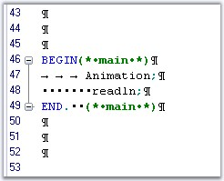

::: {style="DISPLAY: none"}
{#d2h_url_template}{#d2h_package_url style="WIDTH: 0px; DISPLAY: none; HEIGHT: 0px"}
:::

::::::: {.d2h_secondary_topic style="PADDING-BOTTOM: 10pt; MARGIN: 0pt; PADDING-LEFT: 0pt; PADDING-RIGHT: 0pt; PADDING-TOP: 0pt"}
#### WhiteSpace Indicators {#whitespace-indicators style="tab-stops: 0pt"}

 

Edit Control has the ability to indicate whitespaces in its contents with default indicators, explained as follows.

 

1.   Single Spaces are indicated by using Dots.

 

2.   Tabs are indicated by using Right Arrows.

 

3.   Line Feeds are indicated by using a special Line Feed Symbol.

 

{border="0"}

Figure 21: Indicators for Single Spaces, Tabs and a Line Feed

 

You can enable whitespace indicators by setting the **ShowWhiteSpaces** property to **True**. By default, this property is set to **False**.

 

::: {align="center"}
  ----------------------- --------------------------------------------------------------------------------------
  Edit Control Property   Description
  ShowWhiteSpaces         Gets / sets value indicating whether whitespaces should be shown as special symbols.
  ----------------------- --------------------------------------------------------------------------------------
:::

 

You can also toggle the visibility of the whitespace indicators by using the **ToggleShowingWhiteSpaces** method, or by setting the **ShowWhiteSpaces** property to False.

 

::: {align="center"}
  -------------------------- ---------------------------------
  Edit Control Method        Description
  ToggleShowingWhiteSpaces   Toggles showing of whitespaces.
  -------------------------- ---------------------------------
:::

[]{style="FONT-FAMILY: 'Trebuchet MS','sans-serif'; COLOR: #15428b; FONT-SIZE: 9pt"} 

+-----------------------------------------------------------------------------------------------------------------------------------------------------------+
| **[\[C#\]]{style="FONT-FAMILY: 'Courier New'; COLOR: black"}**                                                                                            |
|                                                                                                                                                           |
| []{style="FONT-FAMILY: 'Courier New'; COLOR: black"}                                                                                                      |
|                                                                                                                                                           |
| [// Enabling white space indicators.]{style="FONT-FAMILY: 'Courier New'; COLOR: green"}                                                                   |
|                                                                                                                                                           |
| [this]{style="FONT-FAMILY: 'Courier New'; COLOR: blue"}[.editControl1.ShowWhitespaces = [true]{style="COLOR: blue"};]{style="FONT-FAMILY: 'Courier New'"} |
|                                                                                                                                                           |
| []{style="FONT-FAMILY: 'Courier New'; COLOR: black"}                                                                                                      |
|                                                                                                                                                           |
| [// Toggle the visibility of the white space indicators.]{style="FONT-FAMILY: 'Courier New'; COLOR: green"}                                               |
|                                                                                                                                                           |
| [this]{style="FONT-FAMILY: 'Courier New'; COLOR: blue"}[.editControl1.ToggleShowingWhiteSpaces();]{style="FONT-FAMILY: 'Courier New'"}                    |
+-----------------------------------------------------------------------------------------------------------------------------------------------------------+

[]{style="FONT-FAMILY: 'Trebuchet MS','sans-serif'; COLOR: #15428b; FONT-SIZE: 9pt"} 

+--------------------------------------------------------------------------------------------------------------------------------------------------------+
| **[\[VB.NET\]]{style="FONT-FAMILY: 'Courier New'; COLOR: black"}**                                                                                     |
|                                                                                                                                                        |
| []{style="FONT-FAMILY: 'Courier New'; COLOR: black"}                                                                                                   |
|                                                                                                                                                        |
| [\' Enabling white space indicators.]{style="FONT-FAMILY: 'Courier New'; COLOR: green"}                                                                |
|                                                                                                                                                        |
| [Me]{style="FONT-FAMILY: 'Courier New'; COLOR: blue"}[.editControl1.ShowWhitespaces = [True]{style="COLOR: blue"}]{style="FONT-FAMILY: 'Courier New'"} |
|                                                                                                                                                        |
| []{style="FONT-FAMILY: 'Courier New'; COLOR: black"}                                                                                                   |
|                                                                                                                                                        |
| [\' Toggle the visibility of the white space indicators.]{style="FONT-FAMILY: 'Courier New'; COLOR: green"}                                            |
|                                                                                                                                                        |
| [Me]{style="FONT-FAMILY: 'Courier New'; COLOR: blue"}[.editControl1.ToggleShowingWhiteSpaces()]{style="FONT-FAMILY: 'Courier New'"}                    |
+--------------------------------------------------------------------------------------------------------------------------------------------------------+

 

Showing / Hiding Indicators

 

You can selectively show / hide the whitespace indicators by using the following subproperties of the **WhiteSpaceIndicators** property - **ShowSpaces**, **ShowTabs** and **ShowNewLines**.

[]{style="FONT-FAMILY: 'Trebuchet MS','sans-serif'; COLOR: #15428b; FONT-SIZE: 9pt"} 

::: {align="center"}
  ----------------------- --------------------------------------------------------------
  Edit Control Property   Description
  ShowSpaces              Indicates whether spaces should be replaced with symbols.
  ShowTabs                Indicates whether tabs should be replaced with symbols.
  ShowNewLines            Indicates whether new lines should be replaced with symbols.
  ----------------------- --------------------------------------------------------------
:::

[]{style="FONT-FAMILY: 'Trebuchet MS','sans-serif'; COLOR: #15428b; FONT-SIZE: 9pt"} 

+------------------------------------------------------------------------------------------------------------------------------------------------------------------------------+
| **[\[C#\]]{style="FONT-FAMILY: 'Courier New'; COLOR: black"}**                                                                                                               |
|                                                                                                                                                                              |
| []{style="FONT-FAMILY: 'Courier New'; COLOR: black"}                                                                                                                         |
|                                                                                                                                                                              |
| [// Custom indicator for Line Feed.]{style="FONT-FAMILY: 'Courier New'; COLOR: green"}                                                                                       |
|                                                                                                                                                                              |
| [this]{style="FONT-FAMILY: 'Courier New'; COLOR: blue"}[.editControl1.WhiteSpaceIndicators.ShowSpaces = [true]{style="COLOR: blue"};]{style="FONT-FAMILY: 'Courier New'"}    |
|                                                                                                                                                                              |
| []{style="FONT-FAMILY: 'Courier New'"}                                                                                                                                       |
|                                                                                                                                                                              |
| [// Custom indicator for Tab.]{style="FONT-FAMILY: 'Courier New'; COLOR: green"}                                                                                             |
|                                                                                                                                                                              |
| [this]{style="FONT-FAMILY: 'Courier New'; COLOR: blue"}[.editControl1.WhiteSpaceIndicators.ShowTabs = [true]{style="COLOR: blue"};]{style="FONT-FAMILY: 'Courier New'"}      |
|                                                                                                                                                                              |
| []{style="FONT-FAMILY: 'Courier New'"}                                                                                                                                       |
|                                                                                                                                                                              |
| [// Custom indicator for Space Character.]{style="FONT-FAMILY: 'Courier New'; COLOR: green"}                                                                                 |
|                                                                                                                                                                              |
| [this]{style="FONT-FAMILY: 'Courier New'; COLOR: blue"}[.editControl1.WhiteSpaceIndicators.SpaceNewLines = [true]{style="COLOR: blue"};]{style="FONT-FAMILY: 'Courier New'"} |
+------------------------------------------------------------------------------------------------------------------------------------------------------------------------------+

[]{style="FONT-FAMILY: 'Trebuchet MS','sans-serif'; COLOR: #15428b; FONT-SIZE: 9pt"} 

+---------------------------------------------------------------------------------------------------------------------------------------------------------------------------+
| **[\[VB.NET\]]{style="FONT-FAMILY: 'Courier New'; COLOR: black"}**                                                                                                        |
|                                                                                                                                                                           |
| []{style="FONT-FAMILY: 'Courier New'; COLOR: black"}                                                                                                                      |
|                                                                                                                                                                           |
| [\' Custom indicator for Line Feed. ]{style="FONT-FAMILY: 'Courier New'; COLOR: green"}                                                                                   |
|                                                                                                                                                                           |
| [Me]{style="FONT-FAMILY: 'Courier New'; COLOR: blue"}[.editControl1.WhiteSpaceIndicators.ShowSpaces = [True]{style="COLOR: blue"} ]{style="FONT-FAMILY: 'Courier New'"}   |
|                                                                                                                                                                           |
| []{style="FONT-FAMILY: 'Courier New'"}                                                                                                                                    |
|                                                                                                                                                                           |
| [\' Custom indicator for Tab.]{style="FONT-FAMILY: 'Courier New'; COLOR: green"}                                                                                          |
|                                                                                                                                                                           |
| [Me]{style="FONT-FAMILY: 'Courier New'; COLOR: blue"}[.editControl1.WhiteSpaceIndicators.ShowTabs = [True]{style="COLOR: blue"} ]{style="FONT-FAMILY: 'Courier New'"}     |
|                                                                                                                                                                           |
| []{style="FONT-FAMILY: 'Courier New'"}                                                                                                                                    |
|                                                                                                                                                                           |
| [\' Custom indicator for Space Character. ]{style="FONT-FAMILY: 'Courier New'; COLOR: green"}                                                                             |
|                                                                                                                                                                           |
| [Me]{style="FONT-FAMILY: 'Courier New'; COLOR: blue"}[.editControl1.WhiteSpaceIndicators.SpaceNewLines = [True]{style="COLOR: blue"}]{style="FONT-FAMILY: 'Courier New'"} |
+---------------------------------------------------------------------------------------------------------------------------------------------------------------------------+

 

You can also set the indicators to indicate single spaces, tabs and line feeds by using the **NewLineString**, **TabString** and **SpaceChar** subproperties of the WhiteSpaceIndicators property, as shown below.

 

::: {align="center"}
  ----------------------- ---------------------------------------------------------------------
  Edit Control Property   Description
  NewLineString           Gets / sets string that represents line feed in WhiteSpace mode.
  TabString               Gets / sets string that represents Tab in WhiteSpace mode.
  SpaceChar               Gets / sets character that represents line feed in WhiteSpace mode.
  ----------------------- ---------------------------------------------------------------------
:::

[]{style="FONT-FAMILY: 'Trebuchet MS','sans-serif'; COLOR: #15428b; FONT-SIZE: 9pt"} 

+----------------------------------------------------------------------------------------------------------------------------------------------------------------------------------+
| **[\[C#\]]{style="FONT-FAMILY: 'Courier New'; COLOR: black"}**                                                                                                                   |
|                                                                                                                                                                                  |
| []{style="FONT-FAMILY: 'Courier New'; COLOR: black"}                                                                                                                             |
|                                                                                                                                                                                  |
| [// Custom indicator for Line Feed.]{style="FONT-FAMILY: 'Courier New'; COLOR: green"}                                                                                           |
|                                                                                                                                                                                  |
| [this]{style="FONT-FAMILY: 'Courier New'; COLOR: blue"}[.editControl1.WhiteSpaceIndicators.NewLineString = [\"LF\"]{style="COLOR: maroon"};]{style="FONT-FAMILY: 'Courier New'"} |
|                                                                                                                                                                                  |
| []{style="FONT-FAMILY: 'Courier New'"}                                                                                                                                           |
|                                                                                                                                                                                  |
| [// Custom indicator for Tab.]{style="FONT-FAMILY: 'Courier New'; COLOR: green"}                                                                                                 |
|                                                                                                                                                                                  |
| [this]{style="FONT-FAMILY: 'Courier New'; COLOR: blue"}[.editControl1.WhiteSpaceIndicators.TabString = [\"TAB\"]{style="COLOR: maroon"};]{style="FONT-FAMILY: 'Courier New'"}    |
|                                                                                                                                                                                  |
| []{style="FONT-FAMILY: 'Courier New'"}                                                                                                                                           |
|                                                                                                                                                                                  |
| [// Custom indicator for Space Character.]{style="FONT-FAMILY: 'Courier New'; COLOR: green"}                                                                                     |
|                                                                                                                                                                                  |
| [this]{style="FONT-FAMILY: 'Courier New'; COLOR: blue"}[.editControl1.WhiteSpaceIndicators.SpaceChar = [\"s\"]{style="COLOR: maroon"};]{style="FONT-FAMILY: 'Courier New'"}      |
+----------------------------------------------------------------------------------------------------------------------------------------------------------------------------------+

[]{style="FONT-FAMILY: 'Trebuchet MS','sans-serif'; COLOR: #15428b; FONT-SIZE: 9pt"} 

+-------------------------------------------------------------------------------------------------------------------------------------------------------------------------------+
| **[\[VB.NET\]]{style="FONT-FAMILY: 'Courier New'; COLOR: black"}**                                                                                                            |
|                                                                                                                                                                               |
| []{style="FONT-FAMILY: 'Courier New'; COLOR: black"}                                                                                                                          |
|                                                                                                                                                                               |
| [\' Custom indicator for Line Feed.]{style="FONT-FAMILY: 'Courier New'; COLOR: green"}                                                                                        |
|                                                                                                                                                                               |
| [Me]{style="FONT-FAMILY: 'Courier New'; COLOR: blue"}[.editControl1.WhiteSpaceIndicators.NewLineString = [\"LF\"]{style="COLOR: maroon"}]{style="FONT-FAMILY: 'Courier New'"} |
|                                                                                                                                                                               |
| []{style="FONT-FAMILY: 'Courier New'; COLOR: maroon"}                                                                                                                         |
|                                                                                                                                                                               |
| [\' Custom indicator for Tab.]{style="FONT-FAMILY: 'Courier New'; COLOR: green"}                                                                                              |
|                                                                                                                                                                               |
| [Me]{style="FONT-FAMILY: 'Courier New'; COLOR: blue"}[.editControl1.WhiteSpaceIndicators.TabString = [\"TAB\"]{style="COLOR: maroon"}]{style="FONT-FAMILY: 'Courier New'"}    |
|                                                                                                                                                                               |
| []{style="FONT-FAMILY: 'Courier New'; COLOR: maroon"}                                                                                                                         |
|                                                                                                                                                                               |
| [\' Custom indicator for Space Character.]{style="FONT-FAMILY: 'Courier New'; COLOR: green"}                                                                                  |
|                                                                                                                                                                               |
| [Me]{style="FONT-FAMILY: 'Courier New'; COLOR: blue"}[.editControl1.WhiteSpaceIndicators.SpaceChar = [\"s\"]{style="COLOR: maroon"}]{style="FONT-FAMILY: 'Courier New'"}      |
+-------------------------------------------------------------------------------------------------------------------------------------------------------------------------------+

 

See Also

 

[Spaces and Tabs]{.UGHyperlink}[]{.UGHyperlink}

 

[]{#p41} 

[]{#related-topics}
:::::::
