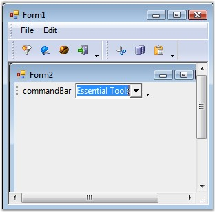

::: {style="DISPLAY: none"}
{#d2h_url_template}{#d2h_package_url style="WIDTH: 0px; DISPLAY: none; HEIGHT: 0px"}
:::

::: {.d2h_secondary_topic style="PADDING-BOTTOM: 10pt; MARGIN: 0pt; PADDING-LEFT: 0pt; PADDING-RIGHT: 0pt; PADDING-TOP: 0pt"}
#### Why is it not possible to add a CommandBarController to a form containing XP Menus and ToolBars? {#why-is-it-not-possible-to-add-a-commandbarcontroller-to-a-form-containing-xp-menus-and-toolbars style="tab-stops: 0pt"}

[]{#p39}[]{style="COLOR: #15428b"} 

The CommandBars framework should be used only with the standard .NET Menus / ToolBars and not with the Essential Tools XP Menus. This is because the XP Menus designer infrastructure will freeze the .Net environment.

 

But it is possible to add a CommandBar to a form containing XP Menus through code as shown in the sample screen shot.

[]{style="COLOR: #15428b"} 

{border="0"}

[]{style="COLOR: #15428b"} 

Figure 36: CommandBar added to XP Menus and ToolBars

 

[]{#related-topics}
:::
