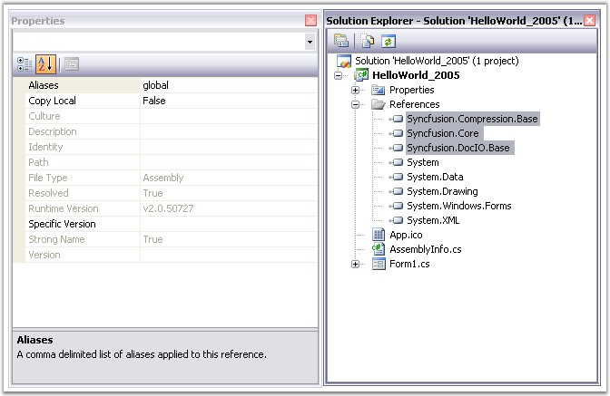
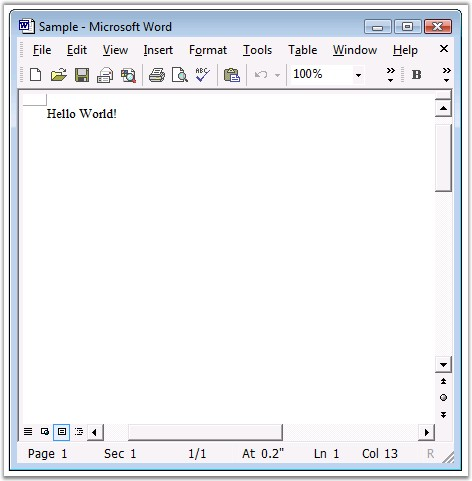

::: {style="DISPLAY: none"}
{#d2h_url_template}{#d2h_package_url style="WIDTH: 0px; DISPLAY: none; HEIGHT: 0px"}
:::

::::: {#nsbanner .d2h_main_nsbanner style="BORDER-BOTTOM: #999999 1px solid; POSITION: relative; PADDING-BOTTOM: 0px; BACKGROUND-COLOR: transparent; PADDING-LEFT: 0px; PADDING-RIGHT: 0px; DISPLAY: none; BORDER-TOP: #999999 1px solid; PADDING-TOP: 0px; LEFT: 0px"}
:::: {#TitleRow .d2h_main_titlerow style="PADDING-BOTTOM: 4px; BACKGROUND-COLOR: transparent; PADDING-LEFT: 22px; WIDTH: 100%; PADDING-RIGHT: 10px; DISPLAY: none; PADDING-TOP: 4px"}
::: {#ienav .d2h_main_ienav style="DISPLAY: none"}
{#D2HPrevious .D2HPreviousEnabled}  {#D2HNext .D2HNextEnabled}
:::
::::
:::::

::::::: {#nstext .d2h_main_nstext style="PADDING-BOTTOM: 10px; BACKGROUND-COLOR: transparent; PADDING-LEFT: 22px; PADDING-RIGHT: 10px; HEIGHT: 100%; OVERFLOW: auto; PADDING-TOP: 5px" hasuserbackground="true" valign="bottom"}
::: {#d2h_breadcrumbs .d2h_breadcrumbs}
[Essential Studio User Guide Documentation](ms-xhelp:///?Id=12457748-09e3-4d74-a240-8e049cedf030){.d2h_breadcrumbsNormal}[ \> ]{.d2h_breadcrumbsLinkSeparator}[Reporting Edition](ms-xhelp:///?Id=027aa5b6-6676-4f93-ad23-c20e8c45792e){.d2h_breadcrumbsNormal}[ \> ]{.d2h_breadcrumbsLinkSeparator}[Essential DocIO](ms-xhelp:///?Id=b88d77b3-4c51-460f-a761-d2ef6d5b0ca6){.d2h_breadcrumbsNormal}[ \> ]{.d2h_breadcrumbsLinkSeparator}[Getting Started](ms-xhelp:///?Id=b13bdbaa-4c11-4a19-ba3a-3401037013af){.d2h_breadcrumbsNormal}[ \> ]{.d2h_breadcrumbsLinkSeparator}[Deploying Essential DocIO](ms-xhelp:///?Id=292813fa-54b4-42a4-8f0d-0291dc5221fb){.d2h_breadcrumbsNormal}
:::

### Windows {#windows style="tab-stops: 0pt"}

 

Now, you have created a Windows application (refer [[Creating Platform Application]{.UGHyperlink}](ms-xhelp:///?Id=78286af6-eb2c-4c81-aa63-ed667b9d74f8)). This section covers information on the following:

 

[·      ]{style="FONT-FAMILY: Symbol"}Deploying Essential DocIO in a Windows Application

[·      ]{style="FONT-FAMILY: Symbol"}Creating a Word Document

 

Deploying Essential DocIO in a Windows Application

 

In order to deploy an application that uses the Syncfusion assemblies, the referenced Syncfusion assemblies should reside in the application folder where the exe file exists, in the target machine.

 

In order to do that, go to the Solution Explorer; Under References, select all the Syncfusion assemblies and then change the Copy Local property of the Syncfusion assemblies to true and compile the project.

[]{style="BACKGROUND: yellow"} 

Now, the Syncfusion assemblies referenced in the project will be copied to the output directory along with the application executable (bin/debug/).

 

Deploy the exe file along with the Syncfusion assemblies found, to the target machine. Be sure that these Syncfusion assemblies reside in the same location as the application exe file, in the target machine.

[]{style="BACKGROUND: yellow"} 

{border="0"}[]{style="BACKGROUND: yellow"}

Figure 16: DLLs to be referenced in the Application

 

::: {style="BORDER-BOTTOM: windowtext 1pt solid; BORDER-LEFT: medium none; PADDING-BOTTOM: 1pt; MARGIN-TOP: 9pt; PADDING-LEFT: 0pt; PADDING-RIGHT: 0pt; MARGIN-BOTTOM: 9pt; BORDER-TOP: windowtext 1pt solid; BORDER-RIGHT: medium none; PADDING-TOP: 1pt"}
{border="0"}Note: Application with Essential DocIO needs the following dependent assemblies for deployment.
:::

[·      ]{style="FONT-FAMILY: Symbol"}Syncfusion.Core.dll

[·      ]{style="FONT-FAMILY: Symbol"}Syncfusion.Compression.dll

[·      ]{style="FONT-FAMILY: Symbol"}Syncfusion.DocIO.Base.dll

 

::: {style="BORDER-BOTTOM: windowtext 1pt solid; BORDER-LEFT: medium none; PADDING-BOTTOM: 1pt; MARGIN-TOP: 9pt; PADDING-LEFT: 0pt; PADDING-RIGHT: 0pt; MARGIN-BOTTOM: 9pt; BORDER-TOP: windowtext 1pt solid; BORDER-RIGHT: medium none; PADDING-TOP: 1pt"}
{border="0"}Note: For detailed documentation on Windows Application deployment, see [[http://www.syncfusion.com/support/user/uploads/DeployingWindowsApplication_bdaf76f7.pdf]{.UGHyperlink}](http://www.syncfusion.com/support/user/uploads/DeployingWindowsApplication_bdaf76f7.pdf).
:::

 

Essential DocIO is deployed in the Windows application.

 

Creating a Word Document

 

In this section, you will learn how to create a simple Word document with \"Hello World\" written on the first paragraph of the first section.

 

1.   Include the following namespaces in your application.

 

[·      ]{style="FONT-FAMILY: Symbol"}**Syncfusion.DocIO.DLS** (using Syncfusion.DocIO.DLS)

[·      ]{style="FONT-FAMILY: Symbol"}**Syncfusion.DocIO** (using Syncfusion.DocIO)

 

2.   Instantiate the **WordDocument** class.

 

+------------------------------------------------------------------------------------------------------------------------------------------------------------------------------------------+
| **[\[C#\]]{style="FONT-FAMILY: 'Courier New'; COLOR: black"}**                                                                                                                           |
|                                                                                                                                                                                          |
| **[]{style="FONT-FAMILY: 'Courier New'; COLOR: black"}**                                                                                                                                 |
|                                                                                                                                                                                          |
| [// Create a new Word document. ]{style="FONT-FAMILY: 'Courier New'; COLOR: green"}                                                                                                      |
|                                                                                                                                                                                          |
| [// This document has no section and no paragraph by default.]{style="FONT-FAMILY: 'Courier New'; COLOR: green"}                                                                         |
|                                                                                                                                                                                          |
| [WordDocument]{style="FONT-FAMILY: 'Courier New'; COLOR: #2b91af"}[ document = [new]{style="COLOR: blue"} [WordDocument]{style="COLOR: #2b91af"}();]{style="FONT-FAMILY: 'Courier New'"} |
+------------------------------------------------------------------------------------------------------------------------------------------------------------------------------------------+

 

+------------------------------------------------------------------------------------------------------------------+
| **[\[VB.NET\]]{style="FONT-FAMILY: 'Courier New'; COLOR: black"}**                                               |
|                                                                                                                  |
| **[]{style="FONT-FAMILY: 'Courier New'; COLOR: black"}**                                                         |
|                                                                                                                  |
| [\' Create a new Word document. ]{style="FONT-FAMILY: 'Courier New'; COLOR: green"}                              |
|                                                                                                                  |
| [\' This document has no section and no paragraph by default.]{style="FONT-FAMILY: 'Courier New'; COLOR: green"} |
|                                                                                                                  |
| [Dim document As WordDocument = New WordDocument()]{style="FONT-FAMILY: 'Courier New'"}                          |
+------------------------------------------------------------------------------------------------------------------+

 

::: {style="BORDER-BOTTOM: windowtext 1pt solid; BORDER-LEFT: medium none; PADDING-BOTTOM: 1pt; MARGIN-TOP: 9pt; PADDING-LEFT: 0pt; PADDING-RIGHT: 0pt; MARGIN-BOTTOM: 9pt; BORDER-TOP: windowtext 1pt solid; BORDER-RIGHT: medium none; PADDING-TOP: 1pt"}
{border="0"}Note: The WordDocument class represents the Word documents created in memory. This is the memory representation of the Word document written to disk.
:::

 

3.   Add a section to the newly created Word document by using the following code.

 

+----------------------------------------------------------------------------------------------------------------------------------------+
| **[\[C#\]]{style="FONT-FAMILY: 'Courier New'; COLOR: black"}**                                                                         |
|                                                                                                                                        |
| []{style="FONT-FAMILY: 'Courier New'; COLOR: black"}                                                                                   |
|                                                                                                                                        |
| [// Add a new section to the document.]{style="FONT-FAMILY: 'Courier New'; COLOR: green"}                                              |
|                                                                                                                                        |
| [IWSection]{style="FONT-FAMILY: 'Courier New'; COLOR: #2b91af"}[ section = document.AddSection();]{style="FONT-FAMILY: 'Courier New'"} |
+----------------------------------------------------------------------------------------------------------------------------------------+

 

+-------------------------------------------------------------------------------------------+
| **[\[VB.NET\]]{style="FONT-FAMILY: 'Courier New'; COLOR: black"}**                        |
|                                                                                           |
| **[]{style="FONT-FAMILY: 'Courier New'; COLOR: black"}**                                  |
|                                                                                           |
| [\' Add a new section to the document.]{style="FONT-FAMILY: 'Courier New'; COLOR: green"} |
|                                                                                           |
| [Dim section As IWSection = document.AddSection()]{style="FONT-FAMILY: 'Courier New'"}    |
+-------------------------------------------------------------------------------------------+

 

4.   Add a paragraph to the newly created section in the Word document by using the following code.

 

+---------------------------------------------------------------------------------------------------------------------------------------------+
| **[\[C#\]]{style="FONT-FAMILY: 'Courier New'; COLOR: black"}**                                                                              |
|                                                                                                                                             |
| **[]{style="FONT-FAMILY: 'Courier New'; COLOR: black"}**                                                                                    |
|                                                                                                                                             |
| [// Add a new paragraph to the section.]{style="FONT-FAMILY: 'Courier New'; COLOR: green"}                                                  |
|                                                                                                                                             |
| [IWParagraph]{style="FONT-FAMILY: 'Courier New'; COLOR: #2b91af"}[ paragraph = section.AddParagraph();]{style="FONT-FAMILY: 'Courier New'"} |
+---------------------------------------------------------------------------------------------------------------------------------------------+

 

+---------------------------------------------------------------------------------------------+
| **[\[VB.NET\]]{style="FONT-FAMILY: 'Courier New'; COLOR: black"}**                          |
|                                                                                             |
| **[]{style="FONT-FAMILY: 'Courier New'; COLOR: black"}**                                    |
|                                                                                             |
| [\' Add a new paragraph to the section.]{style="FONT-FAMILY: 'Courier New'; COLOR: green"}  |
|                                                                                             |
| [Dim paragraph As IWParagraph = section.AddParagraph()]{style="FONT-FAMILY: 'Courier New'"} |
+---------------------------------------------------------------------------------------------+

 

5.   Add a paragraph to the newly created section in the Word document by using the following code.

 

+---------------------------------------------------------------------------------------------------------+
| **[\[C#\]]{style="FONT-FAMILY: 'Courier New'; COLOR: black"}**                                          |
|                                                                                                         |
| **[]{style="FONT-FAMILY: 'Courier New'; COLOR: black"}**                                                |
|                                                                                                         |
| [// Insert text into the paragraph.]{style="FONT-FAMILY: 'Courier New'; COLOR: green"}                  |
|                                                                                                         |
| [paragraph.AppendText([\"Hello World!\"]{style="COLOR: #a31515"});]{style="FONT-FAMILY: 'Courier New'"} |
+---------------------------------------------------------------------------------------------------------+

 

+----------------------------------------------------------------------------------------+
| **[\[VB.NET\]]{style="FONT-FAMILY: 'Courier New'; COLOR: black"}**                     |
|                                                                                        |
| []{style="FONT-FAMILY: 'Courier New'; COLOR: black"}                                   |
|                                                                                        |
| [\' Insert text into the paragraph.]{style="FONT-FAMILY: 'Courier New'; COLOR: green"} |
|                                                                                        |
| [paragraph.AppendText(\"Hello World!\")]{style="FONT-FAMILY: 'Courier New'"}           |
+----------------------------------------------------------------------------------------+

 

6.   Finally, save the Word document. The following code example illustrates how to do this.

 

+------------------------------------------------------------------------------------------------------------------------------------------+
| **[\[C#\]]{style="FONT-FAMILY: 'Courier New'; COLOR: black"}**                                                                           |
|                                                                                                                                          |
| **[]{style="FONT-FAMILY: 'Courier New'; COLOR: black"}**                                                                                 |
|                                                                                                                                          |
| [// Saving the document to disk.]{style="FONT-FAMILY: 'Courier New'; COLOR: green"}                                                      |
|                                                                                                                                          |
| [document.Save([\"Sample.doc\"]{style="COLOR: #a31515"}, [FormatType]{style="COLOR: #2b91af"}.Doc);]{style="FONT-FAMILY: 'Courier New'"} |
+------------------------------------------------------------------------------------------------------------------------------------------+

 

+-------------------------------------------------------------------------------------+
| **[\[VB.NET\]]{style="FONT-FAMILY: 'Courier New'; COLOR: black"}**                  |
|                                                                                     |
| **[]{style="FONT-FAMILY: 'Courier New'; COLOR: black"}**                            |
|                                                                                     |
| [\' Saving the document to disk.]{style="FONT-FAMILY: 'Courier New'; COLOR: green"} |
|                                                                                     |
| [document.Save(\"Sample.doc\", FormatType.Doc)]{style="FONT-FAMILY: 'Courier New'"} |
+-------------------------------------------------------------------------------------+

 

7.   The sample Word document created through the above procedure is shown below.

 

{border="0"}

Figure 17: Word Document

 

A Word document is created in the Windows application.

[]{#related-topics}
:::::::
