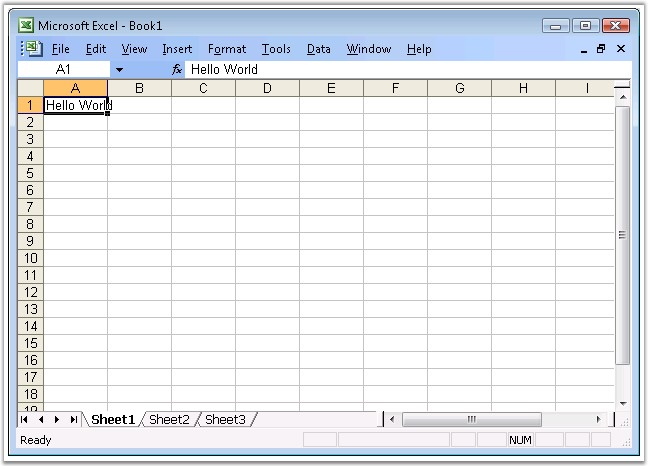

::: {style="DISPLAY: none"}
{#d2h_url_template}{#d2h_package_url style="WIDTH: 0px; DISPLAY: none; HEIGHT: 0px"}
:::

::::: {#nsbanner .d2h_main_nsbanner style="BORDER-BOTTOM: #999999 1px solid; POSITION: relative; PADDING-BOTTOM: 0px; BACKGROUND-COLOR: transparent; PADDING-LEFT: 0px; PADDING-RIGHT: 0px; DISPLAY: none; BORDER-TOP: #999999 1px solid; PADDING-TOP: 0px; LEFT: 0px"}
:::: {#TitleRow .d2h_main_titlerow style="PADDING-BOTTOM: 4px; BACKGROUND-COLOR: transparent; PADDING-LEFT: 22px; WIDTH: 100%; PADDING-RIGHT: 10px; DISPLAY: none; PADDING-TOP: 4px"}
::: {#ienav .d2h_main_ienav style="DISPLAY: none"}
{#D2HPrevious .D2HPreviousEnabled}  {#D2HNext .D2HNextEnabled}
:::
::::
:::::

::::: {#nstext .d2h_main_nstext style="PADDING-BOTTOM: 10px; BACKGROUND-COLOR: transparent; PADDING-LEFT: 22px; PADDING-RIGHT: 10px; HEIGHT: 100%; OVERFLOW: auto; PADDING-TOP: 5px" hasuserbackground="true" valign="bottom"}
::: {#d2h_breadcrumbs .d2h_breadcrumbs}
[Essential Studio User Guide Documentation](ms-xhelp:///?Id=12457748-09e3-4d74-a240-8e049cedf030){.d2h_breadcrumbsNormal}[ \> ]{.d2h_breadcrumbsLinkSeparator}[Reporting Edition](ms-xhelp:///?Id=027aa5b6-6676-4f93-ad23-c20e8c45792e){.d2h_breadcrumbsNormal}[ \> ]{.d2h_breadcrumbsLinkSeparator}[Essential XlsIO](ms-xhelp:///?Id=b01a1b50-1d7d-40c0-bc83-af67e57c9005){.d2h_breadcrumbsNormal}[ \> ]{.d2h_breadcrumbsLinkSeparator}[Getting Started](ms-xhelp:///?Id=ad99231a-9920-49c5-b9a3-8c0224163396){.d2h_breadcrumbsNormal}[ \> ]{.d2h_breadcrumbsLinkSeparator}[Deploying Essential XlsIO](ms-xhelp:///?Id=12c8a00d-964d-4225-99ec-94a82d3c847c){.d2h_breadcrumbsNormal}
:::

### Windows {#windows style="tab-stops: 0pt"}

 

Now, you have created a Windows application (refer[ ]{style="FONT-FAMILY: 'Times New Roman','serif'; FONT-SIZE: 12pt"}[[Creating a Platform Application]{.UGHyperlink}](ms-xhelp:///?Id=e1ba450f-74e6-4ce2-9100-821f1b29c9a2)). This section covers the following:

 

[·      ]{style="FONT-FAMILY: Symbol"}Deploying Essential XlsIO in a Windows Application

[·      ]{style="FONT-FAMILY: Symbol"}Creating and adding an Excel document (with worksheets) to the Application

 

Deploying Essential XlsIO in a Windows Application

 

The following steps will guide you to deploy Essential XlsIO:

1.   Go to **Solution Explorer** of the application you have created. Right-click the **Reference** folder and then click **Add References**.

2.   Add the following assemblies as references in the application.

[·      ]{style="FONT-FAMILY: Symbol"}Syncfusion.Core.dll

[·      ]{style="FONT-FAMILY: Symbol"}Syncfusion.Compression.dll

[·      ]{style="FONT-FAMILY: Symbol"}Syncfusion.XlsIO.base.dll

[]{style="FONT-FAMILY: 'Trebuchet MS','sans-serif'; COLOR: #15428b; FONT-SIZE: 9pt"} 

::: {style="BORDER-BOTTOM: windowtext 1pt solid; BORDER-LEFT: medium none; PADDING-BOTTOM: 1pt; MARGIN-TOP: 9pt; PADDING-LEFT: 0pt; PADDING-RIGHT: 0pt; MARGIN-BOTTOM: 9pt; BORDER-TOP: windowtext 1pt solid; BORDER-RIGHT: medium none; PADDING-TOP: 1pt"}
[{border="0"}]{style="COLOR: #15428b"}[Note:]{style="COLOR: #15428b"}[ For detailed documentation on Windows Application deployment, see: ]{style="COLOR: #15428b"}[[http://www.syncfusion.com/support/user/uploads/DeployingWindowsApplication_bdaf76f7.pdf]{.UGHyperlink}](http://www.syncfusion.com/support/user/uploads/DeployingWindowsApplication_bdaf76f7.pdf)[.]{style="COLOR: #15428b"}
:::

 

Essential XlsIO is deployed in the Windows application.

 

Creating and Adding an Excel Document (With Worksheets) to the Application

 

The following steps will guide you to create and add XlsIO document to this application:

 

1.   Add the following C# code to import the Syncfusion.XlsIO namespace.

[]{style="FONT-FAMILY: 'Trebuchet MS','sans-serif'; COLOR: red; FONT-SIZE: 9pt"} 

+------------------------------------------------------------------------------------------------------------------+
| **[\[C#\]]{style="FONT-FAMILY: 'Courier New'"}**                                                                 |
|                                                                                                                  |
| **[]{style="FONT-FAMILY: 'Courier New'; COLOR: red"}**                                                           |
|                                                                                                                  |
| [using]{style="FONT-FAMILY: 'Courier New'; COLOR: blue"}[ Syncfusion.XlsIO;]{style="FONT-FAMILY: 'Courier New'"} |
+------------------------------------------------------------------------------------------------------------------+

[]{style="FONT-FAMILY: 'Trebuchet MS','sans-serif'; COLOR: red; FONT-SIZE: 9pt"} 

The Syncfusion.XlsIO namespace is imported.

[]{style="FONT-FAMILY: 'Trebuchet MS','sans-serif'; COLOR: #15428b; FONT-SIZE: 9pt"} 

2.   Create an instance of XlsIO by using the following code.

[]{style="FONT-FAMILY: 'Trebuchet MS','sans-serif'; COLOR: #15428b; FONT-SIZE: 9pt"} 

+-------------------------------------------------------------------------------------------------------------------------------------------------------------------------------------------------------------------------------------------------------------------------------------------------------------------------------------------------------------------------+
| **[\[C#\]]{style="FONT-FAMILY: 'Courier New'"}**                                                                                                                                                                                                                                                                                                                        |
|                                                                                                                                                                                                                                                                                                                                                                         |
| **[]{style="FONT-FAMILY: 'Courier New'"}**                                                                                                                                                                                                                                                                                                                              |
|                                                                                                                                                                                                                                                                                                                                                                         |
| [// New instance of XlsIO is created.\[Equivalent to launching MS Excel with no workbooks open\].]{style="FONT-FAMILY: 'Courier New'; COLOR: green"}                                                                                                                                                                                                                    |
|                                                                                                                                                                                                                                                                                                                                                                         |
| [// Instantiate the spreadsheet creation engine.]{style="FONT-FAMILY: 'Courier New'; COLOR: green"}                                                                                                                                                                                                                                                                     |
|                                                                                                                                                                                                                                                                                                                                                                         |
| [ExcelEngine]{style="FONT-FAMILY: 'Courier New'; COLOR: #2b91af"}[ excelEngine = ]{style="FONT-FAMILY: 'Courier New'; COLOR: black"}[new]{style="FONT-FAMILY: 'Courier New'; COLOR: blue"}[ ]{style="FONT-FAMILY: 'Courier New'; COLOR: black"}[ExcelEngine]{style="FONT-FAMILY: 'Courier New'; COLOR: #2b91af"}[();]{style="FONT-FAMILY: 'Courier New'; COLOR: black"} |
+-------------------------------------------------------------------------------------------------------------------------------------------------------------------------------------------------------------------------------------------------------------------------------------------------------------------------------------------------------------------------+

[]{style="FONT-FAMILY: 'Trebuchet MS','sans-serif'; COLOR: #15428b; FONT-SIZE: 9pt"} 

+-------------------------------------------------------------------------------------------------------------------------------------------------------------------------------------------------------------------------------------------------------------------------------------------------------------------------------------------------------------------------+
| **[\[VB.NET\]]{style="FONT-FAMILY: 'Courier New'"}**                                                                                                                                                                                                                                                                                                                    |
|                                                                                                                                                                                                                                                                                                                                                                         |
| **[]{style="FONT-FAMILY: 'Courier New'"}**                                                                                                                                                                                                                                                                                                                              |
|                                                                                                                                                                                                                                                                                                                                                                         |
| [\' New instance of XlsIO is created.\[Equivalent to launching MS Excel with no workbooks open\].]{style="FONT-FAMILY: 'Courier New'; COLOR: green"}                                                                                                                                                                                                                    |
|                                                                                                                                                                                                                                                                                                                                                                         |
| [\' Instantiate the spreadsheet creation engine.]{style="FONT-FAMILY: 'Courier New'; COLOR: green"}                                                                                                                                                                                                                                                                     |
|                                                                                                                                                                                                                                                                                                                                                                         |
| [Dim]{style="FONT-FAMILY: 'Courier New'; COLOR: blue"}[ excelEngine ]{style="FONT-FAMILY: 'Courier New'; COLOR: black"}[As]{style="FONT-FAMILY: 'Courier New'; COLOR: blue"}[ ExcelEngine = ]{style="FONT-FAMILY: 'Courier New'; COLOR: black"}[New]{style="FONT-FAMILY: 'Courier New'; COLOR: blue"}[ ExcelEngine()]{style="FONT-FAMILY: 'Courier New'; COLOR: black"} |
+-------------------------------------------------------------------------------------------------------------------------------------------------------------------------------------------------------------------------------------------------------------------------------------------------------------------------------------------------------------------------+

 

An instance of XlsIO is created.

 

{border="0"}[ ]{style="COLOR: red"}See [[Excel Engine]{.UGHyperlink}](ms-xhelp:///?Id=889b5f93-33b5-4940-a3f7-7fae9ca2a3c2), for more details.

[]{style="COLOR: red"} 

3.   Create an instance of the Excel application through the **IApplication** interface.

[]{style="FONT-FAMILY: 'Trebuchet MS','sans-serif'; COLOR: #15428b; FONT-SIZE: 9pt"} 

+---------------------------------------------------------------------------------------------------------------------------------------------------------+
| **[\[C#\]]{style="FONT-FAMILY: 'Courier New'"}**                                                                                                        |
|                                                                                                                                                         |
| **[]{style="FONT-FAMILY: 'Courier New'"}**                                                                                                              |
|                                                                                                                                                         |
| [// Instantiate the Excel application object.]{style="FONT-FAMILY: 'Courier New'; COLOR: green"}                                                        |
|                                                                                                                                                         |
| [IApplication]{style="FONT-FAMILY: 'Courier New'; COLOR: #2b91af"}[ application = excelEngine.Excel;]{style="FONT-FAMILY: 'Courier New'; COLOR: black"} |
+---------------------------------------------------------------------------------------------------------------------------------------------------------+

[]{style="FONT-FAMILY: 'Trebuchet MS','sans-serif'; COLOR: #15428b; FONT-SIZE: 9pt"} 

+-------------------------------------------------------------------------------------------------------------------------------------------------------------------------------------------------------------------------------------------------------------------+
| **[\[VB.NET\]]{style="FONT-FAMILY: 'Courier New'"}**                                                                                                                                                                                                              |
|                                                                                                                                                                                                                                                                   |
| **[]{style="FONT-FAMILY: 'Courier New'"}**                                                                                                                                                                                                                        |
|                                                                                                                                                                                                                                                                   |
| [\' Instantiate the Excel application object.]{style="FONT-FAMILY: 'Courier New'; COLOR: green"}                                                                                                                                                                  |
|                                                                                                                                                                                                                                                                   |
| [Dim]{style="FONT-FAMILY: 'Courier New'; COLOR: blue"}[ application ]{style="FONT-FAMILY: 'Courier New'; COLOR: black"}[As]{style="FONT-FAMILY: 'Courier New'; COLOR: blue"}[ IApplication = excelEngine.Excel]{style="FONT-FAMILY: 'Courier New'; COLOR: black"} |
+-------------------------------------------------------------------------------------------------------------------------------------------------------------------------------------------------------------------------------------------------------------------+

 

An Excel document is created.

 

4.   Create a workbook. A newly created workbook has three worksheets by default. You can change the number of worksheets, using the **Create** method of **IWorkBook** as shown in the following code.

[]{style="COLOR: red"} 

+-----------------------------------------------------------------------------------------------------------------------------------------------------------------+
| **[\[C#\]]{style="FONT-FAMILY: 'Courier New'"}**                                                                                                                |
|                                                                                                                                                                 |
| **[]{style="FONT-FAMILY: 'Courier New'"}**                                                                                                                      |
|                                                                                                                                                                 |
| [// A new workbook is created.\[Equivalent to creating a new workbook in MS Excel).]{style="FONT-FAMILY: 'Courier New'; COLOR: green"}                          |
|                                                                                                                                                                 |
| [// The new workbook will have 5 worksheets.]{style="FONT-FAMILY: 'Courier New'; COLOR: green"}                                                                 |
|                                                                                                                                                                 |
| [IWorkbook]{style="FONT-FAMILY: 'Courier New'; COLOR: #2b91af"}[ workbook = application.Workbooks.Create(5);]{style="FONT-FAMILY: 'Courier New'; COLOR: black"} |
+-----------------------------------------------------------------------------------------------------------------------------------------------------------------+

[]{style="FONT-FAMILY: 'Trebuchet MS','sans-serif'; COLOR: #15428b; FONT-SIZE: 9pt"} 

+---------------------------------------------------------------------------------------------------------------------------------------------------------------------------------------------------------------------------------------------------------------------------+
| **[\[VB.NET\]]{style="FONT-FAMILY: 'Courier New'"}**                                                                                                                                                                                                                      |
|                                                                                                                                                                                                                                                                           |
| **[]{style="FONT-FAMILY: 'Courier New'"}**                                                                                                                                                                                                                                |
|                                                                                                                                                                                                                                                                           |
| [\' A new workbook is created.\[Equivalent to creating a new workbook in MS Excel\].]{style="FONT-FAMILY: 'Courier New'; COLOR: green"}                                                                                                                                   |
|                                                                                                                                                                                                                                                                           |
| [\' The new workbook will have 5 worksheets.]{style="FONT-FAMILY: 'Courier New'; COLOR: green"}                                                                                                                                                                           |
|                                                                                                                                                                                                                                                                           |
| [Dim]{style="FONT-FAMILY: 'Courier New'; COLOR: blue"}[ workbook ]{style="FONT-FAMILY: 'Courier New'; COLOR: black"}[As]{style="FONT-FAMILY: 'Courier New'; COLOR: blue"}[ IWorkbook = application.Workbooks.Create(5)]{style="FONT-FAMILY: 'Courier New'; COLOR: black"} |
+---------------------------------------------------------------------------------------------------------------------------------------------------------------------------------------------------------------------------------------------------------------------------+

 

A workbook with the mentioned number of worksheets is created in the Excel document.

 

[{border="0"}]{style="FONT-FAMILY: 'Trebuchet MS','sans-serif'; FONT-SIZE: 9pt"}[ ]{style="FONT-FAMILY: 'Trebuchet MS','sans-serif'; FONT-SIZE: 9pt"}See [[Workbook]{.UGHyperlink}](ms-xhelp:///?Id=0f13aa59-cfa3-4abe-962e-efdc48361811) and [[Worksheet]{.UGHyperlink}](ms-xhelp:///?Id=4186fa23-4c0f-479b-951f-322305db255d), for more details.

 

5.   Access the worksheet in the workbook and set the data for the given range, say \"A1\".

[]{style="FONT-FAMILY: 'Trebuchet MS','sans-serif'; COLOR: #15428b; FONT-SIZE: 9pt"} 

+----------------------------------------------------------------------------------------------------------------------------------------------------------------------------------------------------------------------+
| **[\[C#\]]{style="FONT-FAMILY: 'Courier New'"}**                                                                                                                                                                     |
|                                                                                                                                                                                                                      |
| []{style="FONT-FAMILY: 'Courier New'; COLOR: green"}                                                                                                                                                                 |
|                                                                                                                                                                                                                      |
| [// The first worksheet object in the worksheets collection is accessed.]{style="FONT-FAMILY: 'Courier New'; COLOR: green"}                                                                                          |
|                                                                                                                                                                                                                      |
| [IWorksheet]{style="FONT-FAMILY: 'Courier New'; COLOR: #2b91af"}[ sheet = workbook.Worksheets\[0\];      ]{style="FONT-FAMILY: 'Courier New'; COLOR: black"}[                  ]{style="FONT-FAMILY: 'Courier New'"} |
|                                                                                                                                                                                                                      |
| [                        ]{style="FONT-FAMILY: 'Courier New'"}                                                                                                                                                       |
|                                                                                                                                                                                                                      |
| [// Inserting sample text into the first cell of the first worksheet.]{style="FONT-FAMILY: 'Courier New'; COLOR: green"}                                                                                             |
|                                                                                                                                                                                                                      |
| [sheet.Range\[\"A1\"\].Text = \"Hello World\";]{style="FONT-FAMILY: 'Courier New'; COLOR: black"}                                                                                                                    |
+----------------------------------------------------------------------------------------------------------------------------------------------------------------------------------------------------------------------+

[]{style="FONT-FAMILY: 'Trebuchet MS','sans-serif'; COLOR: #15428b; FONT-SIZE: 9pt"} 

+----------------------------------------------------------------------------------------------------------------------------------------------------------------------------------------------------------------------------------------------------------------+
| **[\[VB.NET\]]{style="FONT-FAMILY: 'Courier New'"}**                                                                                                                                                                                                           |
|                                                                                                                                                                                                                                                                |
| **[]{style="FONT-FAMILY: 'Courier New'"}**                                                                                                                                                                                                                     |
|                                                                                                                                                                                                                                                                |
| [\' The first worksheet object in the worksheets collection is accessed.]{style="FONT-FAMILY: 'Courier New'; COLOR: green"}                                                                                                                                    |
|                                                                                                                                                                                                                                                                |
| [Dim]{style="FONT-FAMILY: 'Courier New'; COLOR: blue"}[ sheet ]{style="FONT-FAMILY: 'Courier New'; COLOR: black"}[As]{style="FONT-FAMILY: 'Courier New'; COLOR: blue"}[ IWorksheet = workbook.Worksheets(0)]{style="FONT-FAMILY: 'Courier New'; COLOR: black"} |
|                                                                                                                                                                                                                                                                |
| []{style="FONT-FAMILY: 'Courier New'"}                                                                                                                                                                                                                         |
|                                                                                                                                                                                                                                                                |
| [\' Inserting sample text into the first cell of the first worksheet.]{style="FONT-FAMILY: 'Courier New'; COLOR: green"}                                                                                                                                       |
|                                                                                                                                                                                                                                                                |
| [sheet.Range(\"A1\").Text = \"Hello World\"]{style="FONT-FAMILY: 'Courier New'; COLOR: black"}                                                                                                                                                                 |
+----------------------------------------------------------------------------------------------------------------------------------------------------------------------------------------------------------------------------------------------------------------+

 

The string \"Hello World\" is written to the cell **A1** of the document.

 

6.   Save and close the workbook.

[]{style="FONT-FAMILY: 'Trebuchet MS','sans-serif'; COLOR: #15428b; FONT-SIZE: 9pt"} 

+--------------------------------------------------------------------------------------+
| **[\[C#\]]{style="FONT-FAMILY: 'Courier New'"}**                                     |
|                                                                                      |
| **[]{style="FONT-FAMILY: 'Courier New'"}**                                           |
|                                                                                      |
| [// Saving the workbook to disk.]{style="FONT-FAMILY: 'Courier New'; COLOR: green"}  |
|                                                                                      |
| [workbook.SaveAs(\"Sample.xls\");]{style="FONT-FAMILY: 'Courier New'; COLOR: black"} |
|                                                                                      |
| []{style="FONT-FAMILY: 'Courier New'"}                                               |
|                                                                                      |
| [// Closing the workbook.]{style="FONT-FAMILY: 'Courier New'; COLOR: green"}         |
|                                                                                      |
| [workbook.Close();]{style="FONT-FAMILY: 'Courier New'; COLOR: black"}                |
+--------------------------------------------------------------------------------------+

[]{style="FONT-FAMILY: 'Trebuchet MS','sans-serif'; COLOR: #15428b; FONT-SIZE: 9pt"} 

+-------------------------------------------------------------------------------------+
| **[\[VB.NET\]]{style="FONT-FAMILY: 'Courier New'"}**                                |
|                                                                                     |
| **[]{style="FONT-FAMILY: 'Courier New'"}**                                          |
|                                                                                     |
| [\' Saving the workbook to disk.]{style="FONT-FAMILY: 'Courier New'; COLOR: green"} |
|                                                                                     |
| [workbook.SaveAs(\"Sample.xls\")]{style="FONT-FAMILY: 'Courier New'; COLOR: black"} |
|                                                                                     |
| []{style="FONT-FAMILY: 'Courier New'; COLOR: green"}                                |
|                                                                                     |
| [\' Closing the workbook.]{style="FONT-FAMILY: 'Courier New'; COLOR: green"}        |
|                                                                                     |
| [workbook.Close()]{style="FONT-FAMILY: 'Courier New'; COLOR: black"}                |
+-------------------------------------------------------------------------------------+

 

The Workbook is saved and closed.

 

{border="0"}[ ]{style="COLOR: red"}To know more about saving the workbook, see [[Save]{style="FONT-FAMILY: 'Trebuchet MS','sans-serif'; FONT-SIZE: 9pt"}](ms-xhelp:///?Id=1b71588e-a2a0-4bc0-924a-e0703e047656).

[]{style="COLOR: red"} 

7.   Dispose the Excel engine. Note that the engine should be disposed after completing workbook operations.

[]{style="FONT-FAMILY: 'Trebuchet MS','sans-serif'; COLOR: #15428b; FONT-SIZE: 9pt"} 

+----------------------------------------------------------------------------------+
| **[\[C#\]]{style="FONT-FAMILY: 'Courier New'"}**                                 |
|                                                                                  |
| **[]{style="FONT-FAMILY: 'Courier New'"}**                                       |
|                                                                                  |
| [// Dispose the Excel engine.]{style="FONT-FAMILY: 'Courier New'; COLOR: green"} |
|                                                                                  |
| [excelEngine.Dispose();]{style="FONT-FAMILY: 'Courier New'; COLOR: black"}       |
+----------------------------------------------------------------------------------+

[]{style="FONT-FAMILY: 'Trebuchet MS','sans-serif'; COLOR: #15428b; FONT-SIZE: 9pt"} 

+----------------------------------------------------------------------------------+
| **[\[VB.NET\]]{style="FONT-FAMILY: 'Courier New'"}**                             |
|                                                                                  |
| **[]{style="FONT-FAMILY: 'Courier New'"}**                                       |
|                                                                                  |
| [\' Dispose the Excel engine.]{style="FONT-FAMILY: 'Courier New'; COLOR: green"} |
|                                                                                  |
| [excelEngine.Dispose()]{style="FONT-FAMILY: 'Courier New'; COLOR: black"}        |
+----------------------------------------------------------------------------------+

 

The Excel engine is disposed.

 

This completes the creation of an Excel document in the Windows Application, using Essential XlsIO.

 

The following screen shot shows the Excel document generated by the above given procedure.

 

{border="0"}

Figure 19: Spreadsheet created in the Windows Application[]{style="FONT-FAMILY: 'Trebuchet MS','sans-serif'; COLOR: #15428b"}

[]{style="FONT-FAMILY: 'Trebuchet MS','sans-serif'; COLOR: #15428b"} 

{border="0"} It is possible to serialize the XlsIO object model to any of the following file formats:

[]{style="FONT-FAMILY: 'Trebuchet MS','sans-serif'; COLOR: #15428b; FONT-SIZE: 9pt"} 

[·      ]{style="FONT-FAMILY: Symbol"}BIFF8

[·      ]{style="FONT-FAMILY: Symbol"}BIFF12

[·      ]{style="FONT-FAMILY: Symbol"}SpreadsheetML

[·      ]{style="FONT-FAMILY: Symbol"}CSV

[]{#p15}**[]{style="FONT-FAMILY: 'Segoe UI','sans-serif'; COLOR: black"}** 

[]{#related-topics}
:::::
