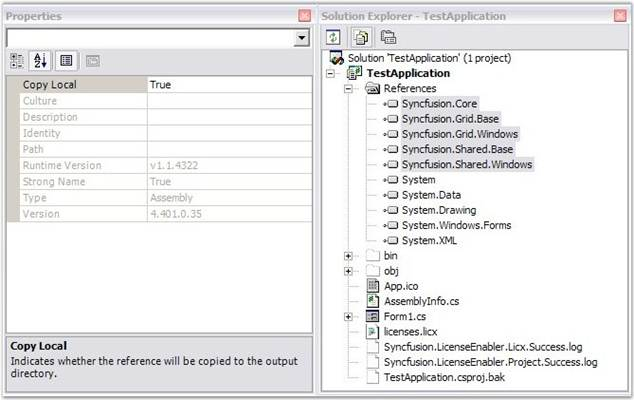

::: {style="DISPLAY: none"}
{#d2h_url_template}{#d2h_package_url style="WIDTH: 0px; DISPLAY: none; HEIGHT: 0px"}
:::

::::: {#nsbanner .d2h_main_nsbanner style="BORDER-BOTTOM: #999999 1px solid; POSITION: relative; PADDING-BOTTOM: 0px; BACKGROUND-COLOR: transparent; PADDING-LEFT: 0px; PADDING-RIGHT: 0px; DISPLAY: none; BORDER-TOP: #999999 1px solid; PADDING-TOP: 0px; LEFT: 0px"}
:::: {#TitleRow .d2h_main_titlerow style="PADDING-BOTTOM: 4px; BACKGROUND-COLOR: transparent; PADDING-LEFT: 22px; WIDTH: 100%; PADDING-RIGHT: 10px; DISPLAY: none; PADDING-TOP: 4px"}
::: {#ienav .d2h_main_ienav style="DISPLAY: none"}
{#D2HPrevious .D2HPreviousEnabled}  {#D2HNext .D2HNextEnabled}
:::
::::
:::::

:::::: {#nstext .d2h_main_nstext style="PADDING-BOTTOM: 10px; BACKGROUND-COLOR: transparent; PADDING-LEFT: 22px; PADDING-RIGHT: 10px; HEIGHT: 100%; OVERFLOW: auto; PADDING-TOP: 5px" hasuserbackground="true" valign="bottom"}
::: {#d2h_breadcrumbs .d2h_breadcrumbs}
[Essential Studio User Guide Documentation](ms-xhelp:///?Id=12457748-09e3-4d74-a240-8e049cedf030){.d2h_breadcrumbsNormal}[ \> ]{.d2h_breadcrumbsLinkSeparator}[Essential Common](ms-xhelp:///?Id=2bfe10b6-fac1-4f91-a173-04db314f10c3){.d2h_breadcrumbsNormal}[ \> ]{.d2h_breadcrumbsLinkSeparator}[Installation and Deployment](ms-xhelp:///?Id=edacfc75-68a5-4518-870d-ce716c583177){.d2h_breadcrumbsNormal}[ \> ]{.d2h_breadcrumbsLinkSeparator}[Deployment](ms-xhelp:///?Id=fea9338f-870c-4078-82ab-0b74e2fcfd00){.d2h_breadcrumbsNormal}
:::

### Windows Forms Deployment {#windows-forms-deployment style="tab-stops: 0pt"}

[]{style="FONT-FAMILY: 'Trebuchet MS','sans-serif'; COLOR: #15428b; FONT-SIZE: 9pt"} 

In order to deploy an application that uses the Syncfusion assemblies, the referenced Syncfusion assemblies should reside in the application folder in the target machine, where the exe exists.

 

To achieve this, on the **Solution Explorer,** in the **References** tab, select all the Syncfusion assemblies and then set the **Copy Local** property of the Syncfusion assemblies to **true*.*** And then compile the project. **** Verify **** that the **licenses.licx** file listed in the project has its **Build Action** property to **Embedded Resource**.

 

Now you may see that the Syncfusion assemblies referenced in the project are copied to the output directory along with the application executable (bin/debug/). Deploy the exe along with the Syncfusion assemblies, found in this location, to the target machine. Make sure that these Syncfusion assemblies reside in the same location as the application exe in the target machine.

::: {style="BORDER-BOTTOM: windowtext 1pt solid; BORDER-LEFT: medium none; PADDING-BOTTOM: 1pt; MARGIN-TOP: 9pt; PADDING-LEFT: 0pt; PADDING-RIGHT: 0pt; MARGIN-BOTTOM: 9pt; BORDER-TOP: windowtext 1pt solid; BORDER-RIGHT: medium none; PADDING-TOP: 1pt"}
{border="0"}Note: In Windows Forms applications, placing these referenced Syncfusion assemblies in the GAC alone in the target machine, will also work.
:::

The following screenshot clearly shows this setting.

 

{border="0"}

Figure 55: Solution Explorer -- Test Application

::: {style="BORDER-BOTTOM: windowtext 1pt solid; BORDER-LEFT: medium none; PADDING-BOTTOM: 1pt; MARGIN-TOP: 9pt; PADDING-LEFT: 0pt; PADDING-RIGHT: 0pt; MARGIN-BOTTOM: 9pt; BORDER-TOP: windowtext 1pt solid; BORDER-RIGHT: medium none; PADDING-TOP: 1pt"}
{border="0"}Note: If you are using System.Web reference in your project, it requires a licensecontext.slf file included in your project folder and that should be placed in your application directory. This will validate runtime licensing of Syncfusion components used in the application when deployed over web. This file changes for each version. So, please ensure that the old file is replaced in the new version upgrades.

 

 
:::

[]{#related-topics}
::::::
