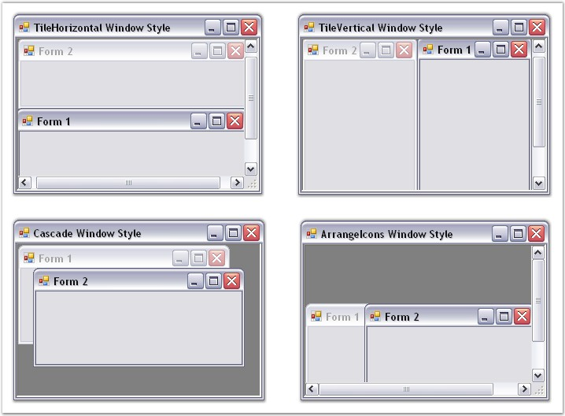

::: {style="DISPLAY: none"}
{#d2h_url_template}{#d2h_package_url style="WIDTH: 0px; DISPLAY: none; HEIGHT: 0px"}
:::

::::: {.d2h_secondary_topic style="PADDING-BOTTOM: 10pt; MARGIN: 0pt; PADDING-LEFT: 0pt; PADDING-RIGHT: 0pt; PADDING-TOP: 0pt"}
##### Window Styles {#window-styles style="MARGIN-LEFT: 18pt; tab-stops: 18.0pt"}

[]{style="COLOR: #15428b"} 

The windows in the TabbedMDI framework can be arranged in four different styles. To set the styles of the windows, the MDIParent form should be detached from the TabbedMDIManager.

[]{style="COLOR: #15428b"} 

::: {style="BORDER-BOTTOM: windowtext 1pt solid; BORDER-LEFT: medium none; PADDING-BOTTOM: 1pt; MARGIN: 9pt 0pt 9pt 18pt; PADDING-LEFT: 0pt; PADDING-RIGHT: 0pt; BORDER-TOP: windowtext 1pt solid; BORDER-RIGHT: medium none; PADDING-TOP: 1pt"}
{border="0"} Note: The[ ]{style="COLOR: black; FONT-SIZE: 8pt"}DetachFromMdiContainer method is used to detach an MDIParent from the TabbedMDIManager.
:::

[]{style="COLOR: #15428b"} 

::: {align="center"}
+-----------------------------------+-------------------------------------------------------------------------------------------+
| TabbedMDIManager Property         | Description                                                                               |
+-----------------------------------+-------------------------------------------------------------------------------------------+
| WindowStyle                       | Specifies the style for the windows of the TabbedMDIManager Control. The options include: |
|                                   |                                                                                           |
|                                   |                                                                                           |
|                                   |                                                                                           |
|                                   | [·      ]{style="FONT-FAMILY: Symbol"}TileHorizontal,                                     |
|                                   |                                                                                           |
|                                   | [·      ]{style="FONT-FAMILY: Symbol"}TileVertical,                                       |
|                                   |                                                                                           |
|                                   | [·      ]{style="FONT-FAMILY: Symbol"}Cascade and                                         |
|                                   |                                                                                           |
|                                   | [·      ]{style="FONT-FAMILY: Symbol"}ArrangeIcons.                                       |
+-----------------------------------+-------------------------------------------------------------------------------------------+
:::

[]{style="COLOR: #15428b"} 

+-------------------------------------------------------------------------------------------------------------------------------------------------------------------------------------+
| **[\[C#\]]{style="FONT-FAMILY: 'Courier New'; COLOR: black"}**                                                                                                                      |
|                                                                                                                                                                                     |
| **[]{style="FONT-FAMILY: 'Courier New'; COLOR: black"}**                                                                                                                            |
|                                                                                                                                                                                     |
| [//Detach the MDIParent form from TabbedMDIManager.]{style="FONT-FAMILY: 'Courier New'; COLOR: green"}                                                                              |
|                                                                                                                                                                                     |
| [this]{style="FONT-FAMILY: 'Courier New'; COLOR: blue"}[.tb.DetachFromMdiContainer([this]{style="COLOR: blue"}, [false]{style="COLOR: blue"});]{style="FONT-FAMILY: 'Courier New'"} |
|                                                                                                                                                                                     |
| []{style="FONT-FAMILY: 'Courier New'"}                                                                                                                                              |
|                                                                                                                                                                                     |
| [//Arranges the multiple document interface Child forms in Horizontal style within the MDIParent form.                        ]{style="FONT-FAMILY: 'Courier New'; COLOR: green"}   |
|                                                                                                                                                                                     |
| [this]{style="FONT-FAMILY: 'Courier New'; COLOR: blue"}[.LayoutMdi([MdiLayout]{style="COLOR: teal"}.TileHorizontal);]{style="FONT-FAMILY: 'Courier New'"}                           |
+-------------------------------------------------------------------------------------------------------------------------------------------------------------------------------------+

[]{style="COLOR: #15428b"} 

+-----------------------------------------------------------------------------------------------------------------------------------------------------------------------------------+
| **[\[VB.NET\]]{style="FONT-FAMILY: 'Courier New'; COLOR: black"}**                                                                                                                |
|                                                                                                                                                                                   |
| **[]{style="FONT-FAMILY: 'Courier New'; COLOR: black"}**                                                                                                                          |
|                                                                                                                                                                                   |
| [\'Detach the MDIParent form from TabbedMDIManager.]{style="FONT-FAMILY: 'Courier New'; COLOR: green"}                                                                            |
|                                                                                                                                                                                   |
| [Me]{style="FONT-FAMILY: 'Courier New'; COLOR: blue"}[.tb.DetachFromMdiContainer([Me]{style="COLOR: blue"}, [False]{style="COLOR: blue"})]{style="FONT-FAMILY: 'Courier New'"}    |
|                                                                                                                                                                                   |
| []{style="FONT-FAMILY: 'Courier New'"}                                                                                                                                            |
|                                                                                                                                                                                   |
| [\'Arranges the multiple document interface Child forms in Horizontal style within the MDIParent form.                        ]{style="FONT-FAMILY: 'Courier New'; COLOR: green"} |
|                                                                                                                                                                                   |
| [Me]{style="FONT-FAMILY: 'Courier New'; COLOR: blue"}[.LayoutMdi([MdiLayout]{style="COLOR: teal"}.TileHorizontal)]{style="FONT-FAMILY: 'Courier New'"}                            |
+-----------------------------------------------------------------------------------------------------------------------------------------------------------------------------------+

[]{style="COLOR: #15428b"} 

{border="0"}

[]{style="COLOR: #15428b"} 

Figure 1086: Window Styles

 

 

 

[]{#p907} 

[]{#related-topics}
:::::
