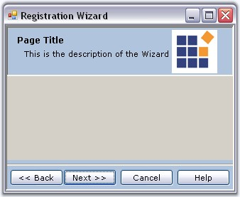
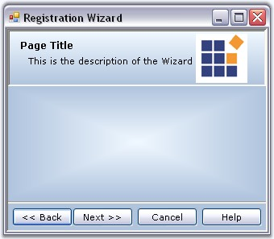
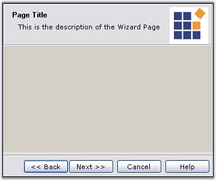
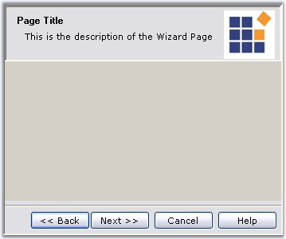

::: {style="DISPLAY: none"}
{#d2h_url_template}{#d2h_package_url style="WIDTH: 0px; DISPLAY: none; HEIGHT: 0px"}
:::

:::::::::::::: {.d2h_secondary_topic style="PADDING-BOTTOM: 10pt; MARGIN: 0pt; PADDING-LEFT: 0pt; PADDING-RIGHT: 0pt; PADDING-TOP: 0pt"}
##### Wizard Control Appearance {#wizard-control-appearance style="MARGIN-LEFT: 18pt; tab-stops: 18.0pt"}

[]{style="COLOR: #15428b"} 

This section discusses the various appearance settings of the Wizard controls.

 

 

###### 3.13.1.4.5.1    Foreground Settings {#foreground-settings style="MARGIN-LEFT: 18pt; tab-stops: 18.0pt"}

[]{style="COLOR: #15428b"} 

Wizard Control Foreground

[]{style="COLOR: #15428b"} 

The appearance of the text in the Wizard control can be controlled using the **Font** and **ForeColor** properties.

[]{style="COLOR: #15428b"} 

::: {align="center"}
  ----------- -----------------------------------------------------------------
  Property    Description
  Font        Sets the font style for the display text in the wizard control.
  ForeColor   Sets the fore color for the display text in the control.
  ----------- -----------------------------------------------------------------
:::

[]{style="COLOR: #15428b"} 

::: {style="BORDER-BOTTOM: windowtext 1pt solid; BORDER-LEFT: medium none; PADDING-BOTTOM: 1pt; MARGIN: 9pt 0pt 9pt 18pt; PADDING-LEFT: 0pt; PADDING-RIGHT: 0pt; BORDER-TOP: windowtext 1pt solid; BORDER-RIGHT: medium none; PADDING-TOP: 1pt"}
 

{border="0"} Note: These WizardControl.Font property will be applied only to the Description text and the Button texts of the Wizard Page. WizardControl.ForeColor property will be applied to the Page Title and description text alone. To set Font style for Title and description, see [Title and Description Settings]{.UGHyperlink} topic.
:::

[]{style="COLOR: #15428b"} 

+------------------------------------------------------------------------------------------------------------------------------------------------------------------------------------------------------------------------------------------------------------------------------------------------------------------------------------------------------------------------------------------------------------------------------------------------+
| **[\[]{style="FONT-FAMILY: 'Courier New'; COLOR: black"}[C#\]]{style="FONT-FAMILY: 'Courier New'; COLOR: black"}[]{style="FONT-FAMILY: 'Courier New'; COLOR: black"}**                                                                                                                                                                                                                                                                         |
|                                                                                                                                                                                                                                                                                                                                                                                                                                                |
| **[]{style="FONT-FAMILY: 'Courier New'; COLOR: black"}**                                                                                                                                                                                                                                                                                                                                                                                       |
|                                                                                                                                                                                                                                                                                                                                                                                                                                                |
| [//Foreground Settings for the display text ]{style="FONT-FAMILY: 'Courier New'; COLOR: green"}                                                                                                                                                                                                                                                                                                                                                |
|                                                                                                                                                                                                                                                                                                                                                                                                                                                |
| [this]{style="FONT-FAMILY: 'Courier New'; COLOR: blue"}[.wizardControl1.Font = ]{style="FONT-FAMILY: 'Courier New'"}[new]{style="FONT-FAMILY: 'Courier New'; COLOR: blue"}[ ]{style="FONT-FAMILY: 'Courier New'"}[System.Drawing.[Font]{style="COLOR: teal"}([\"Verdana\"]{style="COLOR: maroon"}, 8.25F, System.Drawing.[FontStyle]{style="COLOR: teal"}.Regular);]{style="FONT-FAMILY: 'Courier New'"}[]{style="FONT-FAMILY: 'Courier New'"} |
|                                                                                                                                                                                                                                                                                                                                                                                                                                                |
| [this]{style="FONT-FAMILY: 'Courier New'; COLOR: blue"}[.wizardControl1.ForeColor = System.Drawing.[Color]{style="COLOR: teal"}.DarkBlue;]{style="FONT-FAMILY: 'Courier New'"}[]{style="FONT-FAMILY: 'Courier New'"}                                                                                                                                                                                                                           |
+------------------------------------------------------------------------------------------------------------------------------------------------------------------------------------------------------------------------------------------------------------------------------------------------------------------------------------------------------------------------------------------------------------------------------------------------+

[]{#p1057}[]{style="COLOR: #15428b"} 

+--------------------------------------------------------------------------------------------------------------------------------------------------------------------------------------------------------------------------------------------------+
| **[\[VB.NET\]]{style="FONT-FAMILY: 'Courier New'; COLOR: black"}**                                                                                                                                                                               |
|                                                                                                                                                                                                                                                  |
| **[]{style="FONT-FAMILY: 'Courier New'; COLOR: black"}**                                                                                                                                                                                         |
|                                                                                                                                                                                                                                                  |
| [\'Foreground Settings for the display text ]{style="FONT-FAMILY: 'Courier New'; COLOR: green"}                                                                                                                                                  |
|                                                                                                                                                                                                                                                  |
| [Me]{style="FONT-FAMILY: 'Courier New'; COLOR: blue"}[.wizardControl1.Font = [New]{style="COLOR: blue"} System.Drawing.Font([\"Verdana\"]{style="COLOR: maroon"}, 8.25F, System.Drawing.FontStyle.Regular) ]{style="FONT-FAMILY: 'Courier New'"} |
|                                                                                                                                                                                                                                                  |
| [Me]{style="FONT-FAMILY: 'Courier New'; COLOR: blue"}[.wizardControl1.ForeColor = System.Drawing.Color.DarkBlue]{style="FONT-FAMILY: 'Courier New'"}[]{style="FONT-FAMILY: 'Courier New'"}                                                       |
+--------------------------------------------------------------------------------------------------------------------------------------------------------------------------------------------------------------------------------------------------+

[]{style="COLOR: #15428b"} 

{border="0"}

[]{style="COLOR: #15428b"} 

Figure 1232: Font Style = \"Verdana 8\"; ForeColor = \"DarkBlue\"

[]{style="COLOR: #15428b"} 

::: {style="BORDER-BOTTOM: windowtext 1pt solid; BORDER-LEFT: medium none; PADDING-BOTTOM: 1pt; MARGIN: 9pt 0pt 9pt 18pt; PADDING-LEFT: 0pt; PADDING-RIGHT: 0pt; BORDER-TOP: windowtext 1pt solid; BORDER-RIGHT: medium none; PADDING-TOP: 1pt"}
{border="0"} Note: These settings can be overridden by the individual WizardPage.Font and WizardPage.ForeColor settings.
:::

 

The foreground settings for the Button text can be overridden by the **WizardPage.Button.Font** and **WizardPage.Button.ForeColor** settings also. See [Button Appearance]{.UGHyperlink} topic.

[]{style="COLOR: #15428b"} 

Wizard Page Foreground

 

The font and fore color for the display text in a Wizard page can be controlled through below properties.

[]{style="COLOR: #15428b"} 

::: {align="center"}
  ----------- --------------------------------------------------------------
  Property    Description
  Font        Sets the font style for the display text in the wizard page.
  ForeColor   Sets the fore color for the display text in the wizard page.
  ----------- --------------------------------------------------------------
:::

[]{style="COLOR: #15428b"} 

+--------------------------------------------------------------------------------------------------------------------------------------------------------------------------------------------------------------------------------------------------------------------------------------------------+
| **[\[]{style="FONT-FAMILY: 'Courier New'; COLOR: black"}[C#\]]{style="FONT-FAMILY: 'Courier New'; COLOR: black"}[]{style="FONT-FAMILY: 'Courier New'; COLOR: black"}**                                                                                                                           |
|                                                                                                                                                                                                                                                                                                  |
| **[]{style="FONT-FAMILY: 'Courier New'; COLOR: black"}**                                                                                                                                                                                                                                         |
|                                                                                                                                                                                                                                                                                                  |
| [this]{style="FONT-FAMILY: 'Courier New'; COLOR: blue"}[.wizardControl1.Font = [new]{style="COLOR: blue"} System.Drawing.[Font]{style="COLOR: teal"}([\"Verdana\"]{style="COLOR: maroon"}, 8.25F, System.Drawing.[FontStyle]{style="COLOR: teal"}.Regular);]{style="FONT-FAMILY: 'Courier New'"} |
|                                                                                                                                                                                                                                                                                                  |
| [this]{style="FONT-FAMILY: 'Courier New'; COLOR: blue"}[.wizardControl1.ForeColor = System.Drawing.[Color]{style="COLOR: teal"}.Black;]{style="FONT-FAMILY: 'Courier New'"}[]{style="FONT-FAMILY: 'Courier New'"}                                                                                |
+--------------------------------------------------------------------------------------------------------------------------------------------------------------------------------------------------------------------------------------------------------------------------------------------------+

[]{#p1058}[]{style="COLOR: #15428b"} 

+--------------------------------------------------------------------------------------------------------------------------------------------------------------------------------------------------------------------------------------------------+
| **[\[VB.NET\]]{style="FONT-FAMILY: 'Courier New'; COLOR: black"}**                                                                                                                                                                               |
|                                                                                                                                                                                                                                                  |
| **[]{style="FONT-FAMILY: 'Courier New'; COLOR: black"}**                                                                                                                                                                                         |
|                                                                                                                                                                                                                                                  |
| [Me]{style="FONT-FAMILY: 'Courier New'; COLOR: blue"}[.wizardControl1.Font = [New]{style="COLOR: blue"} System.Drawing.Font([\"Verdana\"]{style="COLOR: maroon"}, 8.25F, System.Drawing.FontStyle.Regular) ]{style="FONT-FAMILY: 'Courier New'"} |
|                                                                                                                                                                                                                                                  |
| [Me]{style="FONT-FAMILY: 'Courier New'; COLOR: blue"}[.wizardControl1.ForeColor = System.Drawing.Color.Black]{style="FONT-FAMILY: 'Courier New'"}[]{style="FONT-FAMILY: 'Courier New'"}                                                          |
+--------------------------------------------------------------------------------------------------------------------------------------------------------------------------------------------------------------------------------------------------+

[]{style="COLOR: #15428b"} 

{border="0"}

**[]{style="COLOR: #15428b"}** 

Figure 1233: Font Style = \"Courier New, 10, Bold\"; ForeColor = \"RoyalBlue\"

 

 

###### 3.13.1.4.5.2    Background Settings {#background-settings style="MARGIN-LEFT: 18pt; tab-stops: 18.0pt"}

[]{style="COLOR: #15428b"} 

Wizard Control Background

 

The background of the Wizard control can be customized through the below properties.

[]{style="COLOR: #15428b"} 

::: {align="center"}
  ----------------------- -----------------------------------------------------------------
  Property                Description
  BackColor               Sets the back color for the Wizard control.
  BackgroundImage         Sets the background image for the Wizard control.
  BackgroundImageLayout   Sets the layout for the background image in the Wizard Control.
  ----------------------- -----------------------------------------------------------------
:::

[]{style="COLOR: #15428b"} 

+----------------------------------------------------------------------------------------------------------------------------------------------------------------------------------------------------------------------------+
| **[\[]{style="FONT-FAMILY: 'Courier New'; COLOR: black"}[C#\]]{style="FONT-FAMILY: 'Courier New'; COLOR: black"}[]{style="FONT-FAMILY: 'Courier New'; COLOR: black"}**                                                     |
|                                                                                                                                                                                                                            |
| []{style="FONT-FAMILY: 'Courier New'; COLOR: blue"}                                                                                                                                                                        |
|                                                                                                                                                                                                                            |
| [this]{style="FONT-FAMILY: 'Courier New'; COLOR: blue"}[.wizardControl1.BackColor = System.Drawing.[Color]{style="COLOR: teal"}.LightSteelBlue;]{style="FONT-FAMILY: 'Courier New'"}[]{style="FONT-FAMILY: 'Courier New'"} |
+----------------------------------------------------------------------------------------------------------------------------------------------------------------------------------------------------------------------------+

[]{#p1059}[]{style="COLOR: #15428b"} 

+--------------------------------------------------------------------------------------------------------------------------------------------------------------------------------------------------+
| **[\[VB.NET\]]{style="FONT-FAMILY: 'Courier New'; COLOR: black"}**                                                                                                                               |
|                                                                                                                                                                                                  |
| **[]{style="FONT-FAMILY: 'Courier New'; COLOR: black"}**                                                                                                                                         |
|                                                                                                                                                                                                  |
| [Me]{style="FONT-FAMILY: 'Courier New'; COLOR: blue"}[.wizardControl1.BackColor = System.Drawing.Color.LightSteelBlue]{style="FONT-FAMILY: 'Courier New'"}[]{style="FONT-FAMILY: 'Courier New'"} |
+--------------------------------------------------------------------------------------------------------------------------------------------------------------------------------------------------+

[]{style="COLOR: #15428b"} 

{border="0"}

[]{style="COLOR: #15428b"} 

Figure 1234: BackColor set for WizardControl**[]{style="FONT-FAMILY: 'Trebuchet MS','sans-serif'; COLOR: #15428b"}**

**[]{style="COLOR: #15428b"}** 

::: {style="BORDER-BOTTOM: windowtext 1pt solid; BORDER-LEFT: medium none; PADDING-BOTTOM: 1pt; MARGIN: 9pt 0pt 9pt 18pt; PADDING-LEFT: 0pt; PADDING-RIGHT: 0pt; BORDER-TOP: windowtext 1pt solid; BORDER-RIGHT: medium none; PADDING-TOP: 1pt"}
{border="0"} Note: By default the background settings of the Wizard control will be overridden by the Wizard Container background settings.
:::

[]{style="COLOR: #15428b"} 

Banner Panel Background

[]{style="COLOR: #15428b"} 

The below properties lets you customize the[[ ]{style="COLOR: windowtext; TEXT-DECORATION: none; text-underline: none"}]{.UGHyperlink}[[[banner panel]{style="COLOR: windowtext; TEXT-DECORATION: none; text-underline: none"}]{.UGHyperlink}](../../../../../../../../Documents%20and%20Settings/sylviap/Desktop/Tools%20-%20Part%202.docx#_Banner_Settings) in a Wizard Control.

[]{style="COLOR: #15428b"} 

::: {align="center"}
  ----------------------- -----------------------------------------------------------------------------------------------------------------------------------
  Property                Description
  BackColor               Sets the back color for the banner panel.
  BackgroundColor         Sets a gradient background for the banner panel in the Wizard control. This overrides the BackColor property of the Banner panel.
  BackgroundImage         Sets the background image for the banner panel.
  BackgroundImageLayout   Sets the layout for the background image in the banner panel.
  ----------------------- -----------------------------------------------------------------------------------------------------------------------------------
:::

[]{style="COLOR: #15428b"} 

+-------------------------------------------------------------------------------------------------------------------------------------------------------------------------------------------------------------------------------------------------------------------------------------------------------------------------------------------------------------------------------------------------------------------------------------------+
| **[\[]{style="FONT-FAMILY: 'Courier New'; COLOR: black"}[C#\]]{style="FONT-FAMILY: 'Courier New'; COLOR: black"}[]{style="FONT-FAMILY: 'Courier New'; COLOR: black"}**                                                                                                                                                                                                                                                                    |
|                                                                                                                                                                                                                                                                                                                                                                                                                                           |
| []{style="FONT-FAMILY: 'Courier New'; COLOR: blue"}                                                                                                                                                                                                                                                                                                                                                                                       |
|                                                                                                                                                                                                                                                                                                                                                                                                                                           |
| [this]{style="FONT-FAMILY: 'Courier New'; COLOR: blue"}[.gradientPanel1.BackgroundColor = [new]{style="COLOR: blue"} Syncfusion.Drawing.[BrushInfo]{style="COLOR: teal"}(Syncfusion.Drawing.[GradientStyle]{style="COLOR: teal"}.Vertical, System.Drawing.[Color]{style="COLOR: teal"}.AliceBlue, System.Drawing.[Color]{style="COLOR: teal"}.LightSteelBlue);]{style="FONT-FAMILY: 'Courier New'"}[]{style="FONT-FAMILY: 'Courier New'"} |
+-------------------------------------------------------------------------------------------------------------------------------------------------------------------------------------------------------------------------------------------------------------------------------------------------------------------------------------------------------------------------------------------------------------------------------------------+

[]{#p1060}[]{style="COLOR: #15428b"} 

+---------------------------------------------------------------------------------------------------------------------------------------------------------------------------------------------------------------------------------------------------------------------------------------------------------------------------------------------+
| **[\[VB.NET\]]{style="FONT-FAMILY: 'Courier New'; COLOR: black"}**                                                                                                                                                                                                                                                                          |
|                                                                                                                                                                                                                                                                                                                                             |
| **[]{style="FONT-FAMILY: 'Courier New'; COLOR: black"}**                                                                                                                                                                                                                                                                                    |
|                                                                                                                                                                                                                                                                                                                                             |
| [Me]{style="FONT-FAMILY: 'Courier New'; COLOR: blue"}[.gradientPanel1.BackgroundColor = [New]{style="COLOR: blue"} Syncfusion.Drawing.BrushInfo(Syncfusion.Drawing.GradientStyle.Vertical, System.Drawing.Color.AliceBlue, System.Drawing.Color.LightSteelBlue) ]{style="FONT-FAMILY: 'Courier New'"}[]{style="FONT-FAMILY: 'Courier New'"} |
+---------------------------------------------------------------------------------------------------------------------------------------------------------------------------------------------------------------------------------------------------------------------------------------------------------------------------------------------+

[]{style="COLOR: #15428b"} 

{border="0"}

[]{style="COLOR: #15428b"} 

Figure 1235: Gradient Background set for Banner Panel

**[]{style="COLOR: #15428b"}** 

Wizard Page Background

[]{style="COLOR: #15428b"} 

The below properties lets you customize the [[[Wizard page]{style="COLOR: windowtext; TEXT-DECORATION: none; text-underline: none"}]{.UGHyperlink}](../../../../../../../../Documents%20and%20Settings/sylviap/Desktop/Tools%20-%20Part%202.docx#_Wizard_Page_Settings) in a Wizard Control.

[]{style="COLOR: #15428b"} 

::: {align="center"}
  ----------------------- -----------------------------------------------------------------------------------------------------------------------------------
  Property                Description
  BackColor               Sets the back color for the banner panel.
  BackgroundColor         Sets a gradient background for the banner panel in the Wizard control. This overrides the BackColor property of the Banner panel.
  BackgroundImage         Sets the background image for the banner panel.
  BackgroundImageLayout   Sets the layout for the background image in the banner panel.
  ----------------------- -----------------------------------------------------------------------------------------------------------------------------------
:::

[]{style="COLOR: #15428b"} 

+----------------------------------------------------------------------------------------------------------------------------------------------------------------------------------------------------------------------------------------------------------------------------------------------------------------------------------------------------------------------------------------------------------------------------------------------------+
| **[\[]{style="FONT-FAMILY: 'Courier New'; COLOR: black"}[C#\]]{style="FONT-FAMILY: 'Courier New'; COLOR: black"}[]{style="FONT-FAMILY: 'Courier New'; COLOR: black"}**                                                                                                                                                                                                                                                                             |
|                                                                                                                                                                                                                                                                                                                                                                                                                                                    |
| []{style="FONT-FAMILY: 'Courier New'; COLOR: blue"}                                                                                                                                                                                                                                                                                                                                                                                                |
|                                                                                                                                                                                                                                                                                                                                                                                                                                                    |
| [this]{style="FONT-FAMILY: 'Courier New'; COLOR: blue"}[.wizardControlPage2.BackgroundColor = [new]{style="COLOR: blue"} Syncfusion.Drawing.[BrushInfo]{style="COLOR: teal"}(Syncfusion.Drawing.[GradientStyle]{style="COLOR: teal"}.PathRectangle, System.Drawing.[Color]{style="COLOR: teal"}.AliceBlue, System.Drawing.[Color]{style="COLOR: teal"}.LightSteelBlue);]{style="FONT-FAMILY: 'Courier New'"}[]{style="FONT-FAMILY: 'Courier New'"} |
+----------------------------------------------------------------------------------------------------------------------------------------------------------------------------------------------------------------------------------------------------------------------------------------------------------------------------------------------------------------------------------------------------------------------------------------------------+

[]{#p1061}[]{style="COLOR: #15428b"} 

+------------------------------------------------------------------------------------------------------------------------------------------------------------------------------------------------------------------------------------------------------------------------------------------------------------------------------------------------------+
| **[\[VB.NET\]]{style="FONT-FAMILY: 'Courier New'; COLOR: black"}**                                                                                                                                                                                                                                                                                   |
|                                                                                                                                                                                                                                                                                                                                                      |
| **[]{style="FONT-FAMILY: 'Courier New'; COLOR: black"}**                                                                                                                                                                                                                                                                                             |
|                                                                                                                                                                                                                                                                                                                                                      |
| [Me]{style="FONT-FAMILY: 'Courier New'; COLOR: blue"}[.wizardControlPage2.BackgroundColor = [New]{style="COLOR: blue"} Syncfusion.Drawing.BrushInfo(Syncfusion.Drawing.GradientStyle.PathRectangle, System.Drawing.Color.AliceBlue, System.Drawing.Color.LightSteelBlue) ]{style="FONT-FAMILY: 'Courier New'"}[]{style="FONT-FAMILY: 'Courier New'"} |
+------------------------------------------------------------------------------------------------------------------------------------------------------------------------------------------------------------------------------------------------------------------------------------------------------------------------------------------------------+

[]{style="COLOR: #15428b"} 

{border="0"}

[]{style="COLOR: #15428b"} 

Figure 1236: Gradient background set for Wizard Page**[]{style="FONT-FAMILY: 'Trebuchet MS','sans-serif'; COLOR: #15428b"}**

 

###### 3.13.1.4.5.3    Border Styles {#border-styles style="MARGIN-LEFT: 18pt; tab-stops: 18.0pt"}

[]{style="COLOR: #15428b"} 

Wizard Control

 

The various border styles for a Wizard control are as follows.

[]{style="COLOR: #15428b"} 

[·      ]{style="FONT-FAMILY: Symbol"}None

[·      ]{style="FONT-FAMILY: Symbol"}FixedSingle and

[·      ]{style="FONT-FAMILY: Symbol"}Fixed3D

[]{style="COLOR: #15428b"} 

+-------------------------------------------------------------------------------------------------------------------------------------------------------------------------------------------------+
| **[\[C#\]]{style="FONT-FAMILY: 'Courier New'; COLOR: black"}**                                                                                                                                  |
|                                                                                                                                                                                                 |
| []{style="COLOR: #15428b"}                                                                                                                                                                      |
|                                                                                                                                                                                                 |
| [this]{style="FONT-FAMILY: 'Courier New'; COLOR: blue"}[.wizardControl1.BorderStyle = System.Windows.Forms.[BorderStyle]{style="COLOR: teal"}.FixedSingle;]{style="FONT-FAMILY: 'Courier New'"} |
+-------------------------------------------------------------------------------------------------------------------------------------------------------------------------------------------------+

[]{style="COLOR: #15428b"} 

+------------------------------------------------------------------------------------------------------------------------------------------------------------------------------------------------------------------------------------+
| **[\[VB.NET\]]{style="FONT-FAMILY: 'Courier New'; COLOR: black"}**                                                                                                                                                                 |
|                                                                                                                                                                                                                                    |
| []{style="COLOR: #15428b"}                                                                                                                                                                                                         |
|                                                                                                                                                                                                                                    |
| [Me]{style="FONT-FAMILY: 'Courier New'; COLOR: blue"}[.wizardControl1.BorderStyle = System.Windows.Forms.[BorderStyle]{style="COLOR: teal"}.FixedSingle]{style="FONT-FAMILY: 'Courier New'"}[]{style="FONT-FAMILY: 'Courier New'"} |
+------------------------------------------------------------------------------------------------------------------------------------------------------------------------------------------------------------------------------------+

[]{style="COLOR: #15428b"} 

{border="0"}

[]{style="COLOR: #15428b"} 

Figure 1237: WizardControl.BorderStyle = \"FixedSingle\"

**[]{style="COLOR: #15428b"}** 

Banner Panel

 

Banner Panel is a simple gradient panel whose 3D border styles are as follows.

*[]{style="COLOR: #15428b"}* 

[·      ]{style="FONT-FAMILY: Symbol"}RaisedOuter

[·      ]{style="FONT-FAMILY: Symbol"}SunkenOuter

[·      ]{style="FONT-FAMILY: Symbol"}RaisedInner

[·      ]{style="FONT-FAMILY: Symbol"}Raised

[·      ]{style="FONT-FAMILY: Symbol"}Etched

[·      ]{style="FONT-FAMILY: Symbol"}SunkenInner

[·      ]{style="FONT-FAMILY: Symbol"}Bump

[·      ]{style="FONT-FAMILY: Symbol"}Sunken

[·      ]{style="FONT-FAMILY: Symbol"}Adjust

[·      ]{style="FONT-FAMILY: Symbol"}Flat

*[]{style="COLOR: #15428b"}* 

::: {style="BORDER-BOTTOM: windowtext 1pt solid; BORDER-LEFT: medium none; PADDING-BOTTOM: 1pt; MARGIN: 9pt 0pt 9pt 18pt; PADDING-LEFT: 0pt; PADDING-RIGHT: 0pt; BORDER-TOP: windowtext 1pt solid; BORDER-RIGHT: medium none; PADDING-TOP: 1pt"}
{border="0"} Note: The GradientPanel.BorderStyle property should be set to \"Fixed3D\" to make this setting effective.[]{#p1062}
:::

[]{style="COLOR: #15428b"} 

+-----------------------------------------------------------------------------------------------------------------------------------------------------------------------------------------------------------------------------------+
| **[\[C#\]]{style="FONT-FAMILY: 'Courier New'; COLOR: black"}**                                                                                                                                                                    |
|                                                                                                                                                                                                                                   |
| []{style="COLOR: black"}                                                                                                                                                                                                          |
|                                                                                                                                                                                                                                   |
| [this]{style="FONT-FAMILY: 'Courier New'; COLOR: blue"}[.gradientPanel1.Border3DStyle = System.Windows.Forms.[Border3DStyle]{style="COLOR: teal"}.Sunken;]{style="FONT-FAMILY: 'Courier New'"}                                    |
|                                                                                                                                                                                                                                   |
| [this]{style="FONT-FAMILY: 'Courier New'; COLOR: blue"}[.gradientPanel1.BorderStyle = System.Windows.Forms.[BorderStyle]{style="COLOR: teal"}.Fixed3D;]{style="FONT-FAMILY: 'Courier New'"}[]{style="FONT-FAMILY: 'Courier New'"} |
+-----------------------------------------------------------------------------------------------------------------------------------------------------------------------------------------------------------------------------------+

[]{style="COLOR: #15428b"} 

+---------------------------------------------------------------------------------------------------------------------------------------------------------------------------------------------+
| **[\[VB.NET\]]{style="FONT-FAMILY: 'Courier New'; COLOR: black"}**                                                                                                                          |
|                                                                                                                                                                                             |
| []{style="COLOR: #15428b"}                                                                                                                                                                  |
|                                                                                                                                                                                             |
| [Me]{style="FONT-FAMILY: 'Courier New'; COLOR: blue"}[.gradientPanel1.Border3DStyle = System.Windows.Forms.[Border3DStyle]{style="COLOR: teal"}.Sunken]{style="FONT-FAMILY: 'Courier New'"} |
|                                                                                                                                                                                             |
| [Me]{style="FONT-FAMILY: 'Courier New'; COLOR: blue"}[.gradientPanel1.BorderStyle = System.Windows.Forms.[BorderStyle]{style="COLOR: teal"}.Fixed3D]{style="FONT-FAMILY: 'Courier New'"}    |
+---------------------------------------------------------------------------------------------------------------------------------------------------------------------------------------------+

[]{style="COLOR: #15428b"} 

{border="0"}

 

Figure 1238: BannerPanel with Fixed3D BorderStyle = \"Sunken\"

**[]{style="COLOR: #15428b"}** 

You can use the below properties to set 2D border style for the Banner Control when **GradientPanel.BorderStyle** property is set to \"FixedSingle\".

**[]{style="COLOR: #15428b"}** 

::: {align="center"}
  ----------------------- ----------------------------------------------------------------------------------------------
  Banner Panel Property   Description
  BorderColor             Sets the border color for the Banner panel.
  BorderSides             Specifies the sides of the control which should have border.
  BorderSingle            Specifies the 2D Border style for the panel when BorderStyle property is set to FixedSingle.
  ----------------------- ----------------------------------------------------------------------------------------------
:::

 

Wizard Page Border

 

The below properties controls the border settings for a Wizard control page.[]{#p1063}

[]{style="COLOR: #15428b"} 

::: {align="center"}
+-----------------------------------+------------------------------------------------------------------------------------------------------------------------------+
| Wizard Page Property              | Description                                                                                                                  |
+-----------------------------------+------------------------------------------------------------------------------------------------------------------------------+
| BorderStyle                       | Specifies the border style for Wizard page. The available styles are Fixed3D and FixedSingle.                                |
+-----------------------------------+------------------------------------------------------------------------------------------------------------------------------+
| Border3DStyle                     | Specifies the 3D border style for Wizard page. The available styles are,                                                     |
|                                   |                                                                                                                              |
|                                   |                                                                                                                              |
|                                   |                                                                                                                              |
|                                   | [·      ]{style="FONT-FAMILY: Symbol"}RaisedOuter,                                                                           |
|                                   |                                                                                                                              |
|                                   | [·      ]{style="FONT-FAMILY: Symbol"}SunkenOuter,                                                                           |
|                                   |                                                                                                                              |
|                                   | [·      ]{style="FONT-FAMILY: Symbol"}RaisedInner,                                                                           |
|                                   |                                                                                                                              |
|                                   | [·      ]{style="FONT-FAMILY: Symbol"}Raised,                                                                                |
|                                   |                                                                                                                              |
|                                   | [·      ]{style="FONT-FAMILY: Symbol"}Etched,                                                                                |
|                                   |                                                                                                                              |
|                                   | [·      ]{style="FONT-FAMILY: Symbol"}SunkenInner,                                                                           |
|                                   |                                                                                                                              |
|                                   | [·      ]{style="FONT-FAMILY: Symbol"}Bump,                                                                                  |
|                                   |                                                                                                                              |
|                                   | [·      ]{style="FONT-FAMILY: Symbol"}Sunken,                                                                                |
|                                   |                                                                                                                              |
|                                   | [·      ]{style="FONT-FAMILY: Symbol"}Adjust and                                                                             |
|                                   |                                                                                                                              |
|                                   | [·      ]{style="FONT-FAMILY: Symbol"}Flat.                                                                                  |
+-----------------------------------+------------------------------------------------------------------------------------------------------------------------------+
| BorderColor                       | Sets the border color for the Wizard page.                                                                                   |
+-----------------------------------+------------------------------------------------------------------------------------------------------------------------------+
| BorderSides                       | Specifies the sides of the control which should have border.                                                                 |
+-----------------------------------+------------------------------------------------------------------------------------------------------------------------------+
| BorderSingle                      | Specifies the 2D Border style for the Wizard page when BorderStyle property is set to FixedSingle. The available styles are, |
|                                   |                                                                                                                              |
|                                   |                                                                                                                              |
|                                   |                                                                                                                              |
|                                   | [·      ]{style="FONT-FAMILY: Symbol"}Dotted,                                                                                |
|                                   |                                                                                                                              |
|                                   | [·      ]{style="FONT-FAMILY: Symbol"}Dashed,                                                                                |
|                                   |                                                                                                                              |
|                                   | [·      ]{style="FONT-FAMILY: Symbol"}Solid,                                                                                 |
|                                   |                                                                                                                              |
|                                   | [·      ]{style="FONT-FAMILY: Symbol"}Inset and                                                                              |
|                                   |                                                                                                                              |
|                                   | [·      ]{style="FONT-FAMILY: Symbol"}Outset.                                                                                |
+-----------------------------------+------------------------------------------------------------------------------------------------------------------------------+
:::

 

[]{#related-topics}
::::::::::::::
