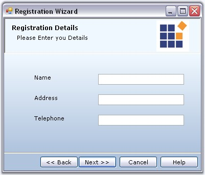
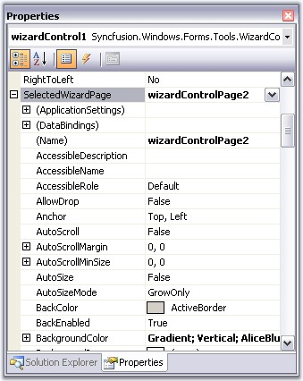
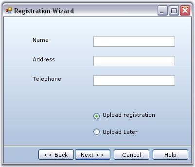
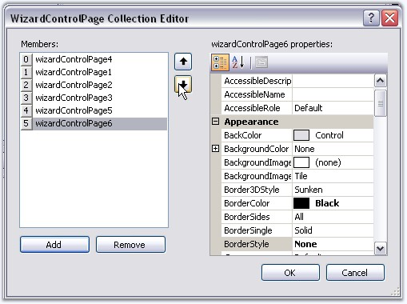
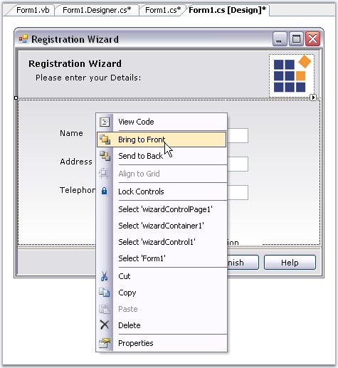

::: {style="DISPLAY: none"}
{#d2h_url_template}{#d2h_package_url style="WIDTH: 0px; DISPLAY: none; HEIGHT: 0px"}
:::

::::::: {.d2h_secondary_topic style="PADDING-BOTTOM: 10pt; MARGIN: 0pt; PADDING-LEFT: 0pt; PADDING-RIGHT: 0pt; PADDING-TOP: 0pt"}
##### Wizard Page Settings {#wizard-page-settings style="MARGIN-LEFT: 18pt; tab-stops: 18.0pt"}

 

A Wizard Page can include a collection of controls implementing an interactive Wizard interface. The Wizard pages are added to the Wizard Container. You can drag and drop any control into a wizard page. Wizard Control lets you to customize the individual Wizard pages to give a unique functionality for each page.

 

[[Creating a Basic Wizard]{.UGHyperlink}](../../../../../../../../Documents%20and%20Settings/sylviap/Desktop/Tools%20-%20Part%202.docx#_Creating_a_Basic)[ ]{style="COLOR: black"}topic discussed how to add Wizard Pages. Let us see how to customize the Wizard pages.

 

**Setting Title and Description**

 

You can specify the title and description in the Banner Panel, for a particular Wizard Page using the **WizardPage.Title** and **WizardPage.Description** properties. The appearance of the title and description can be controlled through Label properties. See[ ]{style="COLOR: black"}[Title and Description Settings ]{.UGHyperlink}for details.

[]{style="COLOR: black"} 

::: {align="center"}
  ------------- -----------------------------------------
  Property      Description
  Title         Specifies the title of the page.
  Description   Specifies the description for the page.
  ------------- -----------------------------------------
:::

[]{#p1049}**[]{style="COLOR: #15428b"}** 

+-------------------------------------------------------------------------------------------------------------------------------------------------------------------------------------------------------------------------------+
| **[\[C#\]]{style="FONT-FAMILY: 'Courier New'; COLOR: black"}**                                                                                                                                                                |
|                                                                                                                                                                                                                               |
| []{style="FONT-FAMILY: 'Courier New'"}                                                                                                                                                                                        |
|                                                                                                                                                                                                                               |
| [this]{style="FONT-FAMILY: 'Courier New'; COLOR: blue"}[.wizardControlPage1.Title = [\"Registration Details\"]{style="COLOR: maroon"};]{style="FONT-FAMILY: 'Courier New'"}                                                   |
|                                                                                                                                                                                                                               |
| [this]{style="FONT-FAMILY: 'Courier New'; COLOR: blue"}[.wizardControlPage1.Description = [\"Please enter your Details:\"]{style="COLOR: maroon"};]{style="FONT-FAMILY: 'Courier New'"}[]{style="FONT-FAMILY: 'Courier New'"} |
+-------------------------------------------------------------------------------------------------------------------------------------------------------------------------------------------------------------------------------+

[]{style="COLOR: #15428b"} 

+-----------------------------------------------------------------------------------------------------------------------------------------------------------------------------------------------------------------------------------------+
| **[\[VB.NET\]]{style="FONT-FAMILY: 'Courier New'; COLOR: black"}**                                                                                                                                                                      |
|                                                                                                                                                                                                                                         |
| []{style="COLOR: #15428b"}                                                                                                                                                                                                              |
|                                                                                                                                                                                                                                         |
| [Me]{style="FONT-FAMILY: 'Courier New'; COLOR: blue"}[.wizardControlPage1.Title [= \"Registration Details\"]{style="COLOR: black"}]{style="FONT-FAMILY: 'Courier New'"}                                                                 |
|                                                                                                                                                                                                                                         |
| [Me]{style="FONT-FAMILY: 'Courier New'; COLOR: blue"}[.wizardControlPage1.Description [= \"Please enter your Details:\"]{style="COLOR: black"}]{style="FONT-FAMILY: 'Courier New'"}[]{style="FONT-FAMILY: 'Courier New'; COLOR: black"} |
+-----------------------------------------------------------------------------------------------------------------------------------------------------------------------------------------------------------------------------------------+

[]{style="COLOR: #15428b"} 

{border="0"}

 

Figure 1217: Wizard Page with Title and Description Set

**[]{style="COLOR: #15428b"}** 

Accessing Wizard Pages

 

We can also access the properties of a Wizard Page using SelectedWizardPage property of the WizardControl in the Designer. See [[Page Navigation at Design time]{.UGHyperlink}](../../../../../../../../Documents%20and%20Settings/sylviap/Desktop/Tools%20-%20Part%202.docx#_Page_Selection_at) for details.

[]{style="COLOR: #15428b"} 

::: {align="center"}
  ----------------------- ----------------------------------------------------------------------------------------------------------------------------------------------------------------------------------------------------------
  Property                Description
  SelectedWizardPage      Specifies the selected wizard page.
  WizardPage.LayoutName   The individual Wizard page is identified using its LayoutName in the SelectedWizardPage property. By default the LayoutName is set as Card1 for the first page added, Card2 for the next page and so on.
  ----------------------- ----------------------------------------------------------------------------------------------------------------------------------------------------------------------------------------------------------
:::

[]{style="COLOR: #15428b"} 

{border="0"}

 

Figure 1218: Accessing Properties of a Wizard Page Through SelectedWizardPage Property of Wizard Control

[]{style="COLOR: #15428b"} 

The header section (GradientPanel and its child controls) can be hidden by setting FullPage property to true. This makes the page occupy the entire space without the header.[]{#p1050}

[]{style="COLOR: black; FONT-SIZE: 8pt"} 

::: {align="center"}
  ---------- --------------------------------------------------------------------------------------------------------------
  Property   Description
  FullPage   Gets/sets the boolean value whether the Banner Panel should  be shown for that page. Default value is false.
  ---------- --------------------------------------------------------------------------------------------------------------
:::

[]{style="COLOR: black; FONT-SIZE: 8pt"} 

+----------------------------------------------------------------------------------------------------------------------------------------------------------+
| **[\[C#\]]{style="FONT-FAMILY: 'Courier New'; COLOR: black"}**                                                                                           |
|                                                                                                                                                          |
| []{style="COLOR: #15428b"}                                                                                                                               |
|                                                                                                                                                          |
| [this]{style="FONT-FAMILY: 'Courier New'; COLOR: blue"}[.wizardControlPage1.FullPage = [true]{style="COLOR: blue"};]{style="FONT-FAMILY: 'Courier New'"} |
+----------------------------------------------------------------------------------------------------------------------------------------------------------+

[]{style="COLOR: #15428b"} 

+-------------------------------------------------------------------------------------------------------------------------------------------------------+
| **[\[VB.NET\]]{style="FONT-FAMILY: 'Courier New'; COLOR: black"}**                                                                                    |
|                                                                                                                                                       |
| []{style="COLOR: #15428b"}                                                                                                                            |
|                                                                                                                                                       |
| [Me]{style="FONT-FAMILY: 'Courier New'; COLOR: blue"}[.wizardControlPage1.FullPage = [True]{style="COLOR: blue"}]{style="FONT-FAMILY: 'Courier New'"} |
+-------------------------------------------------------------------------------------------------------------------------------------------------------+

[]{style="COLOR: black; FONT-SIZE: 8pt"} 

{border="0"}

 

Figure 1219: Wizard Page without Banner panel by setting FullPage = \"True\"

[]{style="COLOR: #15428b"} 

A sample which demonstrates a Wizard Control with interactive Wizard pages is available in the below location.

 

***..\\My Documents\\Syncfusion\\EssentialStudio\\Version Number\\Windows\\Tools.Windows\\Samples\\2.0\\Wizard Package\\WizardControlDemo***

 

**See also**

 

[[Foreground Settings]{.UGHyperlink}](../../../../../../../../Documents%20and%20Settings/sylviap/Desktop/Tools%20-%20Part%202.docx#_Foreground_Settings_1), [[Background Settings]{.UGHyperlink}](../../../../../../../../Documents%20and%20Settings/sylviap/Desktop/Tools%20-%20Part%202.docx#_Background_Settings_1), [[ValidatePage Event]{.UGHyperlink}](../../../../../../../../Documents%20and%20Settings/sylviap/Desktop/Tools%20-%20Part%202.docx#_ValidatePage_Event), [[How to Programmatically control the Page Sequence?]{.UGHyperlink}](../../../../../../../../Documents%20and%20Settings/sylviap/Desktop/Tools%20-%20Part%202.docx#_How_to_Programmatically)[]{.UGHyperlink}

 

 

 

###### []{#_Reordering_Wizard_Pages}3.13.1.4.2.1    Reordering Wizard Pages {#reordering-wizard-pages style="MARGIN-LEFT: 18pt; tab-stops: 18.0pt"}

[]{style="COLOR: #15428b"} 

[]{#p1051}By default, the WizardControl will use the order in which the pages are added to determine the next/previous pages. To reorder the pages, use any one of the following methods.

[]{style="COLOR: #15428b"} 

[·      ]{style="FONT-FAMILY: Symbol"}Select the WizardControl and choose **WizardPages** property in the Property Editor. This will bring out the collection editor, where you can reorder the pages using Up and Down arrow keys.

[]{style="COLOR: #15428b"} 

{border="0"}

[]{style="COLOR: black; FONT-SIZE: 8pt"} 

Figure 1220: Reordering Wizard Pages

[]{style="COLOR: black; FONT-SIZE: 8pt"} 

[·      ]{style="FONT-FAMILY: Symbol"}In the designer, right click on a page and choose \'Bring To Front\' or \'Send To Back\' options which will move the page to the beginning or to the end of the collection, respectively.

[]{style="COLOR: black; FONT-SIZE: 8pt"} 

{border="0"}

 

Figure 1221: Accessing reordering Options(Bring To Front, Send To Back) in Designer

[]{style="COLOR: #15428b"} 

[·      ]{style="FONT-FAMILY: Symbol"}The WizardControlPage has the NextPage and PreviousPage properties with which you can specify the order of page selection. Users may set these properties in the designer for all the pages. If set, the WizardControl will use that as a cue to determine the new page to be selected at run time.

[]{style="COLOR: black; FONT-SIZE: 8pt"} 

::: {align="center"}
  ---------------------------- ------------------------------------------
  WizardControlPage Property   Description
  NextPage                     It sets the next page of the wizard.
  PreviousPage                 It sets the previous page of the wizard.
  ---------------------------- ------------------------------------------
:::

[]{style="COLOR: black; FONT-SIZE: 8pt"} 

+---------------------------------------------------------------------------------------------------------------------------------------------------------------------------------+
| **[\[C#\]]{style="FONT-FAMILY: 'Courier New'; COLOR: black"}**                                                                                                                  |
|                                                                                                                                                                                 |
| []{style="COLOR: #15428b"}                                                                                                                                                      |
|                                                                                                                                                                                 |
| [this]{style="FONT-FAMILY: 'Courier New'; COLOR: blue"}[.wizardControlPage2.NextPage = [this]{style="COLOR: blue"}.wizardControlPage3;]{style="FONT-FAMILY: 'Courier New'"}     |
|                                                                                                                                                                                 |
| [this]{style="FONT-FAMILY: 'Courier New'; COLOR: blue"}[.wizardControlPage2.PreviousPage = [this]{style="COLOR: blue"}.wizardControlPage1;]{style="FONT-FAMILY: 'Courier New'"} |
+---------------------------------------------------------------------------------------------------------------------------------------------------------------------------------+

[]{style="COLOR: black; FONT-SIZE: 8pt"} 

+------------------------------------------------------------------------------------------------------------------------------------------------------------------------------------------------------------------+
| **[\[VB.NET\]]{style="FONT-FAMILY: 'Courier New'; COLOR: black"}**                                                                                                                                               |
|                                                                                                                                                                                                                  |
| []{style="COLOR: #15428b"}                                                                                                                                                                                       |
|                                                                                                                                                                                                                  |
| [Me]{style="FONT-FAMILY: 'Courier New'; COLOR: blue"}[.wizardControlPage2.NextPage = [Me]{style="COLOR: blue"}.wizardControlPage3]{style="FONT-FAMILY: 'Courier New'"}                                           |
|                                                                                                                                                                                                                  |
| [Me]{style="FONT-FAMILY: 'Courier New'; COLOR: blue"}[.wizardControlPage2.PreviousPage = [Me]{style="COLOR: blue"}.wizardControlPage1]{style="FONT-FAMILY: 'Courier New'"}[]{style="FONT-FAMILY: 'Courier New'"} |
+------------------------------------------------------------------------------------------------------------------------------------------------------------------------------------------------------------------+

[]{style="COLOR: black; FONT-SIZE: 8pt"} 

See Also

[]{style="COLOR: #15428b"} 

[[Page Selection at Design time]{.UGHyperlink}](../../../../../../../../Documents%20and%20Settings/sylviap/Desktop/Tools%20-%20Part%202.docx#_Page_Selection_at)[, ]{style="COLOR: #15428b"}[[ValidatePage Event]{.UGHyperlink}](../../../../../../../../Documents%20and%20Settings/sylviap/Desktop/Tools%20-%20Part%202.docx#_ValidatePage_Event)[,]{style="COLOR: #15428b"}[ ]{.UGHyperlink}[[How to Programmatically control the Page Sequence?]{.UGHyperlink}](../../../../../../../../Documents%20and%20Settings/sylviap/Desktop/Tools%20-%20Part%202.docx#_How_to_Programmatically)[]{style="COLOR: black"}

 

 

[]{#related-topics}
:::::::
