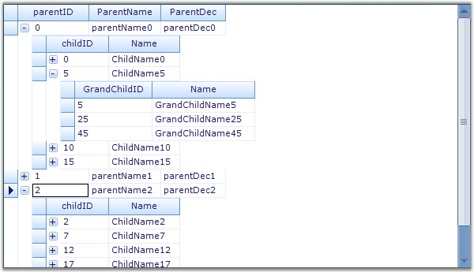
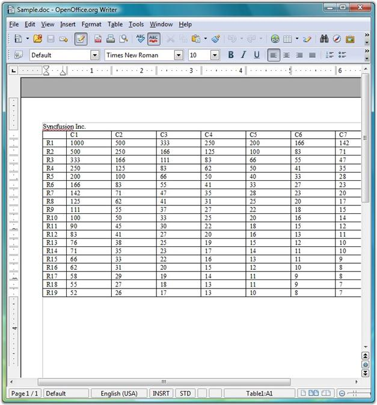
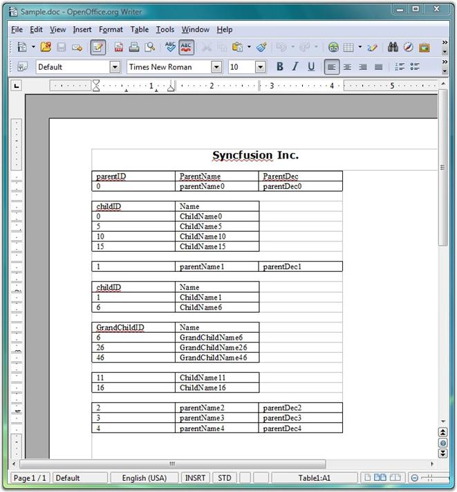

::: {style="DISPLAY: none"}
{#d2h_url_template}{#d2h_package_url style="WIDTH: 0px; DISPLAY: none; HEIGHT: 0px"}
:::

::::: {#nsbanner .d2h_main_nsbanner style="BORDER-BOTTOM: #999999 1px solid; POSITION: relative; PADDING-BOTTOM: 0px; BACKGROUND-COLOR: transparent; PADDING-LEFT: 0px; PADDING-RIGHT: 0px; DISPLAY: none; BORDER-TOP: #999999 1px solid; PADDING-TOP: 0px; LEFT: 0px"}
:::: {#TitleRow .d2h_main_titlerow style="PADDING-BOTTOM: 4px; BACKGROUND-COLOR: transparent; PADDING-LEFT: 22px; WIDTH: 100%; PADDING-RIGHT: 10px; DISPLAY: none; PADDING-TOP: 4px"}
::: {#ienav .d2h_main_ienav style="DISPLAY: none"}
{#D2HPrevious .D2HPreviousEnabled}  {#D2HNext .D2HNextEnabled}
:::
::::
:::::

:::: {#nstext .d2h_main_nstext style="PADDING-BOTTOM: 10px; BACKGROUND-COLOR: transparent; PADDING-LEFT: 22px; PADDING-RIGHT: 10px; HEIGHT: 100%; OVERFLOW: auto; PADDING-TOP: 5px" hasuserbackground="true" valign="bottom"}
::: {#d2h_breadcrumbs .d2h_breadcrumbs}
[Essential Studio User Guide Documentation](ms-xhelp:///?Id=12457748-09e3-4d74-a240-8e049cedf030){.d2h_breadcrumbsNormal}[ \> ]{.d2h_breadcrumbsLinkSeparator}[User Interface Edition](ms-xhelp:///?Id=c29296b7-531c-413b-a0ec-488ca1f7f669){.d2h_breadcrumbsNormal}[ \> ]{.d2h_breadcrumbsLinkSeparator}[Essential Windows](ms-xhelp:///?Id=e60759d8-47a4-4570-9d7a-16a68d63f2ea){.d2h_breadcrumbsNormal}[ \> ]{.d2h_breadcrumbsLinkSeparator}[Essential Grid]{.d2h_breadcrumbsContentsOnly}[ \> ]{.d2h_breadcrumbsLinkSeparator}[Grid Controls](ms-xhelp:///?Id=bf2d70d7-33dc-4c67-a55d-4fcf8d51dc2b){.d2h_breadcrumbsNormal}[ \> ]{.d2h_breadcrumbsLinkSeparator}[Grid Helper Classes](ms-xhelp:///?Id=fc684465-b246-4aea-b668-e0c0084c9590){.d2h_breadcrumbsNormal}
:::

### Word Converter {#word-converter style="tab-stops: 0pt"}

[]{style="FONT-FAMILY: 'Trebuchet MS','sans-serif'; COLOR: #15428b; FONT-SIZE: 9pt"} 

This topic illustrates how to convert Grid and Grid Grouping content to Word format.

 

**Grid to Word Conversion**

 

The **GridWordConverter** class provides support to convert grid content into a Word document. It also provides support to add headers and footers to the document.

 

Essential DocIO libraries are used to support the conversion of grid content into a Word document. The following dependent assemblies must be included in your Windows application to work with the GridWordConverter helper class: **Syncfusion.DocIO.Base** and **Syncfusion.GridHelperClasses.Windows**.

 

The following code examples illustrate the conversion of Grid content to Word document.

[]{style="FONT-FAMILY: 'Trebuchet MS','sans-serif'; COLOR: #15428b; FONT-SIZE: 9pt"} 

1.   Using C#

[]{style="FONT-FAMILY: 'Trebuchet MS','sans-serif'; COLOR: #15428b; FONT-SIZE: 9pt"} 

+-------------------------------------------------------------------------------------------------------------------------------------------------------------------------------------------------------------------------------------------------------------+
| **[\[C#\]]{style="FONT-FAMILY: 'Courier New'; COLOR: black"}**                                                                                                                                                                                              |
|                                                                                                                                                                                                                                                             |
| []{style="FONT-FAMILY: 'Courier New'; COLOR: black"}                                                                                                                                                                                                        |
|                                                                                                                                                                                                                                                             |
| [GridWordConverter]{style="FONT-FAMILY: 'Courier New'; COLOR: #2b91af"}[ converter = [new]{style="COLOR: blue"} [GridWordConverter]{style="COLOR: #2b91af"}([true]{style="COLOR: blue"}, [true]{style="COLOR: blue"});]{style="FONT-FAMILY: 'Courier New'"} |
|                                                                                                                                                                                                                                                             |
| [converter.DrawHeader+=[new]{style="COLOR: blue"} [GridWordConverterBase]{style="COLOR: #2b91af"}.[DrawDocHeaderFooterEventHandler]{style="COLOR: #2b91af"}(converter_DrawHeader);]{style="FONT-FAMILY: 'Courier New'"}                                     |
|                                                                                                                                                                                                                                                             |
| [converter.DrawFooter+=[new]{style="COLOR: blue"} [GridWordConverterBase]{style="COLOR: #2b91af"}.[DrawDocHeaderFooterEventHandler]{style="COLOR: #2b91af"}(converter_DrawFooter);]{style="FONT-FAMILY: 'Courier New'"}                                     |
|                                                                                                                                                                                                                                                             |
| [converter.GridToWord([\"Sample.doc\"]{style="COLOR: #a31515"}, gridControl1);]{style="FONT-FAMILY: 'Courier New'"}                                                                                                                                         |
|                                                                                                                                                                                                                                                             |
| [System.Diagnostics.[Process]{style="COLOR: #2b91af"}.Start([\"Sample.doc\"]{style="COLOR: #a31515"});]{style="FONT-FAMILY: 'Courier New'"}                                                                                                                 |
|                                                                                                                                                                                                                                                             |
| []{style="FONT-FAMILY: 'Courier New'"}                                                                                                                                                                                                                      |
|                                                                                                                                                                                                                                                             |
| [void]{style="FONT-FAMILY: 'Courier New'; COLOR: blue"}[ converter_DrawFooter([object]{style="COLOR: blue"} sender, [DocHeaderFooterEventArgs]{style="COLOR: #2b91af"} e)]{style="FONT-FAMILY: 'Courier New'"}                                              |
|                                                                                                                                                                                                                                                             |
| [{]{style="FONT-FAMILY: 'Courier New'"}                                                                                                                                                                                                                     |
|                                                                                                                                                                                                                                                             |
| [e.Footer.AddParagraph().AppendText([\"Copyright 2001-2008\"]{style="COLOR: #a31515"});]{style="FONT-FAMILY: 'Courier New'"}                                                                                                                                |
|                                                                                                                                                                                                                                                             |
| [}]{style="FONT-FAMILY: 'Courier New'"}                                                                                                                                                                                                                     |
|                                                                                                                                                                                                                                                             |
| []{style="FONT-FAMILY: 'Courier New'"}                                                                                                                                                                                                                      |
|                                                                                                                                                                                                                                                             |
| [void]{style="FONT-FAMILY: 'Courier New'; COLOR: blue"}[ converter_DrawHeader([object]{style="COLOR: blue"} sender, [DocHeaderFooterEventArgs]{style="COLOR: #2b91af"} e)]{style="FONT-FAMILY: 'Courier New'"}                                              |
|                                                                                                                                                                                                                                                             |
| [{]{style="FONT-FAMILY: 'Courier New'"}                                                                                                                                                                                                                     |
|                                                                                                                                                                                                                                                             |
| [e.Header.AddParagraph().AppendText([\"Syncfusion Inc.\"]{style="COLOR: #a31515"});]{style="FONT-FAMILY: 'Courier New'"}                                                                                                                                    |
|                                                                                                                                                                                                                                                             |
| [}]{style="FONT-FAMILY: 'Courier New'"}                                                                                                                                                                                                                     |
+-------------------------------------------------------------------------------------------------------------------------------------------------------------------------------------------------------------------------------------------------------------+

[]{style="FONT-FAMILY: 'Trebuchet MS','sans-serif'; COLOR: #15428b; FONT-SIZE: 9pt"} 

2.   Using VB.NET

[]{style="FONT-FAMILY: 'Trebuchet MS','sans-serif'; COLOR: #15428b; FONT-SIZE: 9pt"} 

+-----------------------------------------------------------------------------------------------------------------------------------------------------------------------------------------------------------------------------------------------------------------+
| **[\[VB.NET\]]{style="FONT-FAMILY: 'Courier New'; COLOR: black"}**                                                                                                                                                                                              |
|                                                                                                                                                                                                                                                                 |
| []{style="FONT-FAMILY: 'Courier New'; COLOR: black"}                                                                                                                                                                                                            |
|                                                                                                                                                                                                                                                                 |
| [Private]{style="FONT-FAMILY: 'Courier New'; COLOR: blue"}[ converter [As]{style="COLOR: blue"} [New]{style="COLOR: blue"} GridWordConverter([True]{style="COLOR: blue"}, [True]{style="COLOR: blue"})]{style="FONT-FAMILY: 'Courier New'"}                     |
|                                                                                                                                                                                                                                                                 |
| [Private]{style="FONT-FAMILY: 'Courier New'; COLOR: blue"}[ converter.DrawHeader+= [New]{style="COLOR: blue"} GridWordConverterBase.DrawDocHeaderFooterEventHandler([AddressOf]{style="COLOR: blue"} converter_DrawHeader)]{style="FONT-FAMILY: 'Courier New'"} |
|                                                                                                                                                                                                                                                                 |
| [Private]{style="FONT-FAMILY: 'Courier New'; COLOR: blue"}[ converter.DrawFooter+= [New]{style="COLOR: blue"} GridWordConverterBase.DrawDocHeaderFooterEventHandler([AddressOf]{style="COLOR: blue"} converter_DrawFooter)]{style="FONT-FAMILY: 'Courier New'"} |
|                                                                                                                                                                                                                                                                 |
| [converter.GridToWord([\"Sample.doc\"]{style="COLOR: #a31515"}, gridControl1)]{style="FONT-FAMILY: 'Courier New'"}                                                                                                                                              |
|                                                                                                                                                                                                                                                                 |
| [System.Diagnostics.Process.Start([\"Sample.doc\"]{style="COLOR: #a31515"})]{style="FONT-FAMILY: 'Courier New'"}                                                                                                                                                |
|                                                                                                                                                                                                                                                                 |
| []{style="FONT-FAMILY: 'Courier New'"}                                                                                                                                                                                                                          |
|                                                                                                                                                                                                                                                                 |
| [void converter_DrawFooter([Object]{style="COLOR: blue"} sender, DocHeaderFooterEventArgs e)]{style="FONT-FAMILY: 'Courier New'"}                                                                                                                               |
|                                                                                                                                                                                                                                                                 |
| [e.Footer.AddParagraph().AppendText([\"Copyright 2001-2008\"]{style="COLOR: #a31515"})]{style="FONT-FAMILY: 'Courier New'"}                                                                                                                                     |
|                                                                                                                                                                                                                                                                 |
| []{style="FONT-FAMILY: 'Courier New'"}                                                                                                                                                                                                                          |
|                                                                                                                                                                                                                                                                 |
| [void converter_DrawHeader([Object]{style="COLOR: blue"} sender, DocHeaderFooterEventArgs e)]{style="FONT-FAMILY: 'Courier New'"}                                                                                                                               |
|                                                                                                                                                                                                                                                                 |
| [e.Header.AddParagraph().AppendText([\"Syncfusion Inc.\"]{style="COLOR: #a31515"})]{style="FONT-FAMILY: 'Courier New'"}                                                                                                                                         |
+-----------------------------------------------------------------------------------------------------------------------------------------------------------------------------------------------------------------------------------------------------------------+

[]{style="FONT-FAMILY: 'Trebuchet MS','sans-serif'; COLOR: #15428b; FONT-SIZE: 9pt"} 

The following screen shots illustrate Grid to Word conversion.

[]{style="FONT-FAMILY: 'Trebuchet MS','sans-serif'; COLOR: #15428b; FONT-SIZE: 9pt"} 

{border="0"}

[]{style="FONT-FAMILY: 'Trebuchet MS','sans-serif'; COLOR: #15428b; FONT-SIZE: 9pt"} 

*[Figure ]{style="FONT-SIZE: 9pt"}[474]{style="FONT-SIZE: 9pt"}[: Grid Control]{style="FONT-SIZE: 9pt"}*

***[]{style="FONT-FAMILY: 'Trebuchet MS','sans-serif'; COLOR: #15428b; FONT-SIZE: 9pt"}*** 

{border="0"}

[]{style="FONT-FAMILY: 'Trebuchet MS','sans-serif'; COLOR: #15428b; FONT-SIZE: 9pt"} 

*[Figure ]{style="FONT-SIZE: 9pt"}[475]{style="FONT-SIZE: 9pt"}[: Grid control content converted to Word Document]{style="FONT-SIZE: 9pt"}*

[]{style="FONT-FAMILY: 'Trebuchet MS','sans-serif'; COLOR: #15428b; FONT-SIZE: 9pt"} 

Grouping Grid to Word Conversion

[]{style="FONT-SIZE: 9pt"} 

[The GroupingGridWordConverter class provides support to convert grouping grid content into a Word document. It also provides support to add headers and footers to the document.]{style="FONT-SIZE: 9pt"}

[]{style="FONT-SIZE: 9pt"} 

[Essential DocIO libraries are used to support the conversion of grouping grid content into a Word document. The following dependent assemblies must be included in your Windows application to work with the GroupingGridWordConverter helper class: Syncfusion.DocIO.Base and Syncfusion.GridHelperClasses.Windows.]{style="FONT-SIZE: 9pt"}

[]{style="FONT-SIZE: 9pt"} 

[The following code examples illustrate the conversion of Grouping Grid content to Word document.]{style="FONT-SIZE: 9pt"}

[]{style="FONT-FAMILY: 'Trebuchet MS','sans-serif'; COLOR: #15428b; FONT-SIZE: 9pt"} 

1.   Using C#

[]{style="FONT-FAMILY: 'Trebuchet MS','sans-serif'; COLOR: #15428b; FONT-SIZE: 9pt"} 

+-----------------------------------------------------------------------------------------------------------------------------------------------------------------------------------------------------------------------------------------------------------------------------+
| **[\[C#\]]{style="FONT-FAMILY: 'Courier New'; COLOR: black"}**                                                                                                                                                                                                              |
|                                                                                                                                                                                                                                                                             |
| []{style="FONT-FAMILY: 'Courier New'; COLOR: black"}                                                                                                                                                                                                                        |
|                                                                                                                                                                                                                                                                             |
| [GroupingGridWordConverter]{style="FONT-FAMILY: 'Courier New'; COLOR: #2b91af"}[ converter = [new]{style="COLOR: blue"} [GroupingGridWordConverter]{style="COLOR: #2b91af"}([true]{style="COLOR: blue"}, [true]{style="COLOR: blue"});]{style="FONT-FAMILY: 'Courier New'"} |
|                                                                                                                                                                                                                                                                             |
| [converter.DrawHeader += [new]{style="COLOR: blue"} [GridWordConverterBase]{style="COLOR: #2b91af"}.[DrawDocHeaderFooterEventHandler]{style="COLOR: #2b91af"}(converter_DrawHeader);]{style="FONT-FAMILY: 'Courier New'"}                                                   |
|                                                                                                                                                                                                                                                                             |
| [converter.DrawFooter += [new]{style="COLOR: blue"} [GridWordConverterBase]{style="COLOR: #2b91af"}.[DrawDocHeaderFooterEventHandler]{style="COLOR: #2b91af"}(converter_DrawFooter);]{style="FONT-FAMILY: 'Courier New'"}                                                   |
|                                                                                                                                                                                                                                                                             |
| [converter.GroupingGridToWord([\"Sample.doc\"]{style="COLOR: #a31515"}, gridGroupingControl1);]{style="FONT-FAMILY: 'Courier New'"}                                                                                                                                         |
|                                                                                                                                                                                                                                                                             |
| [System.Diagnostics.[Process]{style="COLOR: #2b91af"}.Start([\"Sample.doc\"]{style="COLOR: #a31515"});]{style="FONT-FAMILY: 'Courier New'"}                                                                                                                                 |
|                                                                                                                                                                                                                                                                             |
| []{style="FONT-FAMILY: 'Courier New'"}                                                                                                                                                                                                                                      |
|                                                                                                                                                                                                                                                                             |
| [void]{style="FONT-FAMILY: 'Courier New'; COLOR: blue"}[ converter_DrawFooter([object]{style="COLOR: blue"} sender, [DocHeaderFooterEventArgs]{style="COLOR: #2b91af"} e)]{style="FONT-FAMILY: 'Courier New'"}                                                              |
|                                                                                                                                                                                                                                                                             |
| [{]{style="FONT-FAMILY: 'Courier New'"}                                                                                                                                                                                                                                     |
|                                                                                                                                                                                                                                                                             |
| [    IWTextRange txt = e.Footer.AddParagraph().AppendText([\"\\t\\t\\tCopyright Syncfusion Inc. 2001 - 2008\"]{style="COLOR: #a31515"});]{style="FONT-FAMILY: 'Courier New'"}                                                                                               |
|                                                                                                                                                                                                                                                                             |
| [    txt.CharacterFormat.Font = [new]{style="COLOR: blue"} [Font]{style="COLOR: #2b91af"}([\"verdana\"]{style="COLOR: #a31515"}, 12f, [FontStyle]{style="COLOR: #2b91af"}.Bold);]{style="FONT-FAMILY: 'Courier New'"}                                                       |
|                                                                                                                                                                                                                                                                             |
| [}]{style="FONT-FAMILY: 'Courier New'"}                                                                                                                                                                                                                                     |
|                                                                                                                                                                                                                                                                             |
| []{style="FONT-FAMILY: 'Courier New'"}                                                                                                                                                                                                                                      |
|                                                                                                                                                                                                                                                                             |
| [void]{style="FONT-FAMILY: 'Courier New'; COLOR: blue"}[ converter_DrawHeader([object]{style="COLOR: blue"} sender, [DocHeaderFooterEventArgs]{style="COLOR: #2b91af"} e)]{style="FONT-FAMILY: 'Courier New'"}                                                              |
|                                                                                                                                                                                                                                                                             |
| [{]{style="FONT-FAMILY: 'Courier New'"}                                                                                                                                                                                                                                     |
|                                                                                                                                                                                                                                                                             |
| [    IWTextRange txt = e.Header.AddParagraph().AppendText([\"\\t\\t\\t\\tSyncfusion Inc.\\n\"]{style="COLOR: #a31515"});]{style="FONT-FAMILY: 'Courier New'"}                                                                                                               |
|                                                                                                                                                                                                                                                                             |
| [    txt.CharacterFormat.Font = [new]{style="COLOR: blue"} [Font]{style="COLOR: #2b91af"}([\"verdana\"]{style="COLOR: #a31515"}, 12f, [FontStyle]{style="COLOR: #2b91af"}.Bold);]{style="FONT-FAMILY: 'Courier New'"}                                                       |
|                                                                                                                                                                                                                                                                             |
| [}]{style="FONT-FAMILY: 'Courier New'"}                                                                                                                                                                                                                                     |
+-----------------------------------------------------------------------------------------------------------------------------------------------------------------------------------------------------------------------------------------------------------------------------+

[]{style="FONT-FAMILY: 'Trebuchet MS','sans-serif'; COLOR: #15428b; FONT-SIZE: 9pt"} 

2.   Using VB.NET

[]{style="FONT-FAMILY: 'Trebuchet MS','sans-serif'; COLOR: #15428b; FONT-SIZE: 9pt"} 

+---------------------------------------------------------------------------------------------------------------------------------------------------------------------------------------------------------------------------------------------------------------------------------------------------------------------+
| **[\[VB.NET\]]{style="FONT-FAMILY: 'Courier New'; COLOR: black"}**                                                                                                                                                                                                                                                  |
|                                                                                                                                                                                                                                                                                                                     |
| []{style="FONT-FAMILY: 'Courier New'; COLOR: black"}                                                                                                                                                                                                                                                                |
|                                                                                                                                                                                                                                                                                                                     |
| [Private]{style="FONT-FAMILY: 'Courier New'; COLOR: blue"}[ converter [As]{style="COLOR: blue"} [New]{style="COLOR: blue"} GroupingGridWordConverter([True]{style="COLOR: blue"}, [True]{style="COLOR: blue"})]{style="FONT-FAMILY: 'Courier New'"}                                                                 |
|                                                                                                                                                                                                                                                                                                                     |
| [Private]{style="FONT-FAMILY: 'Courier New'; COLOR: blue"}[ converter.DrawHeader += [New]{style="COLOR: blue"} GridWordConverterBase.DrawDocHeaderFooterEventHandler([AddressOf]{style="COLOR: blue"} converter_DrawHeader)]{style="FONT-FAMILY: 'Courier New'"}                                                    |
|                                                                                                                                                                                                                                                                                                                     |
| [Private]{style="FONT-FAMILY: 'Courier New'; COLOR: blue"}[ converter.DrawFooter += [New]{style="COLOR: blue"} GridWordConverterBase.DrawDocHeaderFooterEventHandler([AddressOf]{style="COLOR: blue"} converter_DrawFooter)]{style="FONT-FAMILY: 'Courier New'"}                                                    |
|                                                                                                                                                                                                                                                                                                                     |
| [converter.GroupingGridToWord([\"Sample.doc\"]{style="COLOR: #a31515"}, gridGroupingControl1)]{style="FONT-FAMILY: 'Courier New'"}                                                                                                                                                                                  |
|                                                                                                                                                                                                                                                                                                                     |
| [System.Diagnostics.Process.Start([\"Sample.doc\"]{style="COLOR: #a31515"})]{style="FONT-FAMILY: 'Courier New'"}                                                                                                                                                                                                    |
|                                                                                                                                                                                                                                                                                                                     |
| []{style="FONT-FAMILY: 'Courier New'"}                                                                                                                                                                                                                                                                              |
|                                                                                                                                                                                                                                                                                                                     |
| [void converter_DrawFooter([Object]{style="COLOR: blue"} sender, DocHeaderFooterEventArgs e)]{style="FONT-FAMILY: 'Courier New'"}                                                                                                                                                                                   |
|                                                                                                                                                                                                                                                                                                                     |
| [Dim]{style="FONT-FAMILY: 'Courier New'; COLOR: blue"}[ txt [As]{style="COLOR: blue"} IWTextRange = e.Footer.AddParagraph().AppendText(Constants.vbTab + Constants.vbTab + Constants.vbTab & [\"Copyright Syncfusion Inc. 2001 - 2008\"]{style="COLOR: #a31515"})]{style="FONT-FAMILY: 'Courier New'"}              |
|                                                                                                                                                                                                                                                                                                                     |
| [txt.CharacterFormat.Font = [New]{style="COLOR: blue"} Font([\"verdana\"]{style="COLOR: #a31515"}, 12.0F, FontStyle.Bold)]{style="FONT-FAMILY: 'Courier New'"}                                                                                                                                                      |
|                                                                                                                                                                                                                                                                                                                     |
| []{style="FONT-FAMILY: 'Courier New'"}                                                                                                                                                                                                                                                                              |
|                                                                                                                                                                                                                                                                                                                     |
| [void converter_DrawHeader([Object]{style="COLOR: blue"} sender, DocHeaderFooterEventArgs e)]{style="FONT-FAMILY: 'Courier New'"}                                                                                                                                                                                   |
|                                                                                                                                                                                                                                                                                                                     |
| [Dim]{style="FONT-FAMILY: 'Courier New'; COLOR: blue"}[ txt [As]{style="COLOR: blue"} IWTextRange = e.Header.AddParagraph().AppendText(Constants.vbTab + Constants.vbTab + Constants.vbTab + Constants.vbTab & [\"Syncfusion Inc.\"]{style="COLOR: #a31515"} & Constants.vbLf)]{style="FONT-FAMILY: 'Courier New'"} |
|                                                                                                                                                                                                                                                                                                                     |
| [txt.CharacterFormat.Font = [New]{style="COLOR: blue"} Font([\"verdana\"]{style="COLOR: #a31515"}, 12.0F, FontStyle.Bold)]{style="FONT-FAMILY: 'Courier New'"}                                                                                                                                                      |
+---------------------------------------------------------------------------------------------------------------------------------------------------------------------------------------------------------------------------------------------------------------------------------------------------------------------+

[]{style="FONT-FAMILY: 'Trebuchet MS','sans-serif'; COLOR: #15428b; FONT-SIZE: 9pt"} 

The following screen shots illustrate Grouping Grid to Word conversion.

[]{style="FONT-FAMILY: 'Trebuchet MS','sans-serif'; COLOR: #15428b; FONT-SIZE: 9pt"} 

{border="0"}

[]{style="FONT-FAMILY: 'Trebuchet MS','sans-serif'; COLOR: #15428b; FONT-SIZE: 9pt"} 

*[Figure ]{style="FONT-SIZE: 9pt"}[476]{style="FONT-SIZE: 9pt"}[: Grouping Grid Control]{style="FONT-SIZE: 9pt"}*

[]{style="FONT-FAMILY: 'Trebuchet MS','sans-serif'; COLOR: #15428b; FONT-SIZE: 9pt"} 

{border="0"}

[]{style="FONT-FAMILY: 'Times New Roman','serif'; FONT-SIZE: 12pt"} 

*[Figure ]{style="FONT-SIZE: 9pt"}[477]{style="FONT-SIZE: 9pt"}[: Grouping Grid control content converted to Word Document]{style="FONT-SIZE: 9pt"}*

 

[]{#p540} 

 

[]{#related-topics}
::::
