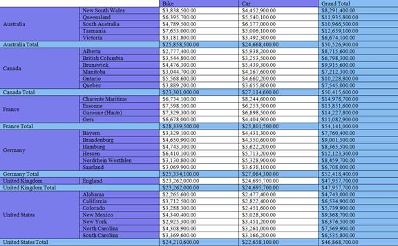

::: {style="DISPLAY: none"}
{#d2h_url_template} {#d2h_package_url style="WIDTH: 0px; DISPLAY: none; HEIGHT: 0px"}
:::

::: {.d2h_secondary_topic style="PADDING-BOTTOM: 10pt; MARGIN: 0pt; PADDING-LEFT: 0pt; PADDING-RIGHT: 0pt; PADDING-TOP: 0pt"}
##### Word Export {#word-export style="tab-stops: 0pt"}

 

PivotGrid for WPF can be exported as a Word document using Essential DocIO. The user can export the contents of the PivotGrid to the Word document for future archival, references and analysis purposes.

 

Call Export method

The [GridWordExport]{style="FONT-FAMILY: 'Courier New'; COLOR: #2b91af"}[]{style="FONT-FAMILY: 'Courier New'"}class provides support for exporting data from a PivotGrid to a Word document for verification. The following dlls should be added, along with the default dlls in the reference folder:

 

[·      ]{style="FONT-FAMILY: Symbol"}Syncfusion.PivotGridConverter.Wpf

[]{style="COLOR: #c00000"} 

+--------------------------------------------------------------------------------------------------------------------------------------------------------------------------------------------------------------+
| **[\[C#\]]{style="FONT-FAMILY: 'Courier New'"}**                                                                                                                                                             |
|                                                                                                                                                                                                              |
| **[]{style="FONT-FAMILY: 'Courier New'"}**                                                                                                                                                                   |
|                                                                                                                                                                                                              |
| [//// Export to Word Document.]{style="FONT-FAMILY: 'Courier New'; COLOR: green"}                                                                                                                            |
|                                                                                                                                                                                                              |
| [SaveFileDialog]{style="FONT-FAMILY: 'Courier New'; COLOR: #2b91af"} [ savedialog = [new]{style="COLOR: blue"}[SaveFileDialog]{style="COLOR: #2b91af"}();]{style="FONT-FAMILY: 'Courier New'"}               |
|                                                                                                                                                                                                              |
| [savedialog.AddExtension = [true]{style="COLOR: blue"};]{style="FONT-FAMILY: 'Courier New'"}                                                                                                                 |
|                                                                                                                                                                                                              |
| [savedialog.FileName = [\"Sample\"]{style="COLOR: #a31515"};]{style="FONT-FAMILY: 'Courier New'"}                                                                                                            |
|                                                                                                                                                                                                              |
| [savedialog.DefaultExt = [\"Doc\"]{style="COLOR: #a31515"};]{style="FONT-FAMILY: 'Courier New'"}                                                                                                             |
|                                                                                                                                                                                                              |
| [savedialog.Filter = [\"Word file (.Doc)\|\*.Doc\"]{style="COLOR: #a31515"};]{style="FONT-FAMILY: 'Courier New'"}                                                                                            |
|                                                                                                                                                                                                              |
| [if]{style="FONT-FAMILY: 'Courier New'; COLOR: blue"} [ (savedialog.ShowDialog() == [true]{style="COLOR: blue"})]{style="FONT-FAMILY: 'Courier New'"}                                                        |
|                                                                                                                                                                                                              |
| [{]{style="FONT-FAMILY: 'Courier New'"}                                                                                                                                                                      |
|                                                                                                                                                                                                              |
| [     fileName = savedialog.FileName;]{style="FONT-FAMILY: 'Courier New'"}                                                                                                                                   |
|                                                                                                                                                                                                              |
| [     [GridWordExport]{style="COLOR: #2b91af"} wordExport = [new]{style="COLOR: blue"}[GridWordExport]{style="COLOR: #2b91af"}([this]{style="COLOR: blue"}.pivotGrid1);]{style="FONT-FAMILY: 'Courier New'"} |
|                                                                                                                                                                                                              |
| [     wordExport.Export(fileName);]{style="FONT-FAMILY: 'Courier New'"}                                                                                                                                      |
|                                                                                                                                                                                                              |
| [}]{style="FONT-FAMILY: 'Courier New'"} []{style="FONT-FAMILY: 'Courier New'"}                                                                                                                               |
+--------------------------------------------------------------------------------------------------------------------------------------------------------------------------------------------------------------+

[]{style="COLOR: #c00000"} 

+------------------------------------------------------------------------------------------------------------------------------------------------------------------------------------------------------------+
| **[\[VB\]]{style="FONT-FAMILY: 'Courier New'"}**                                                                                                                                                           |
|                                                                                                                                                                                                            |
| [\' ]{style="FONT-FAMILY: 'Courier New'; COLOR: green"} [Export to Word Document.]{style="FONT-FAMILY: 'Courier New'; COLOR: green"}                                                                       |
|                                                                                                                                                                                                            |
| [Dim]{style="FONT-FAMILY: 'Courier New'; COLOR: blue"} [ savedialog [As]{style="COLOR: blue"} SaveFileDialog = [New]{style="COLOR: blue"} SaveFileDialog()]{style="FONT-FAMILY: 'Courier New'"}            |
|                                                                                                                                                                                                            |
| [savedialog.AddExtension = [True]{style="COLOR: blue"}]{style="FONT-FAMILY: 'Courier New'"}                                                                                                                |
|                                                                                                                                                                                                            |
| [savedialog.FileName = [\"Sample\"]{style="COLOR: #a31515"}]{style="FONT-FAMILY: 'Courier New'"}                                                                                                           |
|                                                                                                                                                                                                            |
| [savedialog.DefaultExt = [\"Doc\"]{style="COLOR: #a31515"}]{style="FONT-FAMILY: 'Courier New'"}                                                                                                            |
|                                                                                                                                                                                                            |
| [savedialog.Filter = [\"Word file (.Doc)\|\*.Doc\"]{style="COLOR: #a31515"}]{style="FONT-FAMILY: 'Courier New'"}                                                                                           |
|                                                                                                                                                                                                            |
| [If]{style="FONT-FAMILY: 'Courier New'; COLOR: blue"} [ savedialog.ShowDialog() = [True]{style="COLOR: blue"}[Then]{style="COLOR: blue"}]{style="FONT-FAMILY: 'Courier New'"}                              |
|                                                                                                                                                                                                            |
| [    fileName = savedialog.FileName]{style="FONT-FAMILY: 'Courier New'"}                                                                                                                                   |
|                                                                                                                                                                                                            |
| [    [Dim]{style="COLOR: blue"} wordExport [As]{style="COLOR: blue"} GridWordExport = [New]{style="COLOR: blue"} GridWordExport([Me]{style="COLOR: blue"}.pivotGrid1)]{style="FONT-FAMILY: 'Courier New'"} |
|                                                                                                                                                                                                            |
| [    wordExport.Export(fileName)]{style="FONT-FAMILY: 'Courier New'"}                                                                                                                                      |
|                                                                                                                                                                                                            |
| [End]{style="FONT-FAMILY: 'Courier New'; COLOR: blue"} [ [If]{style="COLOR: blue"} ]{style="FONT-FAMILY: 'Courier New'"} **[]{style="FONT-FAMILY: 'Courier New'"}**                                        |
+------------------------------------------------------------------------------------------------------------------------------------------------------------------------------------------------------------+

 

{border="0"}

Figure 25:  Exported Word Document from PivotGrid

[]{#related-topics}
:::
