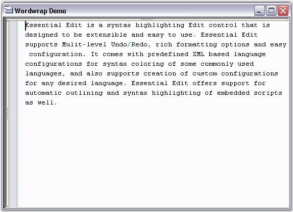

::: {style="DISPLAY: none"}
{#d2h_url_template}{#d2h_package_url style="WIDTH: 0px; DISPLAY: none; HEIGHT: 0px"}
:::

::::: {.d2h_secondary_topic style="PADDING-BOTTOM: 10pt; MARGIN: 0pt; PADDING-LEFT: 0pt; PADDING-RIGHT: 0pt; PADDING-TOP: 0pt"}
#### Wordwrap {#wordwrap style="tab-stops: 0pt"}

 

Wordwrap allows users to view the entire contents of a line, by wrapping text at the edge of the control (or text area) into one or more lines, that normally would have been outside the view in the Edit Control.

 

Edit Control allows advanced customization by using the Wordwrap functionality.

 

Type of Wordwrap

 

Wordwrap is enabled by setting the WordWrap property of the Edit Control to True. The two types of Wordwrap in Edit Control have been explained below.

 

::: {align="center"}
+-----------------------------------+----------------------------------------------------------------------------------------------+
| Edit Control Property             | Description                                                                                  |
+-----------------------------------+----------------------------------------------------------------------------------------------+
| WordWrap                          | Gets / sets state of the word wrapping mode.                                                 |
+-----------------------------------+----------------------------------------------------------------------------------------------+
| WordWrapType                      | Gets / sets type of word wrapping. The options provided are                                  |
|                                   |                                                                                              |
|                                   |                                                                                              |
|                                   |                                                                                              |
|                                   | [·      ]{style="FONT-FAMILY: Symbol"}*WrapByChar* - wraps the text by individual characters |
|                                   |                                                                                              |
|                                   | [·      ]{style="FONT-FAMILY: Symbol"}*WrapByWord* - wraps the text by individual words      |
|                                   |                                                                                              |
|                                   | *[]{style="COLOR: black; FONT-SIZE: 8pt"}*                                                   |
|                                   |                                                                                              |
|                                   | The default value is WrapByWord.                                                             |
+-----------------------------------+----------------------------------------------------------------------------------------------+
:::

 

+-----------------------------------------------------------------------------------------------------------------------------------------------------------------------------------------------------------------------------------------------+
| **[\[C#\]]{style="FONT-FAMILY: 'Courier New'; COLOR: black; FONT-SIZE: 9pt"}**                                                                                                                                                                |
|                                                                                                                                                                                                                                               |
|                                                                                                                                                                                                                                               |
|                                                                                                                                                                                                                                               |
| // WordWrap property set.                                                                                                                                                                                                                     |
|                                                                                                                                                                                                                                               |
| [this]{style="FONT-FAMILY: 'Courier New'; COLOR: blue; FONT-SIZE: 9pt"}[.editControl1.WordWrap = [true]{style="COLOR: blue"};]{style="FONT-FAMILY: 'Courier New'; FONT-SIZE: 9pt"}                                                            |
|                                                                                                                                                                                                                                               |
|                                                                                                                                                                                                                                               |
|                                                                                                                                                                                                                                               |
| // WordWrapType property set.                                                                                                                                                                                                                 |
|                                                                                                                                                                                                                                               |
| [this]{style="FONT-FAMILY: 'Courier New'; COLOR: blue; FONT-SIZE: 9pt"}[.editControl1.WordWrapType = Syncfusion.Windows.Forms.Edit.Enums.[WordWrapType]{style="COLOR: teal"}.WrapByChar;]{style="FONT-FAMILY: 'Courier New'; FONT-SIZE: 9pt"} |
+-----------------------------------------------------------------------------------------------------------------------------------------------------------------------------------------------------------------------------------------------+

 

+---------------------------------------------------------------------------------------------------------------------------------------------------------------------------------------------------------------------+
| **[\[VB.NET\]]{style="FONT-FAMILY: 'Courier New'; COLOR: black; FONT-SIZE: 9pt"}**                                                                                                                                  |
|                                                                                                                                                                                                                     |
|                                                                                                                                                                                                                     |
|                                                                                                                                                                                                                     |
| [\' WordWrap property set.]{style="FONT-FAMILY: 'Courier New'; COLOR: green; FONT-SIZE: 9pt"}                                                                                                                       |
|                                                                                                                                                                                                                     |
| [Me]{style="FONT-FAMILY: 'Courier New'; COLOR: blue; FONT-SIZE: 9pt"}[.editControl1.WordWrap = [True]{style="COLOR: blue"}]{style="FONT-FAMILY: 'Courier New'; FONT-SIZE: 9pt"}                                     |
|                                                                                                                                                                                                                     |
|                                                                                                                                                                                                                     |
|                                                                                                                                                                                                                     |
| \' WordWrapType property set.                                                                                                                                                                                       |
|                                                                                                                                                                                                                     |
| [Me]{style="FONT-FAMILY: 'Courier New'; COLOR: blue; FONT-SIZE: 9pt"}[.editControl1.WordWrapType = Syncfusion.Windows.Forms.Edit.Enums.WordWrapType.WrapByChar]{style="FONT-FAMILY: 'Courier New'; FONT-SIZE: 9pt"} |
+---------------------------------------------------------------------------------------------------------------------------------------------------------------------------------------------------------------------+

 

Wordwrap Mode

 

The following properties are associated with setting the mode of Word Wrapping.

 

::: {align="center"}
+-----------------------------------+--------------------------------------------------------------------------------------------------------------------------------------+
| Edit Control Property             | Description                                                                                                                          |
+-----------------------------------+--------------------------------------------------------------------------------------------------------------------------------------+
| WordWrapMode                      | Gets / sets state of the word wrapping mode. The options provided are                                                                |
|                                   |                                                                                                                                      |
|                                   |                                                                                                                                      |
|                                   |                                                                                                                                      |
|                                   | *WordWrapMargin* - wraps text at the boundary between text area and wordwrap margin of the Edit Control                              |
|                                   |                                                                                                                                      |
|                                   | The area beyond the text area in the Edit Control is referred to as                                                                  |
|                                   |                                                                                                                                      |
|                                   | the wordwrap margin. Hence, the width of the wordwrap margin is the difference between Edit Control\'s width and the TextArea width. |
|                                   |                                                                                                                                      |
|                                   | *Control[ ]{style="COLOR: #15428b; FONT-SIZE: 9pt"}*- wraps the text at the edge of the Edit Control                                 |
|                                   |                                                                                                                                      |
|                                   | *SpecifiedColumn -* wraps the text at the specified column that is specified in WordWrapColumn property                              |
|                                   |                                                                                                                                      |
|                                   |                                                                                                                                      |
|                                   |                                                                                                                                      |
|                                   | The default value is set to Control.                                                                                                 |
+-----------------------------------+--------------------------------------------------------------------------------------------------------------------------------------+
| WordWrapColumnMeasuringFont       | Gets / sets the font used while calculating the position of WordWrapColumn.                                                          |
+-----------------------------------+--------------------------------------------------------------------------------------------------------------------------------------+
| WordWrapColumn                    | Specifies column for wrapping text. Used when WordWrapMode is set to SpecifiedColumn.                                                |
|                                   |                                                                                                                                      |
|                                   |                                                                                                                                      |
|                                   |                                                                                                                                      |
|                                   | The default value is 100.                                                                                                            |
+-----------------------------------+--------------------------------------------------------------------------------------------------------------------------------------+
| TextAreaWidth                     | Gets / sets the width of the text area of the Edit Control.                                                                          |
|                                   |                                                                                                                                      |
|                                   |                                                                                                                                      |
|                                   |                                                                                                                                      |
|                                   | The default value is 600.                                                                                                            |
+-----------------------------------+--------------------------------------------------------------------------------------------------------------------------------------+
| WrappedLinesOffset                | Specifies offset of wrapped lines.                                                                                                   |
+-----------------------------------+--------------------------------------------------------------------------------------------------------------------------------------+
:::

 

+-------------------------------------------------------------------------------------------------------------------------------------------------------------------------------------------------------------------------------------------------------------------------------------------------------------------------------------------------------------------------------------------------------------------+
| **[\[C#\]]{style="FONT-FAMILY: 'Courier New'; COLOR: black"}**                                                                                                                                                                                                                                                                                                                                                    |
|                                                                                                                                                                                                                                                                                                                                                                                                                   |
| []{style="FONT-FAMILY: 'Courier New'"}                                                                                                                                                                                                                                                                                                                                                                            |
|                                                                                                                                                                                                                                                                                                                                                                                                                   |
| [// Sets the WordWrap mode.]{style="FONT-FAMILY: 'Courier New'"}                                                                                                                                                                                                                                                                                                                                                  |
|                                                                                                                                                                                                                                                                                                                                                                                                                   |
| [this]{style="FONT-FAMILY: 'Courier New'; COLOR: blue"}[.editControl1.WordWrapMode = Syncfusion.Windows.Forms.Edit.Enums.[WordWrapMode]{style="COLOR: teal"}.WordWrapMargin;]{style="FONT-FAMILY: 'Courier New'"}                                                                                                                                                                                                 |
|                                                                                                                                                                                                                                                                                                                                                                                                                   |
| []{style="FONT-FAMILY: 'Courier New'"}                                                                                                                                                                                                                                                                                                                                                                            |
|                                                                                                                                                                                                                                                                                                                                                                                                                   |
| [// Sets font that is used while calculating the position of the WordWrap column.]{style="FONT-FAMILY: 'Courier New'"}                                                                                                                                                                                                                                                                                            |
|                                                                                                                                                                                                                                                                                                                                                                                                                   |
| [this]{style="FONT-FAMILY: 'Courier New'; COLOR: blue"}[.editControl1.WordWrapColumnMeasuringFont = [new]{style="COLOR: blue"} System.Drawing.[Font]{style="COLOR: teal"}([\"Arial\"]{style="COLOR: maroon"}, 9.75F, System.Drawing.[FontStyle]{style="COLOR: teal"}.Regular, System.Drawing.[GraphicsUnit]{style="COLOR: teal"}.Point, (([byte]{style="COLOR: blue"})(0)));]{style="FONT-FAMILY: 'Courier New'"} |
|                                                                                                                                                                                                                                                                                                                                                                                                                   |
| []{style="FONT-FAMILY: 'Courier New'"}                                                                                                                                                                                                                                                                                                                                                                            |
|                                                                                                                                                                                                                                                                                                                                                                                                                   |
| [// Specifies column for wrapping text.]{style="FONT-FAMILY: 'Courier New'"}                                                                                                                                                                                                                                                                                                                                      |
|                                                                                                                                                                                                                                                                                                                                                                                                                   |
| [this]{style="FONT-FAMILY: 'Courier New'; COLOR: blue"}[.editControl1.WordWrapColumn = 125;]{style="FONT-FAMILY: 'Courier New'"}                                                                                                                                                                                                                                                                                  |
|                                                                                                                                                                                                                                                                                                                                                                                                                   |
| []{style="FONT-FAMILY: 'Courier New'"}                                                                                                                                                                                                                                                                                                                                                                            |
|                                                                                                                                                                                                                                                                                                                                                                                                                   |
| [// Set the width of the EditControl\'s text area.]{style="FONT-FAMILY: 'Courier New'"}                                                                                                                                                                                                                                                                                                                           |
|                                                                                                                                                                                                                                                                                                                                                                                                                   |
| [this]{style="FONT-FAMILY: 'Courier New'; COLOR: blue"}[.editControl1.TextAreaWidth = 300;]{style="FONT-FAMILY: 'Courier New'"}                                                                                                                                                                                                                                                                                   |
|                                                                                                                                                                                                                                                                                                                                                                                                                   |
| []{style="FONT-FAMILY: 'Courier New'"}                                                                                                                                                                                                                                                                                                                                                                            |
|                                                                                                                                                                                                                                                                                                                                                                                                                   |
| [// Specifies offset for the wrapped lines.]{style="FONT-FAMILY: 'Courier New'"}                                                                                                                                                                                                                                                                                                                                  |
|                                                                                                                                                                                                                                                                                                                                                                                                                   |
| [this]{style="FONT-FAMILY: 'Courier New'; COLOR: blue"}[.editControl1.WrappedLinesOffset = 10;]{style="FONT-FAMILY: 'Courier New'"}                                                                                                                                                                                                                                                                               |
+-------------------------------------------------------------------------------------------------------------------------------------------------------------------------------------------------------------------------------------------------------------------------------------------------------------------------------------------------------------------------------------------------------------------+

 

+-------------------------------------------------------------------------------------------------------------------------------------------------------------------------------------------------------------------------------------------------------------------------------------------------------------------------------------------------------------------------+
| **[\[VB.NET\]]{style="FONT-FAMILY: 'Courier New'; COLOR: black"}**                                                                                                                                                                                                                                                                                                      |
|                                                                                                                                                                                                                                                                                                                                                                         |
| []{style="FONT-FAMILY: 'Courier New'"}                                                                                                                                                                                                                                                                                                                                  |
|                                                                                                                                                                                                                                                                                                                                                                         |
| [\' Sets the WordWrap mode.]{style="FONT-FAMILY: 'Courier New'; COLOR: green"}                                                                                                                                                                                                                                                                                          |
|                                                                                                                                                                                                                                                                                                                                                                         |
| [Me]{style="FONT-FAMILY: 'Courier New'; COLOR: blue"}[.editControl1.WordWrapMode = Syncfusion.Windows.Forms.Edit.Enums.WordWrapMode.WordWrapMargin]{style="FONT-FAMILY: 'Courier New'"}                                                                                                                                                                                 |
|                                                                                                                                                                                                                                                                                                                                                                         |
| []{style="FONT-FAMILY: 'Courier New'"}                                                                                                                                                                                                                                                                                                                                  |
|                                                                                                                                                                                                                                                                                                                                                                         |
| [\' Sets font that is used while calculating the position of the WordWrap column.]{style="FONT-FAMILY: 'Courier New'; COLOR: green"}                                                                                                                                                                                                                                    |
|                                                                                                                                                                                                                                                                                                                                                                         |
| [Me]{style="FONT-FAMILY: 'Courier New'; COLOR: blue"}[.editControl1.WordWrapColumnMeasuringFont = [New]{style="COLOR: blue"} System.Drawing.Font([\"Arial\"]{style="COLOR: maroon"}, 9.75F, System.Drawing.FontStyle.Regular, System.Drawing.GraphicsUnit.Point, ([CType]{style="COLOR: blue"}((0), [Byte]{style="COLOR: blue"})))]{style="FONT-FAMILY: 'Courier New'"} |
|                                                                                                                                                                                                                                                                                                                                                                         |
| []{style="FONT-FAMILY: 'Courier New'"}                                                                                                                                                                                                                                                                                                                                  |
|                                                                                                                                                                                                                                                                                                                                                                         |
| [\' Specifies column for wrapping text.]{style="FONT-FAMILY: 'Courier New'; COLOR: green"}                                                                                                                                                                                                                                                                              |
|                                                                                                                                                                                                                                                                                                                                                                         |
| [Me]{style="FONT-FAMILY: 'Courier New'; COLOR: blue"}[.editControl1.WordWrapColumn = 125]{style="FONT-FAMILY: 'Courier New'"}                                                                                                                                                                                                                                           |
|                                                                                                                                                                                                                                                                                                                                                                         |
| []{style="FONT-FAMILY: 'Courier New'"}                                                                                                                                                                                                                                                                                                                                  |
|                                                                                                                                                                                                                                                                                                                                                                         |
| [\' Set the width of the EditControl\'s text area.]{style="FONT-FAMILY: 'Courier New'; COLOR: green"}                                                                                                                                                                                                                                                                   |
|                                                                                                                                                                                                                                                                                                                                                                         |
| [Me]{style="FONT-FAMILY: 'Courier New'; COLOR: blue"}[.editControl1.TextAreaWidth = 300]{style="FONT-FAMILY: 'Courier New'"}                                                                                                                                                                                                                                            |
|                                                                                                                                                                                                                                                                                                                                                                         |
| []{style="FONT-FAMILY: 'Courier New'; COLOR: blue"}                                                                                                                                                                                                                                                                                                                     |
|                                                                                                                                                                                                                                                                                                                                                                         |
| [\' Specifies offset for the wrapped lines.]{style="FONT-FAMILY: 'Courier New'; COLOR: green"}                                                                                                                                                                                                                                                                          |
|                                                                                                                                                                                                                                                                                                                                                                         |
| [Me]{style="FONT-FAMILY: 'Courier New'; COLOR: blue"}[.editControl1.WrappedLinesOffset = 10]{style="FONT-FAMILY: 'Courier New'"}                                                                                                                                                                                                                                        |
+-------------------------------------------------------------------------------------------------------------------------------------------------------------------------------------------------------------------------------------------------------------------------------------------------------------------------------------------------------------------------+

 

The following illustration shows the Edit Control with the WordWrappingMode and WordWrapType properties set.

 

 

{border="0"}

Figure 36: WordWrappingMode = \"Control\"; WordWrapType= \"WrapByWord\"

 

Refer to the WordWrap Demo sample in the following sample installation location.

 

..\\My Documents\\Syncfusion\\EssentialStudio\\Version Number\\Windows\\Edit.Windows\\Samples\\2.0\\Text Formatting\\WordwrapDemo

 

[]{#p53} 

More:

[ ]{#related-topics}

[{border="0" align="absMiddle"}Wordwrap Margin Customization and Wrapping Images](ms-xhelp:///?Id=7ebc9f19-a74b-4cf7-8600-d55a5ed73999){style="TEXT-DECORATION: none"}
:::::
