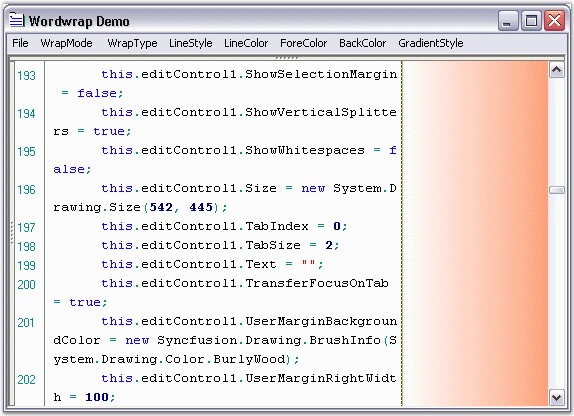
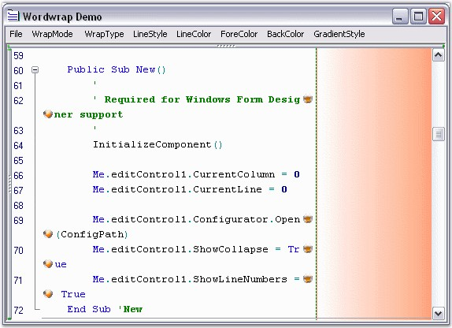

::: {style="DISPLAY: none"}
{#d2h_url_template}{#d2h_package_url style="WIDTH: 0px; DISPLAY: none; HEIGHT: 0px"}
:::

::::: {.d2h_secondary_topic style="PADDING-BOTTOM: 10pt; MARGIN: 0pt; PADDING-LEFT: 0pt; PADDING-RIGHT: 0pt; PADDING-TOP: 0pt"}
##### Wordwrap Margin Customization and Wrapping Images {#wordwrap-margin-customization-and-wrapping-images style="tab-stops: 0pt"}

 

This section discusses the wordwrap margin customization settings. Also, it discusses how images can be set for the wrapped and wrapping lines of the Edit Control.

 

**Margin Line Style and Line Color Settings**

 

Wordwrap margin of the Edit Control can be set and customized by using the below given properties.

 

::: {align="center"}
+-----------------------------------+------------------------------------------------------------------------------------------------------+
| Edit Control Property             | Description                                                                                          |
+-----------------------------------+------------------------------------------------------------------------------------------------------+
| WordWrapMarginVisible             | Gets / sets value indicating whether the wordwrap margin should be visible.                          |
+-----------------------------------+------------------------------------------------------------------------------------------------------+
| WordWrapMarginLineStyle           | Specifies style of line that is drawn at the border of the wordwrap margin. The options provided are |
|                                   |                                                                                                      |
|                                   |                                                                                                      |
|                                   |                                                                                                      |
|                                   | [·      ]{style="FONT-FAMILY: Symbol"}Solid                                                          |
|                                   |                                                                                                      |
|                                   | [·      ]{style="FONT-FAMILY: Symbol"}Dash                                                           |
|                                   |                                                                                                      |
|                                   | [·      ]{style="FONT-FAMILY: Symbol"}Dot                                                            |
|                                   |                                                                                                      |
|                                   | [·      ]{style="FONT-FAMILY: Symbol"}DashDot                                                        |
|                                   |                                                                                                      |
|                                   | [·      ]{style="FONT-FAMILY: Symbol"}DashDotDot                                                     |
|                                   |                                                                                                      |
|                                   | [·      ]{style="FONT-FAMILY: Symbol"}Custom                                                         |
|                                   |                                                                                                      |
|                                   |                                                                                                      |
|                                   |                                                                                                      |
|                                   | The default value is ***Solid***.                                                                    |
+-----------------------------------+------------------------------------------------------------------------------------------------------+
| WordWrapMarginLineColor           | Sets custom color for the line that is drawn at the border of the wordwrap margin.                   |
+-----------------------------------+------------------------------------------------------------------------------------------------------+
| WordWrapMarginBrush               | Gets / sets BrushInfo object that is used when the area situated after the text area is drawn.       |
+-----------------------------------+------------------------------------------------------------------------------------------------------+
:::

[]{style="FONT-FAMILY: 'Trebuchet MS','sans-serif'; COLOR: #15428b; FONT-SIZE: 9pt"} 

+--------------------------------------------------------------------------------------------------------------------------------------------------------------------------------------------------------------------------------------------------------------------------------------------------------------------------------------------------------------------------------------------------+
| **[\[C#\]]{style="FONT-FAMILY: 'Courier New'; COLOR: black"}**                                                                                                                                                                                                                                                                                                                                   |
|                                                                                                                                                                                                                                                                                                                                                                                                  |
| []{style="FONT-FAMILY: 'Courier New'; COLOR: black"}                                                                                                                                                                                                                                                                                                                                             |
|                                                                                                                                                                                                                                                                                                                                                                                                  |
| [// Specifies whether the wordwrap margin should be visible.]{style="FONT-FAMILY: 'Courier New'; COLOR: green"}                                                                                                                                                                                                                                                                                  |
|                                                                                                                                                                                                                                                                                                                                                                                                  |
| [this]{style="FONT-FAMILY: 'Courier New'; COLOR: blue"}[.editControl1.WordWrapMarginVisible = [true]{style="COLOR: blue"};]{style="FONT-FAMILY: 'Courier New'"}                                                                                                                                                                                                                                  |
|                                                                                                                                                                                                                                                                                                                                                                                                  |
| []{style="FONT-FAMILY: 'Courier New'"}                                                                                                                                                                                                                                                                                                                                                           |
|                                                                                                                                                                                                                                                                                                                                                                                                  |
| [// Specifies the line style of the wordwrap margin.]{style="FONT-FAMILY: 'Courier New'; COLOR: green"}                                                                                                                                                                                                                                                                                          |
|                                                                                                                                                                                                                                                                                                                                                                                                  |
| [this]{style="FONT-FAMILY: 'Courier New'; COLOR: blue"}[.editControl1.WordWrapMarginLineStyle = DashStyle.Dash;]{style="FONT-FAMILY: 'Courier New'"}                                                                                                                                                                                                                                             |
|                                                                                                                                                                                                                                                                                                                                                                                                  |
| []{style="FONT-FAMILY: 'Courier New'"}                                                                                                                                                                                                                                                                                                                                                           |
|                                                                                                                                                                                                                                                                                                                                                                                                  |
| [// Specifies the line color of the wordwrap margin.]{style="FONT-FAMILY: 'Courier New'; COLOR: green"}                                                                                                                                                                                                                                                                                          |
|                                                                                                                                                                                                                                                                                                                                                                                                  |
| [this]{style="FONT-FAMILY: 'Courier New'; COLOR: blue"}[.editControl1.WordWrapMarginLineColor = [Color]{style="COLOR: teal"}.Green;]{style="FONT-FAMILY: 'Courier New'"}                                                                                                                                                                                                                         |
|                                                                                                                                                                                                                                                                                                                                                                                                  |
| []{style="FONT-FAMILY: 'Courier New'"}                                                                                                                                                                                                                                                                                                                                                           |
|                                                                                                                                                                                                                                                                                                                                                                                                  |
| [// Specifies the BrushInfo object that is used when the area situated after the text area is drawn.]{style="FONT-FAMILY: 'Courier New'; COLOR: green"}                                                                                                                                                                                                                                          |
|                                                                                                                                                                                                                                                                                                                                                                                                  |
| [this]{style="FONT-FAMILY: 'Courier New'; COLOR: blue"}[.editControl1.WordWrapMarginBrush = [new]{style="COLOR: blue"} Syncfusion.Drawing.[BrushInfo]{style="COLOR: teal"}(Syncfusion.Drawing.[GradientStyle]{style="COLOR: teal"}.Horizontal, System.Drawing.[Color]{style="COLOR: teal"}.White, System.Drawing.[Color]{style="COLOR: teal"}.LightSalmon);]{style="FONT-FAMILY: 'Courier New'"} |
+--------------------------------------------------------------------------------------------------------------------------------------------------------------------------------------------------------------------------------------------------------------------------------------------------------------------------------------------------------------------------------------------------+

[]{style="FONT-FAMILY: 'Trebuchet MS','sans-serif'; COLOR: #15428b; FONT-SIZE: 9pt"} 

+---------------------------------------------------------------------------------------------------------------------------------------------------------------------------------------------------------------------------------------------------------------------------------------------------+
| **[\[VB.NET\]]{style="FONT-FAMILY: 'Courier New'; COLOR: black"}**                                                                                                                                                                                                                                |
|                                                                                                                                                                                                                                                                                                   |
| []{style="FONT-FAMILY: 'Courier New'; COLOR: black"}                                                                                                                                                                                                                                              |
|                                                                                                                                                                                                                                                                                                   |
| [\' Specifies whether the wordwrap margin should be visible.]{style="FONT-FAMILY: 'Courier New'; COLOR: green"}                                                                                                                                                                                   |
|                                                                                                                                                                                                                                                                                                   |
| [Me]{style="FONT-FAMILY: 'Courier New'; COLOR: blue"}[.editControl1.WordWrapMarginVisible = [True]{style="COLOR: blue"}]{style="FONT-FAMILY: 'Courier New'"}                                                                                                                                      |
|                                                                                                                                                                                                                                                                                                   |
| []{style="FONT-FAMILY: 'Courier New'; COLOR: blue"}                                                                                                                                                                                                                                               |
|                                                                                                                                                                                                                                                                                                   |
| [// Specifies the line style of the wordwrap margin.]{style="FONT-FAMILY: 'Courier New'; COLOR: green"}                                                                                                                                                                                           |
|                                                                                                                                                                                                                                                                                                   |
| [Me]{style="FONT-FAMILY: 'Courier New'; COLOR: blue"}[.editControl1.WordWrapMarginLineStyle = System.Drawing.Drawing2D.[DashStyle]{style="COLOR: teal"}.Dash]{style="FONT-FAMILY: 'Courier New'"}                                                                                                 |
|                                                                                                                                                                                                                                                                                                   |
| []{style="FONT-FAMILY: 'Courier New'"}                                                                                                                                                                                                                                                            |
|                                                                                                                                                                                                                                                                                                   |
| [// Specifies the line color of the wordwrap margin.]{style="FONT-FAMILY: 'Courier New'; COLOR: green"}                                                                                                                                                                                           |
|                                                                                                                                                                                                                                                                                                   |
| [Me]{style="FONT-FAMILY: 'Courier New'; COLOR: blue"}[.editControl1.WordWrapMarginLineColor = System.Drawing.[Color]{style="COLOR: teal"}.Green]{style="FONT-FAMILY: 'Courier New'"}                                                                                                              |
|                                                                                                                                                                                                                                                                                                   |
| []{style="FONT-FAMILY: 'Courier New'"}                                                                                                                                                                                                                                                            |
|                                                                                                                                                                                                                                                                                                   |
| [// Specifies the BrushInfo object that is used when the area situated after the text area is drawn.]{style="FONT-FAMILY: 'Courier New'; COLOR: green"}                                                                                                                                           |
|                                                                                                                                                                                                                                                                                                   |
| [Me]{style="FONT-FAMILY: 'Courier New'; COLOR: blue"}[.editControl1.WordWrapMarginBrush = [New]{style="COLOR: blue"} Syncfusion.Drawing.BrushInfo(Syncfusion.Drawing.GradientStyle.Horizontal, System.Drawing.Color.White, System.Drawing.Color.LightSalmon)]{style="FONT-FAMILY: 'Courier New'"} |
+---------------------------------------------------------------------------------------------------------------------------------------------------------------------------------------------------------------------------------------------------------------------------------------------------+

[]{style="FONT-FAMILY: 'Trebuchet MS','sans-serif'; COLOR: #15428b; FONT-SIZE: 9pt"} 

{border="0"}

Figure 37: Edit Control with Character Wrapping and Custom Painted Wordwrap Margin

 

Line Wrapping Images

 

It is also possible to associate images to indicate line wrapping. This feature can be turned on by setting the **MarkLineWrapping** property to **True**. There can be two types of image indicators:

[]{style="FONT-FAMILY: 'Trebuchet MS','sans-serif'; COLOR: #15428b; FONT-SIZE: 9pt"} 

1.   Images that indicate the line that is being wrapped. These are displayed at the beginning of the line being wrapped. This can be set by using the **CustomWrappedLinesMarkingImage** property.

 

2.   Images that indicate the point at which the line is being wrapped. This can be set by using the **CustomLineWrappingMarkingImage** property.

 

Also, to indicate whether wrapped lines should be marked, the **MarkWrappedLines** property can be used.

 

::: {align="center"}
  -------------------------------- -----------------------------------------------------
  Edit Control Property            Description
  MarkLineWrapping                 Specifies whether line wrapping should be marked.
  MarkWrappedLines                 Specifies whether wrapped lines should be marked.
  CustomWrappedLinesMarkingImage   Gets / sets custom image that marks wrapped lines.
  CustomLineWrappingMarkingImage   Gets / sets custom image that marks wrapping lines.
  -------------------------------- -----------------------------------------------------
:::

[]{style="FONT-FAMILY: 'Trebuchet MS','sans-serif'; COLOR: #15428b; FONT-SIZE: 9pt"} 

+-------------------------------------------------------------------------------------------------------------------------------------------------------------------------------------------------------------------------------------------------------------------+
| **[\[C#\]]{style="FONT-FAMILY: 'Courier New'; COLOR: black"}**                                                                                                                                                                                                    |
|                                                                                                                                                                                                                                                                   |
| []{style="FONT-FAMILY: 'Courier New'; COLOR: black"}                                                                                                                                                                                                              |
|                                                                                                                                                                                                                                                                   |
| [// Enable images to indicate line wrapping.]{style="FONT-FAMILY: 'Courier New'; COLOR: green"}                                                                                                                                                                   |
|                                                                                                                                                                                                                                                                   |
| [this]{style="FONT-FAMILY: 'Courier New'; COLOR: blue"}[.editControl1.MarkLineWrapping = [true]{style="COLOR: blue"};]{style="FONT-FAMILY: 'Courier New'"}                                                                                                        |
|                                                                                                                                                                                                                                                                   |
| []{style="FONT-FAMILY: 'Courier New'"}                                                                                                                                                                                                                            |
|                                                                                                                                                                                                                                                                   |
| [// Images that indicate the line that is being wrapped.]{style="FONT-FAMILY: 'Courier New'; COLOR: green"}                                                                                                                                                       |
|                                                                                                                                                                                                                                                                   |
| [this]{style="FONT-FAMILY: 'Courier New'; COLOR: blue"}[.editControl1.CustomWrappedLinesMarkingImage = ((System.Drawing.[Image]{style="COLOR: teal"})(resources.GetObject([\"\$this.Sunset\"]{style="COLOR: maroon"})));]{style="FONT-FAMILY: 'Courier New'"}     |
|                                                                                                                                                                                                                                                                   |
| []{style="FONT-FAMILY: 'Courier New'"}                                                                                                                                                                                                                            |
|                                                                                                                                                                                                                                                                   |
| [// Images that indicate the point at which the line is being wrapped.]{style="FONT-FAMILY: 'Courier New'; COLOR: green"}                                                                                                                                         |
|                                                                                                                                                                                                                                                                   |
| [this]{style="FONT-FAMILY: 'Courier New'; COLOR: blue"}[.editControl1.CustomLineWrappingMarkingImage = ((System.Drawing.[Image]{style="COLOR: teal"})(resources.GetObject([\"\$this.Blue_hills\"]{style="COLOR: maroon"})));]{style="FONT-FAMILY: 'Courier New'"} |
|                                                                                                                                                                                                                                                                   |
| []{style="FONT-FAMILY: 'Courier New'"}                                                                                                                                                                                                                            |
|                                                                                                                                                                                                                                                                   |
| [// Indicate wrapped lines.]{style="FONT-FAMILY: 'Courier New'; COLOR: green"}                                                                                                                                                                                    |
|                                                                                                                                                                                                                                                                   |
| [this]{style="FONT-FAMILY: 'Courier New'; COLOR: blue"}[.editControl1.MarkWrappedLines = [true]{style="COLOR: blue"};]{style="FONT-FAMILY: 'Courier New'"}                                                                                                        |
+-------------------------------------------------------------------------------------------------------------------------------------------------------------------------------------------------------------------------------------------------------------------+

[]{style="FONT-FAMILY: 'Trebuchet MS','sans-serif'; COLOR: #15428b; FONT-SIZE: 9pt"} 

+-----------------------------------------------------------------------------------------------------------------------------------------------------------------------------------------------------------------------------------------------------------------------+
| **[\[VB.NET\]]{style="FONT-FAMILY: 'Courier New'; COLOR: black"}**                                                                                                                                                                                                    |
|                                                                                                                                                                                                                                                                       |
| []{style="FONT-FAMILY: 'Courier New'; COLOR: black"}                                                                                                                                                                                                                  |
|                                                                                                                                                                                                                                                                       |
| [\' Enable images to indicate line wrapping.]{style="FONT-FAMILY: 'Courier New'; COLOR: green"}                                                                                                                                                                       |
|                                                                                                                                                                                                                                                                       |
| [Me]{style="FONT-FAMILY: 'Courier New'; COLOR: blue"}[.editControl1.MarkLineWrapping = [True]{style="COLOR: blue"}]{style="FONT-FAMILY: 'Courier New'"}                                                                                                               |
|                                                                                                                                                                                                                                                                       |
| []{style="FONT-FAMILY: 'Courier New'"}                                                                                                                                                                                                                                |
|                                                                                                                                                                                                                                                                       |
| [\' Images that indicate the line that is being wrapped.]{style="FONT-FAMILY: 'Courier New'; COLOR: green"}                                                                                                                                                           |
|                                                                                                                                                                                                                                                                       |
| [Me]{style="FONT-FAMILY: 'Courier New'; COLOR: blue"}[.editControl1.CustomWrappedLinesMarkingImage = ([CType]{style="COLOR: blue"}((resources.GetObject([\"\$this.Sunset\"]{style="COLOR: maroon"})), System.Drawing.Image))]{style="FONT-FAMILY: 'Courier New'"}     |
|                                                                                                                                                                                                                                                                       |
| []{style="FONT-FAMILY: 'Courier New'"}                                                                                                                                                                                                                                |
|                                                                                                                                                                                                                                                                       |
| [\' Images that indicate the point at which the line is being wrapped.]{style="FONT-FAMILY: 'Courier New'; COLOR: green"}                                                                                                                                             |
|                                                                                                                                                                                                                                                                       |
| [Me]{style="FONT-FAMILY: 'Courier New'; COLOR: blue"}[.editControl1.CustomLineWrappingMarkingImage = ([CType]{style="COLOR: blue"}((resources.GetObject([\"\$this.Blue_hills\"]{style="COLOR: maroon"})), System.Drawing.Image))]{style="FONT-FAMILY: 'Courier New'"} |
|                                                                                                                                                                                                                                                                       |
| []{style="FONT-FAMILY: 'Courier New'"}                                                                                                                                                                                                                                |
|                                                                                                                                                                                                                                                                       |
| [\' Indicate wrapped lines.]{style="FONT-FAMILY: 'Courier New'; COLOR: green"}                                                                                                                                                                                        |
|                                                                                                                                                                                                                                                                       |
| [Me]{style="FONT-FAMILY: 'Courier New'; COLOR: blue"}[.editControl1.MarkWrappedLines = [True]{style="COLOR: blue"}]{style="FONT-FAMILY: 'Courier New'"}                                                                                                               |
+-----------------------------------------------------------------------------------------------------------------------------------------------------------------------------------------------------------------------------------------------------------------------+

[]{style="FONT-FAMILY: 'Trebuchet MS','sans-serif'; COLOR: #15428b; FONT-SIZE: 9pt"} 

{border="0"}

Figure 38: Wrapping Images indicating Wrapped Lines and Point of Wrapping

[]{#p54} 

[]{#related-topics}
:::::
