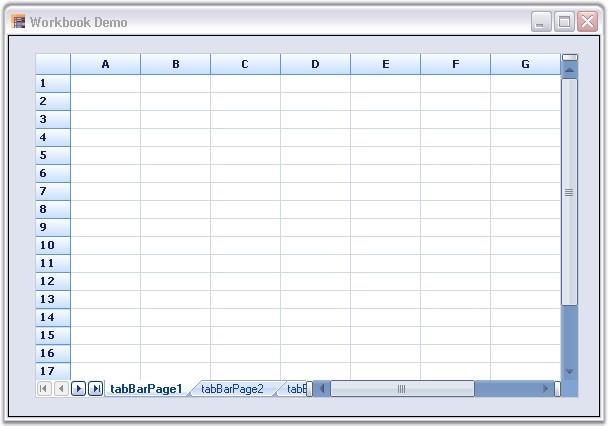

::: {style="DISPLAY: none"}
{#d2h_url_template}{#d2h_package_url style="WIDTH: 0px; DISPLAY: none; HEIGHT: 0px"}
:::

::: {.d2h_secondary_topic style="PADDING-BOTTOM: 10pt; MARGIN: 0pt; PADDING-LEFT: 0pt; PADDING-RIGHT: 0pt; PADDING-TOP: 0pt"}
##### Workbook {#workbook style="tab-stops: 0pt"}

[]{style="FONT-FAMILY: 'Trebuchet MS','sans-serif'; COLOR: #15428b; FONT-SIZE: 9pt"} 

The worksheets in a workbook can be displayed as tabs for easier view and selection of worksheets, similar to Excel. This is achieved by using the Tab Bar Splitter control. You can add any number of Tab Bar pages to the Tab Bar Splitter control, and then add the Grid control to each Tab Bar page, to get the appearance similar to the Workbook in Excel.

[]{style="FONT-FAMILY: 'Trebuchet MS','sans-serif'; COLOR: #15428b; FONT-SIZE: 9pt"} 

1.   Using C#

[]{style="FONT-FAMILY: 'Trebuchet MS','sans-serif'; COLOR: #15428b; FONT-SIZE: 9pt"} 

+-----------------------------------------------------------------------------------------------------------------------------------------------------------------------------+
| **[\[C#\]]{style="FONT-FAMILY: 'Courier New'; COLOR: black"}**                                                                                                              |
|                                                                                                                                                                             |
| []{style="FONT-FAMILY: 'Courier New'; COLOR: black"}                                                                                                                        |
|                                                                                                                                                                             |
| [this]{style="FONT-FAMILY: 'Courier New'; COLOR: blue"}[.tabBarSplitterControl1.Controls.Add([this]{style="COLOR: blue"}.tabBarPage1);]{style="FONT-FAMILY: 'Courier New'"} |
|                                                                                                                                                                             |
| [this]{style="FONT-FAMILY: 'Courier New'; COLOR: blue"}[.tabBarSplitterControl1.Controls.Add([this]{style="COLOR: blue"}.tabBarPage2);]{style="FONT-FAMILY: 'Courier New'"} |
|                                                                                                                                                                             |
| [this]{style="FONT-FAMILY: 'Courier New'; COLOR: blue"}[.tabBarSplitterControl1.Controls.Add([this]{style="COLOR: blue"}.tabBarPage3);]{style="FONT-FAMILY: 'Courier New'"} |
|                                                                                                                                                                             |
| []{style="FONT-FAMILY: 'Courier New'"}                                                                                                                                      |
|                                                                                                                                                                             |
| [// Adding Grid controls to the Tab Bar Pages.]{style="FONT-FAMILY: 'Courier New'; COLOR: green"}                                                                           |
|                                                                                                                                                                             |
| [this]{style="FONT-FAMILY: 'Courier New'; COLOR: blue"}[.tabBarPage1.Controls.Add([this]{style="COLOR: blue"}.gridControl1);]{style="FONT-FAMILY: 'Courier New'"}           |
|                                                                                                                                                                             |
| [this]{style="FONT-FAMILY: 'Courier New'; COLOR: blue"}[.tabBarPage2.Controls.Add([this]{style="COLOR: blue"}.gridControl2);]{style="FONT-FAMILY: 'Courier New'"}           |
|                                                                                                                                                                             |
| [this]{style="FONT-FAMILY: 'Courier New'; COLOR: blue"}[.tabBarPage3.Controls.Add([this]{style="COLOR: blue"}.gridControl3);]{style="FONT-FAMILY: 'Courier New'"}           |
+-----------------------------------------------------------------------------------------------------------------------------------------------------------------------------+

[]{style="FONT-FAMILY: 'Trebuchet MS','sans-serif'; COLOR: #15428b; FONT-SIZE: 9pt"} 

2.   Using VB.NET

[]{style="FONT-FAMILY: 'Trebuchet MS','sans-serif'; COLOR: #15428b; FONT-SIZE: 9pt"} 

+------------------------------------------------------------------------------------------------------------------------------------------------------------------------+
| **[\[VB.NET\]]{style="FONT-FAMILY: 'Courier New'; COLOR: black"}**                                                                                                     |
|                                                                                                                                                                        |
| []{style="FONT-FAMILY: 'Courier New'; COLOR: black"}                                                                                                                   |
|                                                                                                                                                                        |
| [Me]{style="FONT-FAMILY: 'Courier New'; COLOR: blue"}[.tabBarSplitterControl1.Controls.Add([Me]{style="COLOR: blue"}.tabBarPage1)]{style="FONT-FAMILY: 'Courier New'"} |
|                                                                                                                                                                        |
| [Me]{style="FONT-FAMILY: 'Courier New'; COLOR: blue"}[.tabBarSplitterControl1.Controls.Add([Me]{style="COLOR: blue"}.tabBarPage2)]{style="FONT-FAMILY: 'Courier New'"} |
|                                                                                                                                                                        |
| [Me]{style="FONT-FAMILY: 'Courier New'; COLOR: blue"}[.tabBarSplitterControl1.Controls.Add([Me]{style="COLOR: blue"}.tabBarPage3)]{style="FONT-FAMILY: 'Courier New'"} |
|                                                                                                                                                                        |
| []{style="FONT-FAMILY: 'Courier New'"}                                                                                                                                 |
|                                                                                                                                                                        |
| [\' Adding Grid controls to the Tab Bar Pages.]{style="FONT-FAMILY: 'Courier New'; COLOR: green"}                                                                      |
|                                                                                                                                                                        |
| [Me]{style="FONT-FAMILY: 'Courier New'; COLOR: blue"}[.tabBarPage1.Controls.Add([Me]{style="COLOR: blue"}.gridControl1)]{style="FONT-FAMILY: 'Courier New'"}           |
|                                                                                                                                                                        |
| [Me]{style="FONT-FAMILY: 'Courier New'; COLOR: blue"}[.tabBarPage2.Controls.Add([Me]{style="COLOR: blue"}.gridControl2)]{style="FONT-FAMILY: 'Courier New'"}           |
|                                                                                                                                                                        |
| [Me]{style="FONT-FAMILY: 'Courier New'; COLOR: blue"}[.tabBarPage3.Controls.Add([Me]{style="COLOR: blue"}.gridControl3)]{style="FONT-FAMILY: 'Courier New'"}           |
+------------------------------------------------------------------------------------------------------------------------------------------------------------------------+

[]{style="FONT-FAMILY: 'Trebuchet MS','sans-serif'; COLOR: #15428b; FONT-SIZE: 9pt"} 

{border="0"}

[]{style="FONT-FAMILY: 'Trebuchet MS','sans-serif'; COLOR: #15428b; FONT-SIZE: 9pt"} 

*[Figure ]{style="FONT-SIZE: 9pt"}[120]{style="FONT-SIZE: 9pt"}[: Workbook]{style="FONT-SIZE: 9pt"}*

 

[]{#p110} 

 

[]{#related-topics}
:::
