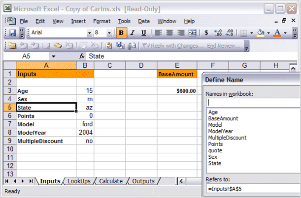
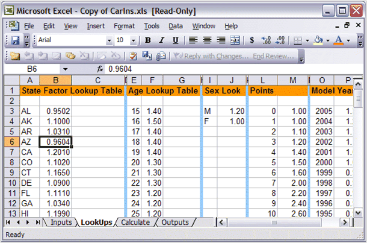
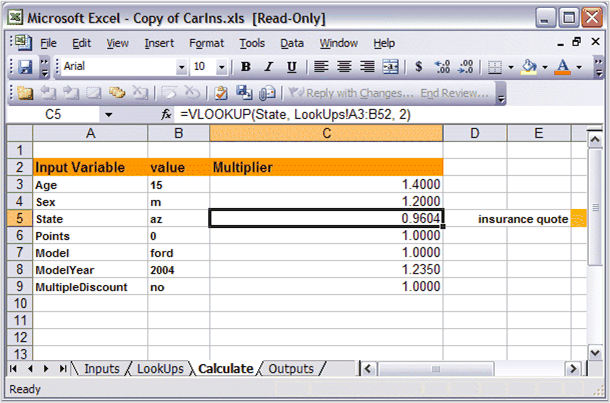
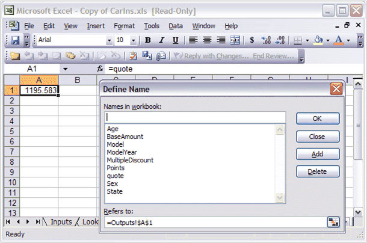
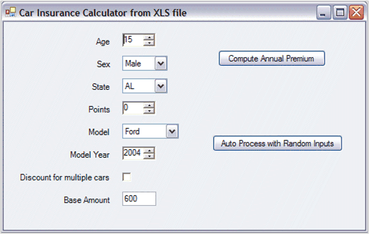

::: {style="DISPLAY: none"}
{#d2h_url_template}{#d2h_package_url style="WIDTH: 0px; DISPLAY: none; HEIGHT: 0px"}
:::

::::: {#nsbanner .d2h_main_nsbanner style="BORDER-BOTTOM: #999999 1px solid; POSITION: relative; PADDING-BOTTOM: 0px; BACKGROUND-COLOR: transparent; PADDING-LEFT: 0px; PADDING-RIGHT: 0px; DISPLAY: none; BORDER-TOP: #999999 1px solid; PADDING-TOP: 0px; LEFT: 0px"}
:::: {#TitleRow .d2h_main_titlerow style="PADDING-BOTTOM: 4px; BACKGROUND-COLOR: transparent; PADDING-LEFT: 22px; WIDTH: 100%; PADDING-RIGHT: 10px; DISPLAY: none; PADDING-TOP: 4px"}
::: {#ienav .d2h_main_ienav style="DISPLAY: none"}
{#D2HPrevious .D2HPreviousEnabled}  {#D2HNext .D2HNextEnabled}
:::
::::
:::::

::::: {#nstext .d2h_main_nstext style="PADDING-BOTTOM: 10px; BACKGROUND-COLOR: transparent; PADDING-LEFT: 22px; PADDING-RIGHT: 10px; HEIGHT: 100%; OVERFLOW: auto; PADDING-TOP: 5px" hasuserbackground="true" valign="bottom"}
::: {#d2h_breadcrumbs .d2h_breadcrumbs}
[Essential Studio User Guide Documentation](ms-xhelp:///?Id=12457748-09e3-4d74-a240-8e049cedf030){.d2h_breadcrumbsNormal}[ \> ]{.d2h_breadcrumbsLinkSeparator}[Reporting Edition](ms-xhelp:///?Id=027aa5b6-6676-4f93-ad23-c20e8c45792e){.d2h_breadcrumbsNormal}[ \> ]{.d2h_breadcrumbsLinkSeparator}[Essential Calculate](ms-xhelp:///?Id=2ea52c7f-a332-43bd-9ca7-2ea0898ff54e){.d2h_breadcrumbsNormal}[ \> ]{.d2h_breadcrumbsLinkSeparator}[Concepts and Features](ms-xhelp:///?Id=91222e44-d3ca-4392-8f0f-41bd2ae3dd3f){.d2h_breadcrumbsNormal}
:::

## Working with an Excel Spreadsheet[]{#p44} {#working-with-an-excel-spreadsheet style="tab-stops: 0pt"}

 

You can use the Microsoft Excel to design spreadsheets that can be used on systems where MS Excel is not installed. This can be done by using a combination of Essential XlsIO and Essential Calculate, where the former can be used to read and write the spreadsheet and later to actually do the computation as values in the spreadsheet are modified.

 

Example

 

To illustrate this process, consider a sample project, Essential Studio\\x.x.x.x\\Windows\\Calculation.Windows\\Samples\\2.0\\XlsFileUsingExcelRW.

 

::: {style="BORDER-BOTTOM: windowtext 1pt solid; BORDER-LEFT: medium none; PADDING-BOTTOM: 1pt; MARGIN-TOP: 9pt; PADDING-LEFT: 0pt; PADDING-RIGHT: 0pt; MARGIN-BOTTOM: 9pt; BORDER-TOP: windowtext 1pt solid; BORDER-RIGHT: medium none; PADDING-TOP: 1pt"}
{border="0"} Note: This requires you to have Essential XlsIO installed in addition to Essential Calculate. MS Excel is not required.
:::

 

The spreadsheet you are using is a car insurance calculator. It uses Names to manage variable values and has the following four sheets.

 

[·      ]{style="FONT-FAMILY: Symbol"}**Inputs**-Contains the input values for the car insurance calculations like the state, age, and so on.

[·      ]{style="FONT-FAMILY: Symbol"}**LookUps**-Contains data that determine insurance rates[. ]{style="COLOR: red"}For example, each state has a weight assigned to it; each age has a weight assigned to it, and so on.

[·      ]{style="FONT-FAMILY: Symbol"}**Calculate**-Does the actual calculations[. ]{style="COLOR: red"}Based on the input values from the input sheet, formulas in this sheet, look up appropriate weights from the LookUps sheet, and compute the car insurance cost depending upon these weights.

[·      ]{style="FONT-FAMILY: Symbol"}**Outputs**-Contains the computed results obtained from the Calculate sheet.

 

{border="0"}

Figure 37: Worksheet that Receives Inputs

 

{border="0"}

Figure 38: Worksheet that Holds LookUp Tables

 

{border="0"}

Figure 39: Worksheet that Performs Calculations

 

{border="0"}

Figure 40: Dialog Box Showing Named Variables

***[]{style="FONT-FAMILY: 'Trebuchet MS','sans-serif'; COLOR: #15428b; FONT-SIZE: 9pt"}*** 

This layout represents a general calculation design process which you can use for batch processing of information. The idea is that you change the inputs (all on a single sheet) and then return the outputs (all from a single sheet). There may be a web service or a server application that will allow clients to upload inputs and then download outputs. Or it could just be a batch processing calculation engine. Using this technique, you can use Excel to design complex calculations and then have a simple application that runs on systems without Excel, to input new values and retrieve computed results.

 

For example, consider the below form which accepts input values from the user. Once the values are set, the user clicks a button on the form that puts these values into the inputs sheet and then retrieves the insurance costs from the Outputs sheet and displays it on the form.

 

{border="0"}

Figure 41: Form interface for our Excel Workbook

 

Before learning about the actual code used in this sample to access XLS files, you need to know about a couple of classes in Essential Calculate as well as the role that Essential XlsIO will play.

More:

[ ]{#related-topics}

[{border="0" align="absMiddle"}CalcSheet and CalcWorkbook Classes](ms-xhelp:///?Id=27419508-cc91-44ab-aba0-6983409ab015){style="TEXT-DECORATION: none"}

[{border="0" align="absMiddle"}Using Essential XlsIO](ms-xhelp:///?Id=75c7442e-381f-46d4-8138-7ec920d1f1bb){style="TEXT-DECORATION: none"}

[{border="0" align="absMiddle"}Car Insurance Sample Details](ms-xhelp:///?Id=786edd05-3883-44b1-8f10-e4434b3fcb72){style="TEXT-DECORATION: none"}
:::::
