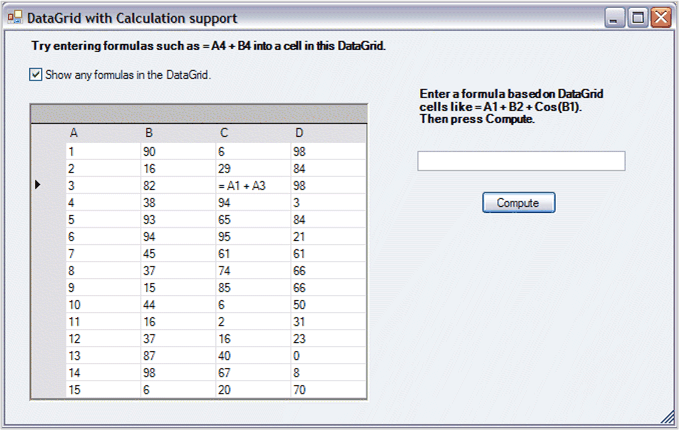

::: {style="DISPLAY: none"}
{#d2h_url_template}{#d2h_package_url style="WIDTH: 0px; DISPLAY: none; HEIGHT: 0px"}
:::

::: {.d2h_secondary_topic style="PADDING-BOTTOM: 10pt; MARGIN: 0pt; PADDING-LEFT: 0pt; PADDING-RIGHT: 0pt; PADDING-TOP: 0pt"}
#### Working with System.Windows.Forms.DataGrid {#working-with-system.windows.forms.datagrid style="tab-stops: 0pt"}

 

A Windows Forms Data Grid is a rectangular container that holds data in cells. Such a container is a natural medium for using calculation support. To add Essential Calculation support to classes that represent data in a row/column format like a Data Grid, you will have to derive the class and implement the ICalcData interface. This interface contains three methods and one event. Once you add the appropriate interface implementation, your derived object will have formula support.

 

The following is a discussion of using Essential Calculate with a Data Grid as an ICalcData object is based on the Essential Studio\\Windows\\Calculation.Windows\\Samples\\DataGridCalculator sample that ships with the product. The sample has a derived DataGrid class that implements ICalcData. Below is a screen shot of a sample screen. The sample sets the column header text to A, B, and so on, and places 1, 2, and so on, in the first column along with random integers in the other columns. This is done to remind you of the Excel-like cell notation of A1, A2, B2, and so on. This is the notation supported by Essential Calculate formulas using ICalcData objects.

 

 

   {border="0"}

Figure 34[]{#p39}: Data Grid

[]{style="FONT-FAMILY: 'Trebuchet MS','sans-serif'; COLOR: #15428b; FONT-SIZE: 9pt"} 

You can copy the code that defines the derived DataGrid object to your projects and have immediate support for calculations in a Data Grid using **Data Table** data sources. Before we begin with the details of this sample and the derived DataGrid class, we will discuss the ICalcData interface describing the purpose of its implementation details.

 

 

More:

[ ]{#related-topics}

[{border="0" align="absMiddle"}Using CalcDataGrid as a Single Spreadsheet](ms-xhelp:///?Id=45e8f7ea-e03d-41f0-bf2b-6dbddbb97fd1){style="TEXT-DECORATION: none"}

[{border="0" align="absMiddle"}Using Several CalcDataGrids in a Workbook](ms-xhelp:///?Id=083c5de2-57ac-4615-afb5-e07512797ab3){style="TEXT-DECORATION: none"}
:::
