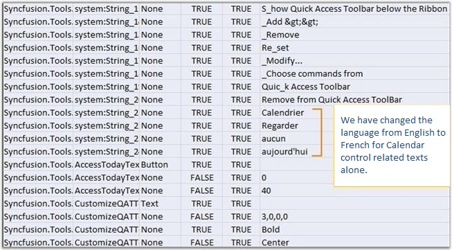

::: {style="DISPLAY: none"}
{#d2h_url_template}{#d2h_package_url style="WIDTH: 0px; DISPLAY: none; HEIGHT: 0px"}
:::

::::: {#nsbanner .d2h_main_nsbanner style="BORDER-BOTTOM: #999999 1px solid; POSITION: relative; PADDING-BOTTOM: 0px; BACKGROUND-COLOR: transparent; PADDING-LEFT: 0px; PADDING-RIGHT: 0px; DISPLAY: none; BORDER-TOP: #999999 1px solid; PADDING-TOP: 0px; LEFT: 0px"}
:::: {#TitleRow .d2h_main_titlerow style="PADDING-BOTTOM: 4px; BACKGROUND-COLOR: transparent; PADDING-LEFT: 22px; WIDTH: 100%; PADDING-RIGHT: 10px; DISPLAY: none; PADDING-TOP: 4px"}
::: {#ienav .d2h_main_ienav style="DISPLAY: none"}
{#D2HPrevious .D2HPreviousEnabled}  {#D2HNext .D2HNextEnabled}
:::
::::
:::::

:::::::: {#nstext .d2h_main_nstext style="PADDING-BOTTOM: 10px; BACKGROUND-COLOR: transparent; PADDING-LEFT: 22px; PADDING-RIGHT: 10px; HEIGHT: 100%; OVERFLOW: auto; PADDING-TOP: 5px" hasuserbackground="true" valign="bottom"}
::: {#d2h_breadcrumbs .d2h_breadcrumbs}
[Essential Studio User Guide Documentation](ms-xhelp:///?Id=12457748-09e3-4d74-a240-8e049cedf030){.d2h_breadcrumbsNormal}[ \> ]{.d2h_breadcrumbsLinkSeparator}[Essential Common](ms-xhelp:///?Id=2bfe10b6-fac1-4f91-a173-04db314f10c3){.d2h_breadcrumbsNormal}[ \> ]{.d2h_breadcrumbsLinkSeparator}[Frequently Asked Questions](ms-xhelp:///?Id=8c0b82fa-382a-437e-9ce1-9b9ffd3f2ead){.d2h_breadcrumbsNormal}[ \> ]{.d2h_breadcrumbsLinkSeparator}[How to Implement Localization Support](ms-xhelp:///?Id=7c104b30-cfaa-4a58-a14e-9015a1f96ad4){.d2h_breadcrumbsNormal}
:::

### WPF {#wpf style="tab-stops: 0pt"}

[     ]{style="FONT-FAMILY: 'Trebuchet MS','sans-serif'; COLOR: #15428b; FONT-SIZE: 9pt"}

You can use this satellite assembly to utilize the localization support for your culture. The following steps will help you to extract the resource strings to a **.csv** file using the **LocBaml.exe** file, as a major part of enabling localization.

[]{style="FONT-FAMILY: 'Trebuchet MS','sans-serif'; COLOR: #15428b; FONT-SIZE: 9pt"} 

**[ ]{style="FONT-FAMILY: 'Trebuchet MS','sans-serif'; COLOR: #15428b; FONT-SIZE: 9pt"}**The Syncfusion.Tools.WPF.Resources.dll is sufficient to generate the localization support for the Syncfusion controls. This assembly will be available in the following installation location.**[]{style="FONT-FAMILY: 'Trebuchet MS','sans-serif'; COLOR: #15428b; FONT-SIZE: 9pt"}**

[]{style="FONT-FAMILY: 'Trebuchet MS','sans-serif'; COLOR: #15428b; FONT-SIZE: 9pt"} 

***\[Installed_location\]\\Syncfusion\\Essential Studio\\\<Version Number\>\\Assemblies\\3.5***

**** 

[  ]{style="FONT-FAMILY: 'Trebuchet MS','sans-serif'; COLOR: #15428b; FONT-SIZE: 9pt"}

1.   Download the **LocBaml.exe** file from the following location.

 

[[http://files.syncfusion.com/support/Tools.WPF/UG/LocBaml.zip]{.UGHyperlink}](http://files.syncfusion.com/support/Tools.WPF/UG/LocBaml.zip)[]{.UGHyperlink}

 

2.   Copy the **exe** file and Syncfusion.Tools.WPF.Resources.dll to the following location.

 

***\<Your Application\>\\bin\\Debug\\en-US***

 

3.   Open the command prompt, and navigate to the same directory.

4.   [ ]{style="FONT-FAMILY: 'Trebuchet MS','sans-serif'; COLOR: #15428b; FONT-SIZE: 9pt"}Use the following command to generate the **.csv** file from the existing Syncfusion.Tools.WPF.Resources.dll.

 

***\[Your Application\]\\bin\\Debug\\en-US \\LocBaml /parse Syncfusion.Tools.WPF.Resources.dll /out:resourceStrings.csv***

[]{style="FONT-FAMILY: 'Trebuchet MS','sans-serif'; COLOR: #15428b; FONT-SIZE: 9pt"} 

[]{style="FONT-FAMILY: 'Trebuchet MS','sans-serif'; COLOR: #15428b; FONT-SIZE: 9pt"} 

::: {style="BORDER-BOTTOM: windowtext 1pt solid; BORDER-LEFT: medium none; PADDING-BOTTOM: 1pt; MARGIN-TOP: 9pt; PADDING-LEFT: 0pt; PADDING-RIGHT: 0pt; MARGIN-BOTTOM: 9pt; BORDER-TOP: windowtext 1pt solid; BORDER-RIGHT: medium none; PADDING-TOP: 1pt"}
{border="0"}Note: The .csv files can be edited via MS Excel (or) Notepad. This file contains our string resources with the default text in English language.
:::

[]{style="FONT-FAMILY: 'Trebuchet MS','sans-serif'; COLOR: #15428b; FONT-SIZE: 9pt"} 

5.   Open the **.csv** file using MS Excel or Notepad, and change the texts based on your culture.

 

The following illustrates customizing from English to French.

[]{style="FONT-FAMILY: 'Verdana','sans-serif'"} 

{border="0"}

 Figure 161:ResourceStrings.csv

 

6.   Generate localized satellite assembly using the modified **.csv** file and install in the application.

7.   Open command prompt, and navigate to the en-US directory.

8.   Create another directory fr-CH under Bin\\Debug folder using the md fr-CH command.

[]{style="FONT-FAMILY: 'Trebuchet MS','sans-serif'; COLOR: #15428b; FONT-SIZE: 9pt"} 

::: {style="BORDER-BOTTOM: windowtext 1pt solid; BORDER-LEFT: medium none; PADDING-BOTTOM: 1pt; MARGIN-TOP: 9pt; PADDING-LEFT: 0pt; PADDING-RIGHT: 0pt; MARGIN-BOTTOM: 9pt; BORDER-TOP: windowtext 1pt solid; BORDER-RIGHT: medium none; PADDING-TOP: 1pt"}
{border="0"}Note: Directory name should follow proper culture name.
:::

[]{style="FONT-FAMILY: 'Trebuchet MS','sans-serif'; COLOR: #15428b; FONT-SIZE: 9pt"} 

9.   Generate your own culture-specified assembly using the following command from en-US folder.

\
***LocBaml /generate /tran: resourceStrings.csv /out:../fr-CH /cul:fr-CH Syncfusion.Tools.WPF.Resources.dll***

 

Now you will be able to see the generated satellite assembly under fr-CH folder.

10.  Run your application with the CurrentUICulture as **fr-CH** in **App.xaml** files as given in the following code.

 

+-----------------------------------------------------------------------------------------------------------------------------------------------------------------------------------------------------------------------------------------------------------------+
| **[\[C#\]]{style="FONT-FAMILY: 'Courier New'; COLOR: black"}**                                                                                                                                                                                                  |
|                                                                                                                                                                                                                                                                 |
|                                                                                                                                                                                                                                                                 |
|                                                                                                                                                                                                                                                                 |
| [public]{style="FONT-FAMILY: 'Courier New'; COLOR: blue"}[ App()]{style="FONT-FAMILY: 'Courier New'"}                                                                                                                                                           |
|                                                                                                                                                                                                                                                                 |
| [{]{style="FONT-FAMILY: 'Courier New'"}                                                                                                                                                                                                                         |
|                                                                                                                                                                                                                                                                 |
| [Thread]{style="FONT-FAMILY: 'Courier New'; COLOR: #2b91af"}[.CurrentThread.CurrentUICulture = [new]{style="COLOR: blue"} System.Globalization.[CultureInfo]{style="COLOR: #2b91af"}([\"fr-FR\"]{style="COLOR: #a31515"});]{style="FONT-FAMILY: 'Courier New'"} |
|                                                                                                                                                                                                                                                                 |
| [Thread]{style="FONT-FAMILY: 'Courier New'; COLOR: #2b91af"}[.CurrentThread.CurrentCulture = [new]{style="COLOR: blue"} System.Globalization.[CultureInfo]{style="COLOR: #2b91af"}([\"fr-FR\"]{style="COLOR: #a31515"});]{style="FONT-FAMILY: 'Courier New'"}   |
|                                                                                                                                                                                                                                                                 |
| [}]{style="FONT-FAMILY: 'Courier New'"}                                                                                                                                                                                                                         |
+-----------------------------------------------------------------------------------------------------------------------------------------------------------------------------------------------------------------------------------------------------------------+

 

At the end of this process, application should have the following things to achieve localization.

[]{style="FONT-FAMILY: 'Trebuchet MS','sans-serif'; COLOR: #15428b; FONT-SIZE: 9pt"} 

[·      ]{style="FONT-FAMILY: Symbol"}Your Application.exe file

[·      ]{style="FONT-FAMILY: Symbol"}The en-US directory with Resources.dll

[·      ]{style="FONT-FAMILY: Symbol"}The fr-CH directory with corresponding Resources.dll and Syncfusion Assemblies (if you have set **CopyLocal** to **True**).

[]{style="FONT-FAMILY: 'Trebuchet MS','sans-serif'; COLOR: #15428b; FONT-SIZE: 9pt"} 

Calendar control in French language

[]{style="FONT-FAMILY: 'Trebuchet MS','sans-serif'; COLOR: #15428b; FONT-SIZE: 9pt"} 

The below image illustrates a Calendar control in French language.

 

{border="0"} 

Figure 162: Calendar control localized to French 

::: {style="BORDER-BOTTOM: windowtext 1pt solid; BORDER-LEFT: medium none; PADDING-BOTTOM: 1pt; MARGIN-TOP: 9pt; PADDING-LEFT: 0pt; PADDING-RIGHT: 0pt; MARGIN-BOTTOM: 9pt; BORDER-TOP: windowtext 1pt solid; BORDER-RIGHT: medium none; PADDING-TOP: 1pt"}
{border="0"}Note:[ ]{style="FONT-FAMILY: 'Trebuchet MS','sans-serif'; COLOR: #15428b"}
:::

::: {style="BORDER-BOTTOM: windowtext 1pt solid; BORDER-LEFT: medium none; PADDING-BOTTOM: 1pt; MARGIN: 9pt 0pt 9pt 36pt; PADDING-LEFT: 0pt; PADDING-RIGHT: 0pt; BORDER-TOP: windowtext 1pt solid; BORDER-RIGHT: medium none; PADDING-TOP: 1pt"}
***[·    ]{style="FONT-FAMILY: Symbol"}***Localized strings will not get displayed in your application until the created satellite assembly is signed. Send us your newly created assemblies for signing. We will sign your assemblies and send it immediately.

***[·    ]{style="FONT-FAMILY: Symbol"}***It is not required to install satellite assemblies in GAC or Assemblies folder.

***[·    ]{style="FONT-FAMILY: Symbol"}***Your en-US directory should contain the default satellite assembly, which is available in the Precompiled Assemblies (or) Assemblies folder.

***[·    ]{style="FONT-FAMILY: Symbol"}***Application culture change should be included before the InitializeComponent() method call in the application. It is better to include culture change in the App.xaml file.
:::

 

[]{#related-topics}
::::::::
