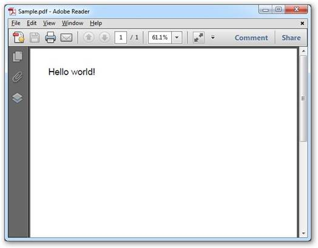

::: {style="DISPLAY: none"}
{#d2h_url_template}{#d2h_package_url style="WIDTH: 0px; DISPLAY: none; HEIGHT: 0px"}
:::

::::: {#nsbanner .d2h_main_nsbanner style="BORDER-BOTTOM: #999999 1px solid; POSITION: relative; PADDING-BOTTOM: 0px; BACKGROUND-COLOR: transparent; PADDING-LEFT: 0px; PADDING-RIGHT: 0px; DISPLAY: none; BORDER-TOP: #999999 1px solid; PADDING-TOP: 0px; LEFT: 0px"}
:::: {#TitleRow .d2h_main_titlerow style="PADDING-BOTTOM: 4px; BACKGROUND-COLOR: transparent; PADDING-LEFT: 22px; WIDTH: 100%; PADDING-RIGHT: 10px; DISPLAY: none; PADDING-TOP: 4px"}
::: {#ienav .d2h_main_ienav style="DISPLAY: none"}
{#D2HPrevious .D2HPreviousEnabled}  {#D2HNext .D2HNextEnabled}
:::
::::
:::::

:::: {#nstext .d2h_main_nstext style="PADDING-BOTTOM: 10px; BACKGROUND-COLOR: transparent; PADDING-LEFT: 22px; PADDING-RIGHT: 10px; HEIGHT: 100%; OVERFLOW: auto; PADDING-TOP: 5px" hasuserbackground="true" valign="bottom"}
::: {#d2h_breadcrumbs .d2h_breadcrumbs}
[Essential Studio User Guide Documentation](ms-xhelp:///?Id=12457748-09e3-4d74-a240-8e049cedf030){.d2h_breadcrumbsNormal}[ \> ]{.d2h_breadcrumbsLinkSeparator}[Reporting Edition](ms-xhelp:///?Id=027aa5b6-6676-4f93-ad23-c20e8c45792e){.d2h_breadcrumbsNormal}[ \> ]{.d2h_breadcrumbsLinkSeparator}[Essential Pdf](ms-xhelp:///?Id=22756092-3da5-4797-9514-dab0617c6902){.d2h_breadcrumbsNormal}[ \> ]{.d2h_breadcrumbsLinkSeparator}[Getting Started](ms-xhelp:///?Id=c0a3e418-fc0c-4115-9643-310912a817be){.d2h_breadcrumbsNormal}[ \> ]{.d2h_breadcrumbsLinkSeparator}[Deploying Essential PDF](ms-xhelp:///?Id=e00e115b-6c6b-4eb8-977a-aca39abdb560){.d2h_breadcrumbsNormal}
:::

### WPF {#wpf style="tab-stops: 0pt"}

 

Now, you have created a WPF application (refer to [[Creating Platform Application]{.UGHyperlink}](ms-xhelp:///?Id=9dd5909e-f26c-47d9-bff0-6a9bd32f5b6e)). This section covers the following:

 

[·      ]{style="FONT-FAMILY: Symbol"}Deploying Essential PDF in a WPF Application

[·      ]{style="FONT-FAMILY: Symbol"}Create and add a PDF document with pages to the application

[]{style="FONT-FAMILY: 'Trebuchet MS','sans-serif'; COLOR: #15428b; FONT-SIZE: 9pt"} 

Deploying Essential PDF in a WPF Application

 

To deploy Essential PDF:

1.   Go to **Solution Explorer** of the application you have created. Right-click the **Reference** folder and then click **Add References**.

2.   Add the following assemblies as references in the application:

[·      ]{style="FONT-FAMILY: Symbol"}Syncfusion.Core.dll

[·      ]{style="FONT-FAMILY: Symbol"}Syncfusion.Compression.Base.dll

[·      ]{style="FONT-FAMILY: Symbol"}Syncfusion.Pdf.Base.dll

[]{style="FONT-FAMILY: 'Trebuchet MS','sans-serif'; COLOR: #15428b; FONT-SIZE: 9pt"} 

{border="0"} For detailed documentation on Windows Application deployment, see: [[http://www.syncfusion.com/support/user/uploads/DeployingWindowsApplication_bdaf76f7.pdf.]{.UGHyperlink}](http://www.syncfusion.com/support/user/uploads/DeployingWindowsApplication_bdaf76f7.pdf.)

Essential PDF is deployed in the Windows application:

 

Create and add a PDF document with pages to the application

 

The following steps will guide you to create and add a PDF document to this application:

 

3.   Create a PDF document using the following code.

[]{style="FONT-FAMILY: 'Trebuchet MS','sans-serif'; COLOR: #15428b; FONT-SIZE: 9pt"} 

{border="0"} The PDF document represents the document that is created in the memory. It is only the memory representation of the PDF document that is written to the disk.

[]{style="FONT-FAMILY: 'Trebuchet MS','sans-serif'; COLOR: #15428b"} 

+--------------------------------------------------------------------------------------------------------------------------------------------------------------------------------+
| **[\[C#\]]{style="FONT-FAMILY: 'Courier New'; COLOR: black"}**                                                                                                                 |
|                                                                                                                                                                                |
| []{style="FONT-FAMILY: 'Courier New'; COLOR: black"}                                                                                                                           |
|                                                                                                                                                                                |
| [// Create a new PDF document. This object represents the PDF document.]{style="FONT-FAMILY: 'Courier New'; COLOR: green"}                                                     |
|                                                                                                                                                                                |
| [// This document has one page, by default. Additional pages have to be added.]{style="FONT-FAMILY: 'Courier New'; COLOR: green"}                                              |
|                                                                                                                                                                                |
| [PdfDocument]{style="FONT-FAMILY: 'Courier New'; COLOR: teal"}[ pdfDoc = [new]{style="COLOR: blue"} [PdfDocument]{style="COLOR: teal"}();]{style="FONT-FAMILY: 'Courier New'"} |
+--------------------------------------------------------------------------------------------------------------------------------------------------------------------------------+

[]{style="FONT-FAMILY: 'Trebuchet MS','sans-serif'; COLOR: #15428b"} 

+--------------------------------------------------------------------------------------------------------------------------------------------------------------------------------------------------------------------+
| **[\[VB.NET\]]{style="FONT-FAMILY: 'Courier New'; COLOR: black"}**                                                                                                                                                 |
|                                                                                                                                                                                                                    |
| []{style="FONT-FAMILY: 'Courier New'; COLOR: black"}                                                                                                                                                               |
|                                                                                                                                                                                                                    |
| [\' Create a new PDF document. This object represents the PDF document.]{style="FONT-FAMILY: 'Courier New'; COLOR: green"}                                                                                         |
|                                                                                                                                                                                                                    |
| [\' This document has one page, by default. Additional pages have to be added.]{style="FONT-FAMILY: 'Courier New'; COLOR: green"}                                                                                  |
|                                                                                                                                                                                                                    |
| [Dim]{style="FONT-FAMILY: 'Courier New'; COLOR: blue"}[ pdfDoc [As]{style="COLOR: blue"} Syncfusion.Pdf.PdfDocument = [New]{style="COLOR: blue"} Syncfusion.Pdf.PdfDocument()]{style="FONT-FAMILY: 'Courier New'"} |
+--------------------------------------------------------------------------------------------------------------------------------------------------------------------------------------------------------------------+

[]{style="FONT-FAMILY: 'Trebuchet MS','sans-serif'; COLOR: #15428b; FONT-SIZE: 9pt"} 

A new PDF document is created.

[]{style="FONT-FAMILY: 'Trebuchet MS','sans-serif'; COLOR: #15428b; FONT-SIZE: 9pt"} 

Add a new page to the created document.

[]{style="FONT-FAMILY: 'Trebuchet MS','sans-serif'; COLOR: #15428b"} 

+--------------------------------------------------------------------------------------------------------------------------+
| **[\[C#\]]{style="FONT-FAMILY: 'Courier New'; COLOR: black"}**                                                           |
|                                                                                                                          |
| []{style="FONT-FAMILY: 'Courier New'; COLOR: black"}                                                                     |
|                                                                                                                          |
| [// Add a page to the document ]{style="FONT-FAMILY: 'Courier New'; COLOR: green"}                                       |
|                                                                                                                          |
| [PdfPage]{style="FONT-FAMILY: 'Courier New'; COLOR: teal"}[ page = doc.Pages.Add();]{style="FONT-FAMILY: 'Courier New'"} |
+--------------------------------------------------------------------------------------------------------------------------+

[]{style="FONT-FAMILY: 'Trebuchet MS','sans-serif'; COLOR: #15428b"} 

+---------------------------------------------------------------------------------------------------------------------------------------------------------------------------+
| **[\[VB.NET\]]{style="FONT-FAMILY: 'Courier New'; COLOR: black"}**                                                                                                        |
|                                                                                                                                                                           |
| []{style="FONT-FAMILY: 'Courier New'; COLOR: black"}                                                                                                                      |
|                                                                                                                                                                           |
| [\'Add a page to the document ]{style="FONT-FAMILY: 'Courier New'; COLOR: green"}                                                                                         |
|                                                                                                                                                                           |
| [Dim]{style="FONT-FAMILY: 'Courier New'; COLOR: blue"}[ firstPage [As]{style="COLOR: blue"} Syncfusion.Pdf.PdfPage = doc.Pages.Add()]{style="FONT-FAMILY: 'Courier New'"} |
+---------------------------------------------------------------------------------------------------------------------------------------------------------------------------+

 

A PDF page is added to the document (doc).

 

4.   Write the string \"Hello World\" on the first page in the PDF document. This task is further subdivided into the following tasks.

[]{style="FONT-FAMILY: 'Trebuchet MS','sans-serif'; COLOR: #15428b; FONT-SIZE: 9pt"} 

[·      ]{style="FONT-FAMILY: Symbol"}Create the font object to be used for writing the \"Hello World\" string. You can set the font size and style in the same statement.

[·      ]{style="FONT-FAMILY: Symbol"}Write the text using the **DrawString** method of the Graphics object.

[]{style="FONT-FAMILY: 'Trebuchet MS','sans-serif'; COLOR: #15428b"} 

+-------------------------------------------------------------------------------------------------------------------------------------------------------------------------------------------------------------------------------------------------+
| **[\[C#\]]{style="FONT-FAMILY: 'Courier New'; COLOR: black"}**                                                                                                                                                                                  |
|                                                                                                                                                                                                                                                 |
| []{style="FONT-FAMILY: 'Courier New'; COLOR: black"}                                                                                                                                                                                            |
|                                                                                                                                                                                                                                                 |
| [// Use the predefined fonts to draw the text. ]{style="FONT-FAMILY: 'Courier New'; COLOR: green"}                                                                                                                                              |
|                                                                                                                                                                                                                                                 |
| [PdfFont]{style="FONT-FAMILY: 'Courier New'; COLOR: teal"}[ font = [new]{style="COLOR: blue"} [PdfStandardFont]{style="COLOR: teal"}([PdfFontFamily]{style="COLOR: teal"}.Helvetica, fontSize, fontStyle);]{style="FONT-FAMILY: 'Courier New'"} |
|                                                                                                                                                                                                                                                 |
| []{style="FONT-FAMILY: 'Courier New'"}                                                                                                                                                                                                          |
|                                                                                                                                                                                                                                                 |
| [// Draw the string at the specified coordinates.]{style="FONT-FAMILY: 'Courier New'; COLOR: green"}                                                                                                                                            |
|                                                                                                                                                                                                                                                 |
| [firstPage.Graphics.DrawString([\"Hello World\"]{style="COLOR: maroon"}, pdfFont, [PdfBrushes]{style="COLOR: teal"}.Black, 0, 0);  ]{style="FONT-FAMILY: 'Courier New'"}                                                                        |
+-------------------------------------------------------------------------------------------------------------------------------------------------------------------------------------------------------------------------------------------------+

[]{style="FONT-FAMILY: 'Trebuchet MS','sans-serif'; COLOR: #15428b"} 

+--------------------------------------------------------------------------------------------------------------------------------------------------------------------------------------------------------------------------------------------------------------------------------+
| **[\[VB.NET\]]{style="FONT-FAMILY: 'Courier New'; COLOR: black"}**                                                                                                                                                                                                             |
|                                                                                                                                                                                                                                                                                |
| []{style="FONT-FAMILY: 'Courier New'; COLOR: black"}                                                                                                                                                                                                                           |
|                                                                                                                                                                                                                                                                                |
| [\' Use the predefined fonts to draw the text. ]{style="FONT-FAMILY: 'Courier New'; COLOR: green"}                                                                                                                                                                             |
|                                                                                                                                                                                                                                                                                |
| [Dim]{style="FONT-FAMILY: 'Courier New'; COLOR: blue"}[ font [As]{style="COLOR: blue"} Syncfusion.Pdf.Graphics.PdfFont = [New]{style="COLOR: blue"} Syncfusion.Pdf.Graphics.PdfStandardFont(PdfFontFamily.Helvetica, fontSize, FontStyle)]{style="FONT-FAMILY: 'Courier New'"} |
|                                                                                                                                                                                                                                                                                |
| []{style="FONT-FAMILY: 'Courier New'"}                                                                                                                                                                                                                                         |
|                                                                                                                                                                                                                                                                                |
| [\' Draw the string at the specified coordinates.]{style="FONT-FAMILY: 'Courier New'; COLOR: green"}                                                                                                                                                                           |
|                                                                                                                                                                                                                                                                                |
| [firstPage.Graphics.DrawString([\"Hello World\"]{style="COLOR: maroon"}, pdfFont, PdfBrushes.Black, 0,0)]{style="FONT-FAMILY: 'Courier New'"}                                                                                                                                  |
+--------------------------------------------------------------------------------------------------------------------------------------------------------------------------------------------------------------------------------------------------------------------------------+

 

The string \"Hello World\" is written to the document.

 

5.   Then write the PDF document we have created to the disk. This can be done by using the **Save** method of the PDF document.

[]{style="FONT-FAMILY: 'Trebuchet MS','sans-serif'; COLOR: #15428b; FONT-SIZE: 9pt"} 

+----------------------------------------------------------------------------------------------+
| **[\[C#\]]{style="FONT-FAMILY: 'Courier New'; COLOR: black"}**                               |
|                                                                                              |
| []{style="FONT-FAMILY: 'Courier New'; COLOR: black"}                                         |
|                                                                                              |
| [// Save the PDF document to disk.]{style="FONT-FAMILY: 'Courier New'; COLOR: green"}        |
|                                                                                              |
| [pdfDoc.Save([\"Sample.pdf\"]{style="COLOR: maroon"}); ]{style="FONT-FAMILY: 'Courier New'"} |
+----------------------------------------------------------------------------------------------+

[]{style="FONT-FAMILY: 'Trebuchet MS','sans-serif'; COLOR: #15428b"} 

+--------------------------------------------------------------------------------------------+
| **[\[VB.NET\]]{style="FONT-FAMILY: 'Courier New'; COLOR: black"}**                         |
|                                                                                            |
| []{style="FONT-FAMILY: 'Courier New'; COLOR: black"}                                       |
|                                                                                            |
| [\' Save the PDF document to disk.]{style="FONT-FAMILY: 'Courier New'; COLOR: green"}      |
|                                                                                            |
| [pdfDoc.Save([\"Sample.pdf\"]{style="COLOR: maroon"})]{style="FONT-FAMILY: 'Courier New'"} |
+--------------------------------------------------------------------------------------------+

[]{style="FONT-FAMILY: 'Trebuchet MS','sans-serif'; COLOR: #15428b; FONT-SIZE: 9pt"} 

You can also save the changes to the loaded document as follows.

[]{style="FONT-FAMILY: 'Trebuchet MS','sans-serif'; COLOR: #15428b"} 

+------------------------------------------------------------------------------------------------+
| **[\[C#\]]{style="FONT-FAMILY: 'Courier New'; COLOR: black"}**                                 |
|                                                                                                |
| []{style="FONT-FAMILY: 'Courier New'; COLOR: black"}                                           |
|                                                                                                |
| [// Save the document with same name       ]{style="FONT-FAMILY: 'Courier New'; COLOR: green"} |
|                                                                                                |
| [pdfDoc.Save([)]{style="COLOR: maroon"};]{style="FONT-FAMILY: 'Courier New'"}                  |
+------------------------------------------------------------------------------------------------+

[     ]{style="FONT-FAMILY: 'Trebuchet MS','sans-serif'; COLOR: #15428b"}

+-----------------------------------------------------------------------------------------------+
| **[\[VB.NET\]]{style="FONT-FAMILY: 'Courier New'; COLOR: black"}**                            |
|                                                                                               |
| []{style="FONT-FAMILY: 'Courier New'; COLOR: black"}                                          |
|                                                                                               |
| [\' Save the document with same name      ]{style="FONT-FAMILY: 'Courier New'; COLOR: green"} |
|                                                                                               |
| [pdfDoc.Save()]{style="FONT-FAMILY: 'Courier New'"}                                           |
+-----------------------------------------------------------------------------------------------+

**[]{style="FONT-FAMILY: 'Trebuchet MS','sans-serif'; COLOR: #15428b"}** 

The created pdf document is saved to the disk using the above code.

[]{style="FONT-FAMILY: 'Trebuchet MS','sans-serif'; COLOR: #15428b; FONT-SIZE: 9pt"} 

6.   Finally close the PDF Document using the following code, so that the objects are released.

[]{style="FONT-FAMILY: 'Trebuchet MS','sans-serif'; COLOR: #15428b; FONT-SIZE: 9pt"} 

+---------------------------------------------------------------------------------------------------------------+
| **[\[C#\]]{style="FONT-FAMILY: 'Courier New'; COLOR: black"}**                                                |
|                                                                                                               |
| []{style="FONT-FAMILY: 'Courier New'; COLOR: black"}                                                          |
|                                                                                                               |
| [// Release the common resources.        ]{style="FONT-FAMILY: 'Courier New'; COLOR: green"}                  |
|                                                                                                               |
| [pdfDoc.Close();]{style="FONT-FAMILY: 'Courier New'"}                                                         |
|                                                                                                               |
| []{style="FONT-FAMILY: 'Courier New'"}                                                                        |
|                                                                                                               |
| [//(or)]{style="FONT-FAMILY: 'Courier New'; COLOR: green"}                                                    |
|                                                                                                               |
| []{style="FONT-FAMILY: 'Courier New'; COLOR: green"}                                                          |
|                                                                                                               |
| [//Releases document stream. This releases entire document]{style="FONT-FAMILY: 'Courier New'; COLOR: green"} |
|                                                                                                               |
| [PdfDoc.Close(true);]{style="FONT-FAMILY: 'Courier New'"}                                                     |
+---------------------------------------------------------------------------------------------------------------+

[]{style="FONT-FAMILY: 'Trebuchet MS','sans-serif'; COLOR: #15428b"} 

+--------------------------------------------------------------------------------------------------------------------------------------------------+
| **[\[VB.NET\]]{style="FONT-FAMILY: 'Courier New'; COLOR: black"}**                                                                               |
|                                                                                                                                                  |
| **[]{style="FONT-FAMILY: 'Courier New'; COLOR: black"}**                                                                                         |
|                                                                                                                                                  |
| [\' Release the common resources.  ]{style="FONT-FAMILY: 'Courier New'; COLOR: green"}[      ]{style="FONT-FAMILY: 'Courier New'; COLOR: black"} |
|                                                                                                                                                  |
| [pdfDoc.Close()]{style="FONT-FAMILY: 'Courier New'; COLOR: black"}                                                                               |
|                                                                                                                                                  |
| []{style="FONT-FAMILY: 'Courier New'; COLOR: black"}                                                                                             |
|                                                                                                                                                  |
| [\'(or)]{style="FONT-FAMILY: 'Courier New'; COLOR: green"}                                                                                       |
|                                                                                                                                                  |
| []{style="FONT-FAMILY: 'Courier New'; COLOR: black"}                                                                                             |
|                                                                                                                                                  |
| [\'Releases document stream. This releases entire document]{style="FONT-FAMILY: 'Courier New'; COLOR: green"}                                    |
|                                                                                                                                                  |
| [PdfDoc.Close(True)]{style="FONT-FAMILY: 'Courier New'; COLOR: black"}                                                                           |
+--------------------------------------------------------------------------------------------------------------------------------------------------+

[]{style="FONT-FAMILY: 'Trebuchet MS','sans-serif'; COLOR: #15428b; FONT-SIZE: 9pt"} 

PDF document will be closed after saving.

 

The sample pdf document created through the above procedure is shown below.

[]{style="FONT-FAMILY: 'Trebuchet MS','sans-serif'; COLOR: #15428b; FONT-SIZE: 9pt"} 

{border="0"}

Figure 22: PDF Document with pages

***[]{style="FONT-FAMILY: 'Trebuchet MS','sans-serif'; COLOR: #15428b; FONT-SIZE: 9pt"}*** 

A PDF document is created in the WPF application.

 

[]{#related-topics}
::::
