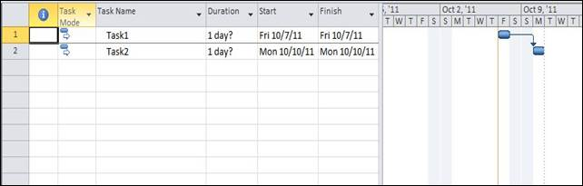

::: {style="DISPLAY: none"}
{#d2h_url_template}{#d2h_package_url style="WIDTH: 0px; DISPLAY: none; HEIGHT: 0px"}
:::

::::: {#nsbanner .d2h_main_nsbanner style="BORDER-BOTTOM: #999999 1px solid; POSITION: relative; PADDING-BOTTOM: 0px; BACKGROUND-COLOR: transparent; PADDING-LEFT: 0px; PADDING-RIGHT: 0px; DISPLAY: none; BORDER-TOP: #999999 1px solid; PADDING-TOP: 0px; LEFT: 0px"}
:::: {#TitleRow .d2h_main_titlerow style="PADDING-BOTTOM: 4px; BACKGROUND-COLOR: transparent; PADDING-LEFT: 22px; WIDTH: 100%; PADDING-RIGHT: 10px; DISPLAY: none; PADDING-TOP: 4px"}
::: {#ienav .d2h_main_ienav style="DISPLAY: none"}
{#D2HPrevious .D2HPreviousEnabled}  {#D2HNext .D2HNextEnabled}
:::
::::
:::::

:::: {#nstext .d2h_main_nstext style="PADDING-BOTTOM: 10px; BACKGROUND-COLOR: transparent; PADDING-LEFT: 22px; PADDING-RIGHT: 10px; HEIGHT: 100%; OVERFLOW: auto; PADDING-TOP: 5px" hasuserbackground="true" valign="bottom"}
::: {#d2h_breadcrumbs .d2h_breadcrumbs}
[Essential Studio User Guide Documentation](ms-xhelp:///?Id=12457748-09e3-4d74-a240-8e049cedf030){.d2h_breadcrumbsNormal}[ \> ]{.d2h_breadcrumbsLinkSeparator}[Reporting Edition](ms-xhelp:///?Id=027aa5b6-6676-4f93-ad23-c20e8c45792e){.d2h_breadcrumbsNormal}[ \> ]{.d2h_breadcrumbsLinkSeparator}[Essential ProjIO](ms-xhelp:///?Id=b95f675f-3e97-4b4b-93b9-e4daba965feb){.d2h_breadcrumbsNormal}[ \> ]{.d2h_breadcrumbsLinkSeparator}[Concepts and Features](ms-xhelp:///?Id=00cd1b25-14ca-4e2b-a23d-b4c6df7344ee){.d2h_breadcrumbsNormal}[ \> ]{.d2h_breadcrumbsLinkSeparator}[Task](ms-xhelp:///?Id=1f030cf8-1f9a-4d18-a0a1-87afe233884d){.d2h_breadcrumbsNormal}
:::

### Writing Tasks to Projects {#writing-tasks-to-projects style="tab-stops: 0pt"}

**RootTask** property of the **Project** class contains the **Children** property that returns the list of **Task** objects. The **Children** property is used to update the tasks.

The following code snippet demonstrates writing tasks to a project.

 

+------------------------------------------------------------------------------------------------------------------------------------------------------------------------------------------------------------------------------------------------+
| **[\[C#\]]{style="FONT-FAMILY: 'Courier New'"}**                                                                                                                                                                                               |
|                                                                                                                                                                                                                                                |
| **[]{style="FONT-FAMILY: 'Courier New'"}**                                                                                                                                                                                                     |
|                                                                                                                                                                                                                                                |
| [// Creating an instance of the Project]{style="FONT-FAMILY: 'Courier New'; COLOR: green"}                                                                                                                                                     |
|                                                                                                                                                                                                                                                |
| [Project]{style="FONT-FAMILY: 'Courier New'; COLOR: #2b91af"}[ P = [new]{style="COLOR: blue"} [Project]{style="COLOR: #2b91af"}();]{style="FONT-FAMILY: 'Courier New'"}                                                                        |
|                                                                                                                                                                                                                                                |
| []{style="FONT-FAMILY: 'Courier New'; COLOR: green"}                                                                                                                                                                                           |
|                                                                                                                                                                                                                                                |
| [// Creating two tasks to be added to the project]{style="FONT-FAMILY: 'Courier New'; COLOR: green"}                                                                                                                                           |
|                                                                                                                                                                                                                                                |
| [Task]{style="FONT-FAMILY: 'Courier New'; COLOR: #2b91af"}[ task1 = [new]{style="COLOR: blue"} [Task]{style="COLOR: #2b91af"}([\"Task1\"]{style="COLOR: #a31515"});]{style="FONT-FAMILY: 'Courier New'"}                                       |
|                                                                                                                                                                                                                                                |
| [task1.Duration = new [TimeSpan]{style="COLOR: #2b91af"}(8, 0, 0);]{style="FONT-FAMILY: 'Courier New'"}                                                                                                                                        |
|                                                                                                                                                                                                                                                |
| [Task]{style="FONT-FAMILY: 'Courier New'; COLOR: #2b91af"}[ task2 = new Task([\"Task2\"]{style="COLOR: #a31515"});]{style="FONT-FAMILY: 'Courier New'"}                                                                                        |
|                                                                                                                                                                                                                                                |
| [task2.Duration = new [TimeSpan]{style="COLOR: #2b91af"}(8, 0, 0);]{style="FONT-FAMILY: 'Courier New'"}                                                                                                                                        |
|                                                                                                                                                                                                                                                |
| []{style="FONT-FAMILY: 'Courier New'"}                                                                                                                                                                                                         |
|                                                                                                                                                                                                                                                |
| [// Adding the tasks to the RootTask of project]{style="FONT-FAMILY: 'Courier New'; COLOR: green"}[]{style="FONT-FAMILY: 'Courier New'"}                                                                                                       |
|                                                                                                                                                                                                                                                |
| [P.RootTask.Children.Add(task1);]{style="FONT-FAMILY: 'Courier New'"}                                                                                                                                                                          |
|                                                                                                                                                                                                                                                |
| [P.RootTask.Children.Add(task2);]{style="FONT-FAMILY: 'Courier New'"}                                                                                                                                                                          |
|                                                                                                                                                                                                                                                |
| []{style="FONT-FAMILY: 'Courier New'"}                                                                                                                                                                                                         |
|                                                                                                                                                                                                                                                |
| [// Calculating Task IDs and UIDs]{style="FONT-FAMILY: 'Courier New'; COLOR: green"}                                                                                                                                                           |
|                                                                                                                                                                                                                                                |
| [P.CalculateTaskIDs();]{style="FONT-FAMILY: 'Courier New'"}                                                                                                                                                                                    |
|                                                                                                                                                                                                                                                |
| []{style="FONT-FAMILY: 'Courier New'"}                                                                                                                                                                                                         |
|                                                                                                                                                                                                                                                |
| [// Link \"Task1\" and \"Task2\"]{style="FONT-FAMILY: 'Courier New'; COLOR: green"}                                                                                                                                                            |
|                                                                                                                                                                                                                                                |
| [TaskLink]{style="FONT-FAMILY: 'Courier New'; COLOR: #2b91af"}[ link = [new]{style="COLOR: blue"} [TaskLink]{style="COLOR: #2b91af"}(task1, task2, [TaskLinkType]{style="COLOR: #2b91af"}.FinishToStart);]{style="FONT-FAMILY: 'Courier New'"} |
|                                                                                                                                                                                                                                                |
| []{style="FONT-FAMILY: 'Courier New'"}                                                                                                                                                                                                         |
|                                                                                                                                                                                                                                                |
| [// Saving the project]{style="FONT-FAMILY: 'Courier New'; COLOR: green"}                                                                                                                                                                      |
|                                                                                                                                                                                                                                                |
| [P.Save([\"ProjectWithTasks.xml\"]{style="COLOR: #a31515"});]{style="FONT-FAMILY: 'Courier New'"}                                                                                                                                              |
|                                                                                                                                                                                                                                                |
| []{style="FONT-FAMILY: 'Courier New'"}                                                                                                                                                                                                         |
+------------------------------------------------------------------------------------------------------------------------------------------------------------------------------------------------------------------------------------------------+

 

+----------------------------------------------------------------------------------------------------------------------------------------------------------------------------------------------------------------------+
| **[\[VB\]]{style="FONT-FAMILY: 'Courier New'"}**                                                                                                                                                                     |
|                                                                                                                                                                                                                      |
| [\' Creating an instance of the Project]{style="FONT-FAMILY: 'Courier New'; COLOR: green"}                                                                                                                           |
|                                                                                                                                                                                                                      |
| [Dim]{style="FONT-FAMILY: 'Courier New'; COLOR: blue"}[ P [As]{style="COLOR: blue"} Project = [New]{style="COLOR: blue"} Project()[]{style="COLOR: green"}]{style="FONT-FAMILY: 'Courier New'"}                      |
|                                                                                                                                                                                                                      |
| **[]{style="FONT-FAMILY: 'Courier New'"}**                                                                                                                                                                           |
|                                                                                                                                                                                                                      |
| [\' Creating tasks that are to be linked]{style="FONT-FAMILY: 'Courier New'; COLOR: green"}                                                                                                                          |
|                                                                                                                                                                                                                      |
| [Dim]{style="FONT-FAMILY: 'Courier New'; COLOR: blue"}[ task1 [As]{style="COLOR: blue"} Task = [New]{style="COLOR: blue"} Task([\"Task1\"]{style="COLOR: #a31515"})]{style="FONT-FAMILY: 'Courier New'"}             |
|                                                                                                                                                                                                                      |
| [task1.Duration = new [TimeSpan]{style="COLOR: #2b91af"}(8, 0, 0)]{style="FONT-FAMILY: 'Courier New'"}                                                                                                               |
|                                                                                                                                                                                                                      |
| [Dim]{style="FONT-FAMILY: 'Courier New'; COLOR: blue"}[ task2 [As]{style="COLOR: blue"} Task = [New]{style="COLOR: blue"} Task([\"Task2\"]{style="COLOR: #a31515"})]{style="FONT-FAMILY: 'Courier New'"}             |
|                                                                                                                                                                                                                      |
| [task2.Duration = new [TimeSpan]{style="COLOR: #2b91af"}(8, 0, 0)]{style="FONT-FAMILY: 'Courier New'"}                                                                                                               |
|                                                                                                                                                                                                                      |
| []{style="FONT-FAMILY: 'Courier New'"}                                                                                                                                                                               |
|                                                                                                                                                                                                                      |
| []{style="FONT-FAMILY: 'Courier New'"}                                                                                                                                                                               |
|                                                                                                                                                                                                                      |
| [\' Adding the tasks to the RootTask of the Project]{style="FONT-FAMILY: 'Courier New'; COLOR: green"}[]{style="FONT-FAMILY: 'Courier New'"}                                                                         |
|                                                                                                                                                                                                                      |
| [P.RootTask.Children.Add(task1)]{style="FONT-FAMILY: 'Courier New'"}                                                                                                                                                 |
|                                                                                                                                                                                                                      |
| [P.RootTask.Children.Add(task2)]{style="FONT-FAMILY: 'Courier New'"}                                                                                                                                                 |
|                                                                                                                                                                                                                      |
| []{style="FONT-FAMILY: 'Courier New'"}                                                                                                                                                                               |
|                                                                                                                                                                                                                      |
| [\' Calculating Task IDs and UIDs]{style="FONT-FAMILY: 'Courier New'; COLOR: green"}[]{style="FONT-FAMILY: 'Courier New'"}                                                                                           |
|                                                                                                                                                                                                                      |
| [P.CalculateTaskIDs()]{style="FONT-FAMILY: 'Courier New'"}                                                                                                                                                           |
|                                                                                                                                                                                                                      |
| []{style="FONT-FAMILY: 'Courier New'"}                                                                                                                                                                               |
|                                                                                                                                                                                                                      |
| [\' Creating a link between task1 and task2]{style="FONT-FAMILY: 'Courier New'; COLOR: green"}                                                                                                                       |
|                                                                                                                                                                                                                      |
| [Dim]{style="FONT-FAMILY: 'Courier New'; COLOR: blue"}[ link [As]{style="COLOR: blue"} TaskLink = [New]{style="COLOR: blue"} TaskLink(task1, task2, TaskLinkType.FinishToStart)]{style="FONT-FAMILY: 'Courier New'"} |
|                                                                                                                                                                                                                      |
| []{style="FONT-FAMILY: 'Courier New'"}                                                                                                                                                                               |
|                                                                                                                                                                                                                      |
| [\' Saving the project]{style="FONT-FAMILY: 'Courier New'; COLOR: green"}[]{style="FONT-FAMILY: 'Courier New'"}                                                                                                      |
|                                                                                                                                                                                                                      |
| [P.Save([\"ProjectWithTasks.xml\"]{style="COLOR: #a31515"})]{style="FONT-FAMILY: 'Courier New'"}                                                                                                                     |
|                                                                                                                                                                                                                      |
|                                                                                                                                                                                                                      |
+----------------------------------------------------------------------------------------------------------------------------------------------------------------------------------------------------------------------+

 

The project file created using above code will look as shown in the following screenshot.

 

{border="0"}

Figure 9: Project File Created

 

[]{#related-topics}
::::
