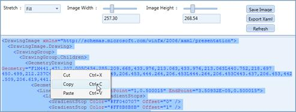
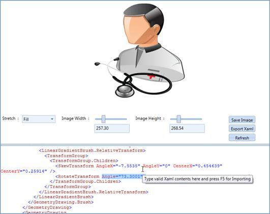
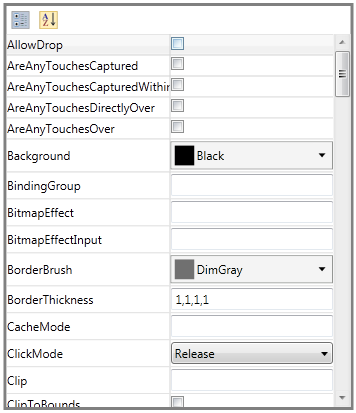

::: {style="DISPLAY: none"}
{#d2h_url_template}{#d2h_package_url style="WIDTH: 0px; DISPLAY: none; HEIGHT: 0px"}
:::

:::: {.d2h_secondary_topic style="PADDING-BOTTOM: 10pt; MARGIN: 0pt; PADDING-LEFT: 0pt; PADDING-RIGHT: 0pt; PADDING-TOP: 0pt"}
#### XAML of Vector Image {#xaml-of-vector-image style="tab-stops: 0pt"}

 

The xaml part of the selected image will be displayed on the bottom pane. You can easily copy the xaml part using the Context Menu options.

 

{border="0"}

Figure 1186: Copying the xaml part

 

 You can edit the xaml part and hit F5 key to refresh the image with the current changes.

[]{style="FONT-FAMILY: 'Trebuchet MS','sans-serif'; FONT-SIZE: 9pt"} 

{border="0"}

Figure 1187: Importing the xaml part

 

 

{border="0"}

Figure 1188: PropertyGrid

 

 

::: {align="center"}
  -------------------------- ------------------------------------------- -------------------- -------------------------------- -----------------
  Property                   Description                                 Type                 Data Type                        Reference links
  HidePropertiesCollection   Collapses the properties in PropertyGrid.   DependencyProperty   ObservableCollection\<String\>   
  -------------------------- ------------------------------------------- -------------------- -------------------------------- -----------------
:::

 

 

[]{#related-topics}
::::
