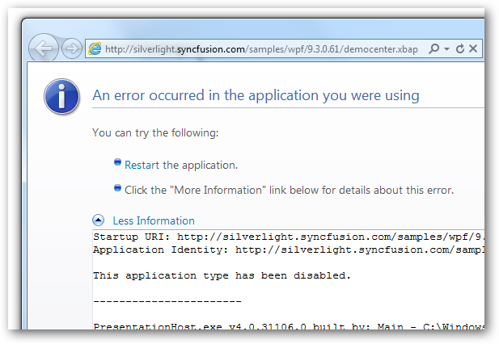
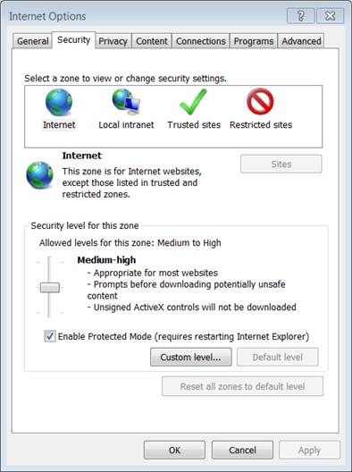
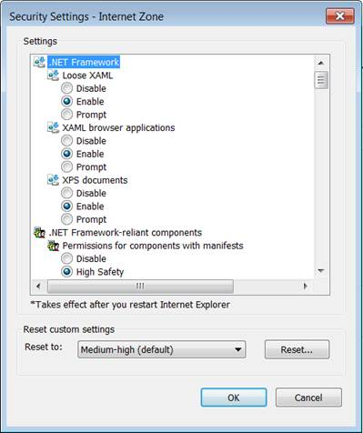
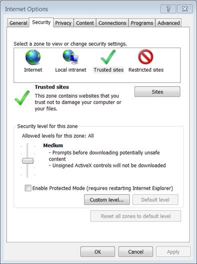
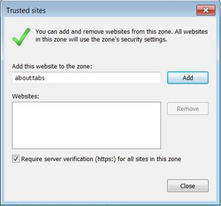

::: {style="DISPLAY: none"}
{#d2h_url_template}{#d2h_package_url style="WIDTH: 0px; DISPLAY: none; HEIGHT: 0px"}
:::

::::: {#nsbanner .d2h_main_nsbanner style="BORDER-BOTTOM: #999999 1px solid; POSITION: relative; PADDING-BOTTOM: 0px; BACKGROUND-COLOR: transparent; PADDING-LEFT: 0px; PADDING-RIGHT: 0px; DISPLAY: none; BORDER-TOP: #999999 1px solid; PADDING-TOP: 0px; LEFT: 0px"}
:::: {#TitleRow .d2h_main_titlerow style="PADDING-BOTTOM: 4px; BACKGROUND-COLOR: transparent; PADDING-LEFT: 22px; WIDTH: 100%; PADDING-RIGHT: 10px; DISPLAY: none; PADDING-TOP: 4px"}
::: {#ienav .d2h_main_ienav style="DISPLAY: none"}
{#D2HPrevious .D2HPreviousEnabled}  {#D2HNext .D2HNextEnabled}
:::
::::
:::::

::::: {#nstext .d2h_main_nstext style="PADDING-BOTTOM: 10px; BACKGROUND-COLOR: transparent; PADDING-LEFT: 22px; PADDING-RIGHT: 10px; HEIGHT: 100%; OVERFLOW: auto; PADDING-TOP: 5px" hasuserbackground="true" valign="bottom"}
::: {#d2h_breadcrumbs .d2h_breadcrumbs}
[Essential Studio User Guide Documentation](ms-xhelp:///?Id=12457748-09e3-4d74-a240-8e049cedf030){.d2h_breadcrumbsNormal}[ \> ]{.d2h_breadcrumbsLinkSeparator}[Essential Common](ms-xhelp:///?Id=2bfe10b6-fac1-4f91-a173-04db314f10c3){.d2h_breadcrumbsNormal}[ \> ]{.d2h_breadcrumbsLinkSeparator}[Sample Browser](ms-xhelp:///?Id=afdcd19d-1a73-4a2a-b989-ac7c039124c0){.d2h_breadcrumbsNormal}
:::

## XBAP Applications is Disabled by default in IE 9 {#xbap-applications-is-disabled-by-default-in-ie-9 style="tab-stops: 0pt"}

 

The XBAP applications are disabled by default in Internet Explorer 9 (IE 9). So an error message is displayed when XBAP Sample Browser is accessed. To overcome this you need to enable XBAP applications in IE9.

{border="0"}

Figure 98 Error Message

 

Enabling XBAP Applications in IE9

Microsoft has changed the security settings in IE9 because XBAPs are primarily used as internal, trusted applications.

[To Enable XBAP:]{style="FONT-FAMILY: 'Calibri','sans-serif'"}

1.   Open IE9

2.   Navigate to **Tools**\--\>**Internet Options.**

3.   In the **Security** tab click **Custom Level**.

{border="0"}

Figure 99 Security Settings

 

The **Security Setting -- Internet Zone** dialog box opens.

4.   Select **Enable** option in **XAML browser applications**.

 

{border="0"}

Figure 100: Security Setting -- Internet Zone Dialog Box

5.   Click **Ok**.

 

 

 

Adding XBAP Application in Your Trusted Site:

You can add our XBAP application in your trusted sites using IE9.

The following steps illustrate this:

1.   Open IE9.

2.   Navigate to **Tools \--\> Internet options.**

3.   In the **Security** tab, click **Trusted Sites \--\> Sites**.

 

 

{border="0"}

Figure 101: Internet Option

 

The **Trusted Sites** dialog opens.  

 

{border="0"}

Figure 102: Trusted Sites

 

4.   Add your XBAP's domain to the list of trusted sites for the Internet Zone.

To run Syncfusion WPF XBAP Sample Browser, add the silverlight.syncfusion.com site into the list of trusted sites.

 

::: {style="BORDER-BOTTOM: windowtext 1pt solid; BORDER-LEFT: medium none; PADDING-BOTTOM: 1pt; MARGIN-TOP: 9pt; PADDING-LEFT: 0pt; PADDING-RIGHT: 0pt; MARGIN-BOTTOM: 9pt; BORDER-TOP: windowtext 1pt solid; BORDER-RIGHT: medium none; PADDING-TOP: 1pt"}
{border="0"}Note: The user will not be able to run other XBAP applications that are not added here.
:::

 

5.   Restart the browser.

 

 

[]{#related-topics}
:::::
