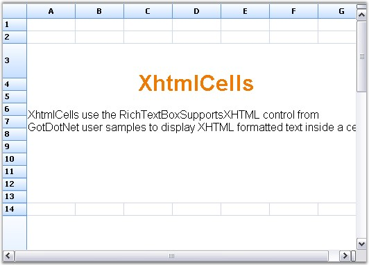

::: {style="DISPLAY: none"}
{#d2h_url_template}{#d2h_package_url style="WIDTH: 0px; DISPLAY: none; HEIGHT: 0px"}
:::

::: {.d2h_secondary_topic style="PADDING-BOTTOM: 10pt; MARGIN: 0pt; PADDING-LEFT: 0pt; PADDING-RIGHT: 0pt; PADDING-TOP: 0pt"}
##### XHTML Cell {#xhtml-cell style="tab-stops: 0pt"}

[]{style="FONT-FAMILY: 'Trebuchet MS','sans-serif'; COLOR: #15428b; FONT-SIZE: 9pt"} 

An XHTML page can be displayed in a grid cell by using Xhtml Cell cell type. A custom cell type can be created and registered to provide XHTML functionality. It requires derivation of two classes:

[]{style="FONT-FAMILY: 'Trebuchet MS','sans-serif'; COLOR: #15428b; FONT-SIZE: 9pt"} 

[·      ]{style="FONT-FAMILY: Symbol"}GridCellModelBase

[·      ]{style="FONT-FAMILY: Symbol"}GridCellRendererBase

[]{style="FONT-FAMILY: 'Trebuchet MS','sans-serif'; COLOR: #15428b; FONT-SIZE: 9pt"} 

The **CellModel** (read GridCellModelBase class in this document) handles any serialization that a cell type requires, and also creates the CellRenderer (read GridCellRendererBase class in this document) class that is associated with the cell type. The **CellRenderer** class manages the UI aspects of the cell type.

 

The XHTML page can be displayed by using the following set of codes.

[]{style="FONT-FAMILY: 'Trebuchet MS','sans-serif'; COLOR: #15428b; FONT-SIZE: 9pt"} 

1.   Using C#

[]{style="FONT-FAMILY: 'Trebuchet MS','sans-serif'; COLOR: #15428b; FONT-SIZE: 9pt"} 

+--------------------------------------------------------------------------------------------------------------------------------------------------------------------------------------------------------------------------+
| **[\[C#\]]{style="FONT-FAMILY: 'Courier New'; COLOR: black"}**                                                                                                                                                           |
|                                                                                                                                                                                                                          |
| []{style="FONT-FAMILY: 'Courier New'; COLOR: black"}                                                                                                                                                                     |
|                                                                                                                                                                                                                          |
| [string]{style="FONT-FAMILY: 'Courier New'; COLOR: blue"}[ xhtml1 = [\"\<body style=\\\"font-family:Arial; line-height:1em\\\"\> \"]{style="COLOR: #a31515"};]{style="FONT-FAMILY: 'Courier New'"}                       |
|                                                                                                                                                                                                                          |
| [xhtml1 += [\"\<h1 style=\\\"text-align:center; color:#EE7A03 \\\"\>XhtmlCells\</h1\>\"]{style="COLOR: #a31515"};]{style="FONT-FAMILY: 'Courier New'"}                                                                   |
|                                                                                                                                                                                                                          |
| [xhtml1 += [\"\<p/\>\"]{style="COLOR: #a31515"};]{style="FONT-FAMILY: 'Courier New'"}                                                                                                                                    |
|                                                                                                                                                                                                                          |
| [xhtml1 += [\"\<p\>XhtmlCells use the RichTextBoxSupportsXHTML control from GotDotNet user samples to display XHTML formatted text inside a cell.\</p\>\"]{style="COLOR: #a31515"};]{style="FONT-FAMILY: 'Courier New'"} |
|                                                                                                                                                                                                                          |
| [xhtml1 += [\"\</body\>\"]{style="COLOR: #a31515"};]{style="FONT-FAMILY: 'Courier New'"}                                                                                                                                 |
|                                                                                                                                                                                                                          |
| [gridControl1\[rowIndex, 1\].CellType = [\"XhtmlCell\"]{style="COLOR: #a31515"};]{style="FONT-FAMILY: 'Courier New'"}                                                                                                    |
|                                                                                                                                                                                                                          |
| [gridControl1\[rowIndex, 1\].Text = xhtml1;]{style="FONT-FAMILY: 'Courier New'"}                                                                                                                                         |
+--------------------------------------------------------------------------------------------------------------------------------------------------------------------------------------------------------------------------+

[]{style="FONT-FAMILY: 'Trebuchet MS','sans-serif'; COLOR: #15428b; FONT-SIZE: 9pt"} 

2.   Using VB.NET

[]{style="FONT-FAMILY: 'Trebuchet MS','sans-serif'; COLOR: #15428b; FONT-SIZE: 9pt"} 

+--------------------------------------------------------------------------------------------------------------------------------------------------------------------------------------------------------------------------------------------------------+
| **[\[VB.NET\]]{style="FONT-FAMILY: 'Courier New'; COLOR: black"}**                                                                                                                                                                                     |
|                                                                                                                                                                                                                                                        |
| []{style="FONT-FAMILY: 'Courier New'; COLOR: black"}                                                                                                                                                                                                   |
|                                                                                                                                                                                                                                                        |
| [Dim]{style="FONT-FAMILY: 'Courier New'; COLOR: blue"}[ xhtml1 [As]{style="COLOR: blue"} [String]{style="COLOR: blue"} = [\"\<body style=\"\"font-family:Arial; line-height:1em\"\"\> \"]{style="COLOR: #a31515"}]{style="FONT-FAMILY: 'Courier New'"} |
|                                                                                                                                                                                                                                                        |
| [xhtml1 += [\"\<h1 style=\"\"text-align:center; color:#EE7A03 \"\"\>XhtmlCells\</h1\>\"]{style="COLOR: #a31515"}]{style="FONT-FAMILY: 'Courier New'"}                                                                                                  |
|                                                                                                                                                                                                                                                        |
| [xhtml1 += [\"\<p/\>\"]{style="COLOR: #a31515"}]{style="FONT-FAMILY: 'Courier New'"}                                                                                                                                                                   |
|                                                                                                                                                                                                                                                        |
| [xhtml1 += [\"\<p\>XhtmlCells use the RichTextBoxSupportsXHTML control from GotDotNet user samples to display XHTML formatted text inside a cell.\</p\>\"]{style="COLOR: #a31515"}]{style="FONT-FAMILY: 'Courier New'"}                                |
|                                                                                                                                                                                                                                                        |
| [xhtml1 += [\"\</body\>\"]{style="COLOR: #a31515"}]{style="FONT-FAMILY: 'Courier New'"}                                                                                                                                                                |
|                                                                                                                                                                                                                                                        |
| [gridControl1(rowIndex, 1).CellType = [\"XhtmlCell\"]{style="COLOR: #a31515"}]{style="FONT-FAMILY: 'Courier New'"}                                                                                                                                     |
|                                                                                                                                                                                                                                                        |
| [gridControl1(rowIndex, 1).Text = xhtml1]{style="FONT-FAMILY: 'Courier New'"}                                                                                                                                                                          |
+--------------------------------------------------------------------------------------------------------------------------------------------------------------------------------------------------------------------------------------------------------+

[]{style="FONT-FAMILY: 'Trebuchet MS','sans-serif'; COLOR: #15428b; FONT-SIZE: 9pt"} 

{border="0"}

[]{style="FONT-FAMILY: 'Trebuchet MS','sans-serif'; COLOR: #15428b; FONT-SIZE: 9pt"} 

*[Figure ]{style="FONT-SIZE: 9pt"}[114]{style="FONT-SIZE: 9pt"}[: XHTML Cell]{style="FONT-SIZE: 9pt"}*

 

[]{#p103} 

 

[]{#related-topics}
:::
