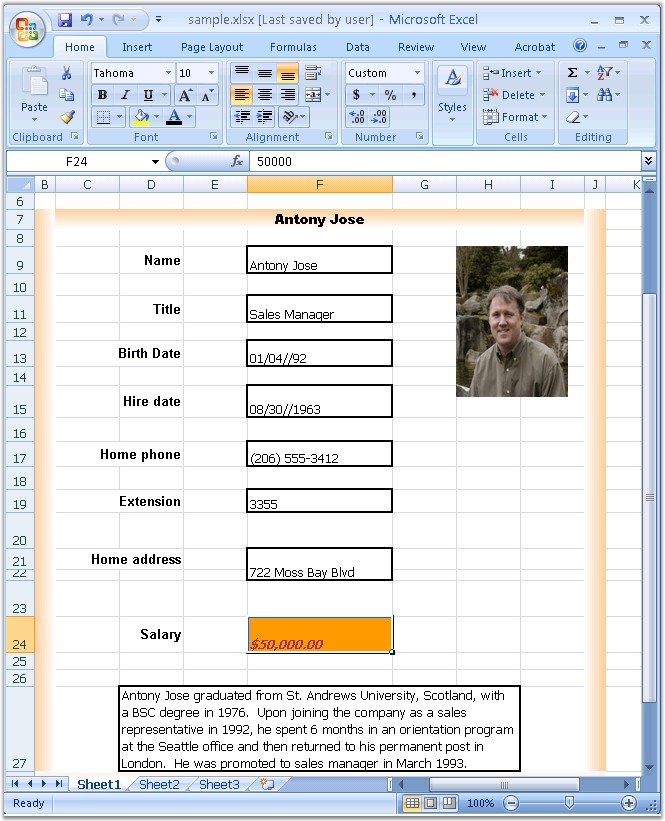

::: {style="DISPLAY: none"}
{#d2h_url_template}{#d2h_package_url style="WIDTH: 0px; DISPLAY: none; HEIGHT: 0px"}
:::

::::: {#nsbanner .d2h_main_nsbanner style="BORDER-BOTTOM: #999999 1px solid; POSITION: relative; PADDING-BOTTOM: 0px; BACKGROUND-COLOR: transparent; PADDING-LEFT: 0px; PADDING-RIGHT: 0px; DISPLAY: none; BORDER-TOP: #999999 1px solid; PADDING-TOP: 0px; LEFT: 0px"}
:::: {#TitleRow .d2h_main_titlerow style="PADDING-BOTTOM: 4px; BACKGROUND-COLOR: transparent; PADDING-LEFT: 22px; WIDTH: 100%; PADDING-RIGHT: 10px; DISPLAY: none; PADDING-TOP: 4px"}
::: {#ienav .d2h_main_ienav style="DISPLAY: none"}
{#D2HPrevious .D2HPreviousEnabled}  {#D2HNext .D2HNextEnabled}
:::
::::
:::::

:::::: {#nstext .d2h_main_nstext style="PADDING-BOTTOM: 10px; BACKGROUND-COLOR: transparent; PADDING-LEFT: 22px; PADDING-RIGHT: 10px; HEIGHT: 100%; OVERFLOW: auto; PADDING-TOP: 5px" hasuserbackground="true" valign="bottom"}
::: {#d2h_breadcrumbs .d2h_breadcrumbs}
[Essential Studio User Guide Documentation](ms-xhelp:///?Id=12457748-09e3-4d74-a240-8e049cedf030){.d2h_breadcrumbsNormal}[ \> ]{.d2h_breadcrumbsLinkSeparator}[Reporting Edition](ms-xhelp:///?Id=027aa5b6-6676-4f93-ad23-c20e8c45792e){.d2h_breadcrumbsNormal}[ \> ]{.d2h_breadcrumbsLinkSeparator}[Essential XlsIO](ms-xhelp:///?Id=b01a1b50-1d7d-40c0-bc83-af67e57c9005){.d2h_breadcrumbsNormal}[ \> ]{.d2h_breadcrumbsLinkSeparator}[Getting Started](ms-xhelp:///?Id=ad99231a-9920-49c5-b9a3-8c0224163396){.d2h_breadcrumbsNormal}[ \> ]{.d2h_breadcrumbsLinkSeparator}[Saving a Workbook](ms-xhelp:///?Id=1b71588e-a2a0-4bc0-924a-e0703e047656){.d2h_breadcrumbsNormal}
:::

### XLSX {#xlsx style="tab-stops: 0pt"}

 

Excel 2007 version of MS Excel has various advanced features, and overcomes the drawbacks of previous versions. Essential XlsIO introduces basic support for Excel 2007 and Excel 2010 **xlsx** format that includes support to read and write basic elements (listed below) into the document.

 

Here is a sample code snippet that opens an **xlsx** file, makes some changes, and saves it as an xlsx file.

 

+-------------------------------------------------------------------------------------------------------------------------------------------------------------------------------------------------------------------------------------------------------------------+
| **[\[C#\]]{style="FONT-FAMILY: 'Courier New'"}**                                                                                                                                                                                                                  |
|                                                                                                                                                                                                                                                                   |
| []{style="FONT-FAMILY: 'Courier New'"}                                                                                                                                                                                                                            |
|                                                                                                                                                                                                                                                                   |
| [//Open an existing Excel 2007 file. Note that you should select the ExcelOpenType when opening ]{style="FONT-FAMILY: 'Courier New'; COLOR: green"}                                                                                                               |
|                                                                                                                                                                                                                                                                   |
| [//.xlsx files]{style="FONT-FAMILY: 'Courier New'; COLOR: green"}                                                                                                                                                                                                 |
|                                                                                                                                                                                                                                                                   |
| [IWorkbook]{style="FONT-FAMILY: 'Courier New'; COLOR: #2b91af"}[ workbook = excelEngine.Excel.Workbooks.Open([\"Excel2007.xlsx\"]{style="COLOR: #a31515"}, [ExcelOpenType]{style="COLOR: #2b91af"}.Automatic);]{style="FONT-FAMILY: 'Courier New'"}               |
|                                                                                                                                                                                                                                                                   |
| []{style="FONT-FAMILY: 'Courier New'"}                                                                                                                                                                                                                            |
|                                                                                                                                                                                                                                                                   |
| [//The first worksheet object in the worksheets collection is accessed.]{style="FONT-FAMILY: 'Courier New'; COLOR: green"}                                                                                                                                        |
|                                                                                                                                                                                                                                                                   |
| [IWorksheet]{style="FONT-FAMILY: 'Courier New'; COLOR: #2b91af"}[ sheet = workbook.Worksheets\[0\];]{style="FONT-FAMILY: 'Courier New'"}                                                                                                                          |
|                                                                                                                                                                                                                                                                   |
| []{style="FONT-FAMILY: 'Courier New'"}                                                                                                                                                                                                                            |
|                                                                                                                                                                                                                                                                   |
| [//Write data]{style="FONT-FAMILY: 'Courier New'; COLOR: green"}                                                                                                                                                                                                  |
|                                                                                                                                                                                                                                                                   |
| [sheet.Range\[[\"C3:O28\"]{style="COLOR: #a31515"}\].Text = [\"Hello world\"]{style="COLOR: #a31515"};]{style="FONT-FAMILY: 'Courier New'"}                                                                                                                       |
|                                                                                                                                                                                                                                                                   |
| []{style="FONT-FAMILY: 'Courier New'"}                                                                                                                                                                                                                            |
|                                                                                                                                                                                                                                                                   |
| [//Select the version to be saved]{style="FONT-FAMILY: 'Courier New'; COLOR: green"}                                                                                                                                                                              |
|                                                                                                                                                                                                                                                                   |
| [workbook.Version = ]{style="FONT-FAMILY: 'Courier New'; COLOR: black"}[ExcelVersion]{style="FONT-FAMILY: 'Courier New'; COLOR: #2b91af"}[.Excel2007; ]{style="FONT-FAMILY: 'Courier New'; COLOR: black"}[//or]{style="FONT-FAMILY: 'Courier New'; COLOR: green"} |
|                                                                                                                                                                                                                                                                   |
| [//workbook.Version = ExcelVersion.Excel2010;]{style="FONT-FAMILY: 'Courier New'; COLOR: green"}                                                                                                                                                                  |
|                                                                                                                                                                                                                                                                   |
| []{style="FONT-FAMILY: 'Courier New'"}                                                                                                                                                                                                                            |
|                                                                                                                                                                                                                                                                   |
| [//Save it as \"Excel2007\" format.]{style="FONT-FAMILY: 'Courier New'; COLOR: green"}                                                                                                                                                                            |
|                                                                                                                                                                                                                                                                   |
| [workbook.SaveAs([\"Sample.xlsx\"]{style="COLOR: #a31515"});]{style="FONT-FAMILY: 'Courier New'"}                                                                                                                                                                 |
+-------------------------------------------------------------------------------------------------------------------------------------------------------------------------------------------------------------------------------------------------------------------+

[]{style="FONT-FAMILY: 'Trebuchet MS','sans-serif'; COLOR: #15428b; FONT-SIZE: 9pt"} 

+----------------------------------------------------------------------------------------------------------------------------------------------------------------------------------------------------------------------------------------------------+
| **[\[VB.NET\]]{style="FONT-FAMILY: 'Courier New'"}**                                                                                                                                                                                               |
|                                                                                                                                                                                                                                                    |
| []{style="FONT-FAMILY: 'Courier New'; COLOR: black"}                                                                                                                                                                                               |
|                                                                                                                                                                                                                                                    |
| [\'Open an existing Excel 2007 file. Note that you should select the ExcelOpenType when opening ]{style="FONT-FAMILY: 'Courier New'; COLOR: green"}                                                                                                |
|                                                                                                                                                                                                                                                    |
| [\'.xlsx files]{style="FONT-FAMILY: 'Courier New'; COLOR: green"}                                                                                                                                                                                  |
|                                                                                                                                                                                                                                                    |
| [Dim]{style="FONT-FAMILY: 'Courier New'; COLOR: blue"}[ workbook [As]{style="COLOR: blue"} IWorkbook = excelEngine.Excel.Workbooks.Open([\"Excel2007.xlsx\"]{style="COLOR: maroon"}, ExcelOpenType.Automatic)]{style="FONT-FAMILY: 'Courier New'"} |
|                                                                                                                                                                                                                                                    |
| []{style="FONT-FAMILY: 'Courier New'"}                                                                                                                                                                                                             |
|                                                                                                                                                                                                                                                    |
| [\'Select the version to be saved.]{style="FONT-FAMILY: 'Courier New'; COLOR: green"}                                                                                                                                                              |
|                                                                                                                                                                                                                                                    |
| [workbook.Version = ExcelVersion.Excel2007]{style="FONT-FAMILY: 'Courier New'; COLOR: black"}[ \'or]{style="FONT-FAMILY: 'Courier New'; COLOR: green"}                                                                                             |
|                                                                                                                                                                                                                                                    |
| [\'workbook.Version = ExcelVersion.Excel2010]{style="FONT-FAMILY: 'Courier New'; COLOR: green"}                                                                                                                                                    |
|                                                                                                                                                                                                                                                    |
| [\'The first worksheet object in the worksheets collection is accessed.]{style="FONT-FAMILY: 'Courier New'; COLOR: green"}                                                                                                                         |
|                                                                                                                                                                                                                                                    |
| [Dim]{style="FONT-FAMILY: 'Courier New'; COLOR: blue"}[ sheet [As]{style="COLOR: blue"} IWorksheet = workbook.Worksheets(0)]{style="FONT-FAMILY: 'Courier New'"}                                                                                   |
|                                                                                                                                                                                                                                                    |
| []{style="FONT-FAMILY: 'Courier New'"}                                                                                                                                                                                                             |
|                                                                                                                                                                                                                                                    |
| [\'Write data]{style="FONT-FAMILY: 'Courier New'; COLOR: green"}                                                                                                                                                                                   |
|                                                                                                                                                                                                                                                    |
| [sheet.Range([\"C3:O28\"]{style="COLOR: maroon"}).Text = [\"Hello world\"]{style="COLOR: maroon"}]{style="FONT-FAMILY: 'Courier New'"}                                                                                                             |
|                                                                                                                                                                                                                                                    |
| []{style="FONT-FAMILY: 'Courier New'"}                                                                                                                                                                                                             |
|                                                                                                                                                                                                                                                    |
| [\'Save it as \"Excel 2007\" format.]{style="FONT-FAMILY: 'Courier New'; COLOR: green"}                                                                                                                                                            |
|                                                                                                                                                                                                                                                    |
| [workbook.SaveAs([\"Sample.xlsx\"]{style="COLOR: maroon"})]{style="FONT-FAMILY: 'Courier New'"}                                                                                                                                                    |
+----------------------------------------------------------------------------------------------------------------------------------------------------------------------------------------------------------------------------------------------------+

[]{style="FONT-FAMILY: 'Trebuchet MS','sans-serif'; COLOR: #15428b; FONT-SIZE: 9pt"} 

::: {style="BORDER-BOTTOM: windowtext 1pt solid; BORDER-LEFT: medium none; PADDING-BOTTOM: 1pt; MARGIN-TOP: 9pt; PADDING-LEFT: 0pt; PADDING-RIGHT: 0pt; MARGIN-BOTTOM: 9pt; BORDER-TOP: windowtext 1pt solid; BORDER-RIGHT: medium none; PADDING-TOP: 1pt"}
{border="0"}Note: You can use the very same API to work with the xlsx file or any other older format.
:::

 

You can also set the **default version** of the workbook when you want to work with the same format.

 

+--------------------------------------------------------------------------------------------------------------------------------------------------------------------------------------------------+
| **[\[C#\]]{style="FONT-FAMILY: 'Courier New'"}**                                                                                                                                                 |
|                                                                                                                                                                                                  |
| []{style="FONT-FAMILY: 'Courier New'"}                                                                                                                                                           |
|                                                                                                                                                                                                  |
| [ExcelEngine ]{style="FONT-FAMILY: 'Courier New'; COLOR: teal"}[excelEngine = new ExcelEngine();]{style="FONT-FAMILY: 'Courier New'"}                                                            |
|                                                                                                                                                                                                  |
| [IApplication]{style="FONT-FAMILY: 'Courier New'; COLOR: teal"}[ application = excelEngine.Excel;]{style="FONT-FAMILY: 'Courier New'"}                                                           |
|                                                                                                                                                                                                  |
| []{style="FONT-FAMILY: 'Courier New'; COLOR: green"}                                                                                                                                             |
|                                                                                                                                                                                                  |
| [//Select the default version as Excel 2007 or Excel 2010;]{style="FONT-FAMILY: 'Courier New'; COLOR: green"}                                                                                    |
|                                                                                                                                                                                                  |
| [application.DefaultVersion = ExcelVersion.Excel2007;]{style="FONT-FAMILY: 'Courier New'; COLOR: black"}[ //or]{style="FONT-FAMILY: 'Courier New'; COLOR: green"}                                |
|                                                                                                                                                                                                  |
| [//application.DefaultVersion = ExcelVersion.Excel2010;]{style="FONT-FAMILY: 'Courier New'; COLOR: green"}                                                                                       |
|                                                                                                                                                                                                  |
| [//Open an existing Excel 2007 file. ]{style="FONT-FAMILY: 'Courier New'; COLOR: green"}                                                                                                         |
|                                                                                                                                                                                                  |
| [IWorkbook]{style="FONT-FAMILY: 'Courier New'; COLOR: #2b91af"}[ workbook = excelEngine.Excel.Workbooks.Open([\"Excel2007.xlsx\"]{style="COLOR: #a31515"});]{style="FONT-FAMILY: 'Courier New'"} |
|                                                                                                                                                                                                  |
| []{style="FONT-FAMILY: 'Courier New'"}                                                                                                                                                           |
|                                                                                                                                                                                                  |
| [//Save it as \"Excel2007\" format.]{style="FONT-FAMILY: 'Courier New'; COLOR: green"}                                                                                                           |
|                                                                                                                                                                                                  |
| [workbook.SaveAs([\"Sample.xlsx\"]{style="COLOR: #a31515"});]{style="FONT-FAMILY: 'Courier New'"}                                                                                                |
+--------------------------------------------------------------------------------------------------------------------------------------------------------------------------------------------------+

[]{style="FONT-FAMILY: 'Trebuchet MS','sans-serif'; COLOR: #15428b; FONT-SIZE: 9pt"} 

+---------------------------------------------------------------------------------------------------------------------------------------------------------------------------------------------------------------------------+
| **[\[VB.NET\]]{style="FONT-FAMILY: 'Courier New'"}**                                                                                                                                                                      |
|                                                                                                                                                                                                                           |
| []{style="FONT-FAMILY: 'Courier New'; COLOR: black"}                                                                                                                                                                      |
|                                                                                                                                                                                                                           |
| [Dim]{style="FONT-FAMILY: 'Courier New'; COLOR: blue"}[ excelEngine [As]{style="COLOR: blue"} ExcelEngine = [New]{style="COLOR: blue"} ExcelEngine()]{style="FONT-FAMILY: 'Courier New'"}                                 |
|                                                                                                                                                                                                                           |
| [Dim]{style="FONT-FAMILY: 'Courier New'; COLOR: blue"}[ application [As]{style="COLOR: blue"} IApplication = excelEngine.Excel]{style="FONT-FAMILY: 'Courier New'"}                                                       |
|                                                                                                                                                                                                                           |
| []{style="FONT-FAMILY: 'Courier New'"}                                                                                                                                                                                    |
|                                                                                                                                                                                                                           |
| [\'Set the default version as Excel 2007;]{style="FONT-FAMILY: 'Courier New'; COLOR: green"}                                                                                                                              |
|                                                                                                                                                                                                                           |
| [application.DefaultVersion = ExcelVersion.Excel2007 ]{style="FONT-FAMILY: 'Courier New'; COLOR: black"}[\'Or]{style="FONT-FAMILY: 'Courier New'; COLOR: green"}                                                          |
|                                                                                                                                                                                                                           |
| [\'application.DefaultVersion = ExcelVersion.Excel2010]{style="FONT-FAMILY: 'Courier New'; COLOR: green"}                                                                                                                 |
|                                                                                                                                                                                                                           |
| [\'Open an existing Excel 2007 file. ]{style="FONT-FAMILY: 'Courier New'; COLOR: green"}                                                                                                                                  |
|                                                                                                                                                                                                                           |
| [Dim]{style="FONT-FAMILY: 'Courier New'; COLOR: blue"}[ workbook [As]{style="COLOR: blue"} IWorkbook = excelEngine.Excel.Workbooks.Open([\"Excel2007.xlsx\"]{style="COLOR: maroon"})]{style="FONT-FAMILY: 'Courier New'"} |
|                                                                                                                                                                                                                           |
| []{style="FONT-FAMILY: 'Courier New'"}                                                                                                                                                                                    |
|                                                                                                                                                                                                                           |
| [\'Save it as \"Excel 2007\" format.]{style="FONT-FAMILY: 'Courier New'; COLOR: green"}                                                                                                                                   |
|                                                                                                                                                                                                                           |
| [workbook.SaveAs([\"Sample.xlsx\"]{style="COLOR: maroon"})]{style="FONT-FAMILY: 'Courier New'"}                                                                                                                           |
+---------------------------------------------------------------------------------------------------------------------------------------------------------------------------------------------------------------------------+

 

Essential XlsIO also allows to open an existing .xls file and save it to the .xlsx format \[with supported elements\], or open an .xlsx file and save it to the .xls format.

 

+-----------------------------------------------------------------------------------------------------------------------------------------------------------------------------------------------------------------------------------------------------+
| **[\[C#\]]{style="FONT-FAMILY: 'Courier New'"}**                                                                                                                                                                                                    |
|                                                                                                                                                                                                                                                     |
| []{style="FONT-FAMILY: 'Courier New'"}                                                                                                                                                                                                              |
|                                                                                                                                                                                                                                                     |
| [//Open an existing Excel 2007 file. Note that you should select the ExcelOpenType when opening ]{style="FONT-FAMILY: 'Courier New'; COLOR: green"}                                                                                                 |
|                                                                                                                                                                                                                                                     |
| [//.xlsx files]{style="FONT-FAMILY: 'Courier New'; COLOR: green"}                                                                                                                                                                                   |
|                                                                                                                                                                                                                                                     |
| [IWorkbook]{style="FONT-FAMILY: 'Courier New'; COLOR: #2b91af"}[ workbook = excelEngine.Excel.Workbooks.Open([\"Excel2007.xlsx\"]{style="COLOR: #a31515"}, [ExcelOpenType]{style="COLOR: #2b91af"}.Automatic);]{style="FONT-FAMILY: 'Courier New'"} |
|                                                                                                                                                                                                                                                     |
| []{style="FONT-FAMILY: 'Courier New'"}                                                                                                                                                                                                              |
|                                                                                                                                                                                                                                                     |
| [//Select the version to be saved.]{style="FONT-FAMILY: 'Courier New'; COLOR: green"}                                                                                                                                                               |
|                                                                                                                                                                                                                                                     |
| [workbook.Version = [ExcelVersion]{style="COLOR: #2b91af"}.Excel97to2003;]{style="FONT-FAMILY: 'Courier New'"}                                                                                                                                      |
|                                                                                                                                                                                                                                                     |
| []{style="FONT-FAMILY: 'Courier New'"}                                                                                                                                                                                                              |
|                                                                                                                                                                                                                                                     |
| [//The first worksheet object in the worksheets collection is accessed.]{style="FONT-FAMILY: 'Courier New'; COLOR: green"}                                                                                                                          |
|                                                                                                                                                                                                                                                     |
| [IWorksheet]{style="FONT-FAMILY: 'Courier New'; COLOR: #2b91af"}[ sheet = workbook.Worksheets\[0\];]{style="FONT-FAMILY: 'Courier New'"}                                                                                                            |
|                                                                                                                                                                                                                                                     |
| []{style="FONT-FAMILY: 'Courier New'"}                                                                                                                                                                                                              |
|                                                                                                                                                                                                                                                     |
| [//Write data]{style="FONT-FAMILY: 'Courier New'; COLOR: green"}                                                                                                                                                                                    |
|                                                                                                                                                                                                                                                     |
| [sheet.Range\[[\"C3:O28\"]{style="COLOR: #a31515"}\].Text = [\"Hello world\"]{style="COLOR: #a31515"};]{style="FONT-FAMILY: 'Courier New'"}                                                                                                         |
|                                                                                                                                                                                                                                                     |
| []{style="FONT-FAMILY: 'Courier New'"}                                                                                                                                                                                                              |
|                                                                                                                                                                                                                                                     |
| [//Save it as \"Excel 97 t0 2003\" format.]{style="FONT-FAMILY: 'Courier New'; COLOR: green"}                                                                                                                                                       |
|                                                                                                                                                                                                                                                     |
| [workbook.SaveAs([\"Sample.xls\"]{style="COLOR: #a31515"});]{style="FONT-FAMILY: 'Courier New'"}                                                                                                                                                    |
+-----------------------------------------------------------------------------------------------------------------------------------------------------------------------------------------------------------------------------------------------------+

[]{style="FONT-FAMILY: 'Trebuchet MS','sans-serif'; COLOR: #15428b; FONT-SIZE: 9pt"} 

+----------------------------------------------------------------------------------------------------------------------------------------------------------------------------------------------------------------------------------------------------+
| **[\[VB.NET\]]{style="FONT-FAMILY: 'Courier New'"}**                                                                                                                                                                                               |
|                                                                                                                                                                                                                                                    |
| []{style="FONT-FAMILY: 'Courier New'"}                                                                                                                                                                                                             |
|                                                                                                                                                                                                                                                    |
| [\'Open an existing Excel 2007 file. Note that you should select the ExcelOpenType when opening ]{style="FONT-FAMILY: 'Courier New'; COLOR: green"}                                                                                                |
|                                                                                                                                                                                                                                                    |
| [\'.xlsx files]{style="FONT-FAMILY: 'Courier New'; COLOR: green"}                                                                                                                                                                                  |
|                                                                                                                                                                                                                                                    |
| [Dim]{style="FONT-FAMILY: 'Courier New'; COLOR: blue"}[ workbook [As]{style="COLOR: blue"} IWorkbook = excelEngine.Excel.Workbooks.Open([\"Excel2007.xlsx\"]{style="COLOR: maroon"}, ExcelOpenType.Automatic)]{style="FONT-FAMILY: 'Courier New'"} |
|                                                                                                                                                                                                                                                    |
| []{style="FONT-FAMILY: 'Courier New'"}                                                                                                                                                                                                             |
|                                                                                                                                                                                                                                                    |
| [\'Select the version to be saved.]{style="FONT-FAMILY: 'Courier New'; COLOR: green"}                                                                                                                                                              |
|                                                                                                                                                                                                                                                    |
| [workbook.Version = ExcelVersion.Excel97to2003]{style="FONT-FAMILY: 'Courier New'"}                                                                                                                                                                |
|                                                                                                                                                                                                                                                    |
| []{style="FONT-FAMILY: 'Courier New'"}                                                                                                                                                                                                             |
|                                                                                                                                                                                                                                                    |
| [\'The first worksheet object in the worksheets collection is accessed.]{style="FONT-FAMILY: 'Courier New'; COLOR: green"}                                                                                                                         |
|                                                                                                                                                                                                                                                    |
| [Dim]{style="FONT-FAMILY: 'Courier New'; COLOR: blue"}[ sheet [As]{style="COLOR: blue"} IWorksheet = workbook.Worksheets(0)]{style="FONT-FAMILY: 'Courier New'"}                                                                                   |
|                                                                                                                                                                                                                                                    |
| []{style="FONT-FAMILY: 'Courier New'"}                                                                                                                                                                                                             |
|                                                                                                                                                                                                                                                    |
| [\'Write data]{style="FONT-FAMILY: 'Courier New'; COLOR: green"}                                                                                                                                                                                   |
|                                                                                                                                                                                                                                                    |
| [sheet.Range([\"C3:O28\"]{style="COLOR: maroon"}).Text = [\"Hello world\"]{style="COLOR: maroon"}]{style="FONT-FAMILY: 'Courier New'"}                                                                                                             |
|                                                                                                                                                                                                                                                    |
| []{style="FONT-FAMILY: 'Courier New'; COLOR: maroon"}                                                                                                                                                                                              |
|                                                                                                                                                                                                                                                    |
| [\'Save it as \"Excel 97 to 2003\" format.]{style="FONT-FAMILY: 'Courier New'; COLOR: green"}                                                                                                                                                      |
|                                                                                                                                                                                                                                                    |
| [workbook.SaveAs([\"Sample.xls\"]{style="COLOR: maroon"})]{style="FONT-FAMILY: 'Courier New'"}                                                                                                                                                     |
+----------------------------------------------------------------------------------------------------------------------------------------------------------------------------------------------------------------------------------------------------+

 

Xlsx File Format Support List

 

::: {align="center"}
+-------------------------------------------------------------------------------------------------------------------------------------------------------------------------------------------------------------------------------+
| Support for Excel 2007 file formats in XlsIO                                                                                                                                                                                  |
+===========================================================+===================================================================================================================================================================+
|  XML-based File Format Support                            | []{style="FONT-FAMILY: 'Times New Roman','serif'; COLOR: #244061"}                                                                                                |
+-----------------------------------------------------------+-------------------------------------------------------------------------------------------------------------------------------------------------------------------+
|                                                           | Gets/sets cells (text, date time, time span, error, number, Boolean, formula).                                                                                    |
+-----------------------------------------------------------+-------------------------------------------------------------------------------------------------------------------------------------------------------------------+
|                                                           | New dimensions: 2\^20 x 2\^14.                                                                                                                                    |
+-----------------------------------------------------------+-------------------------------------------------------------------------------------------------------------------------------------------------------------------+
|                                                           | Range operations such as copy/move range, insert/remove row/column, formula updates after these operations.                                                       |
+-----------------------------------------------------------+-------------------------------------------------------------------------------------------------------------------------------------------------------------------+
|                                                           | Merged cells support.                                                                                                                                             |
+-----------------------------------------------------------+-------------------------------------------------------------------------------------------------------------------------------------------------------------------+
|                                                           | Row and column settings (default style, height/width, visibility).                                                                                                |
+-----------------------------------------------------------+-------------------------------------------------------------------------------------------------------------------------------------------------------------------+
|                                                           | Named ranges support.                                                                                                                                             |
+-----------------------------------------------------------+-------------------------------------------------------------------------------------------------------------------------------------------------------------------+
|                                                           | Ability to open 2007 files and save into 2003 format (without unsupported items).                                                                                 |
+-----------------------------------------------------------+-------------------------------------------------------------------------------------------------------------------------------------------------------------------+
|                                                           | AutoFilters (existing functionality).                                                                                                                             |
+-----------------------------------------------------------+-------------------------------------------------------------------------------------------------------------------------------------------------------------------+
|                                                           | Read/write data validation (existing functionality).                                                                                                              |
+-----------------------------------------------------------+-------------------------------------------------------------------------------------------------------------------------------------------------------------------+
|                                                           | \- Read/Write conditional formatting (existing functionality).                                                                                                    |
|                                                           |                                                                                                                                                                   |
|                                                           | \- Increase possible rules number (in Excel 97-2003 there can be only three rules).                                                                               |
|                                                           |                                                                                                                                                                   |
|                                                           | \- New visualizations \[Data bar, Icon sets and Color scales\].                                                                                                   |
+-----------------------------------------------------------+-------------------------------------------------------------------------------------------------------------------------------------------------------------------+
|                                                           | Adjust row/column height & width, insert rows/cols, group/ungroup \[with summary settings\], freeze pane and split pane.                                          |
+-----------------------------------------------------------+-------------------------------------------------------------------------------------------------------------------------------------------------------------------+
|                                                           | Images operations (insert/remove/move/resize/open/save, without fill).                                                                                            |
+-----------------------------------------------------------+-------------------------------------------------------------------------------------------------------------------------------------------------------------------+
|                                                           | Read/Write hyperlinks (existing functionality).                                                                                                                   |
+-----------------------------------------------------------+-------------------------------------------------------------------------------------------------------------------------------------------------------------------+
|                                                           | Comments (open/save/move/resize/add/remove/get and set rtf text, author, without fill).                                                                           |
+-----------------------------------------------------------+-------------------------------------------------------------------------------------------------------------------------------------------------------------------+
|                                                           | Document properties (built-in and custom) and sheet level properties.                                                                                             |
+-----------------------------------------------------------+-------------------------------------------------------------------------------------------------------------------------------------------------------------------+
|                                                           | Page Setup (all existing properties including header/footer images and page breaks), page layout, zoom, sheet alignment \[right to left\] and page break preview. |
+-----------------------------------------------------------+-------------------------------------------------------------------------------------------------------------------------------------------------------------------+
|                                                           | Worksheet properties (tab color, background image, hide and rename).                                                                                              |
+-----------------------------------------------------------+-------------------------------------------------------------------------------------------------------------------------------------------------------------------+
|                                                           | Ignore error indicator, show/hide gridlines and gridline color.                                                                                                   |
+-----------------------------------------------------------+-------------------------------------------------------------------------------------------------------------------------------------------------------------------+
|                                                           | Gets/sets RTF string.                                                                                                                                             |
+-----------------------------------------------------------+-------------------------------------------------------------------------------------------------------------------------------------------------------------------+
|                                                           | Worksheet protection with or without password, workbook window or structure protection without password.                                                          |
+-----------------------------------------------------------+-------------------------------------------------------------------------------------------------------------------------------------------------------------------+
|                                                           | Encryption and Decryption.                                                                                                                                        |
+-----------------------------------------------------------+-------------------------------------------------------------------------------------------------------------------------------------------------------------------+
|                                                           | TextBox, CheckBox and Combo Box -- Read/Write support.                                                                                                            |
+-----------------------------------------------------------+-------------------------------------------------------------------------------------------------------------------------------------------------------------------+
|                                                           | Pivot Table creation and formatting.                                                                                                                              |
+-----------------------------------------------------------+-------------------------------------------------------------------------------------------------------------------------------------------------------------------+
|                                                           | Tables -- Read/Write and Styles support (Table Formulas are not supported).                                                                                       |
+-----------------------------------------------------------+-------------------------------------------------------------------------------------------------------------------------------------------------------------------+
|                                                           | Read/Write Excel 2007 Formulas.                                                                                                                                   |
+-----------------------------------------------------------+-------------------------------------------------------------------------------------------------------------------------------------------------------------------+
|                                                           | Chart - existing functionality except the options given below which are not supported.                                                                            |
|                                                           |                                                                                                                                                                   |
|                                                           |                                                                                                                                                                   |
|                                                           |                                                                                                                                                                   |
|                                                           | 1\. Secondary axes \[partial\].                                                                                                                                   |
|                                                           |                                                                                                                                                                   |
|                                                           | 2\. Marker filling options.                                                                                                                                       |
|                                                           |                                                                                                                                                                   |
|                                                           | 3\. Drop lines.                                                                                                                                                   |
|                                                           |                                                                                                                                                                   |
|                                                           | 4\. Chart referring to values in other worksheet/workbook.                                                                                                        |
+-----------------------------------------------------------+-------------------------------------------------------------------------------------------------------------------------------------------------------------------+
| Objects Preservation while Opening and Saving XLSX Format |                                                                                                                                                                   |
+-----------------------------------------------------------+-------------------------------------------------------------------------------------------------------------------------------------------------------------------+
|                                                           | Pivot Tables                                                                                                                                                      |
+-----------------------------------------------------------+-------------------------------------------------------------------------------------------------------------------------------------------------------------------+
|                                                           | Shapes (auto shapes, Image styles).                                                                                                                               |
+-----------------------------------------------------------+-------------------------------------------------------------------------------------------------------------------------------------------------------------------+
| Cell Styles Support                                       |                                                                                                                                                                   |
+-----------------------------------------------------------+-------------------------------------------------------------------------------------------------------------------------------------------------------------------+
|                                                           | Read/Write/Set Cell styles (All styles in Biff8 format).                                                                                                          |
+-----------------------------------------------------------+-------------------------------------------------------------------------------------------------------------------------------------------------------------------+
|                                                           | Themes                                                                                                                                                            |
+-----------------------------------------------------------+-------------------------------------------------------------------------------------------------------------------------------------------------------------------+
|                                                           | 32-bit colors                                                                                                                                                     |
+-----------------------------------------------------------+-------------------------------------------------------------------------------------------------------------------------------------------------------------------+
|                                                           | Excel 2007 Built-In Styles.                                                                                                                                       |
+-----------------------------------------------------------+-------------------------------------------------------------------------------------------------------------------------------------------------------------------+
|                                                           | Gradient Fill                                                                                                                                                     |
+-----------------------------------------------------------+-------------------------------------------------------------------------------------------------------------------------------------------------------------------+
|                                                           | New count restriction - \~65000.                                                                                                                                  |
+-----------------------------------------------------------+-------------------------------------------------------------------------------------------------------------------------------------------------------------------+
:::

 

The following screen shot shows the output file generated by Essential XlsIO, with all the basic features supported \[Multiple conditional formatting\].

 

{border="0"}

Figure 30: Sample .xlsx file created with XlsIO[]{style="FONT-FAMILY: 'Trebuchet MS','sans-serif'; COLOR: #15428b"}

[]{style="FONT-FAMILY: 'Trebuchet MS','sans-serif'; COLOR: #15428b; FONT-SIZE: 9pt"} 

For More Information Refer:

**[]{style="FONT-FAMILY: 'Trebuchet MS','sans-serif'; COLOR: #15428b"}** 

[[Excel 97 to 2003]{.UGHyperlink}](ms-xhelp:///?Id=c987ccb0-3e30-4c83-97d7-cc8c66c07ec4)[, ]{style="FONT-FAMILY: 'Trebuchet MS','sans-serif'; COLOR: #15428b; FONT-SIZE: 9pt"}[[SpreadsheetML]{.UGHyperlink}](ms-xhelp:///?Id=b7fff239-e9ce-4e93-a227-8c570b114beb)[, ]{style="FONT-FAMILY: 'Trebuchet MS','sans-serif'; COLOR: #15428b; FONT-SIZE: 9pt"}[[CSV format]{.UGHyperlink}](ms-xhelp:///?Id=b5f99653-905f-4aa8-a445-bc230a3d7b92)[[]{style="FONT-FAMILY: 'Trebuchet MS','sans-serif'; FONT-SIZE: 9pt"}]{.MsoHyperlink}

[[]{style="FONT-FAMILY: 'Trebuchet MS','sans-serif'; FONT-SIZE: 9pt"}]{.MsoHyperlink} 

More:

[ ]{#related-topics}

[{border="0" align="absMiddle"}Reducing size of Excel 2007 & Excel 2010 files](ms-xhelp:///?Id=6e54acab-7fec-462f-a558-8e52de354beb){style="TEXT-DECORATION: none"}
::::::
