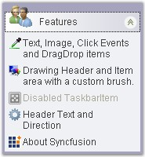

::: {style="DISPLAY: none"}
{#d2h_url_template}{#d2h_package_url style="WIDTH: 0px; DISPLAY: none; HEIGHT: 0px"}
:::

::::: {#nsbanner .d2h_main_nsbanner style="BORDER-BOTTOM: #999999 1px solid; POSITION: relative; PADDING-BOTTOM: 0px; BACKGROUND-COLOR: transparent; PADDING-LEFT: 0px; PADDING-RIGHT: 0px; DISPLAY: none; BORDER-TOP: #999999 1px solid; PADDING-TOP: 0px; LEFT: 0px"}
:::: {#TitleRow .d2h_main_titlerow style="PADDING-BOTTOM: 4px; BACKGROUND-COLOR: transparent; PADDING-LEFT: 22px; WIDTH: 100%; PADDING-RIGHT: 10px; DISPLAY: none; PADDING-TOP: 4px"}
::: {#ienav .d2h_main_ienav style="DISPLAY: none"}
{#D2HPrevious .D2HPreviousEnabled}  {#D2HNext .D2HNextEnabled}
:::
::::
:::::

:::: {#nstext .d2h_main_nstext style="PADDING-BOTTOM: 10px; BACKGROUND-COLOR: transparent; PADDING-LEFT: 22px; PADDING-RIGHT: 10px; HEIGHT: 100%; OVERFLOW: auto; PADDING-TOP: 5px" hasuserbackground="true" valign="bottom"}
::: {#d2h_breadcrumbs .d2h_breadcrumbs}
[Essential Studio User Guide Documentation](ms-xhelp:///?Id=12457748-09e3-4d74-a240-8e049cedf030){.d2h_breadcrumbsNormal}[ \> ]{.d2h_breadcrumbsLinkSeparator}[User Interface Edition](ms-xhelp:///?Id=c29296b7-531c-413b-a0ec-488ca1f7f669){.d2h_breadcrumbsNormal}[ \> ]{.d2h_breadcrumbsLinkSeparator}[Essential Windows](ms-xhelp:///?Id=e60759d8-47a4-4570-9d7a-16a68d63f2ea){.d2h_breadcrumbsNormal}[ \> ]{.d2h_breadcrumbsLinkSeparator}[Essential Tools]{.d2h_breadcrumbsContentsOnly}[ \> ]{.d2h_breadcrumbsLinkSeparator}[Tools Controls](ms-xhelp:///?Id=13c3c4f4-9d16-4b69-93f2-7e98eec67452){.d2h_breadcrumbsNormal}[ \> ]{.d2h_breadcrumbsLinkSeparator}[Navigation Package](ms-xhelp:///?Id=a57592e8-7db2-4cd9-ba89-c7ee92b60203){.d2h_breadcrumbsNormal}
:::

### XPTaskBar {#xptaskbar style="MARGIN-LEFT: 18pt; tab-stops: 18.0pt"}

 

The **XPTaskBar** control simulates the new TaskBar feature popularized in Windows XP. The XPTaskBar is the encompassing control that can show one or more **XPTaskBar Boxes**. Each Box can in turn show user clickable command items represented by the **XPTaskBar Item** type. The box can also take a single child panel inside which you can drop any custom control. It also provides keyboard navigational support.

 

Popularized in XP, this look-and-feel can be the exact theme look when this control is **ThemesEnabled**. This control, however, can be used in any Operating System where it falls back to some specified color settings. The boxes are also collapsible, just like in XP.

 

You can then add one or more XPTaskBar Items to the boxes using their **Items** property.

 

The following screen shot illustrates the XPTaskBar and it\'s elements.

[]{style="COLOR: #15428b"} 

{border="0"}

 

Figure 926: XPTaskBar Illustrated

[]{style="COLOR: #15428b"} 

See Also[]{#p664}

 

More:

[ ]{#related-topics}

[{border="0" align="absMiddle"}Features Overview](ms-xhelp:///?Id=599a76c7-d2cc-4f46-ae1b-5b27a6e7d32e){style="TEXT-DECORATION: none"}

[{border="0" align="absMiddle"}Control Overview](ms-xhelp:///?Id=227c0afb-1ada-4c86-9f81-f201fc6a85c8){style="TEXT-DECORATION: none"}

[{border="0" align="absMiddle"}Creating an XPTaskBar](ms-xhelp:///?Id=d7974009-a120-4b97-b704-6af1a6edf9b1){style="TEXT-DECORATION: none"}

[{border="0" align="absMiddle"}Concepts and Features](ms-xhelp:///?Id=a67928fd-a908-4e93-93cd-3e77f4f2dd89){style="TEXT-DECORATION: none"}

[{border="0" align="absMiddle"}XPTaskBar Events](ms-xhelp:///?Id=997d53cb-717a-4e82-8cd9-bd68850615a1){style="TEXT-DECORATION: none"}

[{border="0" align="absMiddle"}Frequently Asked Questions](ms-xhelp:///?Id=300af2ef-9d20-435b-83e0-8ea0cf9c9f8b){style="TEXT-DECORATION: none"}
::::
