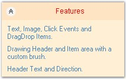
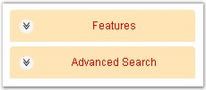
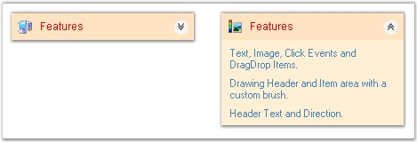
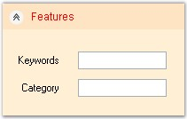
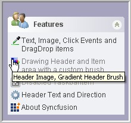

::: {style="DISPLAY: none"}
{#d2h_url_template}{#d2h_package_url style="WIDTH: 0px; DISPLAY: none; HEIGHT: 0px"}
:::

:::::::::: {.d2h_secondary_topic style="PADDING-BOTTOM: 10pt; MARGIN: 0pt; PADDING-LEFT: 0pt; PADDING-RIGHT: 0pt; PADDING-TOP: 0pt"}
##### XPTaskBar Box Settings {#xptaskbar-box-settings style="MARGIN-LEFT: 18pt; tab-stops: 18.0pt"}

[]{style="COLOR: #15428b"} 

This section discusses the appearance and behavior settings of the XPTaskBar Box.

 

It includes the below given topics.[]{#p674}

 

###### 3.6.3.4.2.1      Header Settings {#header-settings style="MARGIN-LEFT: 18pt; tab-stops: 18.0pt"}

[]{style="COLOR: #15428b"} 

This section lists the properties used for customizing the header of the XPTaskBar Box.

 

The Header of the XPTaskBar Box contains the Collapse button and text. The header text can be changed using the **Text** property of the XPTaskBar Box. The other properties are discussed below.

[]{style="COLOR: #15428b"} 

::: {align="center"}
+-----------------------------------+---------------------------------------------------------------------------+
| XPTaskBar Box Property            | Description                                                               |
+-----------------------------------+---------------------------------------------------------------------------+
| HeaderBackColor                   | Gets / sets the background color with which the header will be drawn.     |
+-----------------------------------+---------------------------------------------------------------------------+
| HeaderForeColor                   | Gets / sets the foreground color with which the header will be drawn.     |
+-----------------------------------+---------------------------------------------------------------------------+
| HeaderDirection                   | Gets / sets the header direction. The options are as follows.             |
|                                   |                                                                           |
|                                   |                                                                           |
|                                   |                                                                           |
|                                   | [·      ]{style="FONT-FAMILY: Symbol"}RightToLeft                         |
|                                   |                                                                           |
|                                   | [·      ]{style="FONT-FAMILY: Symbol"}LeftToRight                         |
|                                   |                                                                           |
|                                   |                                                                           |
|                                   |                                                                           |
|                                   | The default value is \'LeftToRight\'.                                     |
+-----------------------------------+---------------------------------------------------------------------------+
| HeaderFont                        | Gets / sets the text font with which the header will be drawn.            |
+-----------------------------------+---------------------------------------------------------------------------+
| HeaderTextAlign                   | Gets / sets the header text alignment. The options are,                   |
|                                   |                                                                           |
|                                   |                                                                           |
|                                   |                                                                           |
|                                   | [·      ]{style="FONT-FAMILY: Symbol"}Near                                |
|                                   |                                                                           |
|                                   | [·      ]{style="FONT-FAMILY: Symbol"}Center                              |
|                                   |                                                                           |
|                                   | [·      ]{style="FONT-FAMILY: Symbol"}Far                                 |
|                                   |                                                                           |
|                                   |                                                                           |
|                                   |                                                                           |
|                                   | The default value is \'Near\'.                                            |
|                                   |                                                                           |
|                                   |                                                                           |
|                                   |                                                                           |
|                                   | The Header text must not be set to Null characters.                       |
+-----------------------------------+---------------------------------------------------------------------------+
| ClipHeaderText                    | Gets / sets a value indicating whether the header text should be clipped. |
+-----------------------------------+---------------------------------------------------------------------------+
:::

[]{style="COLOR: #15428b"} 

The following screen shot illustrates the above settings.

[]{style="COLOR: #15428b"} 

{border="0"}

[]{style="COLOR: #15428b"} 

Figure 941: Header Settings Illustrated

[]{style="COLOR: #15428b"} 

+----------------------------------------------------------------------------------------------------------------------------------------------------------------------------------------------------------------------------------------------------------------------------------+
| **[\[C#\]]{style="FONT-FAMILY: 'Courier New'; COLOR: black"}**                                                                                                                                                                                                                   |
|                                                                                                                                                                                                                                                                                  |
| []{style="FONT-FAMILY: 'Courier New'; COLOR: blue"}                                                                                                                                                                                                                              |
|                                                                                                                                                                                                                                                                                  |
| [this]{style="FONT-FAMILY: 'Courier New'; COLOR: blue"}[.xpTaskBarBox1.HeaderBackColor = System.Drawing.Color.Bisque]{style="FONT-FAMILY: 'Courier New'"}                                                                                                                        |
|                                                                                                                                                                                                                                                                                  |
| [this]{style="FONT-FAMILY: 'Courier New'; COLOR: blue"}[.xpTaskBarBox1.HeaderForeColor = System.Drawing.Color.Red;]{style="FONT-FAMILY: 'Courier New'"}                                                                                                                          |
|                                                                                                                                                                                                                                                                                  |
| [this]{style="FONT-FAMILY: 'Courier New'; COLOR: blue"}[.xpTaskBarBox1.HeaderDirection = Syncfusion.Windows.Forms.Tools.XPTaskBarBox.HeaderDirectionFormat.RightToLeft;]{style="FONT-FAMILY: 'Courier New'"}                                                                     |
|                                                                                                                                                                                                                                                                                  |
| [this]{style="FONT-FAMILY: 'Courier New'; COLOR: blue"}[.xpTaskBarBox1.HeaderFont = [new]{style="COLOR: blue"} System.Drawing.Font(\"Arial\", 9F, System.Drawing.FontStyle.Regular, System.Drawing.GraphicsUnit.Point, ((System.Byte)(0)));]{style="FONT-FAMILY: 'Courier New'"} |
|                                                                                                                                                                                                                                                                                  |
| [this]{style="FONT-FAMILY: 'Courier New'; COLOR: blue"}[.xpTaskBarBox1.HeaderTextAlign = System.Drawing.StringAlignment.Center;]{style="FONT-FAMILY: 'Courier New'"}                                                                                                             |
|                                                                                                                                                                                                                                                                                  |
| [this]{style="FONT-FAMILY: 'Courier New'; COLOR: blue"}[.xpTaskBarBox1.ClipHeaderText = [true]{style="COLOR: blue"};]{style="FONT-FAMILY: 'Courier New'"}                                                                                                                        |
+----------------------------------------------------------------------------------------------------------------------------------------------------------------------------------------------------------------------------------------------------------------------------------+

[]{style="COLOR: #4a5c8c; FONT-SIZE: 8pt"} 

+-----------------------------------------------------------------------------------------------------------------------------------------------------------------------------------------------------------------------------------------------------------------------------------------------------------------------+
| **[\[VB.NET\]]{style="FONT-FAMILY: 'Courier New'; COLOR: black"}**                                                                                                                                                                                                                                                    |
|                                                                                                                                                                                                                                                                                                                       |
| []{style="FONT-FAMILY: 'Courier New'; COLOR: black"}                                                                                                                                                                                                                                                                  |
|                                                                                                                                                                                                                                                                                                                       |
| [Me]{style="FONT-FAMILY: 'Courier New'; COLOR: blue"}[.xpTaskBarBox1.HeaderBackColor = System.Drawing.Color.Bisque]{style="FONT-FAMILY: 'Courier New'"}                                                                                                                                                               |
|                                                                                                                                                                                                                                                                                                                       |
| [Me]{style="FONT-FAMILY: 'Courier New'; COLOR: blue"}[.xpTaskBarBox1.HeaderForeColor = System.Drawing.Color.Red]{style="FONT-FAMILY: 'Courier New'"}                                                                                                                                                                  |
|                                                                                                                                                                                                                                                                                                                       |
| [Me]{style="FONT-FAMILY: 'Courier New'; COLOR: blue"}[.xpTaskBarBox1.HeaderDirection = Syncfusion.Windows.Forms.Tools.XPTaskBarBox.HeaderDirectionFormat.RightToLeft]{style="FONT-FAMILY: 'Courier New'"}                                                                                                             |
|                                                                                                                                                                                                                                                                                                                       |
| [Me]{style="FONT-FAMILY: 'Courier New'; COLOR: blue"}[.xpTaskBarBox1.HeaderFont = [New]{style="COLOR: blue"} System.Drawing.Font([\"Arial\"]{style="COLOR: maroon"}, 9F, System.Drawing.FontStyle.Regular, System.Drawing.GraphicsUnit.Point, ([CByte]{style="COLOR: blue"}(0)))]{style="FONT-FAMILY: 'Courier New'"} |
|                                                                                                                                                                                                                                                                                                                       |
| [Me]{style="FONT-FAMILY: 'Courier New'; COLOR: blue"}[.xpTaskBarBox1.HeaderTextAlign = System.Drawing.StringAlignment.Center]{style="FONT-FAMILY: 'Courier New'"}                                                                                                                                                     |
|                                                                                                                                                                                                                                                                                                                       |
| [Me]{style="FONT-FAMILY: 'Courier New'; COLOR: blue"}[.xpTaskBarBox1.ClipHeaderText = [True]{style="COLOR: blue"}]{style="FONT-FAMILY: 'Courier New'"}                                                                                                                                                                |
+-----------------------------------------------------------------------------------------------------------------------------------------------------------------------------------------------------------------------------------------------------------------------------------------------------------------------+

[]{style="COLOR: #15428b"} 

See Also

[]{style="COLOR: #4a5c8c"} 

[[Image Settings]{.UGHyperlink}](../../../../../../../../Documents%20and%20Settings/sylviap/Desktop/Tools%20-%20Part%202.docx#_XPTaskBar-_Image_Settings)[]{.UGHyperlink}

 

 

[]{#p675} 

 

###### 3.6.3.4.2.2      Button Settings {#button-settings style="MARGIN-LEFT: 18pt; tab-stops: 18.0pt"}

[]{style="COLOR: #15428b"} 

This section discusses the button settings of the XPTaskBar Box.

 

The collapsed button is used to expand or collapse the XPTaskBar Items. The following table lists the properties associated with collapsing or expanding the XPTaskBar Box.

[]{style="COLOR: #15428b"} 

::: {align="center"}
  ------------------------ --------------------------------------------------------------------------------------------------------------------------------------------------------------------------------------
  XPTaskBar Box Property   Description
  Collapsed                Specifies the collapsed state of the TaskBar Box. The default value is set to \'False\'.
  ShowCollapseButton       Specifies whether to show or hide the collapse button. The default value is set to \'True\'.
  ToggleByButton           Specifies whether the XPTaskBar Box should expand or collapse only when the collapse button is clicked, or always when the header is clicked. The default value is set to \'False\'.
  ------------------------ --------------------------------------------------------------------------------------------------------------------------------------------------------------------------------------
:::

[]{style="COLOR: #15428b"} 

+---------------------------------------------------------------------------------------------------------------------------------------------------------------+
| **[\[C#\]]{style="FONT-FAMILY: 'Courier New'; COLOR: black"}**                                                                                                |
|                                                                                                                                                               |
| []{style="FONT-FAMILY: 'Courier New'; COLOR: black"}                                                                                                          |
|                                                                                                                                                               |
| [this]{style="FONT-FAMILY: 'Courier New'; COLOR: blue"}[.xpTaskBarBox1.Collapsed = [true]{style="COLOR: blue"};]{style="FONT-FAMILY: 'Courier New'"}          |
|                                                                                                                                                               |
| [this]{style="FONT-FAMILY: 'Courier New'; COLOR: blue"}[.xpTaskBarBox1.ShowCollapseButton = [true]{style="COLOR: blue"};]{style="FONT-FAMILY: 'Courier New'"} |
|                                                                                                                                                               |
| [this]{style="FONT-FAMILY: 'Courier New'; COLOR: blue"}[.xpTaskBarBox1.ToggleByButton = [true]{style="COLOR: blue"};]{style="FONT-FAMILY: 'Courier New'"}     |
+---------------------------------------------------------------------------------------------------------------------------------------------------------------+

[]{style="COLOR: #15428b"} 

+------------------------------------------------------------------------------------------------------------------------------------------------------------+
| **[\[VB.NET\]]{style="FONT-FAMILY: 'Courier New'; COLOR: black"}**                                                                                         |
|                                                                                                                                                            |
| []{style="FONT-FAMILY: 'Courier New'; COLOR: black"}                                                                                                       |
|                                                                                                                                                            |
| [Me]{style="FONT-FAMILY: 'Courier New'; COLOR: blue"}[.xpTaskBarBox1.Collapsed = [True]{style="COLOR: blue"}]{style="FONT-FAMILY: 'Courier New'"}          |
|                                                                                                                                                            |
| [Me]{style="FONT-FAMILY: 'Courier New'; COLOR: blue"}[.xpTaskBarBox1.ShowCollapseButton = [True]{style="COLOR: blue"}]{style="FONT-FAMILY: 'Courier New'"} |
|                                                                                                                                                            |
| [Me]{style="FONT-FAMILY: 'Courier New'; COLOR: blue"}[.xpTaskBarBox1.ToggleByButton = [True]{style="COLOR: blue"}]{style="FONT-FAMILY: 'Courier New'"}     |
+------------------------------------------------------------------------------------------------------------------------------------------------------------+

[]{style="COLOR: #15428b"} 

{border="0"}

**[]{style="COLOR: #15428b"}** 

Figure 942: Collapsed State of the XPTaskBar Boxes

[]{style="COLOR: #15428b"} 

The methods associated with the above properties are given below.

[]{style="COLOR: #15428b"} 

::: {align="center"}
  ----------------------- --------------------------------------------------------------------
  Methods                 Description
  LoadBoxExpandedStates   Loads the expanded child taskbar boxes from the AppStateSerializer
  SaveBoxExpandedStates   Saves the expanded child taskbar boxes to the AppStateSerializer.
  ----------------------- --------------------------------------------------------------------
:::

 

 

 

[]{#p676} 

 

###### []{#_Animation_Settings}3.6.3.4.2.3      Animation Settings {#animation-settings style="MARGIN-LEFT: 18pt; tab-stops: 18.0pt"}

[]{style="COLOR: #15428b"} 

Animation during expanding / collapsing of the Taskbar items in an XPTaskBar can be controlled using the following properties. Animation can also be enabled while adding or removing any TaskBar items.

[]{style="COLOR: #4a5c8c; FONT-SIZE: 8pt"} 

::: {align="center"}
  ------------------------- ------------------------------------------------------------------------------
  XPTaskBar Box Property    Description
  AnimationDelay            Specifies the animation delay during expand / collapse of the  XPTaskBarBox.
  AnimationPositionsCount   Specifies the number of animation positions during expand / collapse.
  UseAdditionalAnimation    It indicates whether animation is enabled when items are added / removed.
  ------------------------- ------------------------------------------------------------------------------
:::

[]{style="COLOR: #15428b"} 

+-------------------------------------------------------------------------------------------------------------------------------------------------------------------+
| **[\[C#\]]{style="FONT-FAMILY: 'Courier New'; COLOR: black"}**                                                                                                    |
|                                                                                                                                                                   |
| []{style="FONT-FAMILY: 'Courier New'; COLOR: black"}                                                                                                              |
|                                                                                                                                                                   |
| [this]{style="FONT-FAMILY: 'Courier New'; COLOR: blue"}[.xpTaskBarBox1.AnimationDelay = 100;]{style="FONT-FAMILY: 'Courier New'"}                                 |
|                                                                                                                                                                   |
| [this]{style="FONT-FAMILY: 'Courier New'; COLOR: blue"}[.xpTaskBarBox1.AnimationPositionsCount = 20;]{style="FONT-FAMILY: 'Courier New'"}                         |
|                                                                                                                                                                   |
| [this]{style="FONT-FAMILY: 'Courier New'; COLOR: blue"}[.xpTaskBarBox1.UseAdditionalAnimation = [true]{style="COLOR: blue"};]{style="FONT-FAMILY: 'Courier New'"} |
+-------------------------------------------------------------------------------------------------------------------------------------------------------------------+

[]{style="COLOR: #15428b"} 

+----------------------------------------------------------------------------------------------------------------------------------------------------------------+
| **[\[VB.NET\]]{style="FONT-FAMILY: 'Courier New'; COLOR: black"}**                                                                                             |
|                                                                                                                                                                |
| []{style="FONT-FAMILY: 'Courier New'; COLOR: black"}                                                                                                           |
|                                                                                                                                                                |
| [Me]{style="FONT-FAMILY: 'Courier New'; COLOR: blue"}[.xpTaskBarBox1.AnimationDelay = 100]{style="FONT-FAMILY: 'Courier New'"}                                 |
|                                                                                                                                                                |
| [Me]{style="FONT-FAMILY: 'Courier New'; COLOR: blue"}[.xpTaskBarBox1.AnimationPositionsCount = 20]{style="FONT-FAMILY: 'Courier New'"}                         |
|                                                                                                                                                                |
| [Me]{style="FONT-FAMILY: 'Courier New'; COLOR: blue"}[.xpTaskBarBox1.UseAdditionalAnimation = [True]{style="COLOR: blue"}]{style="FONT-FAMILY: 'Courier New'"} |
+----------------------------------------------------------------------------------------------------------------------------------------------------------------+

[]{style="COLOR: #15428b"} 

{border="0"}

[]{style="COLOR: #15428b"} 

Figure 943: Collapse and Header Image for XPTaskBar

 

 

[]{#p677} 

 

###### 3.6.3.4.2.4      Mouse Hover Settings {#mouse-hover-settings style="MARGIN-LEFT: 18pt; tab-stops: 18.0pt"}

[]{style="COLOR: #15428b"} 

This section discusses the mouse hover settings of the XPTaskBar control.

 

The position of the mouse with respect to the control can be known using the properties given below.

[]{style="COLOR: #15428b"} 

::: {align="center"}
  ------------------------ -------------------------------------------------------------------
  XPTaskBar Box Property   Description
  HitTaskBoxArea           Specifies whether the mouse is moved over the TaskBox area.
  HeaderHit                Indicates whether the mouse is currently over the header portion.
  ------------------------ -------------------------------------------------------------------
:::

[]{style="COLOR: #15428b"} 

+----------------------------------------------------------------------------------------------------------------------------------------------------------------------------------+
| **[\[C#\]]{style="FONT-FAMILY: 'Courier New'; COLOR: black"}**                                                                                                                   |
|                                                                                                                                                                                  |
| **[]{style="FONT-FAMILY: 'Courier New'; COLOR: black"}**                                                                                                                         |
|                                                                                                                                                                                  |
| [this]{style="FONT-FAMILY: 'Courier New'; COLOR: blue"}[.xpTaskBarBox1.[HitTaskBoxArea]{style="COLOR: black"}= [true]{style="COLOR: blue"};]{style="FONT-FAMILY: 'Courier New'"} |
|                                                                                                                                                                                  |
| [this]{style="FONT-FAMILY: 'Courier New'; COLOR: blue"}[.xpTaskBarBox1.HeaderHit= [true]{style="COLOR: blue"};]{style="FONT-FAMILY: 'Courier New'"}                              |
+----------------------------------------------------------------------------------------------------------------------------------------------------------------------------------+

[]{style="COLOR: #15428b"} 

+--------------------------------------------------------------------------------------------------------------------------------------------------------------------------------+
| **[\[VB.NET\]]{style="FONT-FAMILY: 'Courier New'; COLOR: black"}**                                                                                                             |
|                                                                                                                                                                                |
| **[]{style="FONT-FAMILY: 'Courier New'; COLOR: black"}**                                                                                                                       |
|                                                                                                                                                                                |
| [Me]{style="FONT-FAMILY: 'Courier New'; COLOR: blue"}[.xpTaskBarBox1.[HitTaskBoxArea ]{style="COLOR: black"}= [True]{style="COLOR: blue"}]{style="FONT-FAMILY: 'Courier New'"} |
|                                                                                                                                                                                |
| [Me]{style="FONT-FAMILY: 'Courier New'; COLOR: blue"}[.xpTaskBarBox1.HeaderHit[ ]{style="COLOR: black"}= [True]{style="COLOR: blue"}]{style="FONT-FAMILY: 'Courier New'"}      |
+--------------------------------------------------------------------------------------------------------------------------------------------------------------------------------+

 

 

[]{#p678} 

 

###### 3.6.3.4.2.5      Integrating Child Controls to the XPTaskBar Box {#integrating-child-controls-to-the-xptaskbar-box style="MARGIN-LEFT: 18pt; tab-stops: 18.0pt"}

[]{style="COLOR: #15428b"} 

To host multiple controls inside the XPTaskBar Boxes, we prefer the **Panel** control. We can set the panel\'s height using the **PreferredChildPanelHeight** property.

[]{style="COLOR: #4a5c8c; FONT-SIZE: 8pt"} 

::: {align="center"}
  --------------------------- ---------------------------------------------------------------------
  XPTaskBar Box Property      Description
  PreferredChildPanelHeight   It sets the height of the panel hosted inside the XPTaskBar Boxes. 
  --------------------------- ---------------------------------------------------------------------
:::

[]{style="COLOR: #15428b"} 

+---------------------------------------------------------------------------------------------------------------------------------------------+
| **[\[C#\]]{style="FONT-FAMILY: 'Courier New'; COLOR: black"}**                                                                              |
|                                                                                                                                             |
| []{style="FONT-FAMILY: 'Courier New'; COLOR: black"}                                                                                        |
|                                                                                                                                             |
| [this]{style="FONT-FAMILY: 'Courier New'; COLOR: blue"}[.xpTaskBarBox1.PreferredChildPanelHeight = 35;]{style="FONT-FAMILY: 'Courier New'"} |
+---------------------------------------------------------------------------------------------------------------------------------------------+

[]{style="COLOR: #15428b"} 

+------------------------------------------------------------------------------------------------------------------------------------------+
| **[\[VB.NET\]]{style="FONT-FAMILY: 'Courier New'; COLOR: black"}**                                                                       |
|                                                                                                                                          |
| []{style="FONT-FAMILY: 'Courier New'; COLOR: black"}                                                                                     |
|                                                                                                                                          |
| [Me]{style="FONT-FAMILY: 'Courier New'; COLOR: blue"}[.xpTaskBarBox1.PreferredChildPanelHeight = 35]{style="FONT-FAMILY: 'Courier New'"} |
+------------------------------------------------------------------------------------------------------------------------------------------+

[]{style="COLOR: #15428b"} 

{border="0"}

[]{style="COLOR: #15428b"} 

Figure 944: PreferredChildPanelHeight = \"35\"

 

 

[]{#p679} 

 

###### []{#_XPTaskBar-_ToolTips}3.6.3.4.2.6      XPTaskBar- ToolTips {#xptaskbar--tooltips style="MARGIN-LEFT: 18pt; tab-stops: 18.0pt"}

[]{style="COLOR: #15428b"} 

ToolTips can be provided for the TaskBar Items of the XPTaskBar Box. The interesting part is that tooltips can also be assigned for the disabled TaskBar Items.

 

The **ToolTipText** property of the XPTaskBar control can be used to set the text of the tooltip, while the tooltip can be displayed using the **ShowToolTip** property.

[]{style="COLOR: #15428b"} 

::: {align="center"}
  ------------------------ ----------------------------------------------------------------------------
  XPTaskBar Box Property   Description
  ToolTipText              Gets / sets the text of the tooltip.
  ShowToolTip              Sets the visibility of the tooltip. The default value is set to \'False\'.
  ------------------------ ----------------------------------------------------------------------------
:::

[]{style="COLOR: #4a5c8c; FONT-SIZE: 8pt"} 

+------------------------------------------------------------------------------------------------------------------------------------------------------------------------------------------------------------------------------------------------------------+
| **[\[C#\]]{style="FONT-FAMILY: 'Courier New'; COLOR: black"}**                                                                                                                                                                                             |
|                                                                                                                                                                                                                                                            |
| []{style="FONT-FAMILY: 'Courier New'; COLOR: black"}                                                                                                                                                                                                       |
|                                                                                                                                                                                                                                                            |
| [// Set the tooltip text for the XPTaskBar Item.]{style="FONT-FAMILY: 'Courier New'; COLOR: green"}                                                                                                                                                        |
|                                                                                                                                                                                                                                                            |
| [this]{style="FONT-FAMILY: 'Courier New'; COLOR: blue"}[.xpTaskBarBox1.Items\[1\].]{style="FONT-FAMILY: 'Courier New'; COLOR: black"}[ToolTipText = [\"Header Image, Gradient Header Brush\"]{style="COLOR: maroon"};]{style="FONT-FAMILY: 'Courier New'"} |
|                                                                                                                                                                                                                                                            |
| [this]{style="FONT-FAMILY: 'Courier New'; COLOR: blue"}[.xpTaskBarBox1.ShowToolTip = [true]{style="COLOR: blue"};]{style="FONT-FAMILY: 'Courier New'"}                                                                                                     |
+------------------------------------------------------------------------------------------------------------------------------------------------------------------------------------------------------------------------------------------------------------+

[]{style="COLOR: #4a5c8c; FONT-SIZE: 8pt"} 

+---------------------------------------------------------------------------------------------------------------------------------------------------------------------------------------------------------------------------+
| **[\[VB.NET\]]{style="FONT-FAMILY: 'Courier New'; COLOR: black"}**                                                                                                                                                        |
|                                                                                                                                                                                                                           |
| **[]{style="FONT-FAMILY: 'Courier New'; COLOR: black"}**                                                                                                                                                                  |
|                                                                                                                                                                                                                           |
| [\' Set the tooltip text for the XPTaskBar Item.]{style="FONT-FAMILY: 'Courier New'; COLOR: green"}                                                                                                                       |
|                                                                                                                                                                                                                           |
| [Me]{style="FONT-FAMILY: 'Courier New'; COLOR: blue"}[.[xpTaskBarBox1.Items(1)]{style="COLOR: black"}.ToolTipText = [\"Header Image, Gradient Header Brush\"]{style="COLOR: maroon"}]{style="FONT-FAMILY: 'Courier New'"} |
|                                                                                                                                                                                                                           |
| [Me]{style="FONT-FAMILY: 'Courier New'; COLOR: blue"}[.xpTaskBarBox1.ShowToolTip = [True]{style="COLOR: blue"}]{style="FONT-FAMILY: 'Courier New'"}                                                                       |
+---------------------------------------------------------------------------------------------------------------------------------------------------------------------------------------------------------------------------+

[]{style="COLOR: #15428b"} 

 {border="0"}

[]{style="COLOR: #15428b"} 

Figure 945: TaskBar Box displaying ToolTip

 

 

[]{#p680} 

 

[]{#related-topics}
::::::::::
