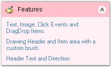
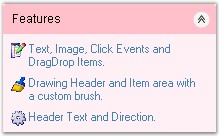

::: {style="DISPLAY: none"}
{#d2h_url_template}{#d2h_package_url style="WIDTH: 0px; DISPLAY: none; HEIGHT: 0px"}
:::

::::: {.d2h_secondary_topic style="PADDING-BOTTOM: 10pt; MARGIN: 0pt; PADDING-LEFT: 0pt; PADDING-RIGHT: 0pt; PADDING-TOP: 0pt"}
##### XPTaskBar- Image Settings {#xptaskbar--image-settings style="MARGIN-LEFT: 18pt; tab-stops: 18.0pt"}

[]{style="COLOR: #15428b"} 

This section discusses the image settings available in XPTaskBar.

[]{style="COLOR: #15428b"} 

Adding Images to the XPTaskBar Box Header

[]{style="COLOR: #4a5c8c; FONT-SIZE: 8pt"} 

We can add images to the header of the XPTaskBar Box using the **ImageList** control and some properties that are discussed below.

[]{style="COLOR: #15428b"} 

::: {align="center"}
  ------------------------ -----------------------------------------------------------------------
  XPTaskBar Box Property   Description
  HeaderImageList          Gets / sets the ImageList that will be used to draw the header image.
  HeaderImageIndex         Gets / sets the index into the HeaderImageList.
  ------------------------ -----------------------------------------------------------------------
:::

[]{style="COLOR: #15428b"} 

Drag and drop the ImageList control onto the form and add images to it using the **Image Collection Editor**. To include an image in the header, set the **HeaderImageList** property to an ImageList containing the image and also set the **HeaderImageIndex** property to refer to a specific image within the above list.

[]{style="COLOR: #15428b"} 

+-----------------------------------------------------------------------------------------------------------------------------------------------------------------------+
| **[\[C#\]]{style="FONT-FAMILY: 'Courier New'; COLOR: black"}**                                                                                                        |
|                                                                                                                                                                       |
| []{style="FONT-FAMILY: 'Courier New'; COLOR: black"}                                                                                                                  |
|                                                                                                                                                                       |
| [this]{style="FONT-FAMILY: 'Courier New'; COLOR: blue"}[.xpTaskBarBox1.ImageList = [this]{style="COLOR: blue"}.imageList1;]{style="FONT-FAMILY: 'Courier New'"}       |
|                                                                                                                                                                       |
| [this]{style="FONT-FAMILY: 'Courier New'; COLOR: blue"}[.xpTaskBarBox1.HeaderImageList = [this]{style="COLOR: blue"}.imageList2;]{style="FONT-FAMILY: 'Courier New'"} |
|                                                                                                                                                                       |
| [this]{style="FONT-FAMILY: 'Courier New'; COLOR: blue"}[.xpTaskBarBox1.HeaderImageIndex = 0;]{style="FONT-FAMILY: 'Courier New'"}                                     |
+-----------------------------------------------------------------------------------------------------------------------------------------------------------------------+

**[]{style="COLOR: #15428b"}** 

+------------------------------------------------------------------------------------------------------------------------------------------------------------------+
| **[\[VB.NET\]]{style="FONT-FAMILY: 'Courier New'; COLOR: black"}**                                                                                               |
|                                                                                                                                                                  |
| []{style="FONT-FAMILY: 'Courier New'; COLOR: black"}                                                                                                             |
|                                                                                                                                                                  |
| [Me]{style="FONT-FAMILY: 'Courier New'; COLOR: blue"}[.xpTaskBarBox1.ImageList = [Me]{style="COLOR: blue"}.imageList1]{style="FONT-FAMILY: 'Courier New'"}       |
|                                                                                                                                                                  |
| [Me]{style="FONT-FAMILY: 'Courier New'; COLOR: blue"}[.xpTaskBarBox1.HeaderImageList = [Me]{style="COLOR: blue"}.imageList2]{style="FONT-FAMILY: 'Courier New'"} |
|                                                                                                                                                                  |
| [Me]{style="FONT-FAMILY: 'Courier New'; COLOR: blue"}[.xpTaskBarBox1.HeaderImageIndex = 0]{style="FONT-FAMILY: 'Courier New'"}                                   |
+------------------------------------------------------------------------------------------------------------------------------------------------------------------+

[]{style="COLOR: #15428b"} 

{border="0"}

[]{style="COLOR: #15428b"} 

Figure 950: Image added to the TaskBar Box Header

**[]{style="COLOR: #15428b"}** 

Adding Images to XPTaskBar Items

[]{style="COLOR: #4a5c8c; FONT-SIZE: 8pt"} 

Images can be easily associated with the **ImageIndex** property of the XPTaskBar Items.

[]{style="COLOR: #15428b"} 

::: {align="center"}
  ------------------------- -------------------------------------------------------------------------------------------------
  XPTaskBar Item Property   Description
  ImageList                 Sets the ImageList that contains the images with which images of XPTaskBar Items will be drawn.
  ImageIndex                It sets the image index into the ImageList that contains images for the TaskBar Items.
  ------------------------- -------------------------------------------------------------------------------------------------
:::

[]{style="COLOR: #15428b"} 

The **ImageIndex** of the XPTaskBar Items can be specified in the **XPTaskBarItem Collection Editor**.

[]{style="COLOR: #15428b"} 

+-----------------------------------------------------------------------------------------------------------------------------------------------------------------+
| **[\[C#\]]{style="FONT-FAMILY: 'Courier New'; COLOR: black"}**                                                                                                  |
|                                                                                                                                                                 |
| []{style="FONT-FAMILY: 'Courier New'; COLOR: black"}                                                                                                            |
|                                                                                                                                                                 |
| [this]{style="FONT-FAMILY: 'Courier New'; COLOR: blue"}[.xpTaskBarBox1.ImageList = [this]{style="COLOR: blue"}.imageList1;]{style="FONT-FAMILY: 'Courier New'"} |
|                                                                                                                                                                 |
| [this]{style="FONT-FAMILY: 'Courier New'; COLOR: blue"}[.xpTaskBarBox1.[Items\[0\].]{style="COLOR: black"}ImageIndex = 0;]{style="FONT-FAMILY: 'Courier New'"}  |
|                                                                                                                                                                 |
| [this]{style="FONT-FAMILY: 'Courier New'; COLOR: blue"}[.xpTaskBarBox1.[Items\[1\].]{style="COLOR: black"}ImageIndex = 1;]{style="FONT-FAMILY: 'Courier New'"}  |
|                                                                                                                                                                 |
| [this]{style="FONT-FAMILY: 'Courier New'; COLOR: blue"}[.xpTaskBarBox1.[Items\[2\].]{style="COLOR: black"}ImageIndex = 2;]{style="FONT-FAMILY: 'Courier New'"}  |
+-----------------------------------------------------------------------------------------------------------------------------------------------------------------+

[]{style="COLOR: #4a5c8c; FONT-SIZE: 8pt"} 

+------------------------------------------------------------------------------------------------------------------------------------------------------------+
| **[\[VB.NET\]]{style="FONT-FAMILY: 'Courier New'; COLOR: black"}**                                                                                         |
|                                                                                                                                                            |
| []{style="FONT-FAMILY: 'Courier New'; COLOR: black"}                                                                                                       |
|                                                                                                                                                            |
| [Me]{style="FONT-FAMILY: 'Courier New'; COLOR: blue"}[.xpTaskBarBox1.ImageList = [Me]{style="COLOR: blue"}.imageList1]{style="FONT-FAMILY: 'Courier New'"} |
|                                                                                                                                                            |
| [Me]{style="FONT-FAMILY: 'Courier New'; COLOR: blue"}[.xpTaskBarBox1[.Items(0)]{style="COLOR: black"}ImageIndex = 0]{style="FONT-FAMILY: 'Courier New'"}   |
|                                                                                                                                                            |
| [Me]{style="FONT-FAMILY: 'Courier New'; COLOR: blue"}[.xpTaskBarBox1[.Items(1)]{style="COLOR: black"}ImageIndex = 1]{style="FONT-FAMILY: 'Courier New'"}   |
|                                                                                                                                                            |
| [Me]{style="FONT-FAMILY: 'Courier New'; COLOR: blue"}[.xpTaskBarBox1[.Items(2)]{style="COLOR: black"}ImageIndex = 2]{style="FONT-FAMILY: 'Courier New'"}   |
+------------------------------------------------------------------------------------------------------------------------------------------------------------+

[]{style="COLOR: #15428b"} 

{border="0"}

[]{style="COLOR: #15428b"} 

Figure 951: Images added to the TaskBar Items

 

 

[]{#p684} 

 

[]{#related-topics}
:::::
