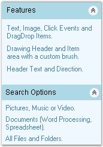
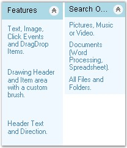
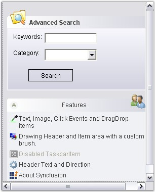

::: {style="DISPLAY: none"}
{#d2h_url_template}{#d2h_package_url style="WIDTH: 0px; DISPLAY: none; HEIGHT: 0px"}
:::

::::: {.d2h_secondary_topic style="PADDING-BOTTOM: 10pt; MARGIN: 0pt; PADDING-LEFT: 0pt; PADDING-RIGHT: 0pt; PADDING-TOP: 0pt"}
##### XPTaskBar Settings {#xptaskbar-settings style="MARGIN-LEFT: 18pt; tab-stops: 18.0pt"}

[]{style="COLOR: #15428b"} 

The behavior of the XPTaskBar can be controlled using the properties given below.

[]{style="COLOR: black; FONT-SIZE: 8pt"} 

###### 3.6.3.4.1.1      Behavior Settings {#behavior-settings style="MARGIN-LEFT: 18pt; tab-stops: 18.0pt"}

[]{style="COLOR: #15428b"} 

This section discusses the behavior settings of the XPTaskBar.

[]{style="COLOR: #15428b"} 

::: {align="center"}
+-------------------------------+-------------------------------------------------------------------------------------------------------------------------------------------------------------------------+------------------+------------------+--------------------------------------------------------+------------------------------------------------------------------------------------------------------------------+-------------------------------------------------------------------------------------------------------------------------------------------------------------------------------------------------------------------+
| XPTaskBar Property            | Description                                                                                                                                                             | Type of Property | Value It Accepts | Property Syntax                                        | Sub Properties                                                                                                   | More Information                                                                                                                                                                                                  |
+-------------------------------+-------------------------------------------------------------------------------------------------------------------------------------------------------------------------+------------------+------------------+--------------------------------------------------------+------------------------------------------------------------------------------------------------------------------+-------------------------------------------------------------------------------------------------------------------------------------------------------------------------------------------------------------------+
| AllowDrop                     | Gets / sets a value indicating whether the control can accept data that the user drags on it.                                                                           | Normal           | Boolean          | Public Property AllowDrop As Boolean                   |                                                                                                                  |                                                                                                                                                                                                                   |
|                               |                                                                                                                                                                         |                  |                  |                                                        |                                                                                                                  |                                                                                                                                                                                                                   |
|                               |                                                                                                                                                                         |                  | \[true/false\]   | this.xpTaskBar1.AllowDrop = true;                      | \-                                                                                                               | \-                                                                                                                                                                                                                |
+-------------------------------+-------------------------------------------------------------------------------------------------------------------------------------------------------------------------+------------------+------------------+--------------------------------------------------------+------------------------------------------------------------------------------------------------------------------+-------------------------------------------------------------------------------------------------------------------------------------------------------------------------------------------------------------------+
| AutoPersistStates             | Specifies whether to automatically persist the collapsed state of the child boxes.                                                                                      | Normal           | Boolean          | Public Property AutoPersistStates As Boolean           | No                                                                                                               | The expanded states of the child task bar boxes are cached as the users expands/collapses them, when this property is true. The cached state is persisted in the Isolated Storage, when this control is disposed. |
|                               |                                                                                                                                                                         |                  |                  |                                                        |                                                                                                                  |                                                                                                                                                                                                                   |
|                               |                                                                                                                                                                         |                  | \[true/false\]   | this.xpTaskBar1.AutoPersistStates = true;              |                                                                                                                  | If the child task bar boxes are added to this control, the saved state is reapplied on the task bar boxes, when the application loads again.                                                                      |
|                               |                                                                                                                                                                         |                  |                  |                                                        |                                                                                                                  |                                                                                                                                                                                                                   |
|                               |                                                                                                                                                                         |                  |                  |                                                        |                                                                                                                  | State is saved in the Isolated Storage of the system, scoped by the current user identity.                                                                                                                        |
|                               |                                                                                                                                                                         |                  |                  |                                                        |                                                                                                                  |                                                                                                                                                                                                                   |
|                               |                                                                                                                                                                         |                  |                  |                                                        |                                                                                                                  | You can control the persistent store and/or the time of persistence using LoadBoxExpandedStates() and SaveBoxExpandedStates() methods.                                                                            |
+-------------------------------+-------------------------------------------------------------------------------------------------------------------------------------------------------------------------+------------------+------------------+--------------------------------------------------------+------------------------------------------------------------------------------------------------------------------+-------------------------------------------------------------------------------------------------------------------------------------------------------------------------------------------------------------------+
| VerticalLayout                | Gets / sets the value which determines whether the TaskBar Boxes should be aligned vertically or horizontally in the XPTaskBar control. The default layout is Vertical. | Normal           | Boolean          | Public Property VerticalLayout As Boolean              |                                                                                                                  |                                                                                                                                                                                                                   |
|                               |                                                                                                                                                                         |                  |                  |                                                        |                                                                                                                  |                                                                                                                                                                                                                   |
|                               |                                                                                                                                                                         |                  | \[true/false\]   | this.xpTaskBar1.VerticalLayout = true;                 |                                                                                                                  |                                                                                                                                                                                                                   |
+-------------------------------+-------------------------------------------------------------------------------------------------------------------------------------------------------------------------+------------------+------------------+--------------------------------------------------------+------------------------------------------------------------------------------------------------------------------+-------------------------------------------------------------------------------------------------------------------------------------------------------------------------------------------------------------------+
| ColWidthOnHorizontalAlignment | Specifies the width for each column in the Horizontal Layout mode. The  default value is 100. VerticalLayout property must be set to \'False\'.                         | Normal           | Integer value    | public int ColWidthOnHorizontalAlignment { get; set; } | Yes. Set this property as false to make changes on Horizontal alignment. this.xpTaskBar1.VerticalLayout = false; |                                                                                                                                                                                                                   |
|                               |                                                                                                                                                                         |                  |                  |                                                        |                                                                                                                  |                                                                                                                                                                                                                   |
|                               |                                                                                                                                                                         |                  |                  | this.xpTaskBar1.ColWidthOnHorizontalAlignment = 100;   |                                                                                                                  |                                                                                                                                                                                                                   |
+-------------------------------+-------------------------------------------------------------------------------------------------------------------------------------------------------------------------+------------------+------------------+--------------------------------------------------------+------------------------------------------------------------------------------------------------------------------+-------------------------------------------------------------------------------------------------------------------------------------------------------------------------------------------------------------------+
:::

[]{style="COLOR: #15428b"} 

[]{style="COLOR: #15428b"} 

[]{style="COLOR: #15428b"} 

+-----------------------------------------------------------------------------------------------------------------------------------------------------------+
| **[\[C#\]]{style="FONT-FAMILY: 'Courier New'; COLOR: black"}**                                                                                            |
|                                                                                                                                                           |
| []{style="FONT-FAMILY: 'Courier New'; COLOR: black"}                                                                                                      |
|                                                                                                                                                           |
| [this]{style="FONT-FAMILY: 'Courier New'; COLOR: blue"}[.xpTaskBar1.AllowDrop = [true]{style="COLOR: blue"};]{style="FONT-FAMILY: 'Courier New'"}         |
|                                                                                                                                                           |
| [this]{style="FONT-FAMILY: 'Courier New'; COLOR: blue"}[.xpTaskBar1.AutoPersistStates = [true]{style="COLOR: blue"};]{style="FONT-FAMILY: 'Courier New'"} |
|                                                                                                                                                           |
| [this]{style="FONT-FAMILY: 'Courier New'; COLOR: blue"}[.xpTaskBar1.ColWidthOnHorizontalAlignment = 100;]{style="FONT-FAMILY: 'Courier New'"}             |
|                                                                                                                                                           |
| [this]{style="FONT-FAMILY: 'Courier New'; COLOR: blue"}[.xpTaskBar1.VerticalLayout = true;]{style="FONT-FAMILY: 'Courier New'"}                           |
+-----------------------------------------------------------------------------------------------------------------------------------------------------------+

[]{style="COLOR: #4a5c8c; FONT-SIZE: 8pt"} 

+--------------------------------------------------------------------------------------------------------------------------------------------------------+
| **[\[VB.NET\]]{style="FONT-FAMILY: 'Courier New'; COLOR: black"}**                                                                                     |
|                                                                                                                                                        |
| []{style="FONT-FAMILY: 'Courier New'; COLOR: black"}                                                                                                   |
|                                                                                                                                                        |
| [Me]{style="FONT-FAMILY: 'Courier New'; COLOR: blue"}[.xpTaskBar1.AllowDrop = [True]{style="COLOR: blue"}]{style="FONT-FAMILY: 'Courier New'"}         |
|                                                                                                                                                        |
| [Me]{style="FONT-FAMILY: 'Courier New'; COLOR: blue"}[.xpTaskBar1.AutoPersistStates = [True]{style="COLOR: blue"}]{style="FONT-FAMILY: 'Courier New'"} |
|                                                                                                                                                        |
| [Me]{style="FONT-FAMILY: 'Courier New'; COLOR: blue"}[.xpTaskBar1.ColWidthOnHorizontalAlignment = 100]{style="FONT-FAMILY: 'Courier New'"}             |
|                                                                                                                                                        |
| [Me]{style="FONT-FAMILY: 'Courier New'; COLOR: blue"}[.xpTaskBar1.VerticalLayout = [True]{style="COLOR: blue"}]{style="FONT-FAMILY: 'Courier New'"}    |
+--------------------------------------------------------------------------------------------------------------------------------------------------------+

[]{style="COLOR: #15428b"} 

{border="0"}

[]{style="COLOR: #15428b"} 

Figure 938: Vertical Layout of XPTaskBar

**[]{style="COLOR: #15428b"}** 

{border="0"}

**[]{style="COLOR: #15428b"}** 

Figure 939: Horizontal Layout of XPTaskBar with

ColumnWidthOnHorizontalAlignment property set to \"100\"

 

 

[]{#p672} 

 

###### 3.6.3.4.1.2      Scroll Settings {#scroll-settings style="MARGIN-LEFT: 18pt; tab-stops: 18.0pt"}

[]{style="COLOR: #15428b"} 

Vertical scrollbar will be automatically added to the XPTaskBar when the TaskBarBoxes are placed outside the TaskBar\'s client area, provided the XPTaskBar is in the Vertical Layout mode.

 

In the Horizontal Layout mode, the horizontal scrollbar appears on setting the [[ColWidthOnHorizontalLayout]{.UGHyperlink}](../../../../../../../../Documents%20and%20Settings/sylviap/Desktop/Tools%20-%20Part%202.docx#_Behavior_Settings)[ ]{.UGHyperlink}property to large values.

[]{style="COLOR: #15428b"} 

::: {align="center"}
  -------------------- --------------------------------------------------------------------------------------------------------------------------------------
  XPTaskBar Property   Description
  AutoScroll           Specifies the value indicating whether a container allows the user to scroll any control placed outside of it\'s visible boundaries.
  AutoScrollMargin     Gets / sets the size of the AutoScroll margin.
  AutoScrollMinSize    Gets /sets the minimum size of the AutoScroll.
  -------------------- --------------------------------------------------------------------------------------------------------------------------------------
:::

[]{style="COLOR: #15428b"} 

+------------------------------------------------------------------------------------------------------------------------------------------------------------------------------------+
| **[\[C#\]]{style="FONT-FAMILY: 'Courier New'; COLOR: black"}**                                                                                                                     |
|                                                                                                                                                                                    |
| []{style="FONT-FAMILY: 'Courier New'; COLOR: black"}                                                                                                                               |
|                                                                                                                                                                                    |
| [this]{style="FONT-FAMILY: 'Courier New'; COLOR: blue"}[.xpTaskBar1.AutoScroll = [true]{style="COLOR: blue"};]{style="FONT-FAMILY: 'Courier New'"}                                 |
|                                                                                                                                                                                    |
| [this]{style="FONT-FAMILY: 'Courier New'; COLOR: blue"}[.xpTaskBar1.AutoScrollMargin = [new]{style="COLOR: blue"} System.Drawing.Size(5, 5);]{style="FONT-FAMILY: 'Courier New'"}  |
|                                                                                                                                                                                    |
| [this]{style="FONT-FAMILY: 'Courier New'; COLOR: blue"}[.xpTaskBar1.AutoScrollMinSize = [new]{style="COLOR: blue"} System.Drawing.Size(3, 3);]{style="FONT-FAMILY: 'Courier New'"} |
+------------------------------------------------------------------------------------------------------------------------------------------------------------------------------------+

[]{style="COLOR: #4a5c8c; FONT-SIZE: 8pt"} 

+---------------------------------------------------------------------------------------------------------------------------------------------------------------------------------+
| **[\[VB.NET\]]{style="FONT-FAMILY: 'Courier New'; COLOR: black"}**                                                                                                              |
|                                                                                                                                                                                 |
| []{style="FONT-FAMILY: 'Courier New'; COLOR: black"}                                                                                                                            |
|                                                                                                                                                                                 |
| [Me]{style="FONT-FAMILY: 'Courier New'; COLOR: blue"}[.xpTaskBar1.AutoScroll = [True]{style="COLOR: blue"}]{style="FONT-FAMILY: 'Courier New'"}                                 |
|                                                                                                                                                                                 |
| [Me]{style="FONT-FAMILY: 'Courier New'; COLOR: blue"}[.xpTaskBar1.AutoScrollMargin = [New]{style="COLOR: blue"} System.Drawing.Size(5, 5)]{style="FONT-FAMILY: 'Courier New'"}  |
|                                                                                                                                                                                 |
| [Me]{style="FONT-FAMILY: 'Courier New'; COLOR: blue"}[.xpTaskBar1.AutoScrollMinSize = [New]{style="COLOR: blue"} System.Drawing.Size(3, 3)]{style="FONT-FAMILY: 'Courier New'"} |
+---------------------------------------------------------------------------------------------------------------------------------------------------------------------------------+

[]{style="COLOR: #15428b"} 

The following screen shot illustrates the above settings.

[]{style="COLOR: #15428b"} 

{border="0"}

[]{style="COLOR: #15428b"} 

Figure 940: AutoScroll set for the XPTaskBar

 

 

[]{#p673} 

 

[]{#related-topics}
:::::
