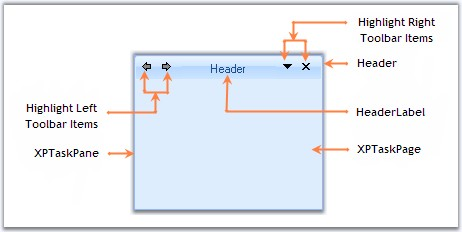

::: {style="DISPLAY: none"}
{#d2h_url_template}{#d2h_package_url style="WIDTH: 0px; DISPLAY: none; HEIGHT: 0px"}
:::

::: {.d2h_secondary_topic style="PADDING-BOTTOM: 10pt; MARGIN: 0pt; PADDING-LEFT: 0pt; PADDING-RIGHT: 0pt; PADDING-TOP: 0pt"}
#### XPTaskPane {#xptaskpane style="MARGIN-LEFT: 18pt; tab-stops: 18.0pt"}

[]{style="COLOR: #15428b"} 

Segments of an XPTaskPane Control

**[]{style="COLOR: #15428b"}** 

[·      ]{style="FONT-FAMILY: Symbol"}The **Header** of the XPTaskPane contains the **Header Label** representing the title of each page.

[]{style="COLOR: #15428b"} 

[·      ]{style="FONT-FAMILY: Symbol"}The **HeaderLeftToolbar** represents the toolbar items placed on top left corner of the task pane header. It has Left and Right navigating button items which can be accessed using **HeaderLeftToolbar.Items\[0\]** and **HeaderLeftToolbar.Items\[1\]** respectively.

[]{style="COLOR: #15428b"} 

[·      ]{style="FONT-FAMILY: Symbol"}The **HeaderRightToolbar** represents the toolbar items placed on top right corner of the task pane header. It has DropDownMenu and Close button items which can be accessed using **HeaderRightToolbar.Items\[0\]** and **HeaderRightToolbar.Items\[1\]** respectively.

[]{style="COLOR: #15428b"} 

[·      ]{style="FONT-FAMILY: Symbol"}The PageContainer of the XPTaskPane hosts the XPTaskPages.

[]{style="COLOR: #15428b"} 

{border="0"}

**[]{style="COLOR: #15428b"}** 

Figure 1242: Sections of XP Task Pane

**[]{style="COLOR: #15428b"}** 

See Also

[]{style="COLOR: #15428b"} 

[[Creating a Simple XP TaskPane]{.UGHyperlink}](../../../../../../../../Documents%20and%20Settings/sylviap/Desktop/Tools%20-%20Part%202.docx#_Creating_a_Simple)[]{.UGHyperlink}

 

 

 

 

[]{#related-topics}
:::
