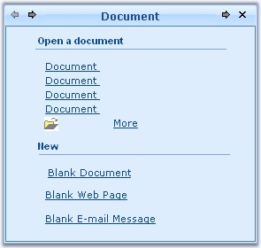
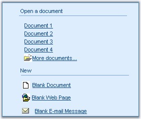
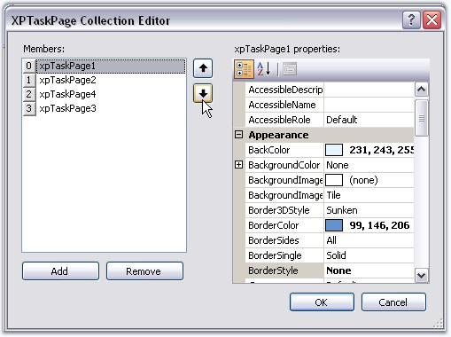
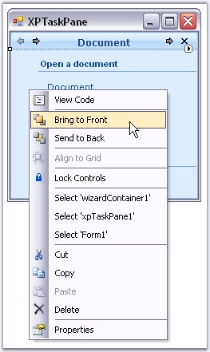
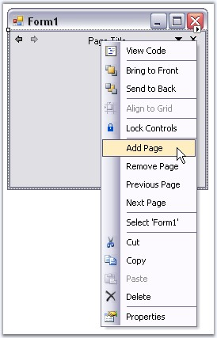

::: {style="DISPLAY: none"}
{#d2h_url_template}{#d2h_package_url style="WIDTH: 0px; DISPLAY: none; HEIGHT: 0px"}
:::

::::::: {.d2h_secondary_topic style="PADDING-BOTTOM: 10pt; MARGIN: 0pt; PADDING-LEFT: 0pt; PADDING-RIGHT: 0pt; PADDING-TOP: 0pt"}
##### XPTaskPane {#xptaskpane style="MARGIN-LEFT: 18pt; tab-stops: 18.0pt"}

**[]{style="COLOR: #4a5c8c"}** 

XPTaskPane has a TaskPanePageContainer which hosts the Task pages. Any number of controls can added to the Task pages and can be customized. Properties which controls the appearance of the Task pages are discussed in this section.

 

**Page Title and Layout Name**

 

The title text for an XPTaskPage can be edited using **XPTaskPage.Title** property.

 

::: {align="center"}
  -------------- ---------------------------------------------------------------------------------------------------------------------------------------------------------------------------------------------------
  Property       Description
  Title          Sets the title text for Task page.
  SelectedPage   Specifies the selected Task page.
  LayoutName     The individual Task page is identified using its LayoutName in the SelectedPage property. By default the LayoutName is set as Card1, for the first page added, Card2 for the next page and so on.
  -------------- ---------------------------------------------------------------------------------------------------------------------------------------------------------------------------------------------------
:::

[]{style="COLOR: #15428b"} 

+--------------------------------------------------------------------------------------------------------------------------------------------------------------------------------------------------+
| **[\[]{style="FONT-FAMILY: 'Courier New'; COLOR: black"}[C#\]]{style="FONT-FAMILY: 'Courier New'; COLOR: black"}[]{style="FONT-FAMILY: 'Courier New'; COLOR: black"}**                           |
|                                                                                                                                                                                                  |
| **[]{style="FONT-FAMILY: 'Courier New'; COLOR: black"}**                                                                                                                                         |
|                                                                                                                                                                                                  |
| [this]{style="FONT-FAMILY: 'Courier New'; COLOR: blue"}[.xpTaskPage1.Title = [\"XPTaskPane Header\"]{style="COLOR: maroon"};]{style="FONT-FAMILY: 'Courier New'"}                                |
|                                                                                                                                                                                                  |
| [this]{style="FONT-FAMILY: 'Courier New'; COLOR: blue"}[.xpTaskPage1.LayoutName = [\"Card1\"]{style="COLOR: maroon"};]{style="FONT-FAMILY: 'Courier New'"}[]{style="FONT-FAMILY: 'Courier New'"} |
+--------------------------------------------------------------------------------------------------------------------------------------------------------------------------------------------------+

[]{#p1071}[]{style="COLOR: #15428b"} 

+--------------------------------------------------------------------------------------------------------------------------------------------------------------------------------------------------------------+
| **[\[VB.NET\]]{style="FONT-FAMILY: 'Courier New'; COLOR: black"}**                                                                                                                                           |
|                                                                                                                                                                                                              |
| **[]{style="FONT-FAMILY: 'Courier New'; COLOR: black"}**                                                                                                                                                     |
|                                                                                                                                                                                                              |
| [Me]{style="FONT-FAMILY: 'Courier New'; COLOR: blue"}[.xpTaskPage1.Title = [\"XPTaskPane Header\"]{style="COLOR: maroon"}]{style="FONT-FAMILY: 'Courier New'"}                                               |
|                                                                                                                                                                                                              |
| [Me]{style="FONT-FAMILY: 'Courier New'; COLOR: blue"}[.xpTaskPage1.LayoutName = [\"Card1\"]{style="COLOR: maroon"}]{style="FONT-FAMILY: 'Courier New'"}[]{style="FONT-FAMILY: 'Courier New'; COLOR: maroon"} |
+--------------------------------------------------------------------------------------------------------------------------------------------------------------------------------------------------------------+

[]{style="COLOR: #15428b"} 

{border="0"}

[]{style="COLOR: #15428b"} 

Figure 1250: XPTaskPage Title = \"XPTaskPane Header\"

**[]{style="COLOR: #15428b"}** 

TaskPage Border

 

The below properties controls the border settings for a Task page.[]{#p1072}

[]{style="COLOR: #15428b"} 

::: {align="center"}
+-----------------------------------+----------------------------------------------------------------------------------------------------------------------------+
| XPTaskPage Property               | Description                                                                                                                |
+-----------------------------------+----------------------------------------------------------------------------------------------------------------------------+
| BorderStyle                       | Specifies the border style for Task page. The available styles are Fixed3D and FixedSingle.                                |
+-----------------------------------+----------------------------------------------------------------------------------------------------------------------------+
| Border3DStyle                     | Specifies the 3D border style for Task page. The available styles are,                                                     |
|                                   |                                                                                                                            |
|                                   | [·      ]{style="FONT-FAMILY: Symbol"}                                                                                     |
|                                   |                                                                                                                            |
|                                   | [·      ]{style="FONT-FAMILY: Symbol"}RaisedOuter,                                                                         |
|                                   |                                                                                                                            |
|                                   | [·      ]{style="FONT-FAMILY: Symbol"}SunkenOuter,                                                                         |
|                                   |                                                                                                                            |
|                                   | [·      ]{style="FONT-FAMILY: Symbol"}RaisedInner,                                                                         |
|                                   |                                                                                                                            |
|                                   | [·      ]{style="FONT-FAMILY: Symbol"}Raised,                                                                              |
|                                   |                                                                                                                            |
|                                   | [·      ]{style="FONT-FAMILY: Symbol"}Etched,                                                                              |
|                                   |                                                                                                                            |
|                                   | [·      ]{style="FONT-FAMILY: Symbol"}SunkenInner,                                                                         |
|                                   |                                                                                                                            |
|                                   | [·      ]{style="FONT-FAMILY: Symbol"}Bump,                                                                                |
|                                   |                                                                                                                            |
|                                   | [·      ]{style="FONT-FAMILY: Symbol"}Sunken,                                                                              |
|                                   |                                                                                                                            |
|                                   | [·      ]{style="FONT-FAMILY: Symbol"}Adjust and                                                                           |
|                                   |                                                                                                                            |
|                                   | [·      ]{style="FONT-FAMILY: Symbol"}Flat.                                                                                |
+-----------------------------------+----------------------------------------------------------------------------------------------------------------------------+
| BorderColor                       | Sets the border color for the Task page.                                                                                   |
+-----------------------------------+----------------------------------------------------------------------------------------------------------------------------+
| BorderSides                       | Specifies the sides of the control which should have border.                                                               |
+-----------------------------------+----------------------------------------------------------------------------------------------------------------------------+
| BorderSingle                      | Specifies the 2D Border style for the Task page when BorderStyle property is set to FixedSingle. The available styles are, |
|                                   |                                                                                                                            |
|                                   |                                                                                                                            |
|                                   |                                                                                                                            |
|                                   | [·      ]{style="FONT-FAMILY: Symbol"}Dotted,                                                                              |
|                                   |                                                                                                                            |
|                                   | [·      ]{style="FONT-FAMILY: Symbol"}Dashed,                                                                              |
|                                   |                                                                                                                            |
|                                   | [·      ]{style="FONT-FAMILY: Symbol"}Solid,                                                                               |
|                                   |                                                                                                                            |
|                                   | [·      ]{style="FONT-FAMILY: Symbol"}Inset and                                                                            |
|                                   |                                                                                                                            |
|                                   | [·      ]{style="FONT-FAMILY: Symbol"}Outset.                                                                              |
+-----------------------------------+----------------------------------------------------------------------------------------------------------------------------+
:::

**[]{style="COLOR: #4a5c8c"}** 

+-----------------------------------------------------------------------------------------------------------------------------------------------------------------------------------------------------------------------------------+
| **[\[C#\]]{style="FONT-FAMILY: 'Courier New'; COLOR: black"}**                                                                                                                                                                    |
|                                                                                                                                                                                                                                   |
| **[]{style="FONT-FAMILY: 'Courier New'; COLOR: black"}**                                                                                                                                                                          |
|                                                                                                                                                                                                                                   |
| [this]{style="FONT-FAMILY: 'Courier New'; COLOR: blue"}[.xpTaskPage1.BorderColor = System.Drawing.[Color]{style="COLOR: teal"}.SteelBlue]{style="FONT-FAMILY: 'Courier New'"}                                                     |
|                                                                                                                                                                                                                                   |
| [this]{style="FONT-FAMILY: 'Courier New'; COLOR: blue"}[.xpTaskPage1.BorderStyle = System.Windows.Forms.[BorderStyle]{style="COLOR: teal"}.FixedSingle]{style="FONT-FAMILY: 'Courier New'"}[]{style="FONT-FAMILY: 'Courier New'"} |
+-----------------------------------------------------------------------------------------------------------------------------------------------------------------------------------------------------------------------------------+

[]{style="COLOR: #15428b"} 

+---------------------------------------------------------------------------------------------------------------------------------------------------------------------------------------------------------------------------------+
| **[\[]{style="FONT-FAMILY: 'Courier New'; COLOR: black"}[VB.NET\]]{style="FONT-FAMILY: 'Courier New'; COLOR: black"}[]{style="FONT-FAMILY: 'Courier New'; COLOR: black"}**                                                      |
|                                                                                                                                                                                                                                 |
| **[]{style="FONT-FAMILY: 'Courier New'; COLOR: black"}**                                                                                                                                                                        |
|                                                                                                                                                                                                                                 |
| [Me]{style="FONT-FAMILY: 'Courier New'; COLOR: blue"}[.xpTaskPage1.BorderColor = System.Drawing.[Color]{style="COLOR: teal"}.SteelBlue]{style="FONT-FAMILY: 'Courier New'"}                                                     |
|                                                                                                                                                                                                                                 |
| [Me]{style="FONT-FAMILY: 'Courier New'; COLOR: blue"}[.xpTaskPage1.BorderStyle = System.Windows.Forms.[BorderStyle]{style="COLOR: teal"}.FixedSingle]{style="FONT-FAMILY: 'Courier New'"}[]{style="FONT-FAMILY: 'Courier New'"} |
+---------------------------------------------------------------------------------------------------------------------------------------------------------------------------------------------------------------------------------+

[]{style="COLOR: #15428b"} 

{border="0"}

 

Figure 1251: 2DBorder, Solid Style; BorderColor = \"SteelBlue\"

**[]{style="COLOR: #15428b"}** 

XPTaskPage Foreground

 

Font style and fore color of the Task pages can be set using XPTaskPage.Font and XPTaskPage.ForeColor properties.

[]{style="COLOR: #15428b"} 

+------------------------------------------------------------------------------------------------------------------------------------------------------------------------------------------------------------------------------------+
| **[\[]{style="FONT-FAMILY: 'Courier New'; COLOR: black"}[C#\]]{style="FONT-FAMILY: 'Courier New'; COLOR: black"}[]{style="FONT-FAMILY: 'Courier New'; COLOR: black"}**                                                             |
|                                                                                                                                                                                                                                    |
| **[]{style="FONT-FAMILY: 'Courier New'; COLOR: black"}**                                                                                                                                                                           |
|                                                                                                                                                                                                                                    |
| [this]{style="FONT-FAMILY: 'Courier New'; COLOR: blue"}[.xpTaskPage1.Font = [new]{style="COLOR: blue"} System.Drawing.[Font]{style="COLOR: teal"}([\"Arial\"]{style="COLOR: maroon"}, 8.25F);]{style="FONT-FAMILY: 'Courier New'"} |
|                                                                                                                                                                                                                                    |
| [this]{style="FONT-FAMILY: 'Courier New'; COLOR: blue"}[.xpTaskPage1.ForeColor = System.Drawing.[Color]{style="COLOR: teal"}.SteelBlue;]{style="FONT-FAMILY: 'Courier New'"}[]{style="FONT-FAMILY: 'Courier New'"}                 |
+------------------------------------------------------------------------------------------------------------------------------------------------------------------------------------------------------------------------------------+

[]{#p1073}[]{style="COLOR: #15428b"} 

+---------------------------------------------------------------------------------------------------------------------------------------------------------------------------------------------------------------------------------+
| **[\[VB.NET\]]{style="FONT-FAMILY: 'Courier New'; COLOR: black"}**                                                                                                                                                              |
|                                                                                                                                                                                                                                 |
| **[]{style="FONT-FAMILY: 'Courier New'; COLOR: black"}**                                                                                                                                                                        |
|                                                                                                                                                                                                                                 |
| [Me]{style="FONT-FAMILY: 'Courier New'; COLOR: blue"}[.xpTaskPage1.Font = [New]{style="COLOR: blue"} System.Drawing.[Font]{style="COLOR: teal"}([\"Arial\"]{style="COLOR: maroon"}, 8.25F)]{style="FONT-FAMILY: 'Courier New'"} |
|                                                                                                                                                                                                                                 |
| [Me]{style="FONT-FAMILY: 'Courier New'; COLOR: blue"}[.xpTaskPage1.ForeColor = System.Drawing.[Color]{style="COLOR: teal"}.SteelBlue]{style="FONT-FAMILY: 'Courier New'"}[]{style="FONT-FAMILY: 'Courier New'"}                 |
+---------------------------------------------------------------------------------------------------------------------------------------------------------------------------------------------------------------------------------+

[]{style="COLOR: #15428b"} 

{border="0"}

[]{style="COLOR: #15428b"} 

Figure 1252: XPTaskPage FontStyle = \"Arial, 8\"

**[]{style="COLOR: #15428b"}** 

See Also

[]{style="COLOR: #15428b"} 

[[Reordering XPTaskPage]{.UGHyperlink}](../../../../../../../../Documents%20and%20Settings/sylviap/Desktop/Tools%20-%20Part%202.docx#_Reordering_XPTaskPage)[]{.UGHyperlink}

 

 

###### []{#_Reordering_XPTaskPage}3.13.2.4.1.1    Reordering XPTaskPage {#reordering-xptaskpage style="MARGIN-LEFT: 18pt; tab-stops: 18.0pt"}

**[]{style="COLOR: #4a5c8c"}** 

When the end user adds a page to the XPTaskPane control, the order of the page is decided, as the page is added. They can be reordered using any one of the below methods in the designer.

[]{style="COLOR: #15428b"} 

[·      ]{style="FONT-FAMILY: Symbol"}Through XPTaskPage Collection Editor.

[]{style="COLOR: #15428b"} 

{border="0"}

***[]{style="COLOR: #15428b"}*** 

Figure 1253: Reordering Pages Using XPTaskPage Collection Editor

**[]{style="COLOR: #15428b"}** 

[·      ]{style="FONT-FAMILY: Symbol"}Select a page in the designer and choose the \'Bring To Front\' or \'Send To Back\' verb which will move the page to the beginning of the collection or to the end of the collection, respectively.

[]{style="FONT-SIZE: 8pt"} 

{border="0"}

[]{style="COLOR: #15428b"} 

Figure 1254: Reordering Pages Using \'Bring To Front\' and \'Send To Back\' Options

**[]{style="COLOR: #15428b"}** 

Going to Next Page or Previous Page

[]{style="COLOR: #15428b"} 

[·      ]{style="FONT-FAMILY: Symbol"}Right Click a page in the designer and choose the \'Previous Page\' or \'Next Page\' verb which will show you the page, which is before the current page or the page which is after the current page. These options can also be accessed through smart tag and property grid commands.

[]{style="COLOR: #15428b"} 

{border="0"}

Figure 1255: Next and Previous Page Option in Context Menu

**[]{style="COLOR: #15428b"}** 

Page Order at RunTime

 

XPTaskPage allows you to set the next or the previous page to the currently selected page through the NextPage and PreviousPage properties.

[]{style="COLOR: #15428b"} 

::: {align="center"}
  --------------------- --------------------------------------------
  XPTaskPage Property   Description
  NextPage              It sets the next page for XP TaskPane.
  PreviousPage          It sets the previous page for XP TaskPane.
  --------------------- --------------------------------------------
:::

**[]{style="COLOR: #4a5c8c"}** 

::: {style="BORDER-BOTTOM: windowtext 1pt solid; BORDER-LEFT: medium none; PADDING-BOTTOM: 1pt; MARGIN: 9pt 0pt 9pt 18pt; PADDING-LEFT: 0pt; PADDING-RIGHT: 0pt; BORDER-TOP: windowtext 1pt solid; BORDER-RIGHT: medium none; PADDING-TOP: 1pt"}
[{border="0"}]{style="COLOR: #4a5c8c"} Note: The TaskPane follows this order at run time.
:::

[]{style="COLOR: #15428b"} 

+---------------------------------------------------------------------------------------------------------------------------------------------------------------------------------------------------------+
| **[\[C#\]]{style="FONT-FAMILY: 'Courier New'; COLOR: black"}**                                                                                                                                          |
|                                                                                                                                                                                                         |
| []{style="COLOR: #15428b"}                                                                                                                                                                              |
|                                                                                                                                                                                                         |
| [this]{style="FONT-FAMILY: 'Courier New'; COLOR: blue"}[.xpTaskPage2.NextPage = [this]{style="COLOR: blue"}.xpTaskPage3;]{style="FONT-FAMILY: 'Courier New'"}                                           |
|                                                                                                                                                                                                         |
| [this]{style="FONT-FAMILY: 'Courier New'; COLOR: blue"}[.xpTaskPage2.PreviousPage = [this]{style="COLOR: blue"}.xpTaskPage1;]{style="FONT-FAMILY: 'Courier New'"}[]{style="FONT-FAMILY: 'Courier New'"} |
+---------------------------------------------------------------------------------------------------------------------------------------------------------------------------------------------------------+

[]{#p1074}**[]{style="COLOR: #4a5c8c"}** 

+----------------------------------------------------------------------------------------------------------------------------------------------------------------------------------------------------+
| **[\[VB.NET\]]{style="FONT-FAMILY: 'Courier New'; COLOR: black"}**                                                                                                                                 |
|                                                                                                                                                                                                    |
| []{style="FONT-FAMILY: 'Courier New'"}                                                                                                                                                             |
|                                                                                                                                                                                                    |
| [Me]{style="FONT-FAMILY: 'Courier New'; COLOR: blue"}[.xpTaskPage2.NextPage = [Me]{style="COLOR: blue"}.xpTaskPage3]{style="FONT-FAMILY: 'Courier New'"}                                           |
|                                                                                                                                                                                                    |
| [Me]{style="FONT-FAMILY: 'Courier New'; COLOR: blue"}[.xpTaskPage2.PreviousPage = [Me]{style="COLOR: blue"}.xpTaskPage1]{style="FONT-FAMILY: 'Courier New'"}[]{style="FONT-FAMILY: 'Courier New'"} |
+----------------------------------------------------------------------------------------------------------------------------------------------------------------------------------------------------+

 

 

 

[]{#related-topics}
:::::::
