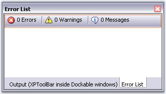

::: {style="DISPLAY: none"}
{#d2h_url_template}{#d2h_package_url style="WIDTH: 0px; DISPLAY: none; HEIGHT: 0px"}
:::

::: {.d2h_secondary_topic style="PADDING-BOTTOM: 10pt; MARGIN: 0pt; PADDING-LEFT: 0pt; PADDING-RIGHT: 0pt; PADDING-TOP: 0pt"}
#### XPToolbar {#xptoolbar style="tab-stops: 0pt"}

[]{style="COLOR: #15428b"} 

An **XP Toolbar** is a toolbar-like control with look-and-feel of the XP Menus toolbar. It supports a list of BarItems which can be added to it. It is a stand-alone control that can also be used in the absence of a BarManager also.

[]{style="COLOR: #15428b"} 

{border="0"}

[]{style="COLOR: #15428b"} 

Figure 805: XPToolbar with Bar Items in a Floating Window

[       ]{style="COLOR: #15428b"}

See Also

More:

[ ]{#related-topics}

[{border="0" align="absMiddle"}Adding and Filling the XPToolbar](ms-xhelp:///?Id=75401a94-fb78-45a3-8cef-a4c5bb6607a2){style="TEXT-DECORATION: none"}

[{border="0" align="absMiddle"}XPToolbar Properties](ms-xhelp:///?Id=046265d9-dd59-48a6-b66e-27899b58584f){style="TEXT-DECORATION: none"}
:::
