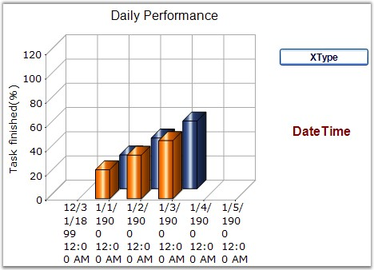

::: {style="DISPLAY: none"}
{#d2h_url_template}{#d2h_package_url style="WIDTH: 0px; DISPLAY: none; HEIGHT: 0px"}
:::

:::: {.d2h_secondary_topic style="PADDING-BOTTOM: 10pt; MARGIN: 0pt; PADDING-LEFT: 0pt; PADDING-RIGHT: 0pt; PADDING-TOP: 0pt"}
#### XType {#xtype style="tab-stops: 0pt"}

 

Returns the x value type that is being rendered. It is a read-only property.

 

::: {align="center"}
+-------------------------------------+--------------------------------------------------------------------------------------+
| **Details**                                                                                                                |
+-------------------------------------+--------------------------------------------------------------------------------------+
| **Possible Values**                 | [·      ]{style="FONT-FAMILY: Symbol"}**Double** - Specifies Double values           |
|                                     |                                                                                      |
|                                     | [·      ]{style="FONT-FAMILY: Symbol"}**DateTime** - Specifies Date and Time values  |
|                                     |                                                                                      |
|                                     | [·      ]{style="FONT-FAMILY: Symbol"}**Logarithmic** - Specifies Logarithmic values |
|                                     |                                                                                      |
|                                     | [·      ]{style="FONT-FAMILY: Symbol"}**Custom** - Specifies Custom values           |
+-------------------------------------+--------------------------------------------------------------------------------------+
| **Default Value    **               | **Double**                                                                           |
+-------------------------------------+--------------------------------------------------------------------------------------+
| **2D / 3D Limitations**             | No                                                                                   |
+-------------------------------------+--------------------------------------------------------------------------------------+
| **Applies to Chart Element**        | Any Series                                                                           |
+-------------------------------------+--------------------------------------------------------------------------------------+
| **Applies to Chart Types**          | All Chart Types                                                                      |
+-------------------------------------+--------------------------------------------------------------------------------------+
:::

 

Here is sample code snippet using XType.

 

+---------------------------------------------------------------------------------------------------------------------------------------------------------------------------------------------------------------------------------+
| **[\[C#\]]{style="FONT-FAMILY: 'Courier New'; COLOR: black"}**                                                                                                                                                                  |
|                                                                                                                                                                                                                                 |
| **[]{style="FONT-FAMILY: 'Courier New'; COLOR: black"}**                                                                                                                                                                        |
|                                                                                                                                                                                                                                 |
| [autoLabel1.Text = ]{style="FONT-FAMILY: 'Courier New'; COLOR: black"}[this]{style="FONT-FAMILY: 'Courier New'; COLOR: blue"}[.chartControl1.Series\[0\].XType.ToString(); ]{style="FONT-FAMILY: 'Courier New'; COLOR: black"}  |
+---------------------------------------------------------------------------------------------------------------------------------------------------------------------------------------------------------------------------------+

 

+-------------------------------------------------------------------------------------------------------------------------------------------------------------------------------------------------------------------------------------------------------------------------------------+
| **[\[VB.NET\]]{style="FONT-FAMILY: 'Courier New'; COLOR: black"}**                                                                                                                                                                                                                  |
|                                                                                                                                                                                                                                                                                     |
| **[]{style="FONT-FAMILY: 'Courier New'; COLOR: black"}**                                                                                                                                                                                                                            |
|                                                                                                                                                                                                                                                                                     |
| [Private]{style="FONT-FAMILY: 'Courier New'; COLOR: blue"}[ autoLabel1.Text = ]{style="FONT-FAMILY: 'Courier New'; COLOR: black"}[Me]{style="FONT-FAMILY: 'Courier New'; COLOR: blue"}[.chartControl1.Series(0).XType.ToString()]{style="FONT-FAMILY: 'Courier New'; COLOR: black"} |
+-------------------------------------------------------------------------------------------------------------------------------------------------------------------------------------------------------------------------------------------------------------------------------------+

 

{border="0"}

 

Figure 231: Get the X Value Type that is being Rendered

**[]{style="FONT-FAMILY: 'Courier New'; COLOR: black"}** 

See Also

 

[]{style="COLOR: black"}

[[Chart Types]{style="COLOR: blue"}]{.UGHyperlink}

 

[]{#p167} 

[]{#related-topics}
::::
