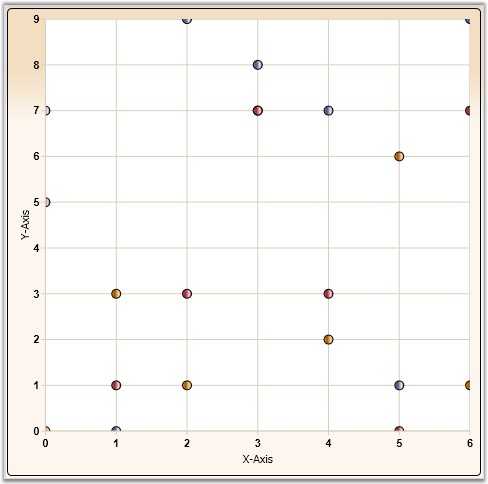
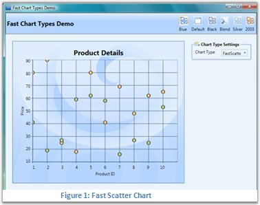
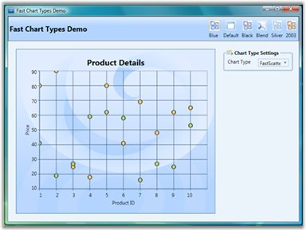
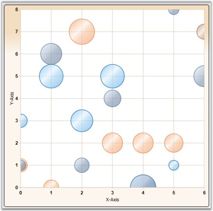

::: {style="DISPLAY: none"}
{#d2h_url_template}{#d2h_package_url style="WIDTH: 0px; DISPLAY: none; HEIGHT: 0px"}
:::

:::::::::: {.d2h_secondary_topic style="PADDING-BOTTOM: 10pt; MARGIN: 0pt; PADDING-LEFT: 0pt; PADDING-RIGHT: 0pt; PADDING-TOP: 0pt"}
##### XY Charts (Bubble and Scatter)[]{#p100} {#xy-charts-bubble-and-scatter style="tab-stops: 0pt"}

###### 4.1.1.4.6.1 Scatter Chart {#scatter-chart style="tab-stops: 0pt"}

Scatter Charts, also known as XY Charts, are a plot of Y values and X values along two axes. The points are not joined together and can be customized using shapes or images to make them easily identifiable, usually independent of time.

 

The scatter graph lets you plot data points based on two independent variables. The variable that we seek to predict is called the dependent variable or Y-variable. The variable on which it depends is called the independent variable or the X-variable. Scatter graphs can chart multiple data sets, each represented by a different symbol and each having any number of data points.

 

It is used to display numerical data, either discrete or continuous. Scatter charts are commonly used for visualizing scientific data.

 

The following image shows a multi series Scatter Chart.

[]{style="COLOR: red; FONT-SIZE: 8pt"} 

{border="0"}

Figure 140: Scatter Chart

 

Data Requirements

[]{style="FONT-FAMILY: 'Trebuchet MS','sans-serif'; COLOR: #15428b; FONT-SIZE: 9pt"} 

Table 81: Data Requirement

::: {align="center"}
+------------------------------+-------------+
| Details                                    |
+------------------------------+-------------+
| Number of y values per point | one         |
+------------------------------+-------------+
| Number of points             | one or more |
+------------------------------+-------------+
| Number of series             | one or more |
+------------------------------+-------------+
:::

**[]{style="FONT-FAMILY: 'Trebuchet MS','sans-serif'; COLOR: #15428b"}** 

Template

While setting template the following parameters can be used:

[]{style="FONT-FAMILY: 'Trebuchet MS','sans-serif'; COLOR: #15428b; FONT-SIZE: 9pt"} 

Table 82: Template Parameters

::: {align="center"}
  ---------- ------------- ---------------------------
  Name       Type          Description
  X          double        x point coordinate
  Y          double        y point coordinate
  Interior   Brush         column color
  Series     ChartSeries   reference to series-owner
  ---------- ------------- ---------------------------
:::

[]{style="FONT-FAMILY: 'Trebuchet MS','sans-serif'; COLOR: #15428b; FONT-SIZE: 9pt"} 

A sample which demonstrates Scatter and Bubble Chart Types is available in the following sample installation path.

 

***..My Documents\\Syncfusion\\EssentialStudio\\\<Version Number\>\\WPF\\Chart.WPF\\Samples\\3.5\\WindowsSamples\\Chart Gallery\\Scatter And Bubble Chart Demo***

 

Fast Scatter chart Type

Fast Scatter charts are similar to Scatter Charts as they are a plot of Y values and X values along two axes. The points are not joined together and can be customized using shapes or images to make them easily identifiable, usually independent of time.

 

Fast Scatter charts can present multiple data sets, each represented by a different symbol and each having any number of data points. It is used to display numerical data, either discrete or continuous.

 

The following points mark the advantages of **Fast Scatter Charts** over **Scatter Charts**:

[]{style="FONT-FAMILY: 'Trebuchet MS','sans-serif'; COLOR: #15428b; FONT-SIZE: 9pt"} 

[·      ]{style="FONT-FAMILY: Symbol"}The Fast Scatter Charts are rendered using drawing visuals.

[·      ]{style="FONT-FAMILY: Symbol"}They load faster than the scattered charts.

[·      ]{style="FONT-FAMILY: Symbol"}They ensure high performance for displaying data.

[·      ]{style="FONT-FAMILY: Symbol"}They can be used as real time charts to render huge number of data points.

[]{style="FONT-FAMILY: 'Trebuchet MS','sans-serif'; COLOR: #15428b; FONT-SIZE: 9pt"} 

The Chart type Fast Scatter is added in the Enum of type **ChartTypes**.

[]{style="FONT-FAMILY: 'Trebuchet MS','sans-serif'; COLOR: #15428b; FONT-SIZE: 9pt"} 

{border="0"}

Figure 141: Fast Scatter Charts

[]{style="FONT-FAMILY: 'Trebuchet MS','sans-serif'; COLOR: #15428b; FONT-SIZE: 9pt"} 

Data Requirements

[]{style="FONT-FAMILY: 'Trebuchet MS','sans-serif'; COLOR: #15428b; FONT-SIZE: 9pt"} 

Table 83: Data Requirement

::: {align="center"}
+------------------------------+-------------+
| Details                                    |
+------------------------------+-------------+
| Number of y values per point | one         |
+------------------------------+-------------+
| Number of points             | one or more |
+------------------------------+-------------+
| Number of series             | one or more |
+------------------------------+-------------+
:::

**[]{style="FONT-FAMILY: 'Trebuchet MS','sans-serif'; COLOR: #15428b; FONT-SIZE: 9pt"}** 

Template

While setting template the following parameters can be used:

[]{style="FONT-FAMILY: 'Trebuchet MS','sans-serif'; COLOR: #15428b; FONT-SIZE: 9pt"} 

Table 84: Template Parameter

::: {align="center"}
  ---------- ------------- ---------------------------
  Name       Type          Description
  X          double        x point coordinate
  Y          double        y point coordinate
  Interior   Brush         column color
  Series     ChartSeries   reference to series-owner
  ---------- ------------- ---------------------------
:::

[]{style="FONT-FAMILY: 'Trebuchet MS','sans-serif'; COLOR: #15428b; FONT-SIZE: 9pt"} 

The following code snippet illustrates the usage of Fast Scatter charts.

[]{style="FONT-FAMILY: 'Trebuchet MS','sans-serif'; COLOR: #15428b; FONT-SIZE: 9pt"} 

+------------------------------------------------------------------------------------------------------------------------------------------------------------------------------------------------------------------------------------------------------------------------------------------------------------------------------------------------------------------------------------------------------------------------------------------------------------------------------------------------------------------------------------------------------------------------------------------------------------------------------------------------------------------------------------------------------------------------------------------------------------------------------------------------------------------------------------------------------------+
| **[\[XAML\]]{style="FONT-FAMILY: 'Courier New'"}**                                                                                                                                                                                                                                                                                                                                                                                                                                                                                                                                                                                                                                                                                                                                                                                                         |
|                                                                                                                                                                                                                                                                                                                                                                                                                                                                                                                                                                                                                                                                                                                                                                                                                                                            |
| []{style="FONT-FAMILY: 'Courier New'; COLOR: blue"}                                                                                                                                                                                                                                                                                                                                                                                                                                                                                                                                                                                                                                                                                                                                                                                                        |
|                                                                                                                                                                                                                                                                                                                                                                                                                                                                                                                                                                                                                                                                                                                                                                                                                                                            |
| [\<]{style="FONT-FAMILY: 'Courier New'; COLOR: blue"}[syncfusion]{style="FONT-FAMILY: 'Courier New'; COLOR: #a31515"}[:]{style="FONT-FAMILY: 'Courier New'; COLOR: blue"}[ChartSeries]{style="FONT-FAMILY: 'Courier New'; COLOR: #a31515"}[ Type]{style="FONT-FAMILY: 'Courier New'; COLOR: red"}[=\"FastScatter\"]{style="FONT-FAMILY: 'Courier New'; COLOR: blue"}[ Name]{style="FONT-FAMILY: 'Courier New'; COLOR: red"}[=\"series1\"]{style="FONT-FAMILY: 'Courier New'; COLOR: blue"}[ Stroke]{style="FONT-FAMILY: 'Courier New'; COLOR: red"}[=\"Black\"]{style="FONT-FAMILY: 'Courier New'; COLOR: blue"}[ DataSource]{style="FONT-FAMILY: 'Courier New'; COLOR: red"}[=\"{]{style="FONT-FAMILY: 'Courier New'; COLOR: blue"}[Binding]{style="FONT-FAMILY: 'Courier New'; COLOR: #a31515"}[}\"/\>]{style="FONT-FAMILY: 'Courier New'; COLOR: blue"} |
+------------------------------------------------------------------------------------------------------------------------------------------------------------------------------------------------------------------------------------------------------------------------------------------------------------------------------------------------------------------------------------------------------------------------------------------------------------------------------------------------------------------------------------------------------------------------------------------------------------------------------------------------------------------------------------------------------------------------------------------------------------------------------------------------------------------------------------------------------------+

[]{style="FONT-FAMILY: 'Trebuchet MS','sans-serif'; COLOR: #15428b; FONT-SIZE: 9pt"} 

+--------------------------------------------------------------------------------------------------------------------------------------------------------------------------------------------------------------------------------------------------------------------------------------------------------------------------------------------------------------------+
| **[\[C#\]]{style="FONT-FAMILY: 'Courier New'"}**                                                                                                                                                                                                                                                                                                                   |
|                                                                                                                                                                                                                                                                                                                                                                    |
| []{style="FONT-FAMILY: 'Courier New'; COLOR: blue"}                                                                                                                                                                                                                                                                                                                |
|                                                                                                                                                                                                                                                                                                                                                                    |
| [ChartSeries]{style="FONT-FAMILY: 'Courier New'; COLOR: #2b91af"}[ series = ]{style="FONT-FAMILY: 'Courier New'; COLOR: black"}[new]{style="FONT-FAMILY: 'Courier New'; COLOR: blue"}[ ]{style="FONT-FAMILY: 'Courier New'; COLOR: black"}[ChartSeries]{style="FONT-FAMILY: 'Courier New'; COLOR: #2b91af"}[();]{style="FONT-FAMILY: 'Courier New'; COLOR: black"} |
|                                                                                                                                                                                                                                                                                                                                                                    |
| [series.Type = ]{style="FONT-FAMILY: 'Courier New'; COLOR: black"}[ChartTypes]{style="FONT-FAMILY: 'Courier New'; COLOR: #2b91af"}[.FastScatter;]{style="FONT-FAMILY: 'Courier New'; COLOR: black"}                                                                                                                                                                |
+--------------------------------------------------------------------------------------------------------------------------------------------------------------------------------------------------------------------------------------------------------------------------------------------------------------------------------------------------------------------+

[]{style="FONT-FAMILY: 'Trebuchet MS','sans-serif'; COLOR: #15428b; FONT-SIZE: 9pt"} 

Run the sample.

[]{style="FONT-FAMILY: 'Trebuchet MS','sans-serif'; COLOR: #15428b; FONT-SIZE: 9pt"} 

A Fast Scatter chart is displayed.

[]{style="FONT-FAMILY: 'Trebuchet MS','sans-serif'; COLOR: #15428b; FONT-SIZE: 9pt"} 

{border="0"}

Figure 142: Fast Scatter Chart

[]{style="FONT-FAMILY: 'Trebuchet MS','sans-serif'; COLOR: #15428b; FONT-SIZE: 9pt"} 

A sample which demonstrates Fast Scatter Chart Types is available in the following sample installation path.

 

***..My Documents\\Syncfusion\\Essential Studio\\\<Version Number\>\\WPF\\Chart.WPF\\Samples\\3.5\\WindowsSamples\\Chart Performance-\> Fast chart types***

 

See Also

[]{#p101}[[[Chart Types]{style="COLOR: blue"}](ms-xhelp:///?Id=b472b0c1-a043-4ef7-8186-3c0b92b19b96)]{.UGHyperlink}

[]{style="FONT-FAMILY: 'Trebuchet MS','sans-serif'; COLOR: #15428b; FONT-SIZE: 9pt"} 

###### 4.1.1.4.6.2 Bubble Chart {#bubble-chart style="tab-stops: 0pt"}

Bubble Chart is an extension of the Scatter Chart (or XY-chart) where each data marker is represented by a circle whose dimension forms a third variable. Consequently, bubble charts allow three-variable comparisons allowing for easy visualization of complex interdependencies that are not apparent in two-variable charts. Bubble charts are frequently used in market and product comparison studies.

 

Though it\'s called a bubble chart, the data marker can be rendered as either a circle, image or square using the **BubbleType** property.

 

The following image shows a multi series Bubble Chart.

[]{style="FONT-FAMILY: 'Trebuchet MS','sans-serif'; COLOR: #15428b; FONT-SIZE: 9pt"} 

{border="0"}

Figure 143: Bubble Chart

[]{style="FONT-FAMILY: 'Trebuchet MS','sans-serif'; COLOR: #15428b; FONT-SIZE: 9pt"} 

Data Requirements

[]{style="FONT-FAMILY: 'Trebuchet MS','sans-serif'; COLOR: #15428b; FONT-SIZE: 9pt"} 

Table 85: Data Requirement

::: {align="center"}
+------------------------------+-------------+
| Details                                    |
+------------------------------+-------------+
| Number of y values per point | two         |
+------------------------------+-------------+
| Number of points             | one or more |
+------------------------------+-------------+
| Number of series             | one or more |
+------------------------------+-------------+
:::

**[]{style="FONT-FAMILY: 'Trebuchet MS','sans-serif'; COLOR: #15428b; FONT-SIZE: 9pt"}** 

BubbleType Properties

[]{style="FONT-FAMILY: 'Trebuchet MS','sans-serif'; COLOR: #15428b; FONT-SIZE: 9pt"} 

Table 86: Property Table

::: {align="center"}
  --------------------------- -------- ------------- -----------------------
  Name                        Type     Container     Description
  ChartBubbleType.MinRadius   double   ChartSeries   minimal figure radius
  ChartBubbleType.MaxRadius   double   ChartSeries   maximal figure radius
  --------------------------- -------- ------------- -----------------------
:::

[]{style="FONT-FAMILY: 'Trebuchet MS','sans-serif'; COLOR: #15428b; FONT-SIZE: 9pt"} 

Template

While setting template the following parameters can be used:

[]{style="FONT-FAMILY: 'Trebuchet MS','sans-serif'; COLOR: #15428b; FONT-SIZE: 9pt"} 

Table 87: Template Parameter

::: {align="center"}
  ---------- ------------- ---------------------------
  Name       Type          Description
  X          double        x column coordinate
  Y          double        y column coordinate
  Width      double        column width
  Height     double        column height
  Radius     double        figure radius
  Interior   Brush         column color
  Series     ChartSeries   reference to series-owner
  ---------- ------------- ---------------------------
:::

[]{style="FONT-FAMILY: 'Trebuchet MS','sans-serif'; COLOR: #15428b; FONT-SIZE: 9pt"} 

A sample which demonstrates Scatter and Bubble Chart Types is available in the following sample installation path.

 

***..My Documents\\Syncfusion\\EssentialStudio\\\<Version Number\>\\WPF\\Chart.WPF\\Samples\\3.5\\WindowsSamples\\Chart Gallery\\Scatter And Bubble Chart Demo***

**** 

See Also

[[Chart Types]{.UGHyperlink}](ms-xhelp:///?Id=6f1c7554-4bdc-4e3d-af07-09c36770951d)[]{.UGHyperlink}

[]{style="FONT-FAMILY: 'Trebuchet MS','sans-serif'; COLOR: #15428b; FONT-SIZE: 9pt"} 

[]{#related-topics}
::::::::::
