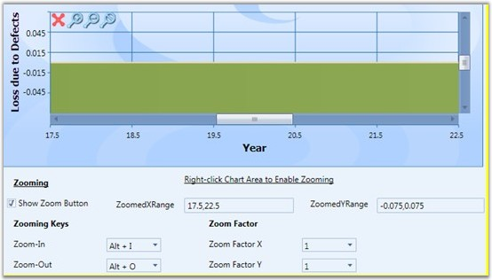

::: {style="DISPLAY: none"}
{#d2h_url_template}{#d2h_package_url style="WIDTH: 0px; DISPLAY: none; HEIGHT: 0px"}
:::

::::: {.d2h_secondary_topic style="PADDING-BOTTOM: 10pt; MARGIN: 0pt; PADDING-LEFT: 0pt; PADDING-RIGHT: 0pt; PADDING-TOP: 0pt"}
##### Zoomed Area Selection {#zoomed-area-selection style="tab-stops: 0pt"}

Essential Chart WPF lets the user to select the zoomed area in a chart. This can be achieved using the **ZoomedXRange** and **ZoomedYRange** properties. Under a zoomed state, you can select:

 

[·      ]{style="FONT-FAMILY: Symbol"}The range of zoomed area in horizontal axis.

[·      ]{style="FONT-FAMILY: Symbol"}The range of zoomed area in vertical axis.

[]{style="FONT-FAMILY: 'Trebuchet MS','sans-serif'; COLOR: #15428b; FONT-SIZE: 9pt"} 

Properties

The following table provides more information on the property used.

 

Table 157: Property

::: {align="center"}
  -------------- ------------- ------------- ----------------------------------------------
  Property       Description   Type          Value Returned
  ZoomedXRange   Dependency    DoubleRange   Selects the zoomed area for horizontal axis.
  ZoomedYRange   Dependency    DoubleRange   Selects the zoomed area for vertical axis.
  -------------- ------------- ------------- ----------------------------------------------
:::

[]{style="FONT-FAMILY: 'Trebuchet MS','sans-serif'; COLOR: #15428b; FONT-SIZE: 9pt"} 

Methods

The following table provides more information on the method used.

 

::: {align="center"}
  ----------------------------------- --------------------- ------------- ---------------------------
  Method                              Parameters            Return Type   Description
  VisibileRangeForZoomAllAxis         ChartArea,ChartAxis   Void          Enables zoom in all axes.
  VisibleRangeForZoomHorizontalAxis   ChartArea,ChartAxis   Void          Enables zoom in x-axis.
  VisibleRangeForZoomVerticalAxis     ChartArea,ChartAxis   Void          Enables zoom in y-axis.
  ----------------------------------- --------------------- ------------- ---------------------------
:::

[]{style="FONT-FAMILY: 'Trebuchet MS','sans-serif'; COLOR: #15428b; FONT-SIZE: 9pt"} 

###### 4.1.1.10.6.1        Selecting a Zoomed Area {#selecting-a-zoomed-area style="tab-stops: 0pt"}

The following code snippet illustrates selection of zoomed area in a chart.

 

1.   Using XAML

 

+--------------------------------------------------------------------------------------------------------------------------------------------------------------------------------------------------------------------------------------------------------------------------------------------------------------------------------------------------------------------------------------------------------------------------------------------------------------------------------------------------------------------------------------------------------------------------------------------------------------------------------------------------------------------------------------------------------------------------------------------------------------------------------------------------------------------------------------------------------------------------------------------------------------------------------------------------------------------------------------------------------------------------------------------+
| **[\[XAML\]]{style="FONT-FAMILY: 'Courier New'"}**                                                                                                                                                                                                                                                                                                                                                                                                                                                                                                                                                                                                                                                                                                                                                                                                                                                                                                                                                                                         |
|                                                                                                                                                                                                                                                                                                                                                                                                                                                                                                                                                                                                                                                                                                                                                                                                                                                                                                                                                                                                                                            |
| []{style="FONT-FAMILY: 'Courier New'; COLOR: blue"}                                                                                                                                                                                                                                                                                                                                                                                                                                                                                                                                                                                                                                                                                                                                                                                                                                                                                                                                                                                        |
|                                                                                                                                                                                                                                                                                                                                                                                                                                                                                                                                                                                                                                                                                                                                                                                                                                                                                                                                                                                                                                            |
| [\<]{style="FONT-FAMILY: 'Courier New'; COLOR: blue"}[TextBox]{style="FONT-FAMILY: 'Courier New'; COLOR: #a31515"}[ Margin]{style="FONT-FAMILY: 'Courier New'; COLOR: red"}[=\"0,6,12,2\"]{style="FONT-FAMILY: 'Courier New'; COLOR: blue"}[ Name]{style="FONT-FAMILY: 'Courier New'; COLOR: red"}[=\"textBox1\"]{style="FONT-FAMILY: 'Courier New'; COLOR: blue"}[ Grid.Column]{style="FONT-FAMILY: 'Courier New'; COLOR: red"}[=\"2\"]{style="FONT-FAMILY: 'Courier New'; COLOR: blue"}[ Grid.Row]{style="FONT-FAMILY: 'Courier New'; COLOR: red"}[=\"1\"]{style="FONT-FAMILY: 'Courier New'; COLOR: blue"}[ Text]{style="FONT-FAMILY: 'Courier New'; COLOR: red"}[=\"{]{style="FONT-FAMILY: 'Courier New'; COLOR: blue"}[Binding]{style="FONT-FAMILY: 'Courier New'; COLOR: #a31515"}[ ElementName]{style="FONT-FAMILY: 'Courier New'; COLOR: red"}[=area,]{style="FONT-FAMILY: 'Courier New'; COLOR: blue"}[Path]{style="FONT-FAMILY: 'Courier New'; COLOR: red"}[=ZoomedXRange,]{style="FONT-FAMILY: 'Courier New'; COLOR: blue"}     |
|                                                                                                                                                                                                                                                                                                                                                                                                                                                                                                                                                                                                                                                                                                                                                                                                                                                                                                                                                                                                                                            |
| [Converter]{style="FONT-FAMILY: 'Courier New'; COLOR: red"}[={]{style="FONT-FAMILY: 'Courier New'; COLOR: blue"}[StaticResource]{style="FONT-FAMILY: 'Courier New'; COLOR: #a31515"}[ rangeConverter]{style="FONT-FAMILY: 'Courier New'; COLOR: red"}[}}\" /\>]{style="FONT-FAMILY: 'Courier New'; COLOR: blue"}                                                                                                                                                                                                                                                                                                                                                                                                                                                                                                                                                                                                                                                                                                                           |
|                                                                                                                                                                                                                                                                                                                                                                                                                                                                                                                                                                                                                                                                                                                                                                                                                                                                                                                                                                                                                                            |
| [\<]{style="FONT-FAMILY: 'Courier New'; COLOR: blue"}[TextBox]{style="FONT-FAMILY: 'Courier New'; COLOR: #a31515"}[ Margin]{style="FONT-FAMILY: 'Courier New'; COLOR: red"}[=\"0,6,11.999,2\"]{style="FONT-FAMILY: 'Courier New'; COLOR: blue"}[ Name]{style="FONT-FAMILY: 'Courier New'; COLOR: red"}[=\"textBox2\"]{style="FONT-FAMILY: 'Courier New'; COLOR: blue"}[ Grid.Column]{style="FONT-FAMILY: 'Courier New'; COLOR: red"}[=\"4\"]{style="FONT-FAMILY: 'Courier New'; COLOR: blue"}[ Grid.Row]{style="FONT-FAMILY: 'Courier New'; COLOR: red"}[=\"1\"]{style="FONT-FAMILY: 'Courier New'; COLOR: blue"}[ Text]{style="FONT-FAMILY: 'Courier New'; COLOR: red"}[=\"{]{style="FONT-FAMILY: 'Courier New'; COLOR: blue"}[Binding]{style="FONT-FAMILY: 'Courier New'; COLOR: #a31515"}[ ElementName]{style="FONT-FAMILY: 'Courier New'; COLOR: red"}[=area,]{style="FONT-FAMILY: 'Courier New'; COLOR: blue"}[Path]{style="FONT-FAMILY: 'Courier New'; COLOR: red"}[=ZoomedYRange,]{style="FONT-FAMILY: 'Courier New'; COLOR: blue"} |
|                                                                                                                                                                                                                                                                                                                                                                                                                                                                                                                                                                                                                                                                                                                                                                                                                                                                                                                                                                                                                                            |
| [Converter]{style="FONT-FAMILY: 'Courier New'; COLOR: red"}[={]{style="FONT-FAMILY: 'Courier New'; COLOR: blue"}[StaticResource]{style="FONT-FAMILY: 'Courier New'; COLOR: #a31515"}[ rangeConverter]{style="FONT-FAMILY: 'Courier New'; COLOR: red"}[}}\"/\>]{style="FONT-FAMILY: 'Courier New'; COLOR: blue"}                                                                                                                                                                                                                                                                                                                                                                                                                                                                                                                                                                                                                                                                                                                            |
+--------------------------------------------------------------------------------------------------------------------------------------------------------------------------------------------------------------------------------------------------------------------------------------------------------------------------------------------------------------------------------------------------------------------------------------------------------------------------------------------------------------------------------------------------------------------------------------------------------------------------------------------------------------------------------------------------------------------------------------------------------------------------------------------------------------------------------------------------------------------------------------------------------------------------------------------------------------------------------------------------------------------------------------------+

[]{style="FONT-FAMILY: 'Trebuchet MS','sans-serif'; COLOR: #15428b; FONT-SIZE: 9pt"} 

{border="0"}

Figure 247: Selecting Zoomed Area

 

[]{#related-topics}
:::::
