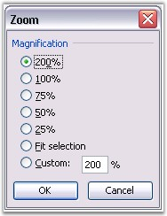

::: {style="DISPLAY: none"}
{#d2h_url_template}{#d2h_package_url style="WIDTH: 0px; DISPLAY: none; HEIGHT: 0px"}
:::

::::: {#nsbanner .d2h_main_nsbanner style="BORDER-BOTTOM: #999999 1px solid; POSITION: relative; PADDING-BOTTOM: 0px; BACKGROUND-COLOR: transparent; PADDING-LEFT: 0px; PADDING-RIGHT: 0px; DISPLAY: none; BORDER-TOP: #999999 1px solid; PADDING-TOP: 0px; LEFT: 0px"}
:::: {#TitleRow .d2h_main_titlerow style="PADDING-BOTTOM: 4px; BACKGROUND-COLOR: transparent; PADDING-LEFT: 22px; WIDTH: 100%; PADDING-RIGHT: 10px; DISPLAY: none; PADDING-TOP: 4px"}
::: {#ienav .d2h_main_ienav style="DISPLAY: none"}
{#D2HPrevious .D2HPreviousEnabled}  {#D2HNext .D2HNextEnabled}
:::
::::
:::::

:::: {#nstext .d2h_main_nstext style="PADDING-BOTTOM: 10px; BACKGROUND-COLOR: transparent; PADDING-LEFT: 22px; PADDING-RIGHT: 10px; HEIGHT: 100%; OVERFLOW: auto; PADDING-TOP: 5px" hasuserbackground="true" valign="bottom"}
::: {#d2h_breadcrumbs .d2h_breadcrumbs}
[Essential Studio User Guide Documentation](ms-xhelp:///?Id=12457748-09e3-4d74-a240-8e049cedf030){.d2h_breadcrumbsNormal}[ \> ]{.d2h_breadcrumbsLinkSeparator}[Reporting Edition](ms-xhelp:///?Id=027aa5b6-6676-4f93-ad23-c20e8c45792e){.d2h_breadcrumbsNormal}[ \> ]{.d2h_breadcrumbsLinkSeparator}[Essential XlsIO](ms-xhelp:///?Id=b01a1b50-1d7d-40c0-bc83-af67e57c9005){.d2h_breadcrumbsNormal}[ \> ]{.d2h_breadcrumbsLinkSeparator}[Concepts and Features](ms-xhelp:///?Id=21b26556-5905-4ad9-90b4-40320db25faf){.d2h_breadcrumbsNormal}[ \> ]{.d2h_breadcrumbsLinkSeparator}[View](ms-xhelp:///?Id=c847cbb0-917f-4a11-8b06-27f0adc8e824){.d2h_breadcrumbsNormal}
:::

### Zooming {#zooming style="tab-stops: 0pt"}

 

Zooming feature controls the current document that appears on the screen, no matter how big or small it is. This enables reading the charts and figures in your Microsoft Excel spreadsheet without finding any difficulty.

 

Excel allows zooming the worksheet/range of cells to fit into the window. Default value of Excel zooming is 100 percent, and can be zoomed till 400 percent. Minimum Zooming is 10 percent.

 

{border="0"}

Figure 150: Zoom dialog box in Excel[]{style="FONT-FAMILY: 'Trebuchet MS','sans-serif'; COLOR: #15428b"}

[]{style="FONT-FAMILY: 'Trebuchet MS','sans-serif'; COLOR: #15428b; FONT-SIZE: 9pt"} 

Zooming in XlsIO

 

XlsIO allows to zoom a worksheet by using the **Zoom** property of **IWorksheet**. It returns or sets the display size of the window as a percentage (100 equals normal size, 200 equals double size, and so on).

 

Following code example illustrates how to zoom a worksheet to 150 percent.

 

+--------------------------------------------------------------------------------+
| **[\[C#\]]{style="FONT-FAMILY: 'Courier New'"}**                               |
|                                                                                |
| **[]{style="FONT-FAMILY: 'Courier New'"}**                                     |
|                                                                                |
| [// Zooming to 150 percent.]{style="FONT-FAMILY: 'Courier New'; COLOR: green"} |
|                                                                                |
| [sheet.Zoom = 150;]{style="FONT-FAMILY: 'Courier New'"}                        |
+--------------------------------------------------------------------------------+

[]{style="FONT-FAMILY: 'Trebuchet MS','sans-serif'; COLOR: #15428b; FONT-SIZE: 9pt"} 

+-------------------------------------------------------------------------------+
| **[\[VB\]]{style="FONT-FAMILY: 'Courier New'"}**                              |
|                                                                               |
| **[]{style="FONT-FAMILY: 'Courier New'"}**                                    |
|                                                                               |
| [// Zooming to 150 percent]{style="FONT-FAMILY: 'Courier New'; COLOR: green"} |
|                                                                               |
| [sheet.Zoom = 150]{style="FONT-FAMILY: 'Courier New'"}                        |
+-------------------------------------------------------------------------------+

 

[]{#related-topics}
::::
