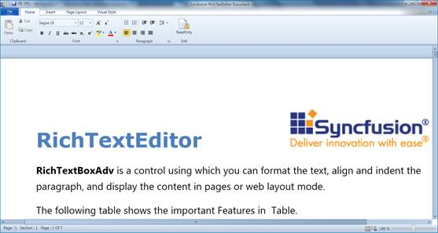

::: {style="DISPLAY: none"}
{#d2h_url_template}{#d2h_package_url style="WIDTH: 0px; DISPLAY: none; HEIGHT: 0px"}
:::

::: {.d2h_secondary_topic style="PADDING-BOTTOM: 10pt; MARGIN: 0pt; PADDING-LEFT: 0pt; PADDING-RIGHT: 0pt; PADDING-TOP: 0pt"}
#### Zooming and Printing {#zooming-and-printing style="tab-stops: 0pt"}

RichTextBoxAdv allows you to zoom in and out on the content of the document. CTRL + mouse wheel will zoom in and zoom out the content of the RichTextBoxAdv control.

 

{border="0"}

Figure 918: RichTextBoxAdv after Zooming

 

The printing feature permits users to print the content of the document using **PrintDocument()**.

We can also use the **Print** command which will execute the **PrintDocument** method whenever it is hooked to the command property.

 

+--------------------------------------------------------------------------------------------------------------------+
| **[\[C#\]]{style="FONT-FAMILY: 'Courier New'"}**                                                                   |
|                                                                                                                    |
| *[        ]{style="FONT-FAMILY: 'Courier New'"}*[RichTextBox.PrintDocument();]{style="FONT-FAMILY: 'Courier New'"} |
|                                                                                                                    |
|                                                                                                                    |
+--------------------------------------------------------------------------------------------------------------------+

 

Properties

  --------------- ------------------------------------------------------------------------- --------------------- -----------
  Property        Description                                                               Type                  Data Type
  IsZoomEnabled   Decides whether the content of the RichTextBoxAdv can be zoomed or not.   Dependency Property   Boolean
  ZoomFactor      Factor to show the zoomed value. It ranges from 0.1 to 1.                 Dependency Property   Double
  --------------- ------------------------------------------------------------------------- --------------------- -----------

 

Methods

  ----------------- ------------------------------------------- ------------ ------ -------------
  Method            Description                                 Parameters   Type   Return Type
  ResetZooming()    Resets the zoom.                            NA           NA     Void
  PrintDocument()   Prints the content of the RichTextBoxAdv.   NA           NA     Void
  ----------------- ------------------------------------------- ------------ ------ -------------

[]{#related-topics}
:::
