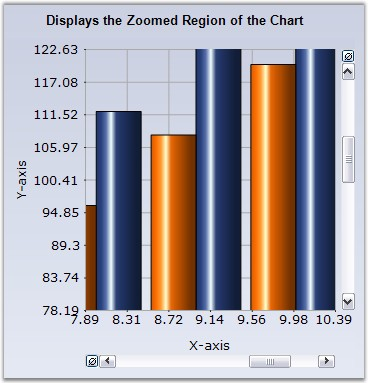
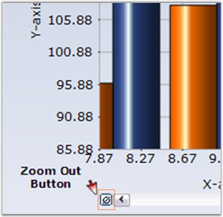
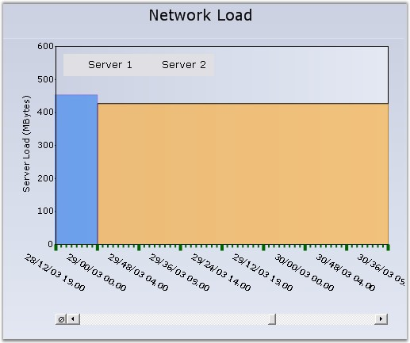

::: {style="DISPLAY: none"}
{#d2h_url_template}{#d2h_package_url style="WIDTH: 0px; DISPLAY: none; HEIGHT: 0px"}
:::

::::: {#nsbanner .d2h_main_nsbanner style="BORDER-BOTTOM: #999999 1px solid; POSITION: relative; PADDING-BOTTOM: 0px; BACKGROUND-COLOR: transparent; PADDING-LEFT: 0px; PADDING-RIGHT: 0px; DISPLAY: none; BORDER-TOP: #999999 1px solid; PADDING-TOP: 0px; LEFT: 0px"}
:::: {#TitleRow .d2h_main_titlerow style="PADDING-BOTTOM: 4px; BACKGROUND-COLOR: transparent; PADDING-LEFT: 22px; WIDTH: 100%; PADDING-RIGHT: 10px; DISPLAY: none; PADDING-TOP: 4px"}
::: {#ienav .d2h_main_ienav style="DISPLAY: none"}
{#D2HPrevious .D2HPreviousEnabled}  {#D2HNext .D2HNextEnabled}
:::
::::
:::::

::::::::: {#nstext .d2h_main_nstext style="PADDING-BOTTOM: 10px; BACKGROUND-COLOR: transparent; PADDING-LEFT: 22px; PADDING-RIGHT: 10px; HEIGHT: 100%; OVERFLOW: auto; PADDING-TOP: 5px" hasuserbackground="true" valign="bottom"}
::: {#d2h_breadcrumbs .d2h_breadcrumbs}
[Essential Studio User Guide Documentation](ms-xhelp:///?Id=12457748-09e3-4d74-a240-8e049cedf030){.d2h_breadcrumbsNormal}[ \> ]{.d2h_breadcrumbsLinkSeparator}[User Interface Edition](ms-xhelp:///?Id=c29296b7-531c-413b-a0ec-488ca1f7f669){.d2h_breadcrumbsNormal}[ \> ]{.d2h_breadcrumbsLinkSeparator}[Essential ASP.NET](ms-xhelp:///?Id=25c35330-c127-4dad-9a92-ed79dc7261a6){.d2h_breadcrumbsNormal}[ \> ]{.d2h_breadcrumbsLinkSeparator}[Essential Chart]{.d2h_breadcrumbsContentsOnly}[ \> ]{.d2h_breadcrumbsLinkSeparator}[Concepts and Features](ms-xhelp:///?Id=100687ce-82f2-4424-9d16-0949ea76cf15){.d2h_breadcrumbsNormal}[ \> ]{.d2h_breadcrumbsLinkSeparator}[Runtime Features](ms-xhelp:///?Id=c39d19cc-1870-49f0-82da-e2e91ebb2e43){.d2h_breadcrumbsNormal}
:::

### Zooming and Scrolling {#zooming-and-scrolling style="tab-stops: 0pt"}

[]{style="FONT-FAMILY: 'Trebuchet MS','sans-serif'; FONT-SIZE: 9pt"} 

Interactive Zooming

**[]{style="FONT-FAMILY: 'Trebuchet MS','sans-serif'"}** 

Zooming via Mouse

**[]{style="FONT-FAMILY: 'Trebuchet MS','sans-serif'; FONT-SIZE: 9pt"}** 

Essential Chart supports interactive zooming features along the x and y axis. During runtime, the user can simply select the range he wants to zoom with the mouse and the chart will accordingly zoom-in. Scrollbars will be activated to browse the areas that become hidden on zooming in.

 

Enable Zooming via the **EnableXZooming** and **EnableYZooming** properties.

[]{style="FONT-FAMILY: 'Trebuchet MS','sans-serif'; FONT-SIZE: 9pt"} 

{border="0"}

[]{style="FONT-FAMILY: 'Trebuchet MS','sans-serif'; FONT-SIZE: 9pt"} 

Figure 282: Select a region in the chart to Zoom-In

[]{style="FONT-FAMILY: 'Trebuchet MS','sans-serif'; FONT-SIZE: 9pt"} 

{border="0"}

**[]{style="FONT-FAMILY: 'Trebuchet MS','sans-serif'; FONT-SIZE: 9pt"}** 

Figure 283: Resultant Zoomed-In Chart

**[]{style="FONT-FAMILY: 'Trebuchet MS','sans-serif'; FONT-SIZE: 9pt"}** 

**In the ChartWebControl**, the scrollbars can be displayed or hidden using the**  ChartWebControl.ShowScrollBars** property.

The user can zoom out by clicking the \"Zoom Out\" button in the scrollbar.

[]{style="FONT-FAMILY: 'Trebuchet MS','sans-serif'; FONT-SIZE: 9pt"} 

{border="0"}

**[]{style="FONT-FAMILY: 'Trebuchet MS','sans-serif'; FONT-SIZE: 9pt"}** 

Figure 284: Zoom Out button beside the Scroll Bar

[]{style="FONT-FAMILY: 'Trebuchet MS','sans-serif'; FONT-SIZE: 9pt"} 

**ZoomOutIncrement** property specifies the increment by which to zoom out. The default value is **0.2**.

 

It is also possible to hide this ZoomOut button in ChartWeb control. This is done by setting **ShowScrollbarsResetButton** property to **true**.

[]{style="FONT-FAMILY: 'Trebuchet MS','sans-serif'; FONT-SIZE: 9pt"} 

+-----------------------------------------------------------------------------------------------------------------------------------------------------------------------+
| **[\[C#\]]{style="FONT-FAMILY: 'Courier New'; COLOR: black"}**                                                                                                        |
|                                                                                                                                                                       |
| []{style="FONT-FAMILY: 'Courier New'"}                                                                                                                                |
|                                                                                                                                                                       |
| [this]{style="FONT-FAMILY: 'Courier New'; COLOR: blue"}[.ChartWebControl1.ShowScrollBarsResetButton=[true]{style="COLOR: blue"};]{style="FONT-FAMILY: 'Courier New'"} |
+-----------------------------------------------------------------------------------------------------------------------------------------------------------------------+

[]{style="FONT-FAMILY: 'Trebuchet MS','sans-serif'; FONT-SIZE: 9pt"} 

+--------------------------------------------------------------------------------------------------------------------------------------------------------------------+
| **[\[VB.NET\]]{style="FONT-FAMILY: 'Courier New'; COLOR: black"}**                                                                                                 |
|                                                                                                                                                                    |
| **[]{style="FONT-FAMILY: 'Courier New'; COLOR: black"}**                                                                                                           |
|                                                                                                                                                                    |
| [Me]{style="FONT-FAMILY: 'Courier New'; COLOR: blue"}[.ChartWebControl1.ShowScrollBarsResetButton=[True]{style="COLOR: blue"}]{style="FONT-FAMILY: 'Courier New'"} |
+--------------------------------------------------------------------------------------------------------------------------------------------------------------------+

**[]{style="FONT-FAMILY: 'Trebuchet MS','sans-serif'; FONT-SIZE: 9pt"}** 

Panning Support for Zoomed Chart

[]{style="FONT-FAMILY: 'Trebuchet MS','sans-serif'; FONT-SIZE: 9pt"} 

Now, you will be able to pan a chart when it is zoomed. Set the **ChartControl.MouseAction** to \'Panning\' to enable this feature. Set the MouseAction to \'None\' to disable this feature. The panning action can be controlled using the **ZoomActions** property that is available for individual axis.

[]{style="FONT-FAMILY: 'Trebuchet MS','sans-serif'; FONT-SIZE: 9pt"} 

::: {align="center"}
+-----------------------------------+-----------------------------------------------------------------------+
| Chart Axes Properties             | Description                                                           |
+-----------------------------------+-----------------------------------------------------------------------+
| ZoomActions                       | Specifies the zoom action on the corresponding axis. The options are, |
|                                   |                                                                       |
|                                   | *Panning* - Enables panning in the zoomed chart.                      |
|                                   |                                                                       |
|                                   | *None* - Disables panning in the zoomed chart.                        |
+-----------------------------------+-----------------------------------------------------------------------+
:::

[]{style="FONT-FAMILY: 'Trebuchet MS','sans-serif'; FONT-SIZE: 9pt"} 

+-------------------------------------------------------------------------------------------------------------------------------------------------------------------------------------------+
| **[\[C#\]]{style="FONT-FAMILY: 'Courier New'; COLOR: black"}**                                                                                                                            |
|                                                                                                                                                                                           |
| **[]{style="FONT-FAMILY: 'Courier New'; COLOR: black"}**                                                                                                                                  |
|                                                                                                                                                                                           |
| [this]{style="FONT-FAMILY: 'Courier New'; COLOR: blue"}[.chartControl1.MouseAction = [ChartMouseAction]{style="COLOR: teal"}.Panning;]{style="FONT-FAMILY: 'Courier New'"}                |
|                                                                                                                                                                                           |
| [this]{style="FONT-FAMILY: 'Courier New'; COLOR: blue"}[.chartControl1.PrimaryXAxis.ZoomActions = [ChartZoomingAction]{style="COLOR: teal"}.Panning;]{style="FONT-FAMILY: 'Courier New'"} |
|                                                                                                                                                                                           |
| [this]{style="FONT-FAMILY: 'Courier New'; COLOR: blue"}[.chartControl1.PrimaryYAxis.ZoomActions = [ChartZoomingAction]{style="COLOR: teal"}.Panning;]{style="FONT-FAMILY: 'Courier New'"} |
+-------------------------------------------------------------------------------------------------------------------------------------------------------------------------------------------+

[]{style="FONT-FAMILY: 'Trebuchet MS','sans-serif'; FONT-SIZE: 9pt"} 

+-------------------------------------------------------------------------------------------------------------------------------------------------------------------------------+
| **[\[VB.NET\]]{style="FONT-FAMILY: 'Courier New'; COLOR: black"}**                                                                                                            |
|                                                                                                                                                                               |
| **[]{style="FONT-FAMILY: 'Courier New'; COLOR: black"}**                                                                                                                      |
|                                                                                                                                                                               |
| [Me]{style="FONT-FAMILY: 'Courier New'; COLOR: blue"}[.chartControl1.MouseAction = [ChartMouseAction.Panning]{style="COLOR: black"}]{style="FONT-FAMILY: 'Courier New'"}      |
|                                                                                                                                                                               |
| [Me]{style="FONT-FAMILY: 'Courier New'; COLOR: blue"}[.chartControl1.PrimaryXAxis.ZoomActions = ChartZoomingAction.Panning]{style="FONT-FAMILY: 'Courier New'; COLOR: black"} |
|                                                                                                                                                                               |
| [Me]{style="FONT-FAMILY: 'Courier New'; COLOR: blue"}[.chartControl1.PrimaryYAxis.ZoomActions = ChartZoomingAction.Panning]{style="FONT-FAMILY: 'Courier New'; COLOR: black"} |
+-------------------------------------------------------------------------------------------------------------------------------------------------------------------------------+

[]{style="FONT-FAMILY: 'Trebuchet MS','sans-serif'; FONT-SIZE: 9pt"} 

::: {style="BORDER-BOTTOM: windowtext 1pt solid; BORDER-LEFT: medium none; PADDING-BOTTOM: 1pt; MARGIN-TOP: 9pt; PADDING-LEFT: 0pt; PADDING-RIGHT: 0pt; MARGIN-BOTTOM: 9pt; BORDER-TOP: windowtext 1pt solid; BORDER-RIGHT: medium none; PADDING-TOP: 1pt"}
{border="0"}Note: Remember to enable zooming on both the axis using EnableXZooming and EnableYZooming properties, before trying out the above panning feature. You cannot pan a chart without zooming it.
:::

**[]{style="FONT-FAMILY: 'Trebuchet MS','sans-serif'; FONT-SIZE: 9pt"}** 

Formatted Axes Lables

[]{style="FONT-FAMILY: 'Trebuchet MS','sans-serif'; FONT-SIZE: 9pt"} 

It is possible to show formatted axes labels for a zoomed chart. Essential Chart\'s **SmartDateZoom** property when set to **true** enables this feature. You can set any one of the following custom label formats to the chart axis.

[]{style="FONT-FAMILY: 'Trebuchet MS','sans-serif'; FONT-SIZE: 9pt"} 

[·      ]{style="FONT-FAMILY: Symbol"}SmartDateZoomDayLevelLabelFormat

[·      ]{style="FONT-FAMILY: Symbol"}SmartDateZoomYearLevelLabelFormat

[·      ]{style="FONT-FAMILY: Symbol"}SmartDateZoomWeekLevelLabelFormat

[·      ]{style="FONT-FAMILY: Symbol"}SmartDateZoomSecondLevelLabelFormat

[·      ]{style="FONT-FAMILY: Symbol"}SmartDateZoomMonthLevelLabelFormat

[·      ]{style="FONT-FAMILY: Symbol"}SmartDateZoomHourLevelLabelFormat

[·      ]{style="FONT-FAMILY: Symbol"}SmartDateZoomMinuteLevelLabelFormat

**[]{style="FONT-FAMILY: 'Trebuchet MS','sans-serif'"}** 

+----------------------------------------------------------------------------------------------------------------------------------------------------------------------------------------------------------+
| **[\[C#\]]{style="FONT-FAMILY: 'Courier New'; COLOR: black"}**                                                                                                                                           |
|                                                                                                                                                                                                          |
| **[]{style="FONT-FAMILY: 'Courier New'; COLOR: black"}**                                                                                                                                                 |
|                                                                                                                                                                                                          |
| [this]{style="FONT-FAMILY: 'Courier New'; COLOR: blue"}[.chartControl1.PrimaryXAxis.SmartDateZoom = [true]{style="COLOR: blue"};]{style="FONT-FAMILY: 'Courier New'"}                                    |
|                                                                                                                                                                                                          |
| [this]{style="FONT-FAMILY: 'Courier New'; COLOR: blue"}[.chartControl1.PrimaryXAxis.SmartDateZoomDayLevelLabelFormat = [\"dd MM/yy HH.00\"]{style="COLOR: maroon"};]{style="FONT-FAMILY: 'Courier New'"} |
+----------------------------------------------------------------------------------------------------------------------------------------------------------------------------------------------------------+

[]{style="FONT-FAMILY: 'Trebuchet MS','sans-serif'; FONT-SIZE: 9pt"} 

+-------------------------------------------------------------------------------------------------------------------------------------------------------------------------------------------------------+
| **[\[VB.NET\]]{style="FONT-FAMILY: 'Courier New'; COLOR: black"}**                                                                                                                                    |
|                                                                                                                                                                                                       |
| **[]{style="FONT-FAMILY: 'Courier New'; COLOR: black"}**                                                                                                                                              |
|                                                                                                                                                                                                       |
| [Me]{style="FONT-FAMILY: 'Courier New'; COLOR: blue"}[.chartControl1.PrimaryXAxis.SmartDateZoom = [True]{style="COLOR: blue"}]{style="FONT-FAMILY: 'Courier New'"}                                    |
|                                                                                                                                                                                                       |
| [Me]{style="FONT-FAMILY: 'Courier New'; COLOR: blue"}[.chartControl1.PrimaryXAxis.SmartDateZoomDayLevelLabelFormat = [\"dd MM/yy HH.00\"]{style="COLOR: maroon"}]{style="FONT-FAMILY: 'Courier New'"} |
+-------------------------------------------------------------------------------------------------------------------------------------------------------------------------------------------------------+

[]{style="FONT-FAMILY: 'Trebuchet MS','sans-serif'; FONT-SIZE: 9pt"} 

{border="0"}

[]{style="FONT-FAMILY: 'Trebuchet MS','sans-serif'; FONT-SIZE: 9pt"} 

Figure 285: SmartDateZoomDayLevelLabelFormat = \"dd MM/yy  HH.00\"

::: {style="BORDER-BOTTOM: windowtext 1pt solid; BORDER-LEFT: medium none; PADDING-BOTTOM: 1pt; MARGIN-TOP: 9pt; PADDING-LEFT: 0pt; PADDING-RIGHT: 0pt; MARGIN-BOTTOM: 9pt; BORDER-TOP: windowtext 1pt solid; BORDER-RIGHT: medium none; PADDING-TOP: 1pt"}
{border="0"}Note: The value type of the axis should be \"DateTime\" for setting the above formatted labels.

 
:::

Cancel Zooming via Keyboard

 

Essential Chart enables users to use keyboard shortcuts to cancel Zooming. This feature can be enabled using the **ZoomCancel** property.

 

The following property is used to cancel zooming action that can be mapped to specific keys:

 

 

::: {align="center"}
  ------------------------ --------------------------------------------------------------------------------------
  Chart control Property   Description
  ZoomCancel               Specifies the keyboard shortcut to control Zoom cancel. The default value is ESCAPE.
  ------------------------ --------------------------------------------------------------------------------------
:::

**[]{style="COLOR: white"}** 

 

The following code snippet illustrates this:

 

+-------------------------------------------------------------------------------------------------------------------------------------------------------------------+
| [ \[C#\]]{style="FONT-FAMILY: 'Courier New'"}                                                                                                                     |
|                                                                                                                                                                   |
| [//Set the Enter key to cancel zooming of control.]{style="FONT-FAMILY: 'Courier New'; COLOR: green"}[       ]{style="FONT-FAMILY: 'Courier New'"}                |
|                                                                                                                                                                   |
| [this]{style="FONT-FAMILY: 'Courier New'; COLOR: blue"}[.ChartWebControl1.ZoomCancel = [Keys]{style="COLOR: #2b91af"}.Enter;]{style="FONT-FAMILY: 'Courier New'"} |
+-------------------------------------------------------------------------------------------------------------------------------------------------------------------+

 

+----------------------------------------------------------------------------------------------------------------------------------------------------------------+
| [ \[VB\]]{style="FONT-FAMILY: 'Courier New'"}                                                                                                                  |
|                                                                                                                                                                |
| [//Set the Enter key to cancel zooming of control.]{style="FONT-FAMILY: 'Courier New'; COLOR: green"}[       ]{style="FONT-FAMILY: 'Courier New'"}             |
|                                                                                                                                                                |
| [Me]{style="FONT-FAMILY: 'Courier New'; COLOR: blue"}[.ChartWebControl1.ZoomCancel = [Keys]{style="COLOR: #2b91af"}.Enter]{style="FONT-FAMILY: 'Courier New'"} |
+----------------------------------------------------------------------------------------------------------------------------------------------------------------+

 

::: {style="BORDER-BOTTOM: windowtext 1pt solid; BORDER-LEFT: medium none; PADDING-BOTTOM: 1pt; MARGIN-TOP: 9pt; PADDING-LEFT: 0pt; PADDING-RIGHT: 0pt; MARGIN-BOTTOM: 9pt; BORDER-TOP: windowtext 1pt solid; BORDER-RIGHT: medium none; PADDING-TOP: 1pt"}
 
:::

[]{#p200} 

[]{#related-topics}
:::::::::
