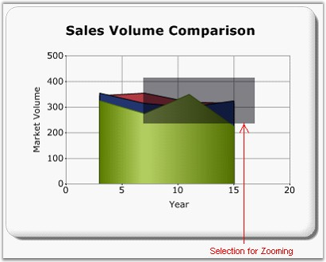
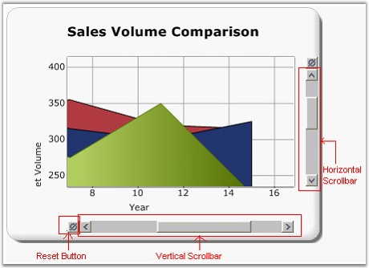

::: {style="DISPLAY: none"}
{#d2h_url_template}{#d2h_package_url style="WIDTH: 0px; DISPLAY: none; HEIGHT: 0px"}
:::

:::::: {.d2h_secondary_topic style="PADDING-BOTTOM: 10pt; MARGIN: 0pt; PADDING-LEFT: 0pt; PADDING-RIGHT: 0pt; PADDING-TOP: 0pt"}
#### Zooming and Scrolling {#zooming-and-scrolling style="tab-stops: 0pt"}

Essential Chart supports the interactive zooming features along the x and y axis. During runtime, the user can select the zooming range by using the mouse and the chart's zoom-in factor accordingly. The scrollbars will be activated to browse the hidden areas on the zoomed in area.

[]{style="FONT-FAMILY: 'Calibri','sans-serif'"} 

{border="0"}

Figure 314: Chart Structure - While Zooming

{border="0"}

Figure 315: Chart Structure - After Zooming

Properties

The following table lists the properties that are used for zooming:

 

 

::: {align="center"}
+------------------+--------------------------------------------------+---------------------------------------------------------+-------------------------------+--------------------------------------------------+
| Property         | Description                                      | Property Type                                           | Value it Accepts              | Any Other Dependencies/Sub-properties Associated |
+------------------+--------------------------------------------------+---------------------------------------------------------+-------------------------------+--------------------------------------------------+
| EnableXZooming   | Enables or disables the x-axis zoom.             | [bool]{style="COLOR: blue"}                             | [True]{style="COLOR: blue"}   | [NA]{style="COLOR: #558ed5"}                     |
|                  |                                                  |                                                         |                               |                                                  |
|                  |                                                  |                                                         | []{style="COLOR: blue"}       |                                                  |
|                  |                                                  |                                                         |                               |                                                  |
|                  |                                                  |                                                         | [false]{style="COLOR: blue"}  |                                                  |
+------------------+--------------------------------------------------+---------------------------------------------------------+-------------------------------+--------------------------------------------------+
| EnableYZooming   | Enables or disables the y-axis zoom.             | [bool]{style="COLOR: blue"}                             |                               | [NA]{style="COLOR: #558ed5"}                     |
|                  |                                                  |                                                         |                               |                                                  |
|                  |                                                  |                                                         | [True]{style="COLOR: blue"}   |                                                  |
|                  |                                                  |                                                         |                               |                                                  |
|                  |                                                  |                                                         | []{style="COLOR: blue"}       |                                                  |
|                  |                                                  |                                                         |                               |                                                  |
|                  |                                                  |                                                         | [false ]{style="COLOR: blue"} |                                                  |
+------------------+--------------------------------------------------+---------------------------------------------------------+-------------------------------+--------------------------------------------------+
| ZoomOutIncrement | Sets the zoom out value for every reset.         | [double]{style="COLOR: blue"}                           | [double]{style="COLOR: blue"} | [NA]{style="COLOR: #558ed5"}                     |
+------------------+--------------------------------------------------+---------------------------------------------------------+-------------------------------+--------------------------------------------------+
| ZoomPosition     | Sets the minimal value of the axis to be zoomed. | [double]{style="COLOR: blue"}[]{style="COLOR: #2b91af"} | [double]{style="COLOR: blue"} | [NA]{style="COLOR: #558ed5"}                     |
+------------------+--------------------------------------------------+---------------------------------------------------------+-------------------------------+--------------------------------------------------+
| ZoomFactor       | Sets the value for the Zoom Factor.              | [double]{style="COLOR: blue"}[]{style="COLOR: #2b91af"} | [double]{style="COLOR: blue"} | [NA]{style="COLOR: #558ed5"}                     |
+------------------+--------------------------------------------------+---------------------------------------------------------+-------------------------------+--------------------------------------------------+
:::

 

Scrolling

Scrolling and panning are used to view the visible area on the chart, after zooming.

You can scroll vertically inside the ChartArea by using the mouse wheel. You can scroll horizontally by holding and pressing the spacebar key and moving the mouse wheel.

Scrolling will be automatically enabled while enabling zooming. You can disable the scrollbars by setting the ShowScrollBars property to true. Even though, you disable the scrollbars, you can scroll by using the mouse wheel.

 

Scrolling by Using the Keyboard

The following keys enable scrolling inside the ChartArea:

 

::: {align="center"}
  ------------- ---------------------------------------
  Keys          Action
  Up arrow      Scroll upwards in the ChartArea.
  Down arrow    Scroll downwards in the ChartArea.
  Left arrow    Scroll to the left in the ChartArea.
  Right arrow   Scroll to the right in the ChartArea.
  ------------- ---------------------------------------
:::

[]{style="FONT-FAMILY: 'Calibri','sans-serif'"} 

Properties

The following table lists the properties that are used for scrolling:

 

::: {align="center"}
+---------------------------+----------------------------------------------------------------------+-----------------------------+------------------------------+--------------------------------------------------+
| Property                  | Description                                                          | Property Type               | Value it Accepts             | Any Other Dependencies/Sub-properties Associated |
+---------------------------+----------------------------------------------------------------------+-----------------------------+------------------------------+--------------------------------------------------+
| ShowScrollBars            | Enables or disables the visibility of the scrollbars.                | [bool]{style="COLOR: blue"} | [True]{style="COLOR: blue"}  | [NA]{style="COLOR: #558ed5"}                     |
|                           |                                                                      |                             |                              |                                                  |
|                           |                                                                      |                             | []{style="COLOR: blue"}      |                                                  |
|                           |                                                                      |                             |                              |                                                  |
|                           |                                                                      |                             | [false]{style="COLOR: blue"} |                                                  |
+---------------------------+----------------------------------------------------------------------+-----------------------------+------------------------------+--------------------------------------------------+
| ShowScrollBarsResetButton | Enables or disables the visibility of the scrollbar\'s Reset button. | [bool]{style="COLOR: blue"} | [True]{style="COLOR: blue"}  | [NA]{style="COLOR: #558ed5"}                     |
|                           |                                                                      |                             |                              |                                                  |
|                           |                                                                      |                             | []{style="COLOR: blue"}      |                                                  |
|                           |                                                                      |                             |                              |                                                  |
|                           |                                                                      |                             | [false]{style="COLOR: blue"} |                                                  |
+---------------------------+----------------------------------------------------------------------+-----------------------------+------------------------------+--------------------------------------------------+
:::

[]{style="FONT-FAMILY: 'Calibri','sans-serif'"} 

Chart with the zooming feature can be created through two ways:

[·      ]{style="FONT-FAMILY: Symbol"}Builder

[·      ]{style="FONT-FAMILY: Symbol"}ChartModel

More:

[ ]{#related-topics}

[{border="0" align="absMiddle"}Builder](ms-xhelp:///?Id=a844fe21-71ba-46c5-b451-9bf1bcfe8d1e){style="TEXT-DECORATION: none"}

[{border="0" align="absMiddle"}ChartModel](ms-xhelp:///?Id=7abb9cd6-430e-459b-9ed2-3fd97c373720){style="TEXT-DECORATION: none"}
::::::
