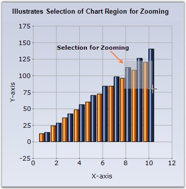

::: {style="DISPLAY: none"}
{#d2h_url_template}{#d2h_package_url style="WIDTH: 0px; DISPLAY: none; HEIGHT: 0px"}
:::

::::: {#nsbanner .d2h_main_nsbanner style="BORDER-BOTTOM: #999999 1px solid; POSITION: relative; PADDING-BOTTOM: 0px; BACKGROUND-COLOR: transparent; PADDING-LEFT: 0px; PADDING-RIGHT: 0px; DISPLAY: none; BORDER-TOP: #999999 1px solid; PADDING-TOP: 0px; LEFT: 0px"}
:::: {#TitleRow .d2h_main_titlerow style="PADDING-BOTTOM: 4px; BACKGROUND-COLOR: transparent; PADDING-LEFT: 22px; WIDTH: 100%; PADDING-RIGHT: 10px; DISPLAY: none; PADDING-TOP: 4px"}
::: {#ienav .d2h_main_ienav style="DISPLAY: none"}
{#D2HPrevious .D2HPreviousEnabled}  {#D2HNext .D2HNextEnabled}
:::
::::
:::::

:::::::: {#nstext .d2h_main_nstext style="PADDING-BOTTOM: 10px; BACKGROUND-COLOR: transparent; PADDING-LEFT: 22px; PADDING-RIGHT: 10px; HEIGHT: 100%; OVERFLOW: auto; PADDING-TOP: 5px" hasuserbackground="true" valign="bottom"}
::: {#d2h_breadcrumbs .d2h_breadcrumbs}
[Essential Studio User Guide Documentation](ms-xhelp:///?Id=12457748-09e3-4d74-a240-8e049cedf030){.d2h_breadcrumbsNormal}[ \> ]{.d2h_breadcrumbsLinkSeparator}[User Interface Edition](ms-xhelp:///?Id=c29296b7-531c-413b-a0ec-488ca1f7f669){.d2h_breadcrumbsNormal}[ \> ]{.d2h_breadcrumbsLinkSeparator}[Essential Windows](ms-xhelp:///?Id=e60759d8-47a4-4570-9d7a-16a68d63f2ea){.d2h_breadcrumbsNormal}[ \> ]{.d2h_breadcrumbsLinkSeparator}[Essential Chart]{.d2h_breadcrumbsContentsOnly}[ \> ]{.d2h_breadcrumbsLinkSeparator}[Concepts and Features](ms-xhelp:///?Id=71321e9c-336c-4c1c-a127-be9f135ad4bb){.d2h_breadcrumbsNormal}[ \> ]{.d2h_breadcrumbsLinkSeparator}[Runtime Features](ms-xhelp:///?Id=90d48bbb-6229-484d-9d3e-31e26c59f1d3){.d2h_breadcrumbsNormal}
:::

### Zooming and Scrolling {#zooming-and-scrolling style="tab-stops: 0pt"}

 

Interactive Zooming

 

Zooming via Mouse

 

Essential Chart supports interactive zooming features along the x and y axis. During runtime, the user can simply select the range he wants to zoom with the mouse and the chart will accordingly zoom-in. Scrollbars will be activated to browse the areas that become hidden on zooming in.

 

Enable Zooming via the **EnableXZooming** and **EnableYZooming** properties.

 

{border="0"}

 

Figure 290: Select a region in the chart to Zoom-In

 

{border="0"}

 

Figure 291: Resultant Zoomed-In Chart

 

The scrollbar will shift by the amount specified in the **ScrollPrecision** property which is set to **20** by default.

**[]{style="FONT-FAMILY: 'Verdana','sans-serif'; COLOR: red; FONT-SIZE: 8pt"}** 

User can zoom out by clicking the \"Zoom Out\" button in the scrollbar.

 

{border="0"}

 

Figure 292: Zoom Out button beside the Scrollbar

 

**ZoomOutIncrement** property specifies the increment by which to zoom out. The default value is **0.2**.

 

Programmatic Zooming

 

Programmatically the chart can be zoomed using **ZoomFactorX** and **ZoomFactorY** properties. The Zoom factor is usually between 0 and 1. When set to 1, the chart isn\'t zoomed. When set to 0.5, the chart is double its usual size. Scrollbars will automatically appear to allow any section of the hidden range to be viewed. The default value is **1**.

 

You can also programmatically specify the scrollbar position of the zoomed in axes using the **ZoomPositionX** and **ZoomPositionY** properties.

 

To restrict the zoom-in factor to a certain level on the x and y axis use the **MinZoomFactorX** and **MinZoomFactorY** properties. The value can be in between 0 and 1. 1 means not zoomed.

 

Zooming via Keyboard

 

Essential Chart also enables users to use keyboard shortcuts to enable zooming. Enable this feature through the **KeyZoom** property.

 

Using the following properties the zooming action can be mapped to specific keys.

 

::: {align="center"}
  ------------------------ ------------------------------------------------------------------------------------------
  Chart control Property   Description
  ZoomCancel               Specifies the keyboard shortcut to control Zoom cancel. The default value is ESCAPE.
  ZoomDown                 Specifies the keyboard shortcut to control Zoom Down. The default value is DOWN arrow.
  ZoomIn                   Specifies the keyboard shortcut to control Zoom In. The default value is ADD key.
  ZoomLeft                 Specifies the keyboard shortcut to control Zoom Left. The default value is LEFT arrow.
  ZoomOut                  Specifies the keyboard shortcut to control Zoom Out. The default value is SUBTRACT.
  ZoomRight                Specifies the keyboard shortcut to control Zoom Right. The default value is RIGHT arrow.
  ZoomUp                   Specifies the keyboard short cut to control Zoom Up. The default value is UP arrow.
  ------------------------ ------------------------------------------------------------------------------------------
:::

 

Panning Support for Zoomed Chart

 

Now, you will be able to pan a chart when it is zoomed. Set the **ChartControl.MouseAction** to \'Panning\' to enable this feature. Set the MouseAction to \'None\' to disable this feature. The panning action can be controlled using the **ZoomActions** property that is available for individual axis.

 

::: {align="center"}
+-----------------------------------+-----------------------------------------------------------------------+
| Chart Axes Property               | Description                                                           |
+-----------------------------------+-----------------------------------------------------------------------+
| ZoomActions                       | Specifies the zoom action on the corresponding axis. The options are, |
|                                   |                                                                       |
|                                   | *Panning* - Enables panning in the zoomed chart.                      |
|                                   |                                                                       |
|                                   | *None* - Disables panning in the zoomed chart.                        |
+-----------------------------------+-----------------------------------------------------------------------+
:::

 

+-------------------------------------------------------------------------------------------------------------------------------------------------------------------------------------------+
| **[\[C#\]]{style="FONT-FAMILY: 'Courier New'; COLOR: black"}**                                                                                                                            |
|                                                                                                                                                                                           |
| **[]{style="FONT-FAMILY: 'Courier New'; COLOR: black"}**                                                                                                                                  |
|                                                                                                                                                                                           |
| [this]{style="FONT-FAMILY: 'Courier New'; COLOR: blue"}[.chartControl1.MouseAction = [ChartMouseAction]{style="COLOR: teal"}.Panning;]{style="FONT-FAMILY: 'Courier New'"}                |
|                                                                                                                                                                                           |
| [this]{style="FONT-FAMILY: 'Courier New'; COLOR: blue"}[.chartControl1.PrimaryXAxis.ZoomActions = [ChartZoomingAction]{style="COLOR: teal"}.Panning;]{style="FONT-FAMILY: 'Courier New'"} |
|                                                                                                                                                                                           |
| [this]{style="FONT-FAMILY: 'Courier New'; COLOR: blue"}[.chartControl1.PrimaryYAxis.ZoomActions = [ChartZoomingAction]{style="COLOR: teal"}.Panning;]{style="FONT-FAMILY: 'Courier New'"} |
+-------------------------------------------------------------------------------------------------------------------------------------------------------------------------------------------+

 

+-------------------------------------------------------------------------------------------------------------------------------------------------------------------------------+
| **[\[VB]{style="FONT-FAMILY: 'Courier New'; COLOR: black"}[.NET]{style="FONT-FAMILY: 'Courier New'; COLOR: black"}[\]]{style="FONT-FAMILY: 'Courier New'; COLOR: black"}**    |
|                                                                                                                                                                               |
| **[]{style="FONT-FAMILY: 'Courier New'; COLOR: black"}**                                                                                                                      |
|                                                                                                                                                                               |
| [Me]{style="FONT-FAMILY: 'Courier New'; COLOR: blue"}[.chartControl1.MouseAction = [ChartMouseAction.Panning]{style="COLOR: black"}]{style="FONT-FAMILY: 'Courier New'"}      |
|                                                                                                                                                                               |
| [Me]{style="FONT-FAMILY: 'Courier New'; COLOR: blue"}[.chartControl1.PrimaryXAxis.ZoomActions = ChartZoomingAction.Panning]{style="FONT-FAMILY: 'Courier New'; COLOR: black"} |
|                                                                                                                                                                               |
| [Me]{style="FONT-FAMILY: 'Courier New'; COLOR: blue"}[.chartControl1.PrimaryYAxis.ZoomActions = ChartZoomingAction.Panning]{style="FONT-FAMILY: 'Courier New'; COLOR: black"} |
+-------------------------------------------------------------------------------------------------------------------------------------------------------------------------------+

 

::: {style="BORDER-BOTTOM: windowtext 1pt solid; BORDER-LEFT: medium none; PADDING-BOTTOM: 1pt; MARGIN-TOP: 9pt; PADDING-LEFT: 0pt; PADDING-RIGHT: 0pt; MARGIN-BOTTOM: 9pt; BORDER-TOP: windowtext 1pt solid; BORDER-RIGHT: medium none; PADDING-TOP: 1pt"}
{border="0"}Note: Remember to enable zooming on both the axis using EnableXZooming and EnableYZooming properties, before trying out the above panning feature. You cannot pan a chart without zooming it.
:::

 

Formatted Axes Lables

 

It is possible to show formatted axes labels for a zoomed chart. Essential Chart\'s **SmartDateZoom** property when set to **true** enables this feature. You can set any one of the following custom label formats to the chart axis.

 

[·      ]{style="FONT-FAMILY: Symbol"}SmartDateZoomDayLevelLabelFormat

[·      ]{style="FONT-FAMILY: Symbol"}SmartDateZoomYearLevelLabelFormat

[·      ]{style="FONT-FAMILY: Symbol"}SmartDateZoomWeekLevelLabelFormat

[·      ]{style="FONT-FAMILY: Symbol"}SmartDateZoomSecondLevelLabelFormat

[·      ]{style="FONT-FAMILY: Symbol"}SmartDateZoomMonthLevelLabelFormat

[·      ]{style="FONT-FAMILY: Symbol"}SmartDateZoomHourLevelLabelFormat

[·      ]{style="FONT-FAMILY: Symbol"}SmartDateZoomMinuteLevelLabelFormat

 

+----------------------------------------------------------------------------------------------------------------------------------------------------------------------------------------------------------+
| **[\[C#\]]{style="FONT-FAMILY: 'Courier New'; COLOR: black"}**                                                                                                                                           |
|                                                                                                                                                                                                          |
| **[]{style="FONT-FAMILY: 'Courier New'; COLOR: black"}**                                                                                                                                                 |
|                                                                                                                                                                                                          |
| [this]{style="FONT-FAMILY: 'Courier New'; COLOR: blue"}[.chartControl1.PrimaryXAxis.SmartDateZoom = [true]{style="COLOR: blue"};]{style="FONT-FAMILY: 'Courier New'"}                                    |
|                                                                                                                                                                                                          |
| [this]{style="FONT-FAMILY: 'Courier New'; COLOR: blue"}[.chartControl1.PrimaryXAxis.SmartDateZoomDayLevelLabelFormat = [\"dd MM/yy HH.00\"]{style="COLOR: maroon"};]{style="FONT-FAMILY: 'Courier New'"} |
+----------------------------------------------------------------------------------------------------------------------------------------------------------------------------------------------------------+

 

+-------------------------------------------------------------------------------------------------------------------------------------------------------------------------------------------------------+
| **[\[VB]{style="FONT-FAMILY: 'Courier New'; COLOR: black"}[.NET]{style="FONT-FAMILY: 'Courier New'; COLOR: black"}[\]]{style="FONT-FAMILY: 'Courier New'; COLOR: black"}**                            |
|                                                                                                                                                                                                       |
| **[]{style="FONT-FAMILY: 'Courier New'; COLOR: black"}**                                                                                                                                              |
|                                                                                                                                                                                                       |
| [Me]{style="FONT-FAMILY: 'Courier New'; COLOR: blue"}[.chartControl1.PrimaryXAxis.SmartDateZoom = [True]{style="COLOR: blue"}]{style="FONT-FAMILY: 'Courier New'"}                                    |
|                                                                                                                                                                                                       |
| [Me]{style="FONT-FAMILY: 'Courier New'; COLOR: blue"}[.chartControl1.PrimaryXAxis.SmartDateZoomDayLevelLabelFormat = [\"dd MM/yy HH.00\"]{style="COLOR: maroon"}]{style="FONT-FAMILY: 'Courier New'"} |
+-------------------------------------------------------------------------------------------------------------------------------------------------------------------------------------------------------+

 

{border="0"}

 

Figure 293: SmartDateZoomDayLevelLabelFormat = \"dd MM/yy  HH.00\"

 

::: {style="BORDER-BOTTOM: windowtext 1pt solid; BORDER-LEFT: medium none; PADDING-BOTTOM: 1pt; MARGIN-TOP: 9pt; PADDING-LEFT: 0pt; PADDING-RIGHT: 0pt; MARGIN-BOTTOM: 9pt; BORDER-TOP: windowtext 1pt solid; BORDER-RIGHT: medium none; PADDING-TOP: 1pt"}
{border="0"}Note: The value type of the axis should be \"DateTime\" for setting the above formatted labels.
:::

 

A sample which demonstrates the zooming and scrolling features is available in the following sample installation location.

 

[\<Install Location\>\\Syncfusion\\EssentialStudio\\\<Install version\>\\Web\\chart.web\\Samples\\3.5\\UserInteraction\\ZoomingAndScrolling]{.UGHyperlink}

 

See Also

 

[How to hide the Chart ZoomButton]{.UGHyperlink}[]{.UGHyperlink}

 

[]{#p198} 

 

[]{#related-topics}
::::::::
