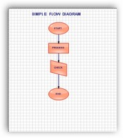
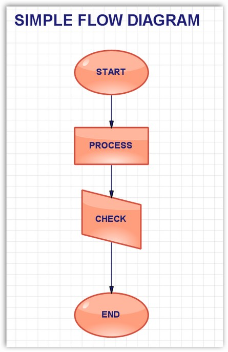

::: {style="DISPLAY: none"}
{#d2h_url_template}{#d2h_package_url style="WIDTH: 0px; DISPLAY: none; HEIGHT: 0px"}
:::

:::: {.d2h_secondary_topic style="PADDING-BOTTOM: 10pt; MARGIN: 0pt; PADDING-LEFT: 0pt; PADDING-RIGHT: 0pt; PADDING-TOP: 0pt"}
#### Zoom Support {#zoom-support style="tab-stops: 0pt"}

[]{style="FONT-FAMILY: 'Trebuchet MS','sans-serif'; COLOR: #15428b; FONT-SIZE: 9pt"} 

One of the interactive feature in Essential Diagram control is the zooming feature. You can zoom the nodes in / out by using the following client methods.

[]{style="FONT-FAMILY: 'Trebuchet MS','sans-serif'; COLOR: #15428b; FONT-SIZE: 9pt"} 

[·      ]{style="FONT-FAMILY: Symbol"}ZoomIn()

[·      ]{style="FONT-FAMILY: Symbol"}ZoomOut()

[·      ]{style="FONT-FAMILY: Symbol"}ZoomToSelection()

[·      ]{style="FONT-FAMILY: Symbol"}ZoomToActual()

[]{style="FONT-FAMILY: 'Trebuchet MS','sans-serif'; COLOR: #15428b; FONT-SIZE: 9pt"} 

The zooming is performed using the ZoomTool. This tool allows the user to zoom the diagram with minimum and maximum magnification.

[]{style="FONT-FAMILY: 'Trebuchet MS','sans-serif'; COLOR: #15428b; FONT-SIZE: 9pt"} 

+------------------------------------------------------------------------------------------------------------------------------------------------------------------------+
| **[\[C#\]]{style="FONT-FAMILY: 'Courier New'; COLOR: black"}**                                                                                                         |
|                                                                                                                                                                        |
| []{style="FONT-FAMILY: 'Courier New'"}                                                                                                                                 |
|                                                                                                                                                                        |
| [this]{style="FONT-FAMILY: 'Courier New'; COLOR: blue"}[.diagram1.Controller.ActivateTool([\"ZoomTool\"]{style="COLOR: maroon"});]{style="FONT-FAMILY: 'Courier New'"} |
+------------------------------------------------------------------------------------------------------------------------------------------------------------------------+

[]{style="FONT-FAMILY: 'Courier New'"} 

+---------------------------------------------------------------------------------------------------------------------------------------------------------------------+
| **[\[VB\]]{style="FONT-FAMILY: 'Courier New'; COLOR: black"}**                                                                                                      |
|                                                                                                                                                                     |
| []{style="FONT-FAMILY: 'Courier New'"}                                                                                                                              |
|                                                                                                                                                                     |
| [Me]{style="FONT-FAMILY: 'Courier New'; COLOR: blue"}[.diagram1.Controller.ActivateTool([\"ZoomTool\"]{style="COLOR: maroon"})]{style="FONT-FAMILY: 'Courier New'"} |
+---------------------------------------------------------------------------------------------------------------------------------------------------------------------+

[]{style="FONT-FAMILY: 'Trebuchet MS','sans-serif'; COLOR: #15428b; FONT-SIZE: 9pt"} 

Properties of the Zoom Tool 

**[]{style="FONT-FAMILY: 'Trebuchet MS','sans-serif'; COLOR: #15428b; FONT-SIZE: 9pt"}** 

::: {align="center"}
  ---------------------- -------------------------------------------------------------------------------------
  Properties             Description
  MaximumMagnification   Specifies the maximum magnification value for zooming. Default value is ***1000***.
  MinimumMagnification   Specifies the minimum magnification value for zooming. Default value is ***10***.
  ZoomIncrement          Specifies the amount to zoom each time the mouse is clicked.
  ---------------------- -------------------------------------------------------------------------------------
:::

**[]{style="FONT-FAMILY: 'Trebuchet MS','sans-serif'; COLOR: #15428b; FONT-SIZE: 9pt"}** 

+-----------------------------------------------------------------------------------------------------------------+
| **[\[C#\]]{style="FONT-FAMILY: 'Courier New'; COLOR: black"}**                                                  |
|                                                                                                                 |
| []{style="FONT-FAMILY: 'Courier New'"}                                                                          |
|                                                                                                                 |
| [diagram1.Controller.ActivateTool([\"ZoomTool\"]{style="COLOR: #a31515"});]{style="FONT-FAMILY: 'Courier New'"} |
|                                                                                                                 |
| [ZoomTool z = (ZoomTool)diagram1.Controller.ActiveTool;]{style="FONT-FAMILY: 'Courier New'"}                    |
|                                                                                                                 |
| [z.MaximumMagnification = 100;]{style="FONT-FAMILY: 'Courier New'"}                                             |
|                                                                                                                 |
| [z.MinimumMagnification = 50;]{style="FONT-FAMILY: 'Courier New'"}                                              |
|                                                                                                                 |
| [z.ZoomIncrement = 10;]{style="FONT-FAMILY: 'Courier New'"}                                                     |
+-----------------------------------------------------------------------------------------------------------------+

[]{style="FONT-FAMILY: 'Courier New'"} 

{border="0"}

**[]{style="FONT-FAMILY: 'Trebuchet MS','sans-serif'; COLOR: #15428b; FONT-SIZE: 9pt"}** 

Figure 92: Zoom In

**[]{style="FONT-FAMILY: 'Trebuchet MS','sans-serif'; COLOR: #15428b; FONT-SIZE: 9pt"}** 

{border="0"}

**[]{style="FONT-FAMILY: 'Trebuchet MS','sans-serif'; COLOR: #15428b; FONT-SIZE: 9pt"}** 

Figure 93: Zoom Out

 

[]{#p53} 

 

[]{#related-topics}
::::
