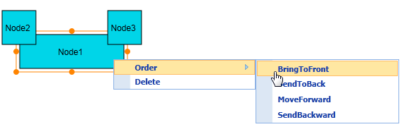
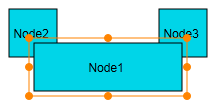
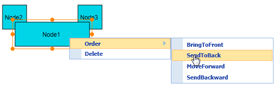
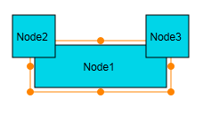
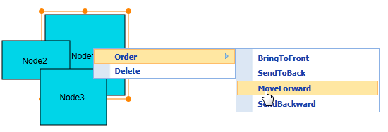
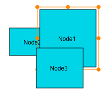
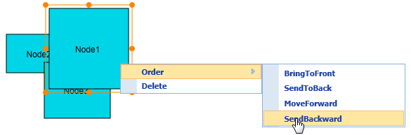
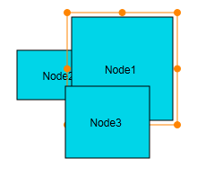

::: {style="DISPLAY: none"}
{#d2h_url_template}{#d2h_package_url style="WIDTH: 0px; DISPLAY: none; HEIGHT: 0px"}
:::

::::: {#nsbanner .d2h_main_nsbanner style="BORDER-BOTTOM: #999999 1px solid; POSITION: relative; PADDING-BOTTOM: 0px; BACKGROUND-COLOR: transparent; PADDING-LEFT: 0px; PADDING-RIGHT: 0px; DISPLAY: none; BORDER-TOP: #999999 1px solid; PADDING-TOP: 0px; LEFT: 0px"}
:::: {#TitleRow .d2h_main_titlerow style="PADDING-BOTTOM: 4px; BACKGROUND-COLOR: transparent; PADDING-LEFT: 22px; WIDTH: 100%; PADDING-RIGHT: 10px; DISPLAY: none; PADDING-TOP: 4px"}
::: {#ienav .d2h_main_ienav style="DISPLAY: none"}
{#D2HPrevious .D2HPreviousEnabled}  {#D2HNext .D2HNextEnabled}
:::
::::
:::::

::::: {#nstext .d2h_main_nstext style="PADDING-BOTTOM: 10px; BACKGROUND-COLOR: transparent; PADDING-LEFT: 22px; PADDING-RIGHT: 10px; HEIGHT: 100%; OVERFLOW: auto; PADDING-TOP: 5px" hasuserbackground="true" valign="bottom"}
::: {#d2h_breadcrumbs .d2h_breadcrumbs}
[Essential Studio User Guide Documentation](ms-xhelp:///?Id=12457748-09e3-4d74-a240-8e049cedf030){.d2h_breadcrumbsNormal}[ \> ]{.d2h_breadcrumbsLinkSeparator}[User Interface Edition](ms-xhelp:///?Id=c29296b7-531c-413b-a0ec-488ca1f7f669){.d2h_breadcrumbsNormal}[ \> ]{.d2h_breadcrumbsLinkSeparator}[Essential ASP.NET MVC](ms-xhelp:///?Id=4b14e7d1-65c4-4f67-b1aa-2c37709905a5){.d2h_breadcrumbsNormal}[ \> ]{.d2h_breadcrumbsLinkSeparator}[Essential Diagram]{.d2h_breadcrumbsContentsOnly}[ \> ]{.d2h_breadcrumbsLinkSeparator}[Concepts and Features](ms-xhelp:///?Id=04839cdf-94fc-4d24-9f6b-119fdbd7bbfb){.d2h_breadcrumbsNormal}
:::

## Z-Order Commands {#z-order-commands style="tab-stops: 0pt"}

[Ordering commands allow you to change the order of selected objects (i.e. nodes and connectors) along the z-axis (z-order value) on the page. The objects can be moved forward or backward. This way, they get displayed over other objects in case two or more objects overlap.]{style="BACKGROUND: white"}

[There are four z-order commands, namely:]{style="BACKGROUND: white"}

[·      ]{style="FONT-FAMILY: Symbol"}[BringToFront]{style="BACKGROUND: white"}

[·      ]{style="FONT-FAMILY: Symbol"}[SendToBack]{style="BACKGROUND: white"}

[·      ]{style="FONT-FAMILY: Symbol"}[MoveForward]{style="BACKGROUND: white"}

[·      ]{style="FONT-FAMILY: Symbol"}[SendBackward]{style="BACKGROUND: white"}

 

Note: The z-order command feature is not supported in SVG mode.

 

Use Case Scenario

This feature allows you to arrange the nodes in a diagram using simple commands. This way, there are lesser chances of error than when you have to drag and drop a node in cramped spaces.

Appearance and Structure

The following figures illustrate the appearance and function of the z-order commands feature and its settings.

1.   **Bring to Front Z-Order Command**: You can use this command to move the selected object(s) in front of other objects by increasing the z-order value to a higher value than the greatest among the rest of the objects.

[]{style="BACKGROUND: white; COLOR: black"} 

[The following figures show you how this command affects nodes (and connectors).]{style="BACKGROUND: white; COLOR: black"}

 

{border="0"}

Figure 93: Nodes before Using the Bring to Front Command

 

 

{border="0"}

Figure 94: Nodes after Using the Bring to Front Command

 

In the figure above, **Node1** is moved in front of Node2 and Node3 by adjusting the z-order value of Node1 to a value that is higher than those of Node2 and Node3.

 

2.   **Send to Back Command**: This command moves the selected object (node or connector) behind all the other objects by setting the z-order value of the selection as 0 (zero), which is the minimum value.

 

The following figures show you how this command affects nodes (and connectors).

 

{border="0"}

Figure 95: Nodes before Using the Send to Back Command

 

 

{border="0"}

Figure 96: Nodes after Using the Send to Back Command

 

::: {style="BORDER-BOTTOM: windowtext 1pt solid; BORDER-LEFT: medium none; PADDING-BOTTOM: 1pt; MARGIN-TOP: 9pt; PADDING-LEFT: 0pt; PADDING-RIGHT: 0pt; MARGIN-BOTTOM: 9pt; BORDER-TOP: windowtext 1pt solid; BORDER-RIGHT: medium none; PADDING-TOP: 1pt"}
Note: Negative values cannot be set as the z-order for nodes and connectors.
:::

3.   **Move Forward Command:** This command sets the z-order value of the selected object to a value that is greater than that of the other objects by 1 (one).

 

 

{border="0"}

Figure 97: Nodes before Using  the Move Forward Command

 

{border="0"}

Figure 98: Nodes after using the Move Forward Command

 

4.   **Send Backward Command:** This command sets the z-order value of the selected object to a value that is lesser than that of the other objects by 1 (one).

 

 

{border="0"}

Figure 99: Nodes before Using the Send Backward Command

{border="0"}

Figure 100: Nodes after Using the Send Backward Command

 

Where do I find the installed samples?

[You should find the samples for the z-order commands in the same location as the samples for the multiple selection feature.]{style="BACKGROUND: white"}

[To view the samples:]{style="BACKGROUND: white"}

1.   [Open the Essential Diagram sample browser from the dashboard. (Refer to the **Samples and Locations** section).]{style="BACKGROUND: white"}

2.   [Go to the **Getting Started** tab and click **Flat Diagram**.]{style="BACKGROUND: white"}

 

Properties

+---------------------+-------------------------------------------------------------------------------------------------------------------------------------+---------------------+--------------------------------------------------------------+----------------------------------------+
| Property            | Description                                                                                                                         | Type of Property    | Value it Accepts                                             | Dependencies                           |
+---------------------+-------------------------------------------------------------------------------------------------------------------------------------+---------------------+--------------------------------------------------------------+----------------------------------------+
| EnableZOrder        | Gets or sets a value indicating whether a z-order can be applied to the selected node/connector. The default value is set to false. | Dependency property | Boolean                                                      | NA (This is not supported in SVG mode) |
|                     |                                                                                                                                     |                     |                                                              |                                        |
|                     |                                                                                                                                     |                     | [·      ]{style="FONT-FAMILY: Symbol"}True                   |                                        |
|                     |                                                                                                                                     |                     |                                                              |                                        |
|                     |                                                                                                                                     |                     | [·      ]{style="FONT-FAMILY: Symbol"}False                  |                                        |
+---------------------+-------------------------------------------------------------------------------------------------------------------------------------+---------------------+--------------------------------------------------------------+----------------------------------------+
| ConnectorZOrderMode | Gets or sets the ConnectorZorderMode for rendering the order of nodes and connectors. The default value is ZOrderMode.Default.      | Dependency property | Enum                                                         | NA (This is not supported in SVG mode) |
|                     |                                                                                                                                     |                     |                                                              |                                        |
|                     |                                                                                                                                     |                     | [·      ]{style="FONT-FAMILY: Symbol"}ZOrderMode.Default     |                                        |
|                     |                                                                                                                                     |                     |                                                              |                                        |
|                     |                                                                                                                                     |                     | [·      ]{style="FONT-FAMILY: Symbol"}ZOrderMode.AlwaysBelow |                                        |
+---------------------+-------------------------------------------------------------------------------------------------------------------------------------+---------------------+--------------------------------------------------------------+----------------------------------------+

 

More:

[ ]{#related-topics}

[{border="0" align="absMiddle"}Enabling Z-Order Commands in Diagram MVC](ms-xhelp:///?Id=cbe1a846-69bf-4cd3-ae8d-324aa79024d9){style="TEXT-DECORATION: none"}
:::::
