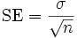
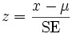

::: {style="DISPLAY: none"}
{#d2h_url_template}{#d2h_package_url style="WIDTH: 0px; DISPLAY: none; HEIGHT: 0px"}
:::

::::: {.d2h_secondary_topic style="PADDING-BOTTOM: 10pt; MARGIN: 0pt; PADDING-LEFT: 0pt; PADDING-RIGHT: 0pt; PADDING-TOP: 0pt"}
#### Z-Test {#z-test style="tab-stops: 0pt"}

[]{style="FONT-FAMILY: 'Trebuchet MS','sans-serif'; FONT-SIZE: 9pt"} 

**Z-test** is a statistical formula that is used to determine if the difference between a sample mean and the population mean is large enough to be statistically significant. This test is primarily used to determine if the test scores of the samples are either within or outside the standard scores.

[]{style="FONT-FAMILY: 'Trebuchet MS','sans-serif'; FONT-SIZE: 9pt"} 

Steps to perform ZTest

**[]{style="FONT-FAMILY: 'Trebuchet MS','sans-serif'"}** 

This test requires the sample to be random and is taken from a population that is distributed normally. In order to perform this test, the following quantities should be known.

[]{style="FONT-FAMILY: 'Trebuchet MS','sans-serif'; FONT-SIZE: 9pt"} 

[·      ]{style="FONT-FAMILY: Symbol"}s (the standard deviation of the population)

[·      ]{style="FONT-FAMILY: Symbol"}µ (the mean of the population)

[·      ]{style="FONT-FAMILY: Symbol"}x (the mean of the sample)

[·      ]{style="FONT-FAMILY: Symbol"}n (the size of the sample)

[]{style="FONT-FAMILY: 'Trebuchet MS','sans-serif'; FONT-SIZE: 9pt"} 

1.   Calculate the standard error (SE) of the mean:

[]{style="FONT-FAMILY: 'Trebuchet MS','sans-serif'; FONT-SIZE: 9pt"} 

[{border="0"}]{style="FONT-FAMILY: 'Trebuchet MS','sans-serif'; FONT-SIZE: 9pt"}[]{style="FONT-FAMILY: 'Trebuchet MS','sans-serif'; FONT-SIZE: 9pt"}

[]{style="FONT-FAMILY: 'Trebuchet MS','sans-serif'; FONT-SIZE: 9pt"} 

2.   Then compute the z-score for the Z-test as below.

[]{style="FONT-FAMILY: 'Trebuchet MS','sans-serif'; FONT-SIZE: 9pt"} 

[{border="0"}]{style="FONT-FAMILY: 'Trebuchet MS','sans-serif'; FONT-SIZE: 9pt"}[]{style="FONT-FAMILY: 'Trebuchet MS','sans-serif'; FONT-SIZE: 9pt"}

[]{style="FONT-FAMILY: 'Trebuchet MS','sans-serif'; FONT-SIZE: 9pt"} 

3.   Finally, the z score is compared to a Z table which contains the percent of area under the normal curve between the mean and the z score. Using this table will indicate whether the calculated z score is within the realm of chance or it is so different from the mean that the sample mean is unlikely to have happened by chance.

[]{style="FONT-FAMILY: 'Trebuchet MS','sans-serif'; FONT-SIZE: 9pt"} 

Using the Formula

[]{style="FONT-FAMILY: 'Trebuchet MS','sans-serif'; FONT-SIZE: 9pt"} 

The Z-test can be carried out on any two series values by using the **ZTest** method of **BasicStatisticalFormuals** class. Below table gives the detailed description of this method. The method returns an instance of ZTestResult object that saves the intermediate results and also the final z score of the test.

[]{style="FONT-FAMILY: 'Trebuchet MS','sans-serif'; FONT-SIZE: 9pt"} 

::: {align="center"}
+-----------------------+------------------------------------------------------------------------------------+-------------------------------------------------------------------------------------------------------------------------------------------------+
|                       |                                                                                    |                                                                                                                                                 |
|                       |                                                                                    |                                                                                                                                                 |
| Method Name           | Parameters                                                                         | Return Value                                                                                                                                    |
+-----------------------+------------------------------------------------------------------------------------+-------------------------------------------------------------------------------------------------------------------------------------------------+
| ZTest                 | 1.   **HypothesizedMeanDifference**: the difference between the population means.  | An ZTestResult object that has the following members:                                                                                           |
|                       |                                                                                    |                                                                                                                                                 |
|                       | 2.   **VarianceOfFirstSeries**: the variance within the first series population.   |                                                                                                                                                 |
|                       |                                                                                    |                                                                                                                                                 |
|                       | 3.   **VarianceOfSecondSeries**: the variance within the second series population. | [·      ]{style="FONT-FAMILY: Symbol"}FirstSeriesMean                                                                                           |
|                       |                                                                                    |                                                                                                                                                 |
|                       | 4.   **Probability**: the probability that gives the confidence level.             | [·      ]{style="FONT-FAMILY: Symbol"}SecondSeriesMean                                                                                          |
|                       |                                                                                    |                                                                                                                                                 |
|                       | 5.   **FirstSeries**: A ChartSeries object that stores the first group of data.    | [·      ]{style="FONT-FAMILY: Symbol"}FirstSeriesVariance                                                                                       |
|                       |                                                                                    |                                                                                                                                                 |
|                       | 6.   **SecondSeries**: A ChartSeries object that stores the second group of data.  | [·      ]{style="FONT-FAMILY: Symbol"}SecondSeriesVariance                                                                                      |
|                       |                                                                                    |                                                                                                                                                 |
|                       |                                                                                    | [·      ]{style="FONT-FAMILY: Symbol"}ZValue                                                                                                    |
|                       |                                                                                    |                                                                                                                                                 |
|                       |                                                                                    | [·      ]{style="FONT-FAMILY: Symbol"}ProbabilityZOneTail                                                                                       |
|                       |                                                                                    |                                                                                                                                                 |
|                       |                                                                                    | [·      ]{style="FONT-FAMILY: Symbol"}ZCriticalValueOneTail                                                                                     |
|                       |                                                                                    |                                                                                                                                                 |
|                       |                                                                                    | [·      ]{style="FONT-FAMILY: Symbol"}ProbabilityZTwoTail                                                                                       |
|                       |                                                                                    |                                                                                                                                                 |
|                       |                                                                                    | [·    ]{style="FONT-FAMILY: Symbol; FONT-SIZE: 12pt"}ZCriticalValueTwoTail [ ]{style="FONT-FAMILY: 'Times New Roman','serif'; FONT-SIZE: 12pt"} |
+-----------------------+------------------------------------------------------------------------------------+-------------------------------------------------------------------------------------------------------------------------------------------------+
:::

[]{style="FONT-FAMILY: 'Trebuchet MS','sans-serif'; FONT-SIZE: 9pt"} 

Example

[]{style="FONT-FAMILY: 'Trebuchet MS','sans-serif'; FONT-SIZE: 9pt"} 

Here is a code snippet that shows a sample usage.

[]{style="FONT-FAMILY: 'Trebuchet MS','sans-serif'; FONT-SIZE: 9pt"} 

+----------------------------------------------------------------------------------------------------------------------------------------------------+
| **[\[C#\]]{style="FONT-FAMILY: 'Courier New'; COLOR: black"}**                                                                                     |
|                                                                                                                                                    |
| []{style="COLOR: black"}                                                                                                                           |
|                                                                                                                                                    |
| [ZTestResult ztr = BasicStatisticalFormulas.ZTest( Convert.ToDouble(TextBox6.Text.ToString()), ]{style="FONT-FAMILY: 'Courier New'; COLOR: black"} |
|                                                                                                                                                    |
| [sqrtVarianceOfFirstSeries\*sqrtVarianceOfFirstSeries,]{style="FONT-FAMILY: 'Courier New'; COLOR: black"}                                          |
|                                                                                                                                                    |
| [sqrtVarianceOfSecondSeries\* sqrtVarianceOfSecondSeries,0.05,series1,series2);]{style="FONT-FAMILY: 'Courier New'; COLOR: black"}                 |
+----------------------------------------------------------------------------------------------------------------------------------------------------+

[]{style="FONT-FAMILY: 'Trebuchet MS','sans-serif'; FONT-SIZE: 9pt"} 

+---------------------------------------------------------------------------------------------------------------------------------------------------------------------------------------------------------------------------------------------------------------------------------------------------------------------------------------------------------------------------------------------------------------------------------------------------------+
| **[\[VB.NET\]]{style="FONT-FAMILY: 'Courier New'; COLOR: black"}**                                                                                                                                                                                                                                                                                                                                                                                      |
|                                                                                                                                                                                                                                                                                                                                                                                                                                                         |
| []{style="COLOR: black"}                                                                                                                                                                                                                                                                                                                                                                                                                                |
|                                                                                                                                                                                                                                                                                                                                                                                                                                                         |
| [Dim]{style="FONT-FAMILY: 'Courier New'; COLOR: blue"}[ ztr ]{style="FONT-FAMILY: 'Courier New'; COLOR: black"}[As]{style="FONT-FAMILY: 'Courier New'; COLOR: blue"}[ ZTestResult = BasicStatisticalFormulas.ZTest(Convert.ToDouble(TextBox6.Text.ToString()), sqrtVarianceOfFirstSeries\*sqrtVarianceOfFirstSeries, sqrtVarianceOfSecondSeries\*sqrtVarianceOfSecondSeries, 0.05, series1, series2)]{style="FONT-FAMILY: 'Courier New'; COLOR: black"} |
+---------------------------------------------------------------------------------------------------------------------------------------------------------------------------------------------------------------------------------------------------------------------------------------------------------------------------------------------------------------------------------------------------------------------------------------------------------+

::: {style="BORDER-BOTTOM: windowtext 1pt solid; BORDER-LEFT: medium none; PADDING-BOTTOM: 1pt; MARGIN-TOP: 9pt; PADDING-LEFT: 0pt; PADDING-RIGHT: 0pt; MARGIN-BOTTOM: 9pt; BORDER-TOP: windowtext 1pt solid; BORDER-RIGHT: medium none; PADDING-TOP: 1pt"}
{border="0"}Note: For programming example, refer the following Browser Sample:
:::

[]{style="FONT-FAMILY: 'Trebuchet MS','sans-serif'; FONT-SIZE: 9pt"} 

\[Install Location\]\\Syncfusion\\EssentialStudio\\\[***Installed version***\]\\Web\\chart.web\\Samples\\3.5\\Statistics\\ChartStatisticalFormulas

[]{#p230} 

[]{#related-topics}
:::::
